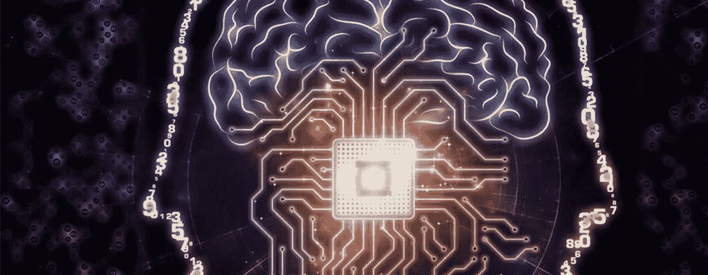
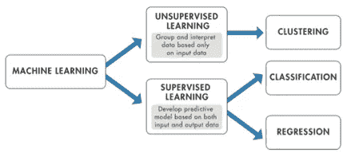
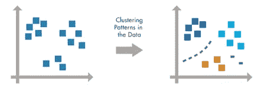
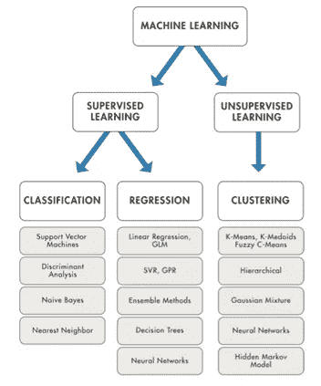

# 采购中的机器学习|未来的浪潮|走向变革

> 原文：<https://medium.datadriveninvestor.com/machine-learning-in-procurement-the-wave-of-future-towards-change-4b1cb136868e?source=collection_archive---------15----------------------->

机器学习是人工智能(AI)的一种应用，它为系统提供了自动学习和根据经验改进的能力，而无需显式编程。机器学习专注于开发能够访问数据并使用数据进行自我学习的计算机程序。现在，大量的数据随处可见。因此，分析这些数据以便提取一些有用的信息并基于这种分析开发算法是非常重要的。这可以通过数据挖掘和机器学习来实现。机器学习是人工智能的一个组成部分，用于根据数据趋势和数据之间的历史关系设计算法。机器学习应用于生物信息学、入侵检测、信息检索等各个领域。

# **定义—**

M 机器学习是从计算学习理论和模式识别的研究中发展而来的。这是在数据分析领域中使用的最有效的方法，以便通过设计一些模型和算法来预测一些事情。这些分析模型使研究人员、工程师、数据科学家和分析师能够得出可靠有效的结果和决策。

 [## 认知计算——一套被广泛认为是……

### 作为它的用户，我们已经习惯了科技。这些天几乎没有什么是司空见惯的…

www.datadriveninvestor.com](https://www.datadriveninvestor.com/2020/02/19/cognitive-computing-a-skill-set-widely-considered-to-be-the-most-vital-manifestation-of-artificial-intelligence/) 

它还有助于通过历史学习和数据趋势发现一些隐藏的模式或特征。特征选择是机器学习最重要的任务。模型是基于从训练数据收集的结果创建的，这就是为什么机器学习算法是非交互式的。它研究过去的观察结果以做出精确的预测。制定一个准确的预测规则并以此为基础开发算法是一项非常困难的任务。

# **工作原理—**

机器学习使用两种技术:监督学习，它根据已知的输入和输出数据训练模型，以便它可以预测未来的输出；以及非监督学习，它在输入数据中找到隐藏的模式或内在结构。

**监督学习**

S 监督机器学习建立了一个模型，在存在不确定性的情况下，根据证据做出预测。监督学习算法采用一组已知的输入数据和对数据的已知响应(输出)，并训练模型来生成对新数据响应的合理预测。如果你已经知道你想要预测的输出的数据，使用监督学习。

监督学习使用分类和回归技术来开发预测模型。

分类技术预测离散的响应，例如，电子邮件是真实的还是垃圾邮件，或者肿瘤是癌性的还是良性的。分类模型将输入数据分类。典型的应用包括医学成像、语音识别和信用评分。

如果您的数据可以被标记、分类或分成特定的组或类，请使用分类。例如，手写识别应用程序使用分类来识别字母和数字。在图像处理和计算机视觉中，无监督模式识别技术用于对象检测和图像分割。

进行分类的常用算法有[支持向量机(SVM)](https://www.mathworks.com/help/stats/support-vector-machine-classification.html) 、[提升](https://www.mathworks.com/help/stats/classification-ensembles.html)、[袋装](https://www.mathworks.com/help/stats/classification-ensembles.html)、[、*k*-最近邻](https://www.mathworks.com/help/stats/classification-nearest-neighbors.html)、[朴素贝叶斯](https://www.mathworks.com/help/stats/classification-naive-bayes.html)、[判别分析](https://www.mathworks.com/help/stats/classification-discriminant-analysis.html)、[逻辑回归](https://www.mathworks.com/help/stats/generalized-linear-regression-1.html)、[神经网络](https://www.mathworks.com/help/deeplearning/pattern-recognition-and-classification.html)。

Supervised learning

回归技术预测连续响应，例如，温度变化或电力需求波动。典型的应用包括电力负荷预测和算法交易。

如果您正在处理一个数据范围，或者如果您的响应的性质是一个实数，如温度或设备故障前的时间，请使用回归技术。

常见的回归算法有[线性模型](https://www.mathworks.com/help/stats/multiple-linear-regression-1.html)、[非线性模型](https://www.mathworks.com/help/stats/nonlinear-models.html)、[正则化](https://www.mathworks.com/help/stats/regularization-1.html)、[逐步回归](https://www.mathworks.com/help/stats/stepwise-regression-1.html)、[助推](https://www.mathworks.com/help/stats/classification-ensembles.html)、[打包](https://www.mathworks.com/help/stats/classification-ensembles.html)、[决策树](https://www.mathworks.com/help/stats/classification-trees.html)、[神经网络](https://www.mathworks.com/help/deeplearning/function-approximation-and-nonlinear-regression.html)、[自适应神经模糊学习](https://www.mathworks.com/help/fuzzy/anfis.html)。

**无监督学习**

U 监督学习在数据中寻找隐藏的模式或内在的结构。它用于从由没有标记响应的输入数据组成的数据集进行推断。

聚类是最常见的无监督学习技术。它用于探索性数据分析，以发现数据中隐藏的模式或分组。[聚类分析](https://www.mathworks.com/discovery/cluster-analysis.html)的应用包括基因序列分析、市场研究和物体识别。

例如，如果一家手机公司希望优化他们建造手机信号塔的位置，他们可以使用机器学习来估计依赖他们信号塔的人群数量。一部手机一次只能与一个信号塔通话，因此该团队使用聚类算法来设计手机信号塔的最佳位置，以优化其客户群体或集群的信号接收。

用于执行聚类的常见算法包括 k-均值和 k-均值聚类、分层聚类、高斯混合模型、隐马尔可夫模型、自组织映射、模糊 c-均值聚类和减法聚类。

**Unsupervised Learning**

# 如何决定使用哪种机器学习算法？

选择正确的算法似乎很难——有几十种监督和非监督的机器学习算法，每种算法都采用不同的学习方法。

没有最好的方法，也没有一刀切。找到正确的算法在一定程度上只是试错——即使是经验丰富的数据科学家也无法在不尝试的情况下判断一种算法是否可行。但是，算法的选择还取决于您正在处理的数据的大小和类型、您想要从数据中获得的见解以及这些见解将如何被使用。

以下是在监督和非监督机器学习之间进行选择的一些指导原则:

*   如果需要训练模型来进行预测(例如，温度或股票价格等连续变量的未来值，或者分类，例如，从网络摄像机视频中识别汽车的品牌),请选择监督学习。
*   如果您需要探索数据并希望训练模型以找到良好的内部表示，例如将数据拆分为聚类，请选择无监督学习。

# 机器学习树形图

# **机器学习的应用**

1.  图像识别
2.  语音识别
3.  医疗诊断
4.  统计套利
5.  学习协会
6.  分类
7.  预言；预测；预告
8.  提取，血统
9.  回归

# 机器学习的优势

**1。轻松识别趋势和模式**

机器学习可以审查大量数据，并发现人类不明显的特定趋势和模式。例如，对于像亚马逊这样的电子商务网站，它有助于了解用户的浏览行为和购买历史，以帮助迎合与他们相关的正确产品、交易和提醒。它使用结果向他们展示相关的广告。

**2。无需人工干预(自动化)**

有了 ML，你不需要在项目的每一步都照看你的项目。因为这意味着给机器学习的能力，它让它们做出预测，也让它们自己改进算法。一个常见的例子是反病毒软件；他们学会在发现新威胁时过滤它们。ML 还擅长识别垃圾邮件。

**3。持续改进**

随着 [ML 算法](https://data-flair.training/blogs/machine-learning-algorithms/)获得经验，它们在准确性和效率方面不断提高。这让他们做出更好的决定。比如说你需要做一个天气预报模型。随着数据量的不断增长，你的算法学会更快地做出更准确的预测。

**4。处理多维多种类数据**

机器学习算法擅长处理多维度、多品种的数据，它们可以在动态或不确定的环境中做到这一点。

**5。广泛应用**

你可以是一个电子零售商或医疗保健提供商，让 ML 为你工作。在它确实适用的地方，它有能力帮助向客户提供更加个性化的体验，同时也锁定正确的客户。

# 机器学习的缺点

尽管机器学习功能强大且广受欢迎，但它并不完美。以下因素限制了它:

**1。数据采集**

机器学习需要大量的数据集来进行训练，这些数据集应该是包容的/无偏见的，并且质量好。有时，它们还必须等待新数据生成。

**2。时间和资源**

ML 需要足够的时间让算法学习和发展，以实现它们的目的，并具有相当大的准确性和相关性。它还需要大量的资源才能发挥作用。这可能意味着对计算机能力的额外要求。

**3。结果解读**

另一个主要挑战是准确解释算法生成的结果的能力。您还必须根据您的目的仔细选择算法。

**4。易错性高**

机器学习是自主的，但非常容易出错。假设你训练一个算法，数据集小到不能包容。你最终会得到来自有偏见的训练集的有偏见的预测。这导致向客户显示不相关的广告。在 ML 的例子中，这样的失误会引发一连串的错误，而这些错误在很长一段时间内都不会被发现。当它们确实被注意到时，需要相当长的时间来识别问题的根源，甚至更长的时间来纠正它。

# 参考文献—

> 机器学习及其应用-作者[贾芳·Angra](https://ieeexplore.ieee.org/author/37086243085)，[萨钦·阿胡贾](https://ieeexplore.ieee.org/author/37085837891)， **2017**
> 
> 时间序列的机器学习算法与特征提取研究-作者:，吴亚斌，欧一航，，周延全，陈道新， **2017**
> 
> 医疗保健中的机器学习研究-作者 [Rohan Bhardwaj](https://ieeexplore.ieee.org/author/37086050758) ， [Ankita R. Nambiar](https://ieeexplore.ieee.org/author/37086048328) ， [Debojyoti Dutta](https://ieeexplore.ieee.org/author/37265107100) ， **2017**
> 
> 用于网络安全的机器学习和深度学习方法-由孔，(IEEE 成员)，陈玉玲，李，朱洪亮，高明成，侯，，， **2017**