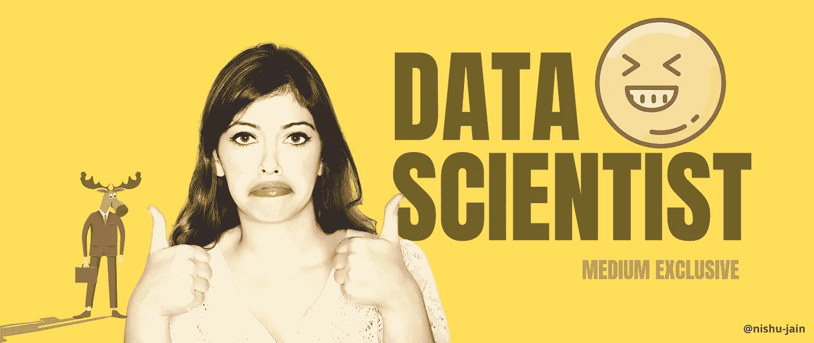
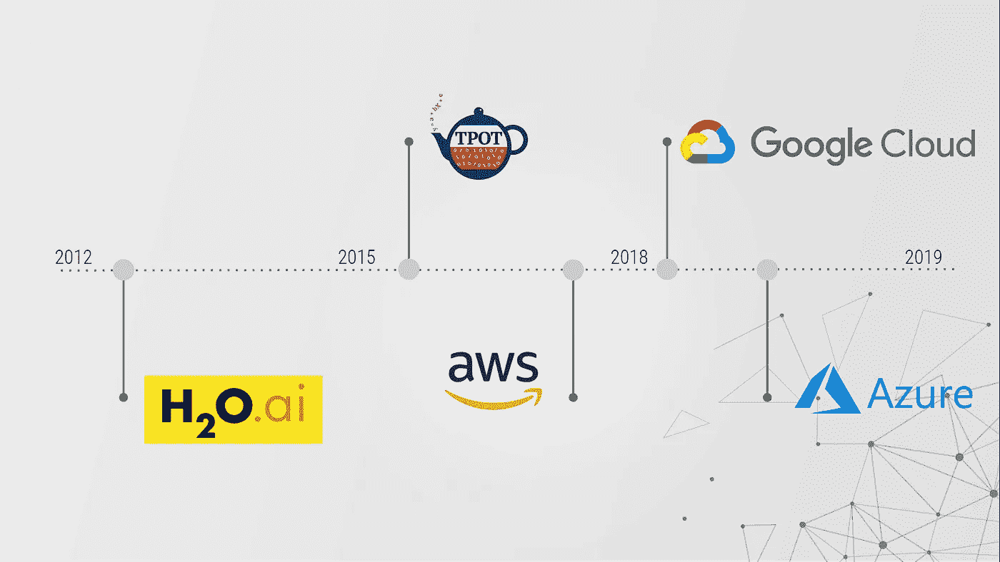

# 为什么机器学习正在成为一个笑话？

> 原文：<https://medium.datadriveninvestor.com/machine-learning-is-becoming-a-joke-automl-downsides-c7634ce0572c?source=collection_archive---------3----------------------->

## 数据科学

## 这个被过度宣传的职业令人不安的真相

Image by the author (Designed using Canva)

Read and Listen — For a better experience

> 我们生活在一个人工智能变得越来越聪明，但其发展变得越来越笨的时代。是不是很搞笑？

不久前，数据科学家曾经从零开始构建 ML 算法。在这些新的、花哨的和“复杂的”库接管之前，真正的数据科学家知道算法的底层机制。他们真的知道他们运行的模型和他们使用的数学。

今天，**每个人都是数据科学家**，这瓦解了这个职业的意义。在 Keras 和 Scikit-Learn 等高度抽象的库的帮助下，一个新手可以编写代码，而实际上并不知道底层发生了什么。

像亚马逊、谷歌和微软这样的公司巨头正在努力使它变得更加抽象和简单。凭借他们的人工智能和云技术，他们正在催生一个名为 **AutoML** 的新领域，他们在这个领域隐藏了更好的底层方法。

# ***但是，是不是越简单越好？***

有些人会认为，脱离数学将不会给创造力和创新留下任何空间。在很大程度上，他们是对的。

当我们开始使用高度抽象的框架来构建我们的 ML 模型时，我们对它们的控制越来越少。众所周知，就像编程语言一样，与 C 和 C++相比，Python 可能更简单，但对机器的控制更少。

因此，提供较少或没有改进的空间；同样的旧模式一再重复。用 GUI 环境构建模型不是一个好主意。还没有。

由于这些新的 AutoML 工具，所谓的数据科学家将永远不会开发解决问题所需的直觉；如果问题出在微观层面，至少不会。

Source: [https://www.kdnuggets.com/2020/02/data-scientists-automl-replace.html](https://www.kdnuggets.com/2020/02/data-scientists-automl-replace.html)

早先，人们习惯于尊重数据科学家的知识和专长。但今天，那些有意识的人都知道， ***一个数据科学家并不是一个值得崇拜的人，因为“*** [***机器学习并没有那么难***](https://medium.com/towards-artificial-intelligence/why-its-super-hard-to-be-an-ml-researcher-or-developer-67fa62fc1971) ***”。LOL！***

 [## 为什么做一个 ML 研究员或者开发者超级难？

### 这一认识彻底改变了我的生活

medium.com](https://medium.com/towards-artificial-intelligence/why-its-super-hard-to-be-an-ml-researcher-or-developer-67fa62fc1971) 

与此相反，那些没有意识到 ML 方法论局限性的人，实际上认为它是神奇的。

> “企业不再需要高薪聘请统计学家，因为你只需给沃森一份电子表格，沃森就会为你分析数据。”— IBM

我们在这里面对的是极端的情况:无能的人充满希望和阳光，而有能力的专家却过着阴郁的生活。有人会说， [*催款克鲁格效应*](https://www.verywellmind.com/an-overview-of-the-dunning-kruger-effect-4160740) 最出色。

## 那么我们能做什么呢？

我没有忘记 AutoML 的好处和 ML 应用程序开发的日益简化。我知道，对于英联邦来说，它将更容易接近，更容易遵循；这将传播意识，帮助他们更快地开发应用程序。但是…

***这可真是灾难性的。*** *(在错误的人手里)*

考虑这个场景，一个新手使用自动生成的代码为你的公司实现一个流行的 ***决策*** ML 算法。一个从一边抛出数据，从另一边传递预测/结果的人。

你会相信他的发展吗？*我不会……*

只要他不能解释代码是怎么回事，我就不能信任他。任何人都可以在谷歌上搜索市场上最时髦的算法。我希望有人了解我的数据及其需求。我想要一个真正的数据科学家。

 [## 机器学习和人工智能如何改变电子商务的面貌？|数据驱动…

### 电子商务开发公司，现在，整合先进的客户体验到一个新的水平…

www.datadriveninvestor.com](https://www.datadriveninvestor.com/2020/11/19/how-machine-learning-and-artificial-intelligence-changing-the-face-of-ecommerce/) 

# 那么谁是真正的数据科学家呢？

以我个人的拙见，数据科学家就是能让复杂的 ML 算法*(在空间和时间复杂度方面)可扩展的人；有直觉和想象力从给定的数据中得出商业、经济或金融结论的人。*

*用 Python 写一段代码不是数据科学；任何精通技术并拥有良好编程技能的人都可以做到这一点。它变得如此简单，不要让我从自动图形用户界面开始。)。*

*我见过营销人员(“自称的数据科学家”)不断更新该领域的最新趋势，而不去接触原始统计数据和算法。*

****这些所谓的数据科学家实现的是流行的，而不是必需的。****

*他们一知半解的知识甚至比对这门学科一无所知还要糟糕。*

*真正的数据科学家对他们的算法了如指掌。这意味着，他们可以找出所有的瓶颈，并优化他们的代码以更好地适应数据——而不是在他们的模型不收敛时哭着要更多的计算资源。*

*很明显，不仅仅是“谁是真正的数据科学家？”我还可以继续说下去……但是你大概知道了。*

# *结束语—*

*因为 AutoML 和这样的框架，假数据科学家的数量急剧增加，这个职业正在走向饱和点。 ***虽然数据科学家不会被淘汰，但当时间到来时，真正的英雄会再次为你拯救世界。你永远不会注意到他们，但他们会一直在那里。****

*数据科学就是利用从数据中获得的知识，系统地推动决策过程，在公司中进行重大的运营变革，并获得可观的投资回报。*

*至于我，我也不完美…但我在努力。 ***我不想落得和我上面描述的假数据科学家一样的下场***——*

*缺乏直觉、想象力和必要的数学和分析技能的人；一个躲在复杂的术语和行话后面来证明自己能力的人；没有坚实基础的人。*

*在这个光荣的研究领域开了个玩笑的人。*

**如果你喜欢看这些故事，那么我相信你一定很乐意成为* [***中等付费会员***](https://nishu-jain.medium.com/membership) ***。每月只需 5 美元，你就可以无限制地接触成千上万的故事和作家。你可以通过* [***使用此链接***](https://nishu-jain.medium.com/membership) ，*注册来支持我，我将赚取一点佣金，这将帮助我成长并出版更多像这样的故事。****

*希望你喜欢这篇文章。祝您愉快！*

***其他一些你可能喜欢的文章—***

* [## 开源软件的商业模式是什么？

### 如何用开源免费软件挣钱？

medium.com](https://medium.com/swlh/whats-the-business-model-for-open-source-software-anyway-e387190d0323)  [## 值得了解的 10 个改变游戏规则的人工智能突破

### 过去几十年中引人入胜的想法和概念

medium.com](https://medium.com/towards-artificial-intelligence/10-game-changing-ai-breakthroughs-worth-knowing-about-b2076afc4930)  [## 如何在 Python 中使用数学来演奏音乐

### 音乐数学

towardsdatascience.com](https://towardsdatascience.com/mathematics-of-music-in-python-b7d838c84f72) 

## 访问专家视图— [订阅 DDI 英特尔](https://datadriveninvestor.com/ddi-intel)*