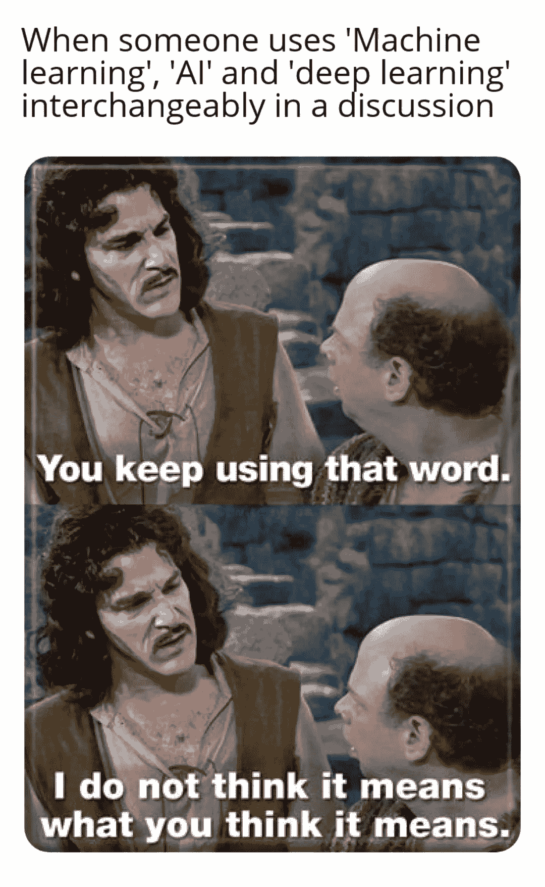
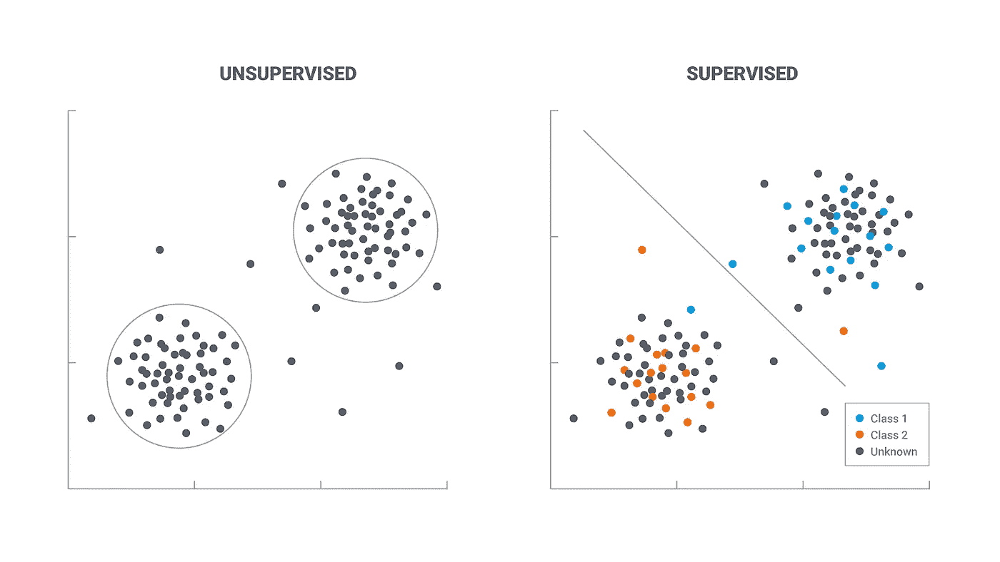
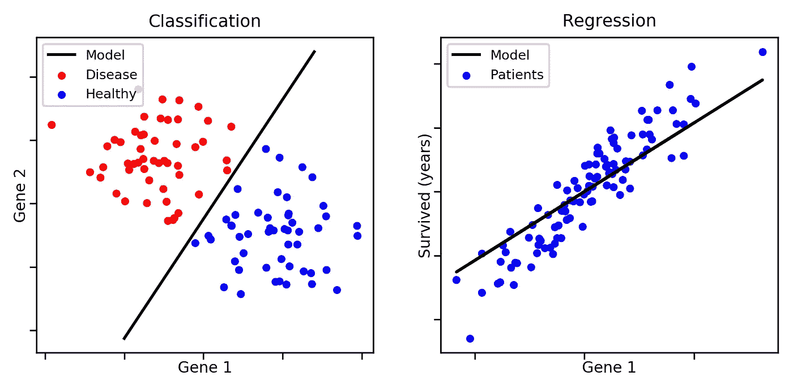
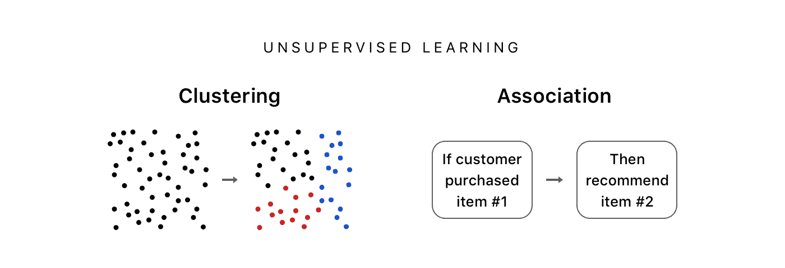

# 机器学习变得容易了

> 原文：<https://medium.datadriveninvestor.com/machine-learning-made-easy-8b7dc34506d2?source=collection_archive---------10----------------------->

嘿，伙计们，
你们以前听说过“机器学习”这个术语，当然，有人告诉过你们，机器学习和人工智能将承担全部工作。但是等等，实际上是什么。让我们比以往任何时候都更简单地浏览一下 ML，它不是什么？

**that’s too many words in a sentence**

> 概述:
> 什么是机器学习？
> 类型
> 监督 ML
> 非监督 ML
> 回归简介
> 分类简介
> 聚类简介
> 关联简介

# 什么是 ML？

> 根据汤姆·米切尔对机器学习的定义
> “如果一个计算机程序在任务 T 中的表现随着经验 E 的增加而提高，那么这个程序就可以从经验 E 中学习一些任务 T 和表现测量 P。”

示例:
下棋。
E =玩多种格子游戏的经验
T =玩格子游戏的任务
P =程序赢得下一场游戏的概率。

# 类型:

机器学习问题可分为**监督学习**和**无监督学习**

# **监督学习:**

在监督学习中，您通过使用标记的数据来训练机器。简而言之，一些数据已经知道它们的正确输出应该是什么样子，并且在输入数据和输出数据之间存在关系。
监督学习问题分为回归和分类两类。

## **回归:**

回归技术使用训练数据预测单个输出值。

示例:您可以使用回归从训练数据中预测房价。输入变量将是地点、房子的大小等。

## 分类:

分类意味着将输出分组到一个类中。如果算法试图将输入标记为两个不同的类，这称为二进制分类。在两个以上的类别之间进行选择被称为多类别分类。

**示例**:判断是否有借款人违约。

# 无监督学习:

这处理未标记的数据。无监督学习算法，使我们能够执行更复杂的处理任务，而且与其他算法相比，它可能更不可预测。

无监督学习问题分为聚类和关联问题。

无监督学习使我们能够在很少或根本不知道结果应该是什么的情况下处理问题。我们可以从不一定知道变量影响的数据中推导出结构。

## 协会:

关联规则允许您在大型数据库中的数据对象之间建立关联。这种无监督的技术是关于发现大型数据库中变量之间令人兴奋的关系

## 示例:

购买手机的人最有可能购买手机套。

## 以下列出了最常用的机器学习算法:

> 线性回归
> 
> 逻辑回归
> 
> 决策图表
> 
> SVM
> 
> 朴素贝叶斯
> 
> kNN
> 
> k-均值
> 
> 随机森林
> 
> 降维算法
> 
> 梯度推进算法
> 
> 马恩岛
> 
> XGBoost
> 
> LightGBM
> 
> CatBoost

谢谢大家！

点击订阅 DIntel [。](https://ddintel.datadriveninvestor.com/)

在这里加入我们的网络:【https://datadriveninvestor.com/collaborate 