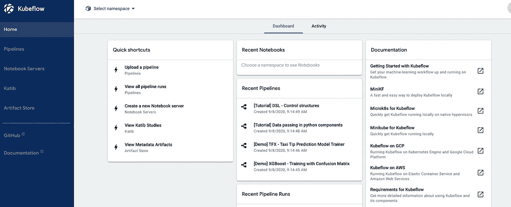

# 用 Kubeflow 构建机器学习管道

> 原文：<https://medium.datadriveninvestor.com/machine-learning-operations-with-kubeflow-befcd0e903e8?source=collection_archive---------1----------------------->


**简介:**

机器学习操作(MLOps)是将 DevOps 原理应用于机器学习而产生的一个领域。可能出现的一个问题是，为什么我们需要将 DevOps 原理应用于机器学习？为了回答这个问题，我们需要理解机器学习中的工作流程。为了构建机器学习模型来解决现实世界的问题，我们需要提取数据、预处理数据、转换数据、执行数据分析、模型选择、度量选择、模型训练、模型测试、超参数调整、模型验证，然后部署模型。手动处理这些任务可能会令人望而生畏，如果频繁地进行更改，可能会产生问题。实施 MLOps 意味着在构建机器学习模型/系统的所有步骤中应用自动化和监控，包括集成、测试、发布、部署和基础设施管理。更多信息可以在[这里找到](https://cloud.google.com/solutions/machine-learning/mlops-continuous-delivery-and-automation-pipelines-in-machine-learning)



Kubeflow Homepage

**库伯弗洛:**

Kubeflow 是一个基于 Kubernetes 的开源平台，旨在简化机器学习系统的开发和部署。在官方文档中被描述为【Kubernetes 的 ML 工具包，Kubeflow 由几个组件组成，跨越了机器学习开发生命周期的各个步骤。这些组件包括笔记本开发环境、超参数调整、功能管理、模型服务，当然还有机器学习管道。”

**库伯流管道:**

流水线用于自动化和编排在创建机器学习模型时使用的工作流中的各个步骤。旧的方法包括将模型的整个工作流作为一个脚本。因此，每个要测试的模型都有自己的脚本。管道由组件组成，组件是包含工作流中每个步骤的容器，如果需要，可以在其他管道中使用它。应该注意的是，这些组件独立于其他组件进行操作，例如，数据预处理所需的一切(即库和代码脚本)只能在预处理组件中使用，试图从另一个组件访问预处理组件中的库和脚本是不可能的。有了这个过程，如果方法相同，在另一个管道中使用来自一个管道的组件就容易多了，使得组件**可重用。**因此，不同型号不需要多个相似的脚本。


Pipeline Graph on Kubeflow.

## *创建管道有两种方法:*

使用重量轻的部件。

使用可重用的组件。

对于本文，我将重点关注可重用组件，但是简单地说，轻量级组件用于快速和容易的部署，轻量级组件的一个缺点是它们不可重用。

**使用 kubeflow 构建可重复使用的管道:**

要访问 kubeflow，你需要把它部署到一个集群上，我用 google 云平台进行部署，其他云服务也可以用比如 AWS，IBM，甚至本地，你的个人电脑。我不会讨论如何在集群上部署 kubeflow，但会在本文末尾提供一个链接。

在部署 kubeflow 之前，您需要确保所有组件都准备好了。让我们走一遍流程。

[](https://www.datadriveninvestor.com/2020/11/19/how-machine-learning-and-artificial-intelligence-changing-the-face-of-ecommerce/) [## 机器学习和人工智能如何改变电子商务的面貌？|数据驱动…

### 电子商务开发公司，现在，整合先进的客户体验到一个新的水平…

www.datadriveninvestor.com](https://www.datadriveninvestor.com/2020/11/19/how-machine-learning-and-artificial-intelligence-changing-the-face-of-ecommerce/) 

**数据预处理组件:**

对于这个例子，我将创建一个三组件管道，包括预处理组件、模型训练组件和模型测试组件。我将使用我参与的一个关于道路安全的项目，细节和代码可以在我的 git repo 上找到。本文末尾提供了回购的链接。

*预处理脚本*

这项任务是建立一个模型，根据某些特征预测事故的严重程度。在这个脚本中，我们基本上只是为模型训练清理数据。我们还将创建一个 Dockerfile，这样我们就可以构建一个图像并将其推送到 Dockerhub。

不要担心，如果你不明白发生了什么，在这篇文章的结尾提供了一个关于如何构建和推送 dockerhub 的链接。这篇文章详细介绍了上面发生的事情。

您的本地目录应该如下所示:

```
data_preprocess
   -preprocess.py
   -Dockerfile
```

现在，您所要做的就是使用命令提示符将目录更改为 data_preprocess 目录，构建 docker 映像并部署到 dockerhub(部署到 dockerhub 的方法有很多种，我是在本地部署的)。本文末尾提供了一个关于如何构建和推送 dockerhub 的链接。

对于模型训练和测试，将进行相同的过程。唯一的区别是，与数据预处理组件不同，模型训练和测试都接收输入，为了在脚本中接收这些输入，我们这样做。

模型培训组件:

这里，我们使用 argparse 来处理输入。使用自己的 Dockerfile，可以使用相同的过程来构建并推送到 Dockerhub。

应该注意，函数的输出是序列化的对象。

要知道您的构建和推送是否成功，您的 dockerhub 应该具有以下内容:


**创建管道:**

部署到 kubeflow 后，点击笔记本服务器，创建一个笔记本并连接到笔记本。连接笔记本时，接口与 jupyter 笔记本接口相同。你创造了一个新的。ipynb 文件并运行以下命令:

```
!python -m pip install --user --upgrade pip
*!pip install kfp*
```

安装完成后，您注释掉上面的代码行，然后重启并清空笔记本。

注意:kfp 是用于创建组件和管道的 sdk。

完成所有这些之后，接下来的事情就是导入必要的库并创建组件。

```
**import** **kfp**
**from** **kfp** **import** dsl
```

为了创建从 dockerhub 访问 docker 图像的组件，我们这样做。

预处理容器

训练容器

测试容器

image 变量是 dockerhub 上 docker 图像的名称，这就是 dsl。ContainerOp 函数访问您的代码。参数列表是代码脚本的输入变量，file_outputs 字典是序列化对象或。txt 文件。

现在已经创建了所有的容器，我们使用下面的代码将它们连接起来形成一个管道:

一切都设置好了，现在我们使用下面的代码运行实验。

```
client = kfp.Client()
client.create_run_from_pipeline_func(road_safety_useable_pipeline, arguments={})
```

正确完成后，它会显示两个链接，单击 run details 以显示管道的运行过程，如果成功(假设没有您忘记导入的 bug 或库),完成的工作将类似于本文开头显示的管道图。

这样，您应该能够创建自己的可重用管道。

链接:

[](https://github.com/kene111/Reusable_pipeline) [## kene 111/可重复使用 _ 管道

### 这是我为第一个道路安全开源项目重建的管道

github.com](https://github.com/kene111/Reusable_pipeline) [](https://towardsdatascience.com/machine-learning-pipelines-with-kubeflow-4c59ad05522) [## 使用 Kubeflow 的机器学习管道

### 如何使用 Kubeflow 管道自动化机器学习工作流

towardsdatascience.com](https://towardsdatascience.com/machine-learning-pipelines-with-kubeflow-4c59ad05522) [](https://medium.com/swlh/python-how-starting-with-docker-d2be73d9ae92) [## Python 如何:从 Docker 开始

### 一个易于遵循，一步一步的指导，让你开始与 Docker

medium.com](https://medium.com/swlh/python-how-starting-with-docker-d2be73d9ae92) [](https://cloud.google.com/solutions/machine-learning/mlops-continuous-delivery-and-automation-pipelines-in-machine-learning) [## MLOps:机器学习中的连续交付和自动化管道

### 本文档讨论了实现和自动化持续集成(CI)，持续交付…

cloud.google.com](https://cloud.google.com/solutions/machine-learning/mlops-continuous-delivery-and-automation-pipelines-in-machine-learning) 

尽管本视频中创建的管道是用轻量级组件完成的，但本教程展示了如何使用 google 云平台在 google 集群上部署 kubeflow。

**进入专家视角—** [**订阅 DDI 英特尔**](https://datadriveninvestor.com/ddi-intel)