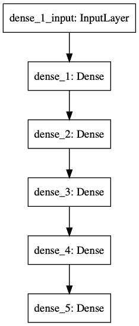

# 机器学习项目:神经网络学习玩井字游戏

> 原文：<https://medium.datadriveninvestor.com/machine-learning-project-neural-network-learns-to-play-tic-tac-toe-6ed71c159dda?source=collection_archive---------4----------------------->

## 一个关于用 Keras 在 Python 中构建神经网络并教它玩井字游戏的机器学习项目。

*本文原载于* [*程序员背包博客*](https://programmerbackpack.com/python-neural-network-tutorial/) *。如果你想阅读更多这类的故事，一定要访问这个博客。*

*更感兴趣？在 Twitter 上关注我，地址是*[*@ b _ dmarius*](https://twitter.com/b_dmarius)*，我会在那里发布每一篇新文章。*


Photo by [Alex Knight](https://unsplash.com/@agkdesign?utm_source=medium&utm_medium=referral) on [Unsplash](https://unsplash.com?utm_source=medium&utm_medium=referral)

# 动机

在这篇文章中，我们将建立一个基本的神经网络来学习井字游戏。众所周知，这是一个已解决的游戏，使用神经网络有点大材小用，但这是一个搜索空间非常小的简单游戏，这是一个很好的机会，让我们可以使用神经网络，而不必太担心数据收集和清理。

这个项目的所有代码都可以在 [Github](https://github.com/bdmarius/nn-tic-tac-toe) 上获得——我在这里只发布代码片段——所以你可以在那里查看(如果你这样做了，请不要忘记启动资源库，这样我就知道你喜欢这个项目了)。另外，请随时在 Twitter 上关注我， [@b_dmarius](https://twitter.com/b_dmarius) ，我会在那里发布每一篇新文章。

# 方法

我们将在命令行构建一个简单的井字游戏。我不会自己玩这个游戏，但是我会让两个电脑玩家从一系列可用的走法中随机选择来玩几千次。我们将记录玩家的每一个动作和游戏的最终结果。

[](https://www.datadriveninvestor.com/2019/03/03/editors-pick-5-machine-learning-books/) [## DDI 编辑推荐:5 本让你从新手变成专家的机器学习书籍|数据驱动…

### 机器学习行业的蓬勃发展重新引起了人们对人工智能的兴趣

www.datadriveninvestor.com](https://www.datadriveninvestor.com/2019/03/03/editors-pick-5-machine-learning-books/) 

在模拟之后，我们将把记录的数据输入一个简单的神经网络来训练我们的模型。训练完模型后，我们将让它与电脑玩家对战，首先作为玩家 1，然后作为玩家 2，看看结果。

# 游戏

对于井字游戏，我选择了一个非常基本的 Python 实现。这部分不是这个项目中最有趣的，所以我将解释流程并在这里列出代码。您可以根据自己的项目需要对其进行调整。

我们使用一个简单的游戏类来保存信息和处理游戏的流程。如果没有任何玩家选择，则单元格标记为 0，-1 表示有 X 的玩家，1 表示有 o 的玩家。每次，游戏都提供一个包含所有可用移动的列表，玩家轮流从该列表中随机选择。移动被处理，并且棋盘的当前状态被保存在我们将用于训练的历史中。游戏结束后(要么是平局，要么是一个玩家赢)，游戏结果被映射到棋盘在游戏中的每个状态。以下是我用过的符号:

```
PLAYER_X = 'X'
PLAYER_O = 'O'
EMPTY = ' '
PLAYER_X_VAL = -1
PLAYER_O_VAL = 1
EMPTY_VAL = 0
HORIZONTAL_SEPARATOR = ' | '
VERTICAL_SEPARATOR = '---------------'
GAME_STATE_X = -1
GAME_STATE_O = 1
GAME_STATE_DRAW = 0
GAME_STATE_NOT_ENDED = 2
```

这是第一次移动后的训练历史。在这个游戏中，玩家 X 赢了(因为第一项中的-1 ),游戏中的第一步是由玩家 X 进行的——第 3 行，第 2 列。

```
[(-1, [[0, 0, 0], [0, 0, 0], [0, -1, 0]])]
```

一整场比赛之后，历史将会是这样的:

```
[(-1, [[0, 0, 0], [0, 0, 0], [0, 1, 0]]), (-1, [[0, 0, 0], [0, -1, 0], [0, 1, 0]]), (-1, [[0, 0, 0], [1, -1, 0], [0, 1, 0]]), (-1, [[0, 0, -1], [1, -1, 0], [0, 1, 0]]), (-1, [[1, 0, -1], [1, -1, 0], [0, 1, 0]]), (-1, [[1, 0, -1], [1, -1, 0], [-1, 1, 0]]), (-1, [[1, 0, -1], [1, -1, 1], [-1, 1, 0]]), (-1, [[1, 0, -1], [1, -1, 1], [-1, 1, -1]]), (-1, [[1, 1, -1], [1, -1, 1], [-1, 1, -1]])]
```

想象 10000 场比赛后训练数据的样子！幸运的是，我们没有钱来帮助我们。稍后你会看到我们将如何处理所有这些数据。以下是我们模拟游戏的方式:

```
def simulate(self, playerToMove):
        while (self.getGameResult() == GAME_STATE_NOT_ENDED):
            availableMoves = self.getAvailableMoves()
            selectedMove = availableMoves[random.randrange(0, len(availableMoves))]
            self.move(selectedMove, playerToMove)
            if playerToMove == PLAYER_X_VAL:
                playerToMove = PLAYER_O_VAL
            else:
                playerToMove = PLAYER_X_VAL
        # Get the history and build the training set
        for historyItem in self.boardHistory:
            self.trainingHistory.append((self.getGameResult(), copy.deepcopy(historyItem)))

    def simulateManyGames(self, playerToMove, numberOfGames):
        playerXWins = 0
        playerOWins = 0
        draws = 0
        for i in range(numberOfGames):
            self.resetBoard()
            self.simulate(playerToMove)
            if i == 0:
                print(self.trainingHistory)
            if self.getGameResult() == PLAYER_X_VAL:
                playerXWins = playerXWins + 1
            elif self.getGameResult() == PLAYER_O_VAL:
                playerOWins = playerOWins + 1
            else: draws = draws + 1
        totalWins = playerXWins + playerOWins + draws
        print ('X Wins: ' + str(int(playerXWins * 100/totalWins)) + '%')
        print('O Wins: ' + str(int(playerOWins * 100 / totalWins)) + '%')
        print('Draws: ' + str(int(draws * 100 / totalWins)) + '%')
```

为了评估游戏的结果，我们使用一个非常基本的方法。当然，这可以优化很多，但这不在本文的讨论范围内。以下是我使用的代码:

```
def getGameResult(self):
        for i in range(len(self.board)):
            for j in range(len(self.board[i])):
                if self.board[i][j] == EMPTY_VAL:
                    return GAME_STATE_NOT_ENDED

        # Rows
        for i in range(len(self.board)):
            candidate = self.board[i][0]
            for j in range(len(self.board[i])):
                if candidate != self.board[i][j]:
                    candidate = 0
            if candidate != 0:
                return candidate

        # Columns
        for i in range(len(self.board)):
            candidate = self.board[0][i]
            for j in range(len(self.board[i])):
                if candidate != self.board[j][i]:
                    candidate = 0
            if candidate != 0:
                return candidate

        # First diagonal
        candidate = self.board[0][0]
        for i in range(len(self.board)):
            if candidate != self.board[i][i]:
                candidate = 0
        if candidate != 0:
            return candidate

        # Second diagonal
        candidate = self.board[0][2]
        for i in range(len(self.board)):
            if candidate != self.board[i][len(self.board[i]) - i - 1]:
                candidate = 0
        if candidate != 0:
            return candidate

        return GAME_STATE_DRAW
```

以下是 10000 场比赛后的模拟结果。在井字游戏中，作为第二个玩家似乎更容易，我们将看到这也反映在我们的神经网络模拟中。

*X 胜:23%
O 胜:64%
平局:11%*

# 神经网络

我们将构建一个神经网络，它将游戏棋盘状态(棋盘中每个单元格的值:-1，0，1)作为输入，并输出与每个可能的游戏结果相关的概率(X 赢，O 赢或平局)。从输出中，我们选择概率最高的结果作为我们的游戏结果。我们希望神经网络能够学会预测给定的棋盘状态，从而得出正确的最终结果。



Neural Network Configuration

所以我们的网络将有 9 个输入和 3 个输出。在输入层和输出层之间，我们有 4 个密集层。在尝试了许多不同的组合后，我选择了层数和尺寸。随意尝试其他组合，我相信你会得到更好的效果！下面是生成模型的代码。为此你需要安装**张量流**和 **keras** 。

```
def __init__(self, numberOfInputs, numberOfOutputs, epochs, batchSize):
        self.epochs = epochs
        self.batchSize = batchSize
        self.numberOfInputs = numberOfInputs
        self.numberOfOutputs = numberOfOutputs
        self.model = Sequential()
        self.model.add(Dense(64, activation='relu', input_shape=(numberOfInputs, )))
        self.model.add(Dense(128, activation='relu'))
        self.model.add(Dense(128, activation='relu'))
        self.model.add(Dense(128, activation='relu'))
        self.model.add(Dense(numberOfOutputs, activation='softmax'))
        self.model.compile(loss='categorical_crossentropy', optimizer='rmsprop', metrics=['accuracy'])
```

# 训练模型

我们将获得棋盘状态和最终结果，并将它们作为输入和输出提供给神经网络。我们将数据集分为 80%的训练集和 20%的评估集。神经网络背后的数学问题已经超出了本文的范围，但是如果您也想让我写一篇关于这方面的文章，我会很乐意的！

然后，我们将使用这些数据对神经网络进行 100 个时期的训练，每批 32 个时期。这些数字也是实验的结果，所以你可以随时尝试新的组合。

```
def train(self, dataset):
        input = []
        output = []
        for data in dataset:
            input.append(data[1])
            output.append(data[0])

        X = np.array(input).reshape((-1, self.numberOfInputs))
        y = to_categorical(output, num_classes=3)
        # Train and test data split
        boundary = int(0.8 * len(X))
        X_train = X[:boundary]
        X_test = X[boundary:]
        y_train = y[:boundary]
        y_test = y[boundary:]
        self.model.fit(X_train, y_train, validation_data=(X_test, y_test), epochs=self.epochs, batch_size=self.batchSize)
```

# 预测最佳行动

预测游戏中给定时刻的最佳行动非常简单。游戏已经为我们提供了所有可能的移动列表，因此我们可以采取每个可能的移动，将其投影到棋盘上，并通过神经网络输入棋盘状态，并记录我们感兴趣的结果(例如，如果神经网络是玩家 X，我们会记录玩家 X 获胜的概率)。

在网络处理完所有可能的走法后，我们选择得分最高的走法，并将其作为我们的下一步走法。

```
def predict(self, data, index):
        return self.model.predict(np.array(data).reshape(-1, self.numberOfInputs))[0][index]
```

这是用神经网络模拟游戏的代码，一个玩家扮演另一个玩家。

```
def simulateNeuralNetwork(self, nnPlayer, model):
        playerToMove = PLAYER_X_VAL
        while (self.getGameResult() == GAME_STATE_NOT_ENDED):
            availableMoves = self.getAvailableMoves()
            if playerToMove == nnPlayer:
                maxValue = 0
                bestMove = availableMoves[0]
                for availableMove in availableMoves:
                    # get a copy of a board
                    boardCopy = copy.deepcopy(self.board)
                    boardCopy[availableMove[0]][availableMove[1]] = nnPlayer
                    if nnPlayer == PLAYER_X_VAL:
                        value = model.predict(boardCopy, 0)
                    else:
                        value = model.predict(boardCopy, 2)
                    if value > maxValue:
                        maxValue = value
                        bestMove = availableMove
                selectedMove = bestMove
            else:
                selectedMove = availableMoves[random.randrange(0, len(availableMoves))]
            self.move(selectedMove, playerToMove)
            if playerToMove == PLAYER_X_VAL:
                playerToMove = PLAYER_O_VAL
            else:
                playerToMove = PLAYER_X_VAL

    def simulateManyNeuralNetworkGames(self, nnPlayer, numberOfGames, model):
        nnPlayerWins = 0
        randomPlayerWins = 0
        draws = 0
        print ("NN player")
        print (nnPlayer)
        for i in range(numberOfGames):
            self.resetBoard()
            self.simulateNeuralNetwork(nnPlayer, model)
            if self.getGameResult() == nnPlayer:
                nnPlayerWins = nnPlayerWins + 1
            elif self.getGameResult() == GAME_STATE_DRAW:
                draws = draws + 1
            else: randomPlayerWins = randomPlayerWins + 1
        totalWins = nnPlayerWins + randomPlayerWins + draws
        print ('X Wins: ' + str(int(nnPlayerWins * 100/totalWins)) + '%')
        print('O Wins: ' + str(int(randomPlayerWins * 100 / totalWins)) + '%')
        print('Draws: ' + str(int(draws * 100 / totalWins)) + '%')
```

这是我们神经网络游戏的模拟结果(每个游戏 10000 个)。

> 用神经网络模拟成 X 玩家:
> NN 玩家
> -1
> X 胜:57%
> O 胜:1%
> 平局:40%
> 
> 用神经网络模拟为 O 玩家:
> NN 玩家
> 1
> X 胜:3%
> O 胜:89%
> 平局:6%

结果对我来说非常好！！在两场比赛中，神经网络都比另一个玩家赢了更多的比赛。对于第一种情况，即使神经网络只赢了 57%的游戏，另一个玩家只赢了 1%，其余的都是平局，这仍然是一个非常好的结果。第二场比赛的结果甚至更好，NN 玩家赢得了惊人的 89%的比赛，而另一个玩家只赢得了 3%。所以在这两种情况下，对手都没有机会！

# 结论

在本文中，我们尝试了一种简单的方法来构建一个尝试玩井字游戏的神经网络。我们只使用了一个基本模型，仍然得到了一些不错的结果。如果你想获得更好的结果，我建议尝试更复杂的模型和更多的训练数据。另外，另一个好方法是使用强化学习，但这是另一篇文章的内容。该项目的完整代码可以在 Github 上找到。如果你喜欢这个项目，就开始吧。感谢阅读！

*更感兴趣？在 Twitter 上关注我，地址是*[*@ b _ dmarius*](https://twitter.com/b_dmarius)*，我会在那里发布每一篇新文章。*