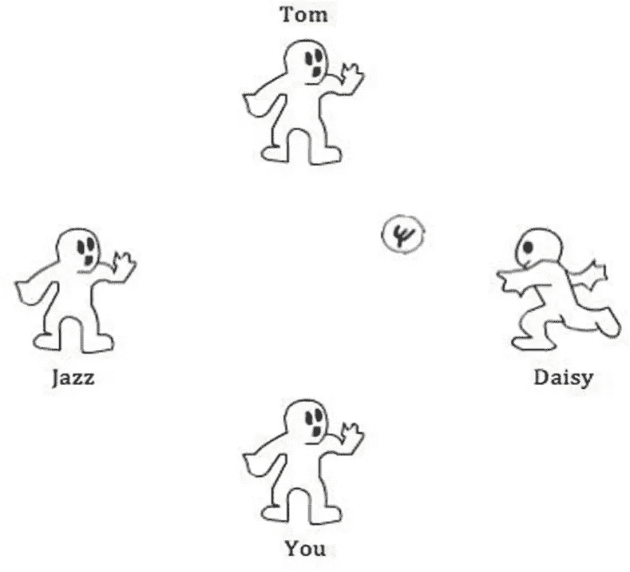
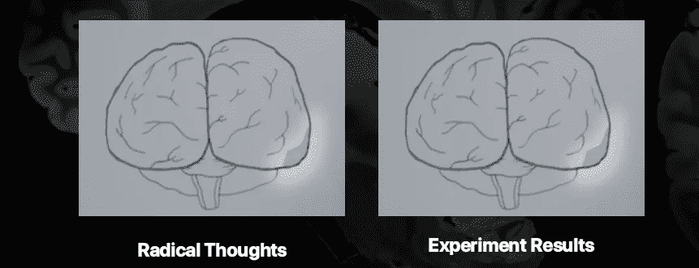
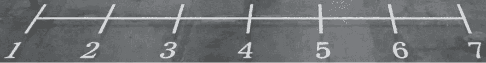
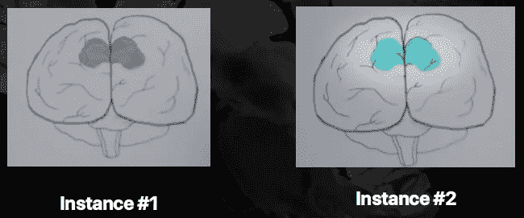
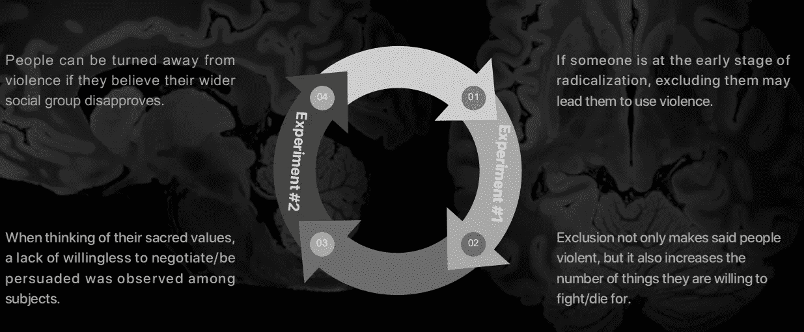
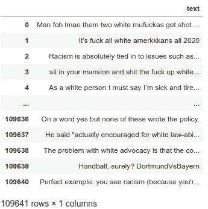
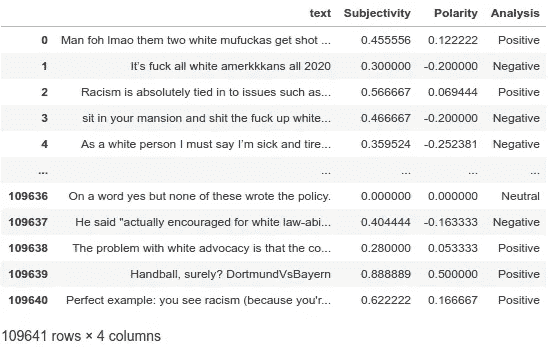
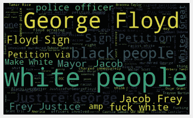
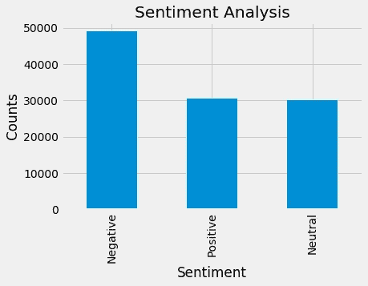

# 机器学习显示你对乔治·弗洛伊德的谋杀负有责任！

> 原文：<https://medium.datadriveninvestor.com/machine-learning-shows-you-are-responsible-for-george-floyds-murder-17ab2b1fa0bd?source=collection_archive---------2----------------------->

## 实用的 9 分钟大开眼界需要带来彻底的改变


Photo by [Mohamed Nohassi](https://unsplash.com/@coopery?utm_source=medium&utm_medium=referral) on [Unsplash](https://unsplash.com?utm_source=medium&utm_medium=referral)

> “我真的没话说了。我一直以来唯一的意图就是传播意识和反对种族主义。我一点也不知道，我正在为此做贡献。”

众所周知，5 月 25 日是 46 岁的明尼苏达州居民**乔治·弗洛伊德**被谋杀的日子。让这一事件与众不同的是参与他的死亡的行动者，以及似乎成为这次袭击燃料的动机。**这篇 6 分钟的文章旨在让你大开眼界，并向你展示你是如何为这一可描述的行为分担责任的。**

这位 46 岁的男子被明尼苏达州的一名警官以我所见过的最不人道的方式谋杀。虽然这一事件之前有一些背景，但与本文的主题无关。重要的是，该男子对任何人都不构成威胁，而且在犯下“无害”罪行后，因警官膝盖压在他脖子上而窒息。

这一罪行被归类为仇恨犯罪。这名警官的行为并不代表警察部队，而是代表他个人的不安全感和无法解释的偏执。

然而，重要的是，你这个读这篇文章的人使这种事件不仅可能发生，而且很可能在不久的将来重演。

作为一名数据科学家和心理学爱好者，我觉得我有责任用科学和数据向你展示你到底做错了什么，以及如何改正。

The video of the incident

# 快速浏览研究的心理学方面(没那么长，不要担心)

在进行机器学习分析时，很明显，我的结论将基于重要的心理学研究。上述研究基于一篇名为*“神圣价值观与暴力极端主义脆弱性的神经和行为相关性”的科学论文。心理学前沿。”*并且可以从这里的[进入](https://psycnet.apa.org/record/2019-00710-001)。

这是一篇全面的论文，所以我将只分享重要的部分，而不是解释整个背景。

目标是通过使用功能磁共振成像扫描，探索神圣价值观、暴力极端主义和社会排斥之间潜在的神经和行为关系。民族志田野调查和心理调查在西班牙巴塞罗纳附近的欧洲穆斯林社区**的 535 名年轻男性**中进行。功能磁共振成像实验的候选人是从那些表示愿意参与或促进与圣战事业有关的暴力的人中挑选出来的；其中 38 人同意接受扫描。

## 实验#1 -电脑球



受试者最初被要求玩一种叫做赛博球(cyber-ball)的游戏(一种以产生强烈的社会排斥感而闻名的游戏)。几轮过后，当玩家开始感到被排斥时，他们被放入核磁共振扫描仪中。

该实验的目的是通过核磁共振成像仪观察参与者的大脑在受到社会排斥后的反应。

显而易见，当受试者暴露于这种现象时，大脑的某个部位的活动会增加。当一个人有激进的想法时，这个部分通常会被激活。



Extract from my presentation “Did We Cause That Terrorist Attack?”

**第一次实验的结论:**

> 当被排除在外时，受试者愿意为之战斗/牺牲的事情越来越多。

这只是指那些已经处于激进化边缘的人。对于之前没有接触过这些概念的人来说，这种影响更加糟糕。仇恨在他们的系统中被诱发，并迅速酝酿直至致命。对特定群体没有仇恨倾向的人突然开始完全改变他们的观点。最后，如果压力足够大，这种仇恨会达到个人前所未有的程度。结果是激进化。

## 实验 2——同伴压力



第二个实验的目的是测试受试者对同伴压力的反应。实验的规则如下:

*   30 名参与者接受了 1-7 分的评分
*   他们被要求对自己为某些价值观而战/献身的意愿进行评级。
*   然后，他们会看到在核磁共振扫描仪的观察下，他们的同伴在秤上的位置，并被要求重新考虑他们的回答。

下面是受试者在被告知他们的同龄人在量表上的排名之前和之后的大脑图像:



Extract from my presentation “Did We Cause That Terrorist Attack?”

**第二实验的结论:**

> 当被要求在量表上选择一个值时，大脑的这一部分完全闲置，显示出缺乏谈判/被说服的意愿。
> 
> 另一方面，当他们被告知更广泛的社会群体的价值比他们低时，大脑的这一部分被重新激活，他们改变自己的答案以匹配同龄人的答案。

*众所周知，大脑的这一部分与一个人对新思想的开放程度和说服力有关。

## 通过观察这两个实验的结果，我们可以假设什么？



Extract from my presentation “Did We Cause That Terrorist Attack?”

继续阅读，理解为什么你会对未来类似的暴力和偏见行为负责！

# 项目蓝图


Photo by [Sven Mieke](https://unsplash.com/@sxoxm?utm_source=medium&utm_medium=referral) on [Unsplash](https://unsplash.com?utm_source=medium&utm_medium=referral)

在规划蓝图之前，需要一个简明的目标。

目标很明确，**我将建立一个机器学习模型，它将删除过去三天所有与事件相关的推文，并将执行情感分析和仇恨言论识别(在相同的数据上)，以评估关于白人的公众舆论。**

我将遵循的**步骤**是之后的**:**

1.  获取 5 月 26 日至 5 月 28 日发布的所有推文，关键词为“去他妈的白人”。
2.  获取 5 月 26 日至 5 月 28 日发布的所有推文，关键词为“乔治·弗洛伊德”。
3.  获取 5 月 26 日至 5 月 28 日发布的所有推文，关键词为“白人”。
4.  获取 5 月 26 日至 5 月 28 日发布的所有推文，关键词为“白人”。
5.  根据这个分数，进行情感分析，作为一种为白人支配公众意见的手段。
6.  对相同的推文进行仇恨言论识别和分析，并确定种族诽谤的大致比例。

# 执行分析

模型的初始组件(获取和清理数据等)与我在这里使用的组件完全相同(您可以按照说明一步一步地操作，不需要修改代码):

[](https://medium.com/datadriveninvestor/master-machine-learning-and-nlp-through-spacexs-dragon-launch-and-twitter-cf1b1a791382) [## 通过 SpaceX 的 Dragon Launch 和… Twitter 掌握机器学习和 NLP？

### 关于如何使用 NLP 为 SpaceX 最近的发射确定公众意见的 A-Z 指南

medium.com](https://medium.com/datadriveninvestor/master-machine-learning-and-nlp-through-spacexs-dragon-launch-and-twitter-cf1b1a791382) [](https://medium.com/datadriveninvestor/create-the-ultimate-stock-investing-portfolio-with-machine-learning-1f8034648211) [## 利用机器学习创建终极股票投资组合

### 关于如何使用机器学习和公众情绪分析建立机器学习投资组合的 A-Z 指南

medium.com](https://medium.com/datadriveninvestor/create-the-ultimate-stock-investing-portfolio-with-machine-learning-1f8034648211) 

因此，我已经成功地获取了 109，641 条与上述关键词相关的推文。



现在重要的是给每条微博分配一个情感分数。这可以用下面的代码来执行:



通过创建一个“单词云”，我们可以在推文中看到一些最常见和最重要的单词。



## 种族仇恨言论模型的交叉引用

拥有一个结果准确的模型至关重要。为了正确地对情感得分进行分类，我将交叉引用仇恨言论检测模型的结果。

使用的数据集，以及一些对我有很大帮助的信息性文献，可以在下面找到:

[](https://github.com/ZeerakW/hatespeech) [## ZeerakW/hatespeech

### 在这里，我们提供了一组已经被标注了仇恨言论的推文数据。我们在…中提供 ID 和注释

github.com](https://github.com/ZeerakW/hatespeech) 

# 结果

模型的结果和我预期的一样令人担忧。



在 109，641 条不同的个人推文中，超过 44%的人针对白种人，并对他们进行种族歧视。另一条 **27.8%** 表示同情，没有使用任何类型的种族诽谤，其余 **27.5%** 的推文是中性的，没有提到任何关于不同种族的事情。

为了更好地理解结果，每个类别的总数如下:

```
Negative    49,017
Positive    30,488
Neutral     30,136
```

# 为什么这很重要？

这一切都回到了这篇文章的标题。**“为什么我最有可能对这次攻击和接下来的攻击负责？”，**你可能会问。

根据我们之前探索的实验，很明显，指责整个群体并有效地隔离人们只会产生负面影响。事实上，在大多数人完全反对那天发生的事情的情况下，对白人进行种族主义的咒骂会使他们更容易受到暴力的影响。这一现象在第一次电子球实验中得到了清晰的展示。

本质上，如果有人出于任何原因同情凶手的信仰体系，在社交媒体上以大多数人目前的反应方式做出反应，只会增加他/她实施恐怖和仇恨行为的意愿。

> “我们能停止这一切吗？”

这个问题的答案可以通过第二个实验来提供。不要试图排斥白人，让他们为夺走乔治生命的悲剧负责，白人必须自己公开声明他们反对这种出于种族动机的暴力事件。事实是，绝大多数人(99%中的 99%)在任何情况下都不会宽恕那个执法人员的行为，而且大多数人可能会因为想到这件事而感到厌恶。

通过团结我们自己，集体谴责杀害乔治的人的行为，以及他所珍视的信仰体系，我们才能带来真正的改变。只有到那时，这些把自己放在“七”上的人，才会归结为“二”。

我希望这篇文章给你上了一堂重要的课，告诉你我们人类应该如何前进。我们有能力阻止这种现象成为常态。唯一需要的是首先作为一个整体行动起来，不要选择看到使我们分离的东西，而是看到使我们团结的东西。

# 你想了解更多吗？

如果你想**提高你的知识**并且对**利用机器学习赚钱感兴趣**我**强烈鼓励你**来**跟随我**并阅读下面列出的**文章:**

[](https://medium.com/datadriveninvestor/create-the-ultimate-stock-investing-portfolio-with-machine-learning-1f8034648211) [## 利用机器学习创建终极股票投资组合

### 关于如何使用机器学习和公众情绪分析建立机器学习投资组合的 A-Z 指南

medium.com](https://medium.com/datadriveninvestor/create-the-ultimate-stock-investing-portfolio-with-machine-learning-1f8034648211) [](https://medium.com/datadriveninvestor/master-machine-learning-and-nlp-through-spacexs-dragon-launch-and-twitter-cf1b1a791382) [## 通过 SpaceX 的 Dragon Launch 和… Twitter 掌握机器学习和 NLP？

### 关于如何使用 NLP 为 SpaceX 最近的发射确定公众意见的 A-Z 指南

medium.com](https://medium.com/datadriveninvestor/master-machine-learning-and-nlp-through-spacexs-dragon-launch-and-twitter-cf1b1a791382) [](https://medium.com/datadriveninvestor/elons-lethal-mistake-predicting-the-stock-price-of-tesla-with-twitter-and-machine-learning-5e89282ce75f) [## 埃隆的黄金礼物:用 Twitter 和机器学习预测特斯拉的股价

### 使用 NLP 和机器学习以超过 80%的准确度预测特斯拉价格的完整指南

medium.com](https://medium.com/datadriveninvestor/elons-lethal-mistake-predicting-the-stock-price-of-tesla-with-twitter-and-machine-learning-5e89282ce75f) [](https://medium.com/datadriveninvestor/millennials-this-is-the-unconventional-money-making-technique-you-were-looking-for-3b47c7384c60) [## 千禧一代！这是你一直在寻找的非常规赚钱技巧

### 如何使用 python 和 ML 以 0 美元启动资金制作成千上万的完整蓝图。

medium.com](https://medium.com/datadriveninvestor/millennials-this-is-the-unconventional-money-making-technique-you-were-looking-for-3b47c7384c60)