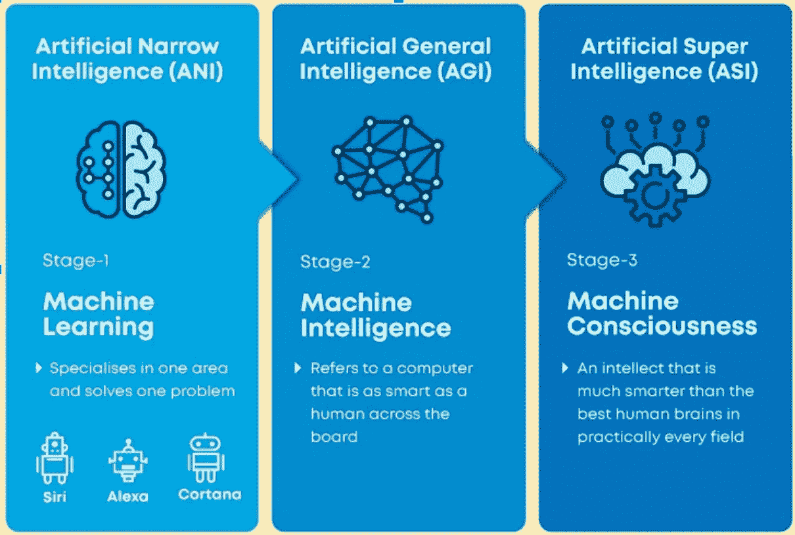
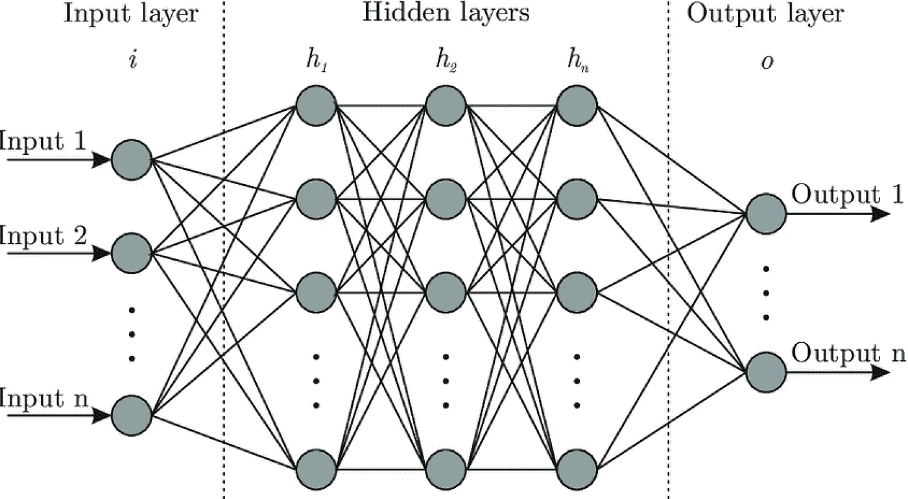
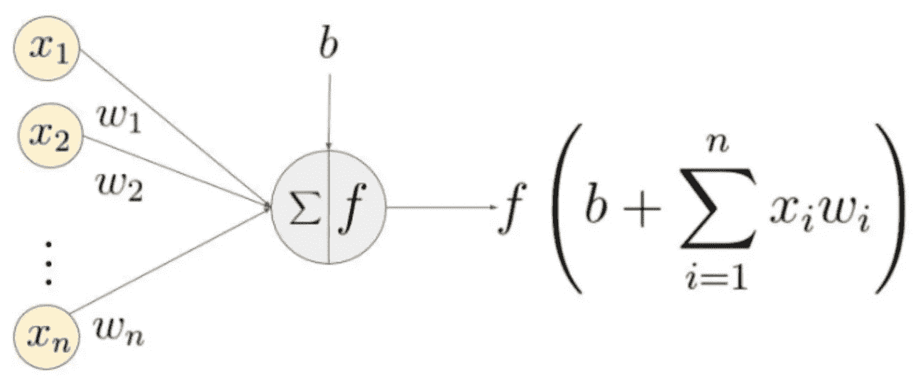
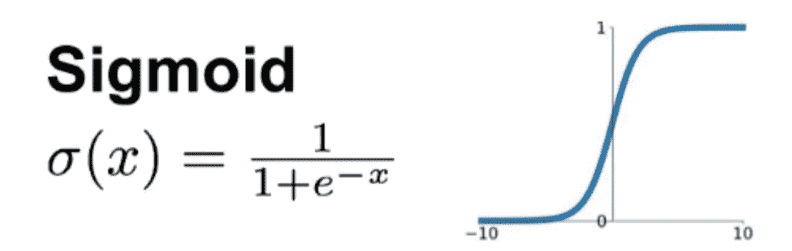
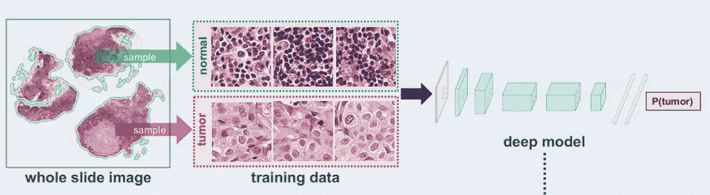
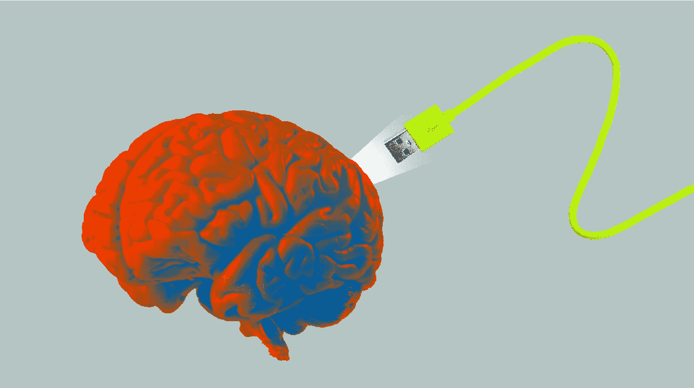

# 机器学习:世纪工具

> 原文：<https://medium.datadriveninvestor.com/machine-learning-the-tool-of-the-century-fe5a20309920?source=collection_archive---------6----------------------->

## 机器学习和人工神经网络综述

我想以分享我今天的一段对话开始这篇文章。我问我的 10 个朋友，“什么是人工智能？”

我和凯文的对话是这样的。警告:如果你像我一样是个人工智能呆子，这可能有点*触发……*⚠️

> 我:嘿凯文！你有时间吗？
> 
> 凯文:当然，什么事？
> 
> 我:我随便问个问题……你知道 AI 是什么吗？
> 
> 凯文:谁？诶眼睛？
> 
> 我:不，不，就像 A . I。
> 
> 凯文:嗯，是的，眼睛…
> 
> 我:不不不，像人工智能。
> 
> 凯文:不，从没听说过他。他是说唱歌手吗？
> 
> 我:…

不，人工智能不是说唱歌手。

我问的所有人都有类似的反应，有些人比其他人更糟糕。我得出的结论是，我的朋友没有一个懂人工智能的。

但说真的，这真的让我大吃一惊。**世界上超过三分之一的*所有*公司都以这样或那样的方式使用人工智能，然而三分之二的消费者甚至没有意识到他们正在使用人工智能……我的朋友中没有一个人**😲甚至凯文使用的应用程序，如网飞和 Snapchat，也使用人工智能。

每个人至少应该对人工智能的工作原理有一个基本的了解。它扰乱了我们生活的方方面面，从医学诊断到治疗。

 [## 金融中的机器学习|数据驱动的投资者

### 在我们讲述一些机器学习金融应用之前，我们先来了解一下什么是机器学习。机器…

www.datadriveninvestor.com](https://www.datadriveninvestor.com/2019/02/08/machine-learning-in-finance/) 

当大多数人听到“人工智能”时，他们会想到智能机器人。智能机器人，如下图，不是人工智能。

NOT artificial intelligence

相反，它们依靠人工智能运行。**人工智能是让这样的机器人变得聪明的软件，而更多时候，这并不是人工智能的目标。**

人工智能有 3 种主要类型:狭义、广义和超级。我们还没有达到超智能，甚至普通智能。人工狭义智能(ANI)包括机器学习，它正被用于制造自动驾驶汽车，向你展示广告，以及改善疾病诊断。

机器学习是计算机在没有显式编程的情况下从数据中学习和改进的领域。

一种类型的机器学习使用人工神经网络(ann ),受我们大脑中的生物神经网络的启发。

像生物神经网络一样，人工神经网络接受输入并返回输出。然后，输出被传递到另一个神经元，从而成为下一个神经元的输入。

Abstracted feedforward neural network

以上是一个抽象的人工神经网络。它接收数量为 *n* 的输入，这些输入随后通过一系列隐藏层产生数量为 *n* 的输出。

每个节点代表一个神经元，每条边代表这些神经元之间的连接。这个网络是完全连接的和前馈的，意味着一个神经元的输出被向前传递到前一层中的所有神经元。

然而，这是抽象的，涉及到一些数学问题:

每个输入乘以其相应的权重， *w，*由网络*中的一条边表示。*计算所有输入*权重的总和，并添加偏差项 *b* 。然后，将总和乘以激活函数，即可得到输出。

我们需要一个激活函数来将总和从 0 变为 1。这使得我们的数据更容易处理。

有许多激活函数，如 ReLU 和 tanH，但使用最广泛的是 Sigmoid 激活函数。

Sigmoid activation function, in which e is Euler’s number and x is the summation

欧拉数是 *e* 和 *x* 是求和。您真正需要知道的是，这会“挤压”0 和 1 之间的值。

现在我们已经有了基本原则，这怎么能实际应用于⁉️呢

实际上，我们可以用神经网络进行一些不同类型的机器学习:

*   **监督学习** ➡️基于示例输入-输出对将输入映射到输出
*   **无监督学习** ➡️从由输入数据*组成的数据集中进行推断，而没有*标记的响应
*   **强化学习** ➡️一种学习类型，其中一种称为代理的算法通过与其环境交互来学习

虽然所有这些在不同的场景中都很有用，但我们将重点关注监督学习，在监督学习中，我们传递标有期望输出或预测的输入。基于神经网络预测的“错误”程度，更新权重和偏差以使预测更接近期望的输出。这个过程被称为训练神经网络。

Gradient descent

我们在一个称为[梯度下降](https://en.wikipedia.org/wiki/Gradient_descent)的过程中训练神经网络，在这个过程中，神经网络的权重和偏差被调整以最小化预测误差。你可以把梯度下降想象成下山，你试图到达最低点，或者在这种情况下误差最小。这将使神经网络更好地预测未来的数据，称为测试数据。

这项技术几乎有无穷无尽的应用，包括基于大脑预测精神分裂症(点击[此处](http://here)查看我的项目)，用[卷积神经网络](https://en.wikipedia.org/wiki/Convolutional_neural_network)赋予计算机视觉(CNN)。

一些最有益的应用是在医学图像诊断中。通过大量的训练数据，CNN 可以比大多数医生更早地预测样本是否有肿瘤。

每一天，科学家们都在越来越多地了解它。在未来的 20 年里，机器学习可能会看起来与现在完全不同，而且很可能会这样……但是没有其他方法可以找到答案，除非我们自己去看👀

# 关键要点🔑

*   人工智能是一个强大的工具，它正在颠覆每一个行业。然而，很多人不明白它是什么，也不知道它是如何工作的
*   人工智能不是智能机器人，而是让智能机器人变得聪明的东西
*   机器学习是一种人工狭义智能，可用于从数据中学习。它使用模拟生物神经元的人工神经网络(ann ),并通过梯度下降进行训练
*   机器学习的三种主要类型是无监督、有监督和强化学习，所有这些在不同的场景中都是有用的
*   人工神经网络的应用几乎是无止境的，甚至被用于制造无人驾驶汽车和更准确的癌症诊断

嘿，你们好！👋*我是米奇·T，16 岁，对指数技术和神经科学的交叉领域充满热情。我的目标是彻底改革神经和精神疾病的诊断和治疗。不过，我对* ***一切*** *还是蛮感兴趣的。如果你想进一步讨论这篇文章，或者只是聊天，请给我发电子邮件到 mike.s.taylor101@gmail.com*

