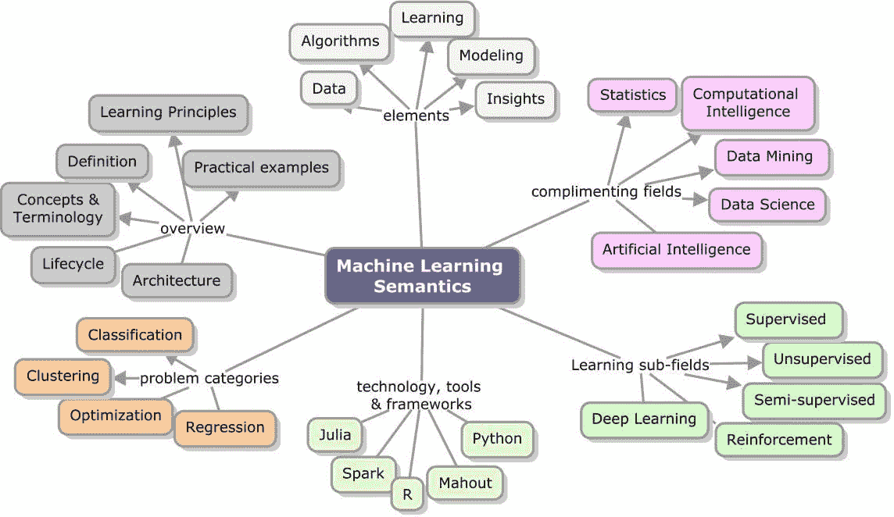
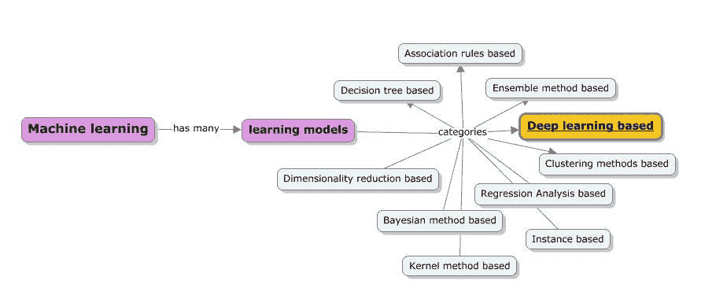
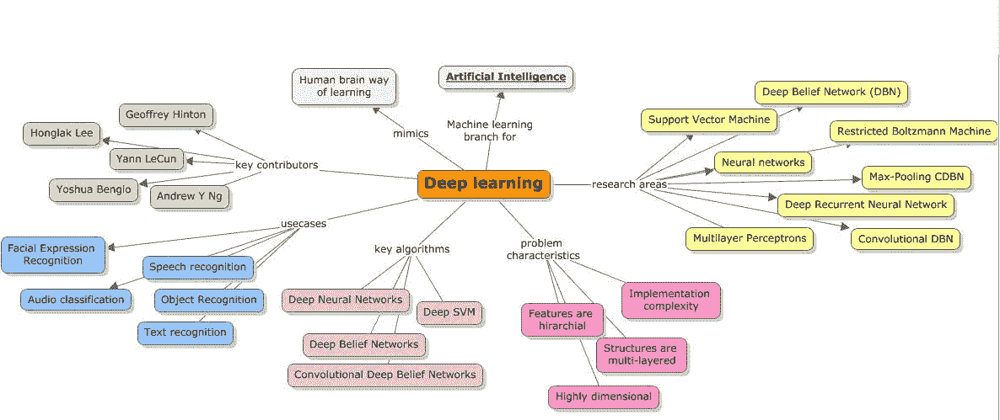
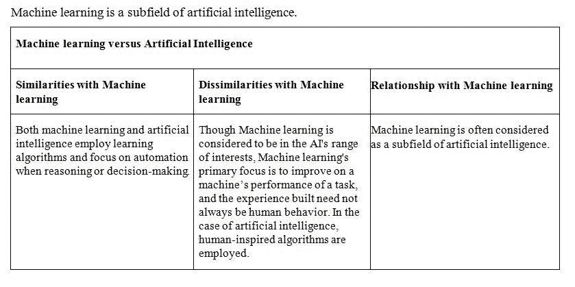

# 机器学习 vs 深度学习 vs 人工智能

> 原文：<https://medium.datadriveninvestor.com/machine-learning-vs-deep-learning-vs-artificial-intelligence-fcc9a082848?source=collection_archive---------5----------------------->

这篇文章是从我的一篇关于机器学习的出版物中摘录的*修改的*。每个人都很好奇，术语也不会让我们厌烦。我试图比较当今存在的流行术语，以及这些术语与机器学习的相似或不同之处。请记住，我还没有将认知计算引入其中。我的下一篇文章将会涉及更多关于认知的内容，以及它与学习/智力的其他领域有何不同。

 [## 深度学习用 7 个步骤解释-更新|数据驱动的投资者

### 在深度学习的帮助下，自动驾驶汽车、Alexa、医学成像-小工具正在我们周围变得超级智能…

www.datadriveninvestor.com](https://www.datadriveninvestor.com/2019/01/23/deep-learning-explained-in-7-steps/) 

首先，机器学习是一种让机器从提供给它的数据中学习的方式，而不是手动编码规则。下面的概念图描绘了机器学习的各个方面。

在我们开始比较这些术语之前，首先让我们看看机器学习中不同类别的学习方法。

在所有的学习方法中，深度学习是机器学习的一个子领域，专注于建立在人脑模型基础上的算法，并以人类解决问题的方式解决问题。深度学习是机器学习的一个领域，专注于将机器学习与人工智能统一起来。关于与人工神经网络的关系，该领域更多地是对人工神经网络的改进，人工神经网络对大量公共数据进行处理，以获得实用的见解。它致力于构建更复杂的神经网络来解决半监督学习下的分类问题，并对几乎没有标记数据的数据集进行操作。一些深度学习技术列举如下:

*   卷积网络
*   受限玻尔兹曼机(RBM)
*   深度信仰网络(DBN)
*   堆叠式自动编码器及其他

下面的概念图快速展示了深度学习的组成。

**人工智能**专注于构建能够模仿人类行为的系统。它已经存在了一段时间，现代人工智能一直在不断发展，现在包括专门的数据需求。在许多其他能力中，人工智能应该展示以下内容:

知识存储和表示，用于保存所有接受询问和调查的数据

*   能够处理文本的自然语言处理(NLP)能力
*   能够回答问题并得出结论的推理能力
*   计划、安排和自动化的能力
*   机器学习能够建立自我学习算法
*   机器人及更多

*最初发表于*[*【https://www.linkedin.com】*](https://www.linkedin.com/pulse/machine-learning-vs-deep-artificial-intelligence-sunila-gollapudi/)*。*