# 机器学习 Zuihitsu-IV

> 原文：<https://medium.datadriveninvestor.com/machine-learning-zuihitsu-iv-cbbe4ffdf483?source=collection_archive---------16----------------------->

***数据混合:一个简单而强大的反过拟合工具***

巴黎@Datategy 数据科学家和机器学习工程师埃伦·云吕博士

我不知道为什么，但对我来说，没有什么比钻研一个直截了当的、陈旧的表格数据挑战更好的了。在公司的大部分时间里，我们的工作负载只是转向复杂的图像分割、视频分析和一些非常复杂的时间序列预测。但是，我只是怀念 2D 表格数据的简单性。也许，只是对懒惰的向往，或者是 30 秒的训练次数，或者是对我大三学机器的纯粹怀念。但是我敢肯定，有很多人和我一样对口味有着明显的偏好:)。

**图像识别中隐藏的对抗性攻击**

你不可能得到生活中的一切。人生不过是对取舍的妥善管理。人工神经网络(ann)以牺牲其增强的性能为代价，带来了一些代价，其中最显著的是过拟合。

有一套工具和策略来对付人工神经网络的过度适应，从简单的辍学到数据扩充或仔细审查的培训政策。不管你用测试数据集做多少验证，相信我；你的 ANN 总是过拟合，即使你不会注意到你的用例，会让你满意。

这种无处不在的人工神经网络过度拟合的最显著的证据是隐藏的敌对噪音现象。在基于深度学习的计算机视觉系统中，这是一个经过充分研究的概念。即使你在像素上添加了非常小的随机噪声；即使你看不到这种变化，它也会极大地扰乱人工神经网络的性能。这几乎完全是由于无处不在的过度拟合效应。在人工神经网络的混沌路径上，输入中的极小扰动可以产生无界梯度。

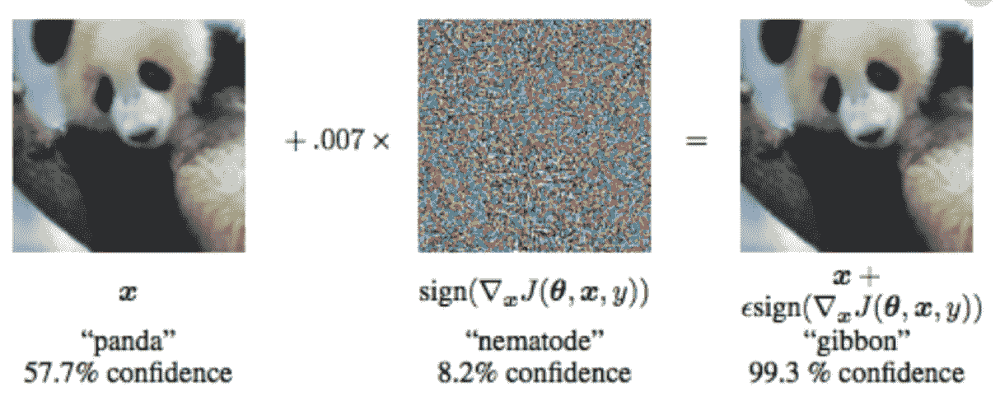

Well, you are really 99.3% sure that it’s a gibbon mate ? Courtesy of legendary ML researcher Ian Goodfellow et al [1]

有许多方法来对抗这些类型的影响，已经构成了大量的文献。基于度量学习的方法，例如对比损失，还包括复杂的鉴别器网络等。优雅的数据扩充技术，实现伪贝叶斯蒙特卡罗退出等。

一种非常简单的对抗隐藏的敌对噪声效应的数据增强策略是简单地混合两幅(或多幅)图像；用模糊类生成全新类型的数据点。最简单的混合形式是创建两个不同类别的两个图像的加权和(例如，0.6x(猫的像素)+ 0.4x(狗的像素)= >类别= 60%猫，% 40%狗)

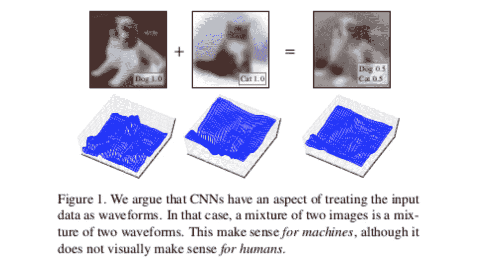

Half cat, Half dog. This type of fuzzy representations force neural networks to learn feature relationships more smoothly, providing a basic countermeasure against hidden adversarial noise phenomenon. Courtesy of [2][3].

如果我们只是简单地将它应用于表格数据集，会发生什么？

当我阅读这些论文时，我只是想知道它会如何影响神经网络在表格数据集上的性能。当我们需要一个具有混合分类和连续特征的二元分类的代表性数据集时，我们在哪里引用？是的，你猜对了！让我们用*泰坦尼克号*试试这个简单的技巧。

**预处理**

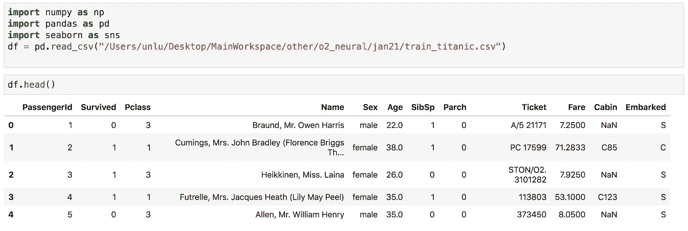

让我们保持一切简单。这只是一个简单的自我教育实验。我只保留 2 个分类特征(**性别**(男或女)，**p 类别** (0，1，2))和 2 个连续特征(**费用**和**年龄**)。

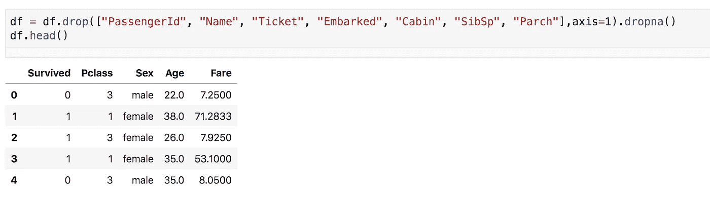

**用于数据处理和缩放的类**

我写了一个类，负责原始数据集和合成数据集的所有必要操作，然后将它们输入神经网络。这里有一个重要的备注，机器学习新手最常犯的一个错误是在拟合缩放器时包含测试样本(应归咎于 sklearn 的 easy fit_transform 函数)；所以我们要确保我们不会这么做。

让我们稍微解构一下代码。我们有两个独立的函数:一个直接返回训练数据集，另一个返回随机混合的数据集。正如您所看到的，我只是简单地打乱了训练数据集的两个版本，并对它们进行了随机加权求和(您可以将此视为混合两个不同样本的矢量方式。我们希望尽可能地利用 numpy 的极端并行性。给你们 python 爱好者一个小小的建议；不断地问自己:“我能用 numpy 以矢量的方式做到这一点吗？”).此外，请注意，在我们的实验中，为了公平起见，两种情况(混合或非混合)的数据集大小相等。

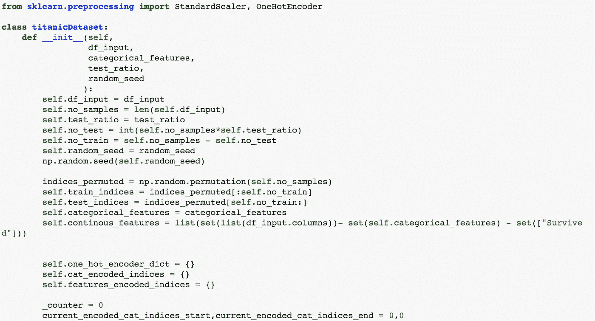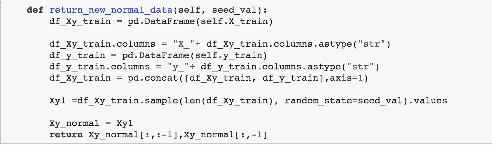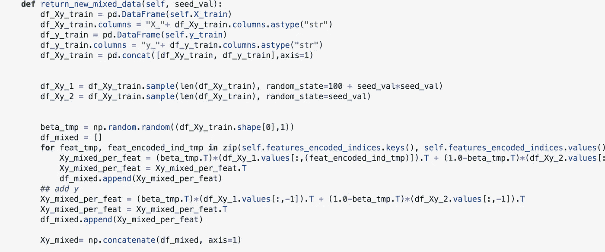

**走向极端:用非常少的训练样本测试过拟合鲁棒性**

到目前为止，scikit-learn 最不受重视的机器学习模型是多层感知器(人工神经网络)。大多数人甚至不知道它的存在。当需要高级神经网络框架时，我们倾向于首先调用 Keras，但是如果您处理简单的表格数据，并且不需要深入研究您的模型的细节；MLPRegressor 和 MLPClassifier 是您的单线解决方案。它的默认参数和提前停止非常健壮。你只需要在一个简单的列表中用神经元的数量定义你的层。

注意，对于常规情况(二进制分类)，我们需要使用 MLPClassifier (sklearn 模块会自动设置自己使用 sigmoid 激活和二进制交叉熵)。混合案例需要 MLPRegressor，因为现在我们有模糊的结果，如 0.45 幸存。(我们将简单地对测试输入的结果进行舍入，以预测它们的类别)

为了测试简单线性混合的潜力，我想用少量的训练数据点进行实验(90%测试，10%训练)。以下是十重交叉验证的片段:

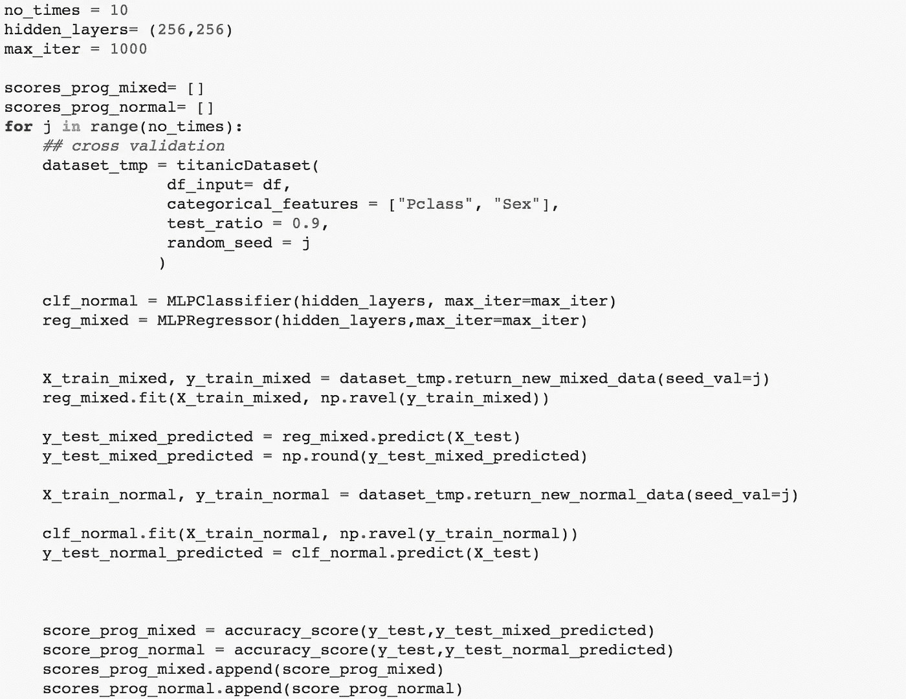

这些是 10 个实验中每个实验的测试精度(橙色:混合，蓝色:常规)。显然，即使是非常简单的 2 样本线性混合也可以在某些情况下利用非常有限的训练数据稍微提高准确度。

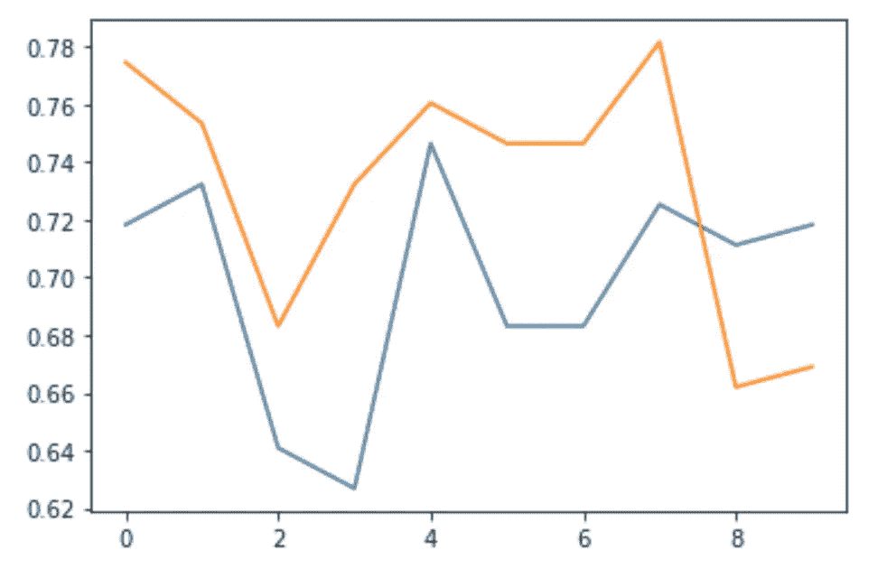

如果我们能够利用这种混合策略的组合特性，性能可以进一步提高。当我们混合两个不同的样本以产生新的合成样本时，我们的搜索空间是(N，2)的二项式，这是一种属性增强的度量学习算法。我们在我们的类中插入了两个新函数，以产生比给定训练数据集有更多样本的合成数据集。为了公平起见(将相同数量的训练样本传递给 MLP 优化算法)，我们简单地复制正常数据集的行。

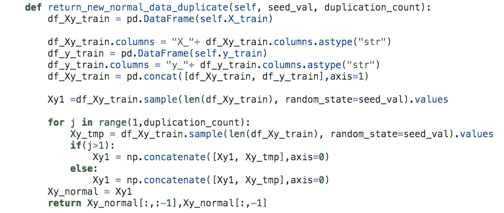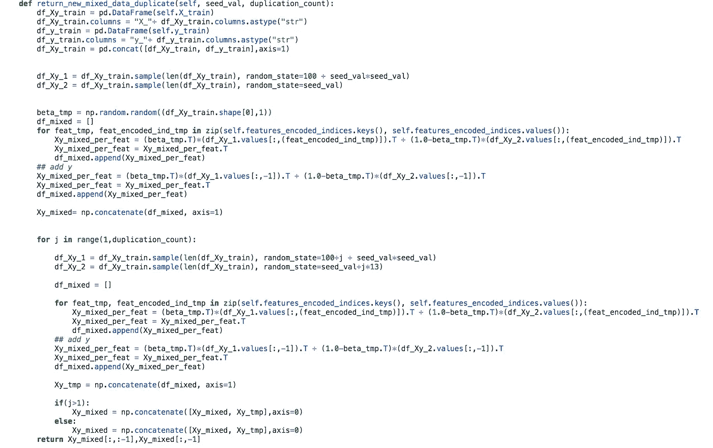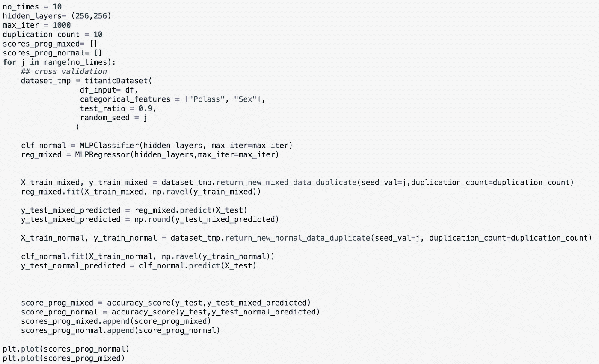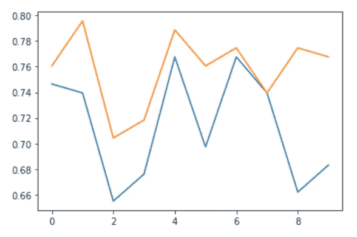

如您所见，随着我们增加数据混合搜索空间的边界，性能会继续进一步提高。

**结论**

我只是想在表格数据上测试简单的图像混合策略。显然，这种方法在表格数据上有潜力。对抗过拟合的优点有两个方面:(1)通过引入模糊性，我们加强了神经网络在更平滑的协变空间而不是刚性空间中学习。(ii)我们可以假设我们还没有看到的测试样本将落在训练数据点之间的特征范围上；这种方法增加了可能性。

然而，请注意，合成训练数据集是一个庞大的学科；这种混合可能是最简单的。也进入度量学习，对比损失，变分自动编码器等。

干杯，

[1] Goodfellow，I. J .，Shlens，j .，& Szegedy，C. (2014 年)。解释和利用对立的例子。 *arXiv 预印本 arXiv:1412.6572* 。

[2] Tokozume，y .，Ushiku，y .，& Harada，T. (2017 年)。从课堂示例中学习深度声音识别。 *arXiv 预印本 arXiv:1711.10282* 。

[3][https://vitalab . github . io/article/2018/04/17/bclearning class . html](https://vitalab.github.io/article/2018/04/17/BCLearningClass.html)