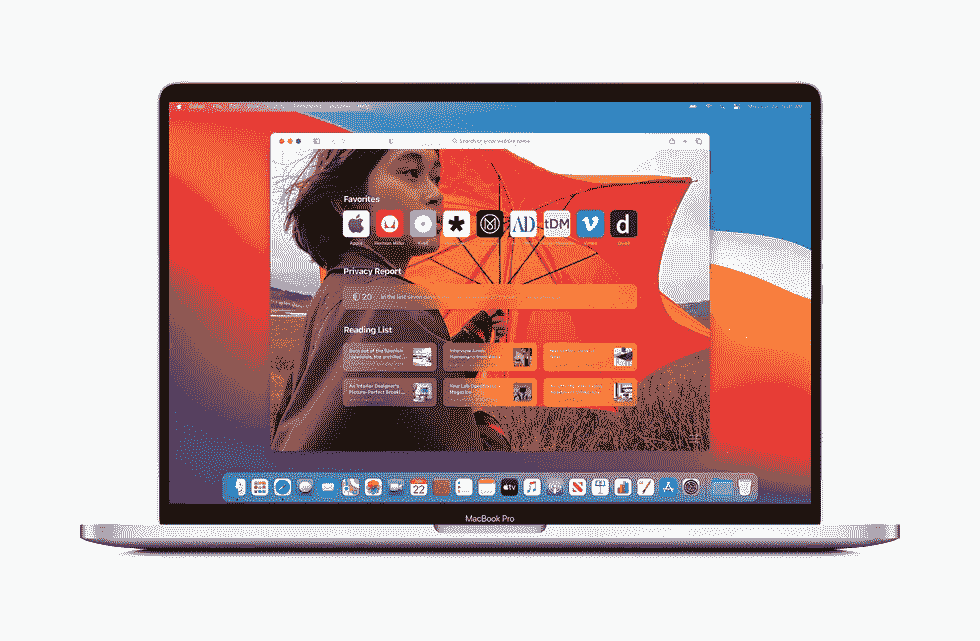

# macOS Big Sur，真的有那么好吗？

> 原文：<https://medium.datadriveninvestor.com/macos-a-developers-point-of-view-about-big-sur-news-and-bugs-that-i-have-personally-encountered-f597ed965ed0?source=collection_archive---------11----------------------->

在[之前的文章](http://bit.ly/2Nz5Fwo)中，我谈到了 iOS 14 以及该操作系统的图形用户界面发生了怎样的变化。但是今天我就说说我在 macOS Big Sur 开发者测试版上的体验吧！

这个测试版是在 6 月 22 日发布的，正好是 WWDC 2020 直播的时候。当我看到这个版本的变化时，我迫不及待地下载并测试了它(有点像我对刚刚发布的 Windows 10 所做的)。

现在我们将一起看到公开的和隐藏的新闻，我还会写一些我遇到的错误，我想知道，对于那些有开发测试版的人来说，这是否发生在不同类型的 Mac 上。

先说新闻吧！

## **设计**

在看到 iOS 14 上所有的图形变化后，我们可能已经猜到，它们在 macOS Big Sur 上不会做得更少。事实上，与 macOS Catalina 相比，有大量的图形变化。准备好了吗？

## **停靠、通知和控制中心**

你还记得码头和 macOS Catalina 通知中心吗？与 iOS 的图形视图相比，它似乎有点过时，我敢说类似于 iOS 10 / 11 的视觉通知。在这个主要版本中，他们把 Dock 做成半透明和“浮动”的，因为它不像以前的版本那样贴在屏幕底部。但这还不是全部！他们用添加的阴影制作了几乎是 3D 的图标，此外，它还有很多 iPadOS 风格的圆形图标，更符合“现代”的形状。

Control Centre

Notification Centre

在通知中心已经删除了不要打扰和夜班模式的可能性，但他们增加了 iOS 14 风格的小工具。macOS 历史上第一次增加了 iPhone 和 iPad 上的控制中心，我们可以在那里找到 WiFi、蓝牙、亮度等。…除了曲目播放之外。屏幕上方的图标。

## **应用程序和文件夹窗口**

幸好他们重新设计了 Finder 的文件夹和各种应用程序以及 Safari 的窗口的图形(我们稍后会谈到)。带有更多圆角的 Windows，带有更多 iPad 和 iPhone 形状。

越来越明显的是，苹果正在让自己的设计尽可能接近独特的东西，谁知道呢，也许有一天会只有一个叫做苹果的操作系统，它会安装在所有设备上，从苹果手表到苹果笔记本。但这些只是我天真的想法:)

## **地图**

正如在上一篇文章中已经解释过的[，地图将能够向我们显示适合自行车和电动汽车的路线，这些路线也可以在 iPhone 上共享，以便随时了解每一次旅行。](http://bit.ly/2Nz5Fwo)

你可以使用“指南”来帮助你发现新的娱乐、放松或吃饭的地方。您还可以创建个人指南，与您认识的人分享，或者简单地记录您在该位置游览过的地方。

## **狩猎之旅**

现在，我们正处于这个主要版本的重要时刻。事实上，大多数新功能都在 Safari 上。苹果已经提高了浏览器的速度，比 Chrome 快了 50%。网站图标会自动加载，以便更容易识别打开的页面。

最后，你可以自定义“新卡片”部分的背景，或者添加红色列表和 iCloud 面板等部分。

有了新的更新，你将能够直接从 Safari 翻译 7 种不同语言的整个网页，这要感谢集成的翻译器。

浏览器兼容的扩展也已经到来，事实上，由于左上角的盾牌图标，将有可能知道我们正在咨询的网站是否包含跟踪我们数据的跟踪器。

按下护盾，就可以看到有多少追踪器被挡住了。

隐私对苹果来说永远是必须的。

## **开发商方**

对于我们的开发者朋友来说，有一些好消息即将到来。首先，Xcode 12 测试版的推出立即适用于安装了 macOS Big Sur 的用户。它已经包含了创建与新设计兼容的应用程序的更改，即小工具和应用程序剪辑。

Mac Catalyst 带来了新的 API 和用于开发它们的应用程序的新外观。Mac 上的 iPad 应用程序读出功能随时可用。

另一个新功能是，开发者现在可以为订阅和应用内购买提供“家庭”共享，并且在支持 WebExtension API 的情况下，为其他浏览器创建的扩展可以很容易地用于 Safari。

***这就是 macOS Big Sur 的最终新功能(暂时如此)。***

现在让我们继续谈谈我从第一天开始的个人经历。

**免责声明:**显然我会列出一些 bug，但我保证这是测试版开发者的常态。
这将是为了比较的目的，与谁可能安装和发现同样的错误。所有这些 bug 都是直接向苹果报告的。

# **我们开始吧！**

## 如果一个匿名标签打开，Safari 就会爆炸！

“爆发”是什么意思？有一天测试 Safari，想测试一下私窗。一切似乎都很好，突然看到浏览器关闭，给我看错误日志。

这是一个无法识别的错误，甚至当我重新启动 Mac 时，它也发生了 6 次。这是碰巧发生在你身上的吗？

## App Store 不希望我下载任何东西(有时)

Mac 的 App Store 已经决定不下载任何东西。输入密码授权下载后，继续加载但 21 分钟没有任何反馈！

重新启动它部分解决，因为下载一个后，它再次冻结。
你为什么对我不好 App Store？**告诉我这是否也发生在你身上。**

## 聚光灯搜索与单词重叠

我在寻找屏幕快照应用程序，像往常一样，我永远也找不到，我看到的文字令人作呕地重叠，以至于我不明白我写的任何东西。

现在他不再对我这样做了，但这种事在我身上发生过几次。你呢？

## **WiFi**

我需要从我的家庭网络切换到我的手机热点。首先，它发现了我的 iPhone，然后一秒钟后，噗，不见了。然而，在我的手机上，它说它是活跃的…我不得不关闭和打开 WiFi 几次，然后就没事了。这个 bug 持续存在，我希望他们尽快修复它。

## **AirPods**

我想试试这个功能，它允许我在不同的情况下在 Mac 和 iPhone 之间切换 AirPods 的连接，反之亦然。

(举例:我在 Mac 上看一个视频，一个电话同时到了 iPhone 上；AirPods 会自动断开与 Mac 的连接，并与 iPhone 关联以允许您接听电话)。

第一次是彻底失败，第二次是半胜利(即你连接手机一会儿，然后随机重新连接到 Mac)，第三次是彻底胜利。我想系统必须完全识别设备才能正常工作。

到目前为止，我已经发现了这些错误，我很想知道你是否有过类似的经历，或者你是否觉得新的 macOS 更新很有趣。

