# 宏观经济体制和最优投资组合分配

> 原文：<https://medium.datadriveninvestor.com/macroeconomic-regimes-and-optimal-portfolio-allocation-b61e8f3afddb?source=collection_archive---------1----------------------->

## 经济状况如何影响不同的资产类别

毫无疑问，宏观经济状况对不同的资产类别有着巨大而不同的影响。在这项研究中，我和我的同事张益阳(Yiyang Zhang)试图找出当经济增长率和通货膨胀率波动时，股票、债券、黄金和大宗商品的表现，以及如果我们对未来的经济状况有一定的预期，如何选择最佳投资组合。

为了收集相关数据，我们首先使用供应管理协会的新订单指数来确定增长模式。ISM 指数是根据对 300 家制造企业的新工业订单调查构建的。它通常被视为经济增长的领先指标，因为高新工业订单通常反映了对需求增长的坚定预期。然后，我们使用美国 CPI-U All Urban Consumer inflation index 来确定通货膨胀制度，该指数代表美国通常消费的一组商品的平均价格。最后，我们的数据包括 1973 年至 2013 年股票、债券、黄金和大宗商品的月度收益率，以及指示经济状况的 4 个虚拟变量，这些变量分为四种制度:高增长和高通胀，高增长和低通胀，低增长和高通胀，以及低增长和低通胀。

# 每项资产的平均回报率和夏普比率

研究的第一步是分析股票、债券、黄金和商品在四种制度下的平均回报率和夏普比率:

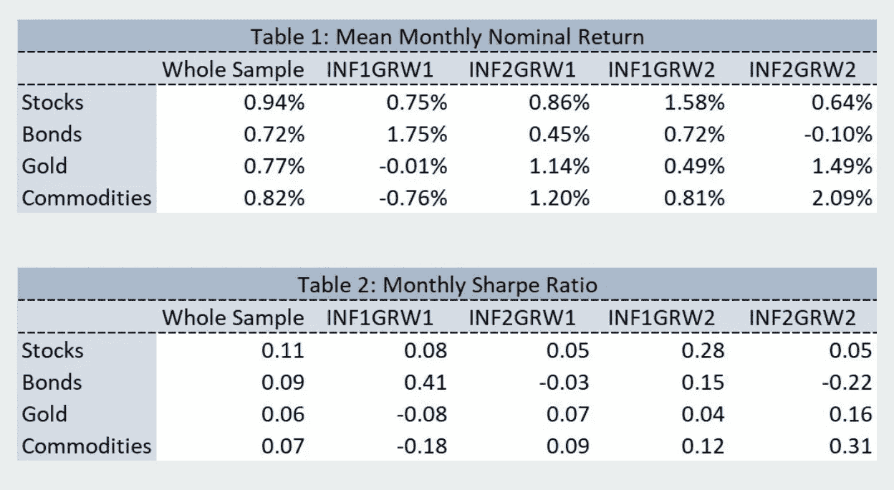

## 通货膨胀

如果我们从分析通货膨胀对四种资产类别的影响开始，我们可以在表 1 中看到，债券在高通货膨胀时期(INF2)表现更差，而黄金和商品在这种情况下表现更好。此外，在低增长环境下(GRW1)，通货膨胀率的增加会导致股票的更好表现。然而，当增长率高(GRW2)时，当通货膨胀率增加时，股票表现会更差。这一结果是有道理的，因为大宗商品是众所周知的对冲通胀的好工具。

 [## 为什么包容性财富指数比 GDP 更能衡量社会进步？|数据驱动…

### 你不需要成为一个经济奇才或金融大师就能知道 GDP 的定义。即使你从未拿过 ECON 奖…

www.datadriveninvestor.com](https://www.datadriveninvestor.com/2019/03/08/why-inclusive-wealth-index-is-a-better-measure-of-societal-progress-than-gdp/) 

## 增长

如果我们知道分析增长对不同资产类别的影响，我们可以看到黄金和大宗商品往往在高增长时期表现更好，而债券表现更差。在低通胀环境下，当增长率提高时，股票表现更好。然而，当通货膨胀率高时，当增长率增加时，股票的表现会更差。

## 通货膨胀和增长并存

总体而言，股票的最佳方案是低通胀高增长(INF1GRW2)，债券的最佳方案是低通胀低增长(INF1GRW1)。在高通胀下，股票和债券的表现都更差，而高增长会扼杀债券的表现。大宗商品和黄金是非常好的通胀对冲工具，但在高增长的情况下表现更好。然而，低通胀和低增长的组合扼杀了大宗商品和黄金。

# 对 GMV 和 MSR 投资组合的影响

不同的制度需要不同的投资策略。为了分析经济条件如何影响最优投资组合，我们首先使用以下公式构建了每个制度(GMV)中的全球最小波动率投资组合，并计算了其夏普比率:

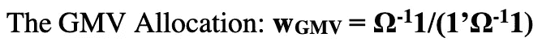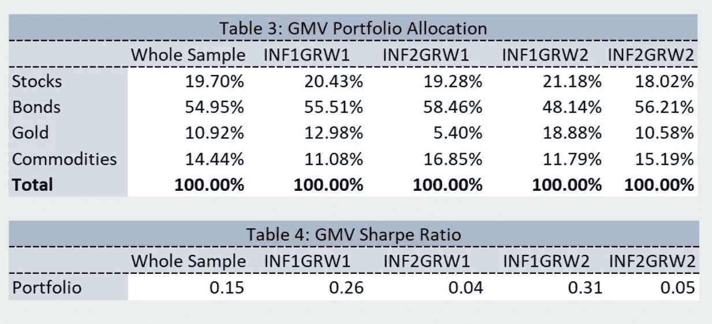

我们还使用以下公式构建了最大夏普比率投资组合，并计算了每个制度中每个资产类别的标准差:

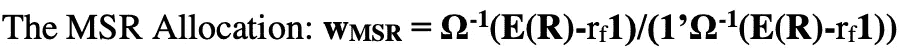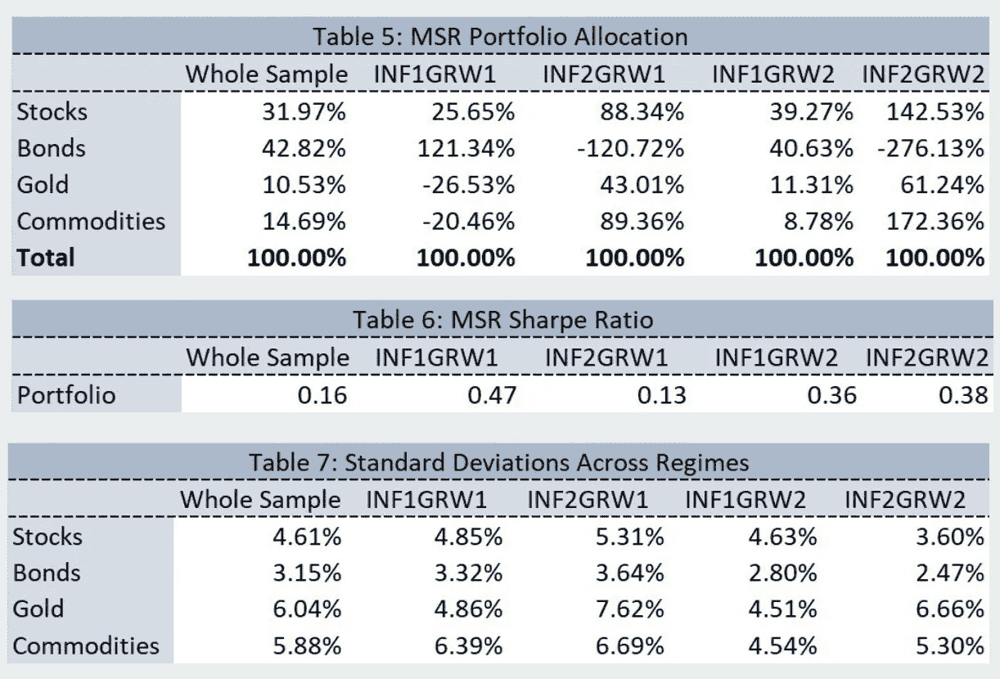

从表 5 中，我们可以看到，MSR 投资组合的配置在不同的制度中是不同的，主要是因为在四个制度中每种资产的回报有很大的差异。也就是说，在某些资产回报率较低的制度下，理想的做法是降低这些资产的权重，甚至卖空它们，投资于其他资产。例如，如果我们查看表 1，我们可以看到，在 INF1GRW1 制度下，黄金和商品的回报为负回报(-0.01%和-0.76%)。在这种情况下，MSR 投资组合要求做空它们(-26.53%和-20.46%)，转而投资于债券和股票，因为它们有更高的回报。在 INF2GRW2 机制中，债券在所有资产中回报率最低(-0.1%)，因此 MSR 投资组合需要大量卖空债券，转而投资于其他三种资产。

如果我们现在分析不同制度下不同资产的标准差(表 7)和最优分配(表 5)，我们可以看到标准差在不同制度下没有显著变化，因此我们看不到它们与分配之间有任何强有力的关系。例如，在 INF1GRW1 机制中，债券具有最低的标准差，但它们具有最大的分配。然而，在 INF2GRW1 机制中，商品具有第二高的标准差，但它们仍然具有最大的分配。因此，标准差不是四种制度下不同分配的主要原因。

当我们分析四种风险资产之间的相关性时，我们观察到它们之间的相关性在所有制度中都不是很高。总之，我们不认为相关性是不同制度间不同配置的主要原因。

# 风险厌恶程度不同的投资者

现在假设我们有 5 个投资者，他们的风险厌恶水平分别为 1.3、2.8、6.5、10.5 和 16.9，下表总结了他们在每个机制下由 MSR 和无风险资产组成的最优投资组合。

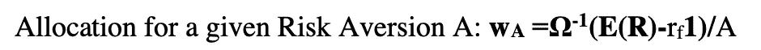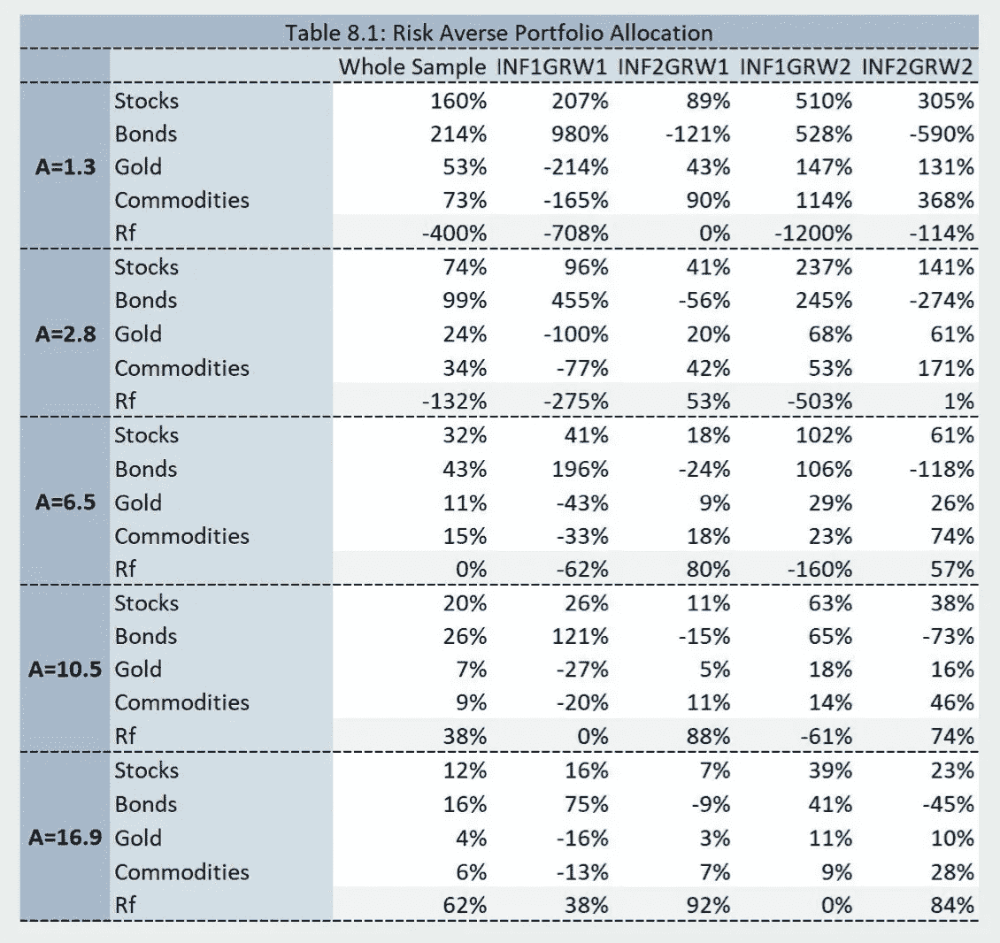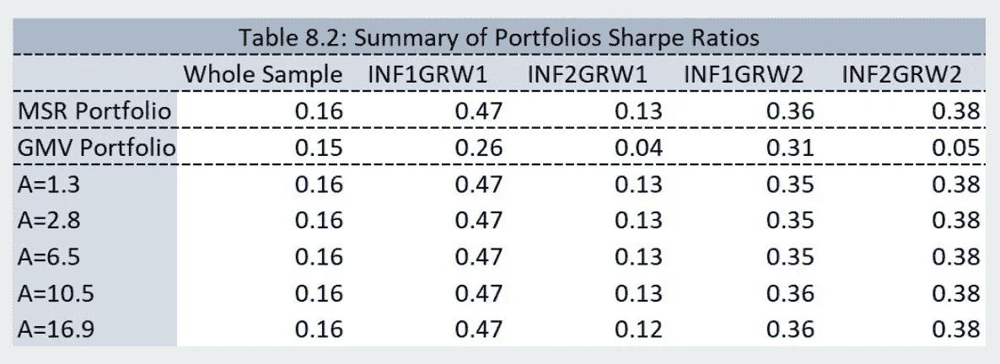

从表 8.2 中，我们可以看到，给定风险规避水平的 MSR 和 5 个投资组合具有相同的夏普比率。这是因为它们都在 CAL 线上，因此具有代表夏普比率的相同斜率。然而，他们都投资不同比例的风险资产，因为他们有不同的风险厌恶。随着风险厌恶水平(A)的提高，投资者应该更加厌恶风险，因此减少对 MSR 投资组合的投资，增加对无风险资产的投资(表 8.1)。所有 6 个投资组合在所有 4 个机制中的表现都优于 GMV 投资组合，因为它只是最小化了方差。在所有制度中，夏普比率最高的是在低通货膨胀和低增长的制度下，这对债券特别有利。第二个最好的情景是高增长和高通胀的环境，这对大宗商品尤其有利。高通胀和低增长体制，也称为滞胀，是所有投资组合的最坏情况。

# 给定未来预期的投资策略

对未来宏观经济制度没有预期的投资者会投资于由 MSR 和无风险资产(基础投资组合)组成的最优投资组合，这是使用整个样本计算的，因为他不知道未来将处于哪个制度。然而，鉴于我们有可靠的专有制度预测，即我们知道我们最有可能处于哪个制度，我们将更加重视最有可能的制度的最优分配。例如，我们知道债券在低通胀和低增长的状态下表现良好，如果我们确信这种状态将成为未来，我们将不得不在债券上投入比其他资产更多的资金。同样的策略也适用于低通胀高增长的情况，在这种情况下，股票表现优于任何其他资产，因此我们必须在这类资产上投入更多。最后，我们将使用基础投资组合作为基准，看看我们的策略是否表现良好。

尽管我们基于预测对未来的经济状态有所信念，但完全采用我们之前计算过的该制度的最优投资组合风险太大，因为总是存在不确定性。为了最大限度地降低风险，我们的第一步是构建一个基准投资组合，该投资组合由所有 4 种制度中风险规避水平为 6.5 的等权重最优投资组合组成(即，为 4 种制度中最优投资组合的每组权重分配 25%)。这个投资组合被称为静态投资组合。然后，如果我们预计其中一个政权更有可能是未来的国家，我们会在这个特定的政权组合中增加权重。我们决定分配我们的资产，将 50%的权重分配给最可能的制度中的最优分配，将 16.67%分配给其他三种制度。表 9 汇总了根据不同预测进行的资产分配。我们可以看到，不同预测的投资策略有很大不同。

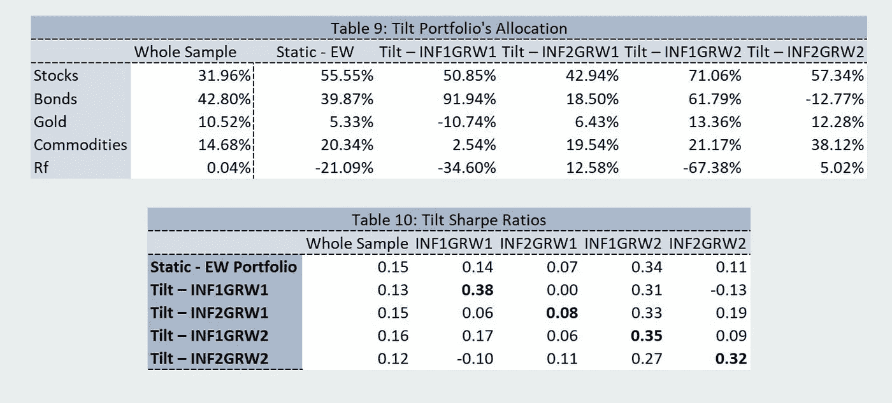

我们还在表 10 中总结了倾斜投资组合的夏普比率。在每个地区，我们专门为该州设计的倾斜投资组合具有最高的夏普比率。唯一的例外是高通胀低增长状态，但我们的策略(Tilt INF2GRW1)仍然是第二好的，与第一个只有 0.03 的夏普比率差异。因此，我们得出结论，如果我们对未来状态有准确的预测，我们的倾斜投资组合是最理想的选择。

# 一个例子

假设你的资产配置目前确实反映出处于低增长、低通胀的状态。你的政权预测模型预测高通胀、高增长状态在短期内变得更有可能。你的制度预测模型预测，下个月高通胀高增长的概率是 1/2，其余的制度将以 1/6 的概率出现。你的分配会有什么变化？

为了回答这个问题，我们首先提取了两种制度下的最优投资组合分配:

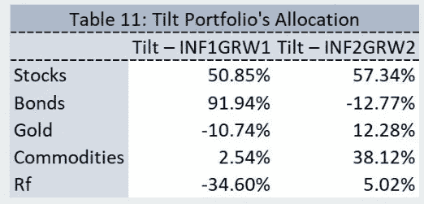

根据表 11，我们可以看到，如果我们的资产配置目前反映了低增长和低通胀的环境，并且我们预计该制度将改变为高通胀和高增长的情景，我们的权重将发生重大变化。我们的股票投资不会受到太大影响，但我们必须将债券投资从 91.94%降至-12.77%，并将黄金投资从-10.74%增至 12.28%，大宗商品投资从 2.54%增至 38.12%。此外，我们将不得不投资于无风险资产，而不是采取杠杆立场。

## 结果

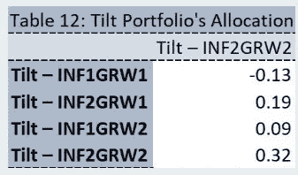

根据表 12，如果我们不改变资产配置并继续投资于同一个倾斜投资组合(INF1GRW1)，我们最终的夏普比率将为-0.13。如果我们重新分配资产以获得一个 INF2GRW2 投资组合，我们将有一个 0.32 的夏普比率，这是好得多的，因为我们将有更高的每单位风险的超额回报。因此，我们认为改变资产配置可以有效地增加我们投资组合的风险调整回报。