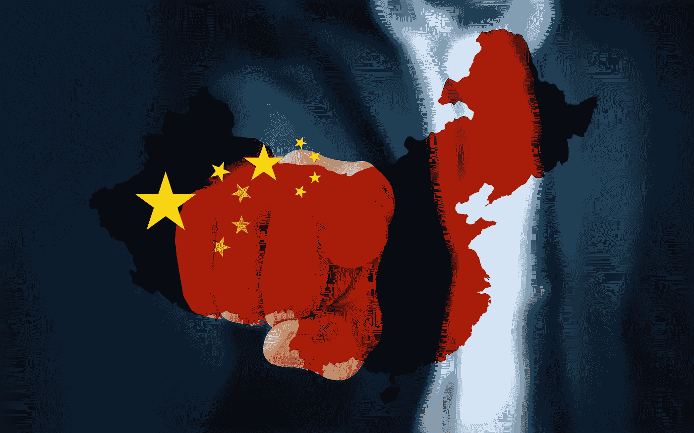
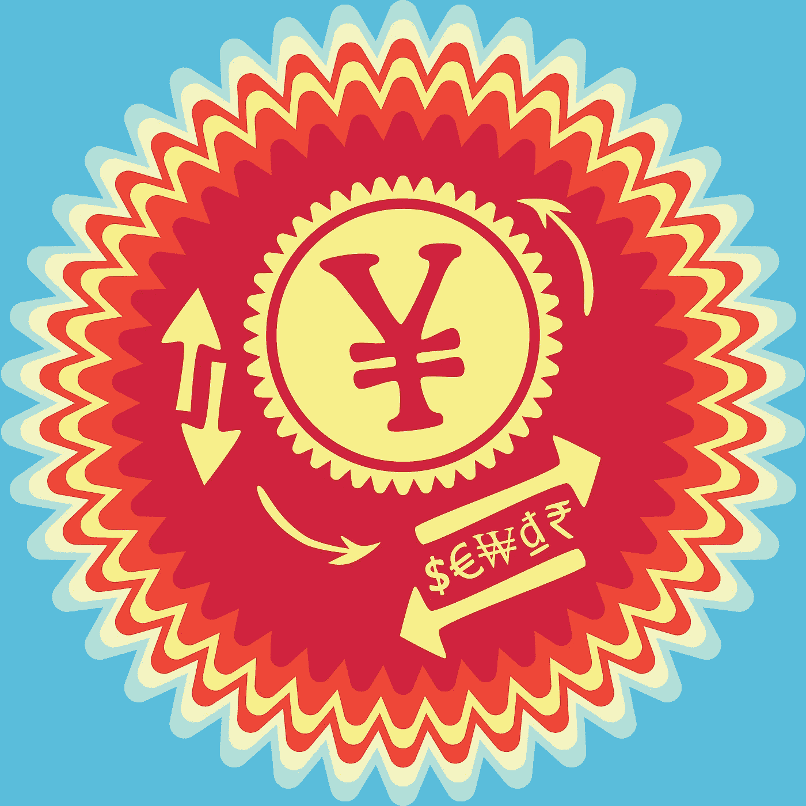
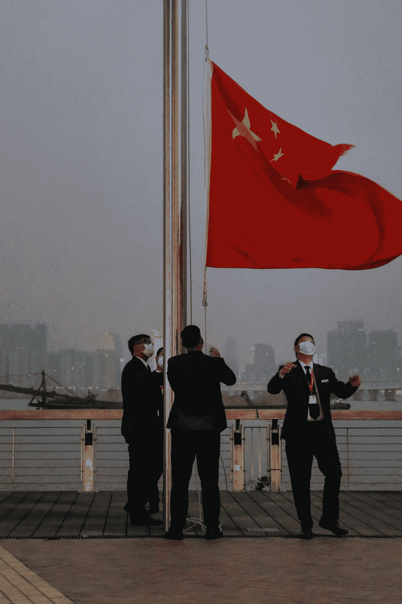
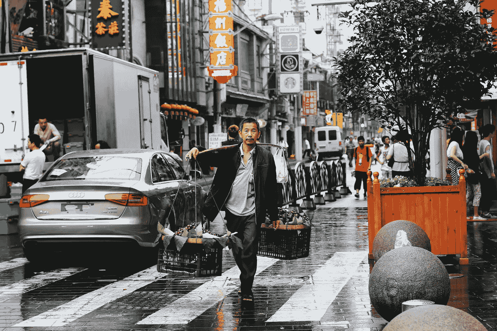
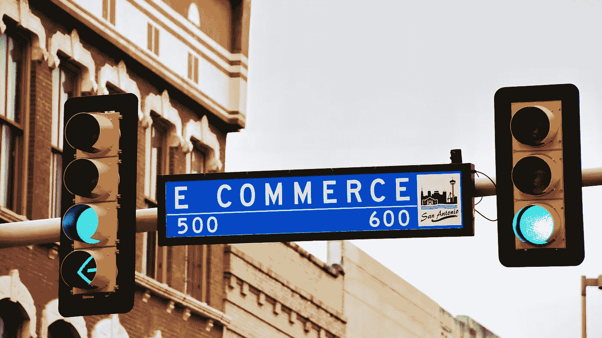

# 中国制造:挑战与机遇

> 原文：<https://medium.datadriveninvestor.com/made-in-china-challenges-and-opportunities-476015fb2490?source=collection_archive---------12----------------------->

## 在过去的十年里，中国在全球对外贸易中的作用越来越重要

Image by [Gerd Altmann](https://pixabay.com/users/geralt-9301/?utm_source=link-attribution&utm_medium=referral&utm_campaign=image&utm_content=3446136) from [Pixabay](https://pixabay.com/?utm_source=link-attribution&utm_medium=referral&utm_campaign=image&utm_content=3446136)

在贸易全球化的进程中，贸易大国的头衔也易主，从最早的葡萄牙、西班牙、荷兰，到工业革命发源地的英国，再到美国，还有德国、日本。

从 15 世纪到 17 世纪，从大航海时代开始，贸易成为连接各大洲的重要纽带。数百年来，商业、物流、人员、资本、信息和数据的全球流动极大地促进了人类生产力的发展。

在过去十年中，中国在全球对外贸易中的作用越来越重要:

*   2009 年，中国成为世界上最大的出口国。
*   2010 年，中国成为世界上最大的制造业国家。
*   2013 年，中国成为世界第一大货物贸易国。
*   2020 年，中国出口占世界市场的 14.2%，再创新高。

可以说，在 21 世纪全球生产和贸易的新海洋时代，中国正发挥着越来越重要的作用。

# **中国制造能力**

对全世界的消费者来说，过去 40 年来生活和福祉的改善得益于美国的技术创新、欧洲、日本和韩国的产品性能以及中国的加工和制造。

对于中国制造来说，过去 40 年的腾飞离不开对外投资和出口的带动。改革开放后很多中国制造企业就是从学习和借鉴国外先进产品和技术开始的:从模仿开始，逐步提高制造能力，市场化生产，赢得更多订单和资本青睐，大量出口后建立性价比优势。

 [## 静悄悄的金融危机

### 疫情仍是最大的不确定因素

medium.com](https://medium.com/datadriveninvestor/the-quiet-financial-crisis-b01898a809a7) 

在这个过程中，很多中国制造企业抓住了机会，做出了自己的品牌。但是大部分还是认为品牌商，中间商，零售商都是以贴牌为主。

> **在海外，他们被称为“中国供应商”。在中国，他们是各种品牌背后的生产者和制造者。**

早期因为需求比较少，中国制造很大程度上靠出口拉动，通过传统外贸渠道出口，被世界转动。近年来，随着国内需求的增加，中国制造开始进入一种“*双循环*模式——一方面利用国内的支持和制造能力为世界生产。这是一个外部循环；另一方面，它满足不断增长和变化的国内需求，为国内市场生产，这是一个内部循环。

世界经济一体化使中国制造业更加紧密地融入全球价值链。世界离不开**中国制造**，这种说法并不夸张。以前，“*国产*往往被贴上低价的标签，但低价并不代表档次低。

2020 年，[为国际品牌代工](https://en.wikipedia.org/wiki/Original_equipment_manufacturer)，比如[宁波的神州国际](https://en.wikipedia.org/wiki/Shenzhou_International)。为[耐克](https://www.nike.com/)、[阿迪达斯](https://www.adidas.com/us)、[优衣库](https://www.uniqlo.com/us/en/home/)等提供[代工。，但它的利润率是耐克的两倍，因为它的业务来自澳大利亚。从棉花种植开始的完整价值链，有大量的面料和染色方面的专利，属于“*增值制造。*](https://en.wikipedia.org/wiki/Original_equipment_manufacturer)

> 中国制造能够在低成本的结构下做出好的产品并走向世界，展示了中国制造体系的综合优势，也构筑了难以撼动的短期竞争壁垒

近几年还有一个明显的趋势，就是越来越多的中国制造企业以自己的品牌、 [R & D](https://en.wikipedia.org/wiki/Research_and_development) 、[全球视野](https://en.wikipedia.org/wiki/GlobalVision)，在国际市场走红，发展。尤其是在消费电子领域，[华为](https://www.huawei.com/en/)、[小米](https://www.mi.com/global/)、 [Oppo](https://www.oppo.com/) 、 [Vivo](https://www.vivo.com/) 、 [Anker](https://www.anker.com/) 等几个中国品牌在海外市场收获了不少用户和粉丝群体。

总的来说，在全球制造业产能阶梯中，中国制造在几个高精尖方面仍有短板，但已在多个领域表现出高维能力和竞争优势。如果能利用这些优势，**中国制造**的未来会更光明。

Image by [ooceey](https://pixabay.com/users/ooceey-13528103/?utm_source=link-attribution&utm_medium=referral&utm_campaign=image&utm_content=4515186) from [Pixabay](https://pixabay.com/?utm_source=link-attribution&utm_medium=referral&utm_campaign=image&utm_content=4515186)

# **新机遇:出海+上线+向品牌转型**

工业制造与农业生产有很大不同。一块农田产量有限，一年一季两季，但机器可以 24 小时工作。

中国制造的巨大产能，仅靠国内市场远远消化不了。国外市场的巨大需求不容忽视。这就是为什么国家提出要构建“*双循环*而不是“*单循环”的发展新格局。*“未来，中国制造面向世界仍将是一个长期趋势。

如果以国内市场或国外市场和自有品牌或 OEM 为标准，中国制造有四种形式:

*   自主品牌，国内市场。
*   自有品牌，国外市场。
*   贴牌生产，国内市场。
*   贴牌生产，国外市场。

**展望未来，中国制造的基本方向会是什么？**

首先，在国内市场，线下和线上竞争都很激烈，有时还很混乱。相比较而言，在国外市场，尤其是一些发达国家，市场秩序更加完善，还有很大的发展空间。

接下来，我们来看看国外市场。它有三个基本特征:

1。国外市场是很多国家市场的总和，比中国单一市场更复杂。

2。国外市场对线下渠道的整合大于国内。大型零售商拥有强大的市场份额和控制力，货架上可以展示的商品有限。中小企业靠自己的品牌进入并不容易。

3。国外电子商务渗透率低于中国。比如美国比中国低 10%。通过电子商务在国外发展潜力很大。

结合以上特点，你会发现中国制造有一个重大而明确的机会，一个让世界- **转向大海+线上+向品牌转型的机会！**

而这恰恰是近年来成为一大看点的跨境电商——通过一个国际化的电商平台，树立自己的品牌，直接向各国终端消费者输出高品质的中国产品。

这样做的另一个好处是，可以先跨过国外相对复杂、进入门槛高的线下零售，等到在电商网站上培养了用户群体和品牌知名度，再进入线下，经销商和零售商的接受度会大大提高。

 [## 人类冬眠:睡眠的大秘密

### DNA 修复机制在低温下工作得更好吗？

medium.com](https://medium.com/datadriveninvestor/human-hibernation-the-big-sleep-secrets-881fb4889e89) 

近期发布的《*跨境电商蓝皮书:中国跨境电商发展报告(2020)* 》指出，2020 年前三季度，通过海关跨境电商管理平台进出口额增长 52.8%，全年可期。达到 2800 亿元，跨境电商规模突飞猛进。

2020 年上半年，国务院新批准设立 46 个跨境电子商务综合试验区，试验区总数扩大至 105 个。外向型经济发达的地方政府把跨境电商作为稳定外贸的重要抓手。

其实电商模式并不复杂。在中国，通过电商平台崭露头角，出现了很多全渠道运作的新品牌，如[三只松鼠](https://www.crunchbase.com/organization/three-squirrels-e-commerce)、[小熊电器](https://www.crunchbase.com/organization/bear-electric-appliance)、[完美日记](https://www.crunchbase.com/organization/perfect-diary)、活力森林等。都是通过国内电商渠道开发的。

而在国外做电商，很多人可能会有点陌生。事实上，许多嗅觉敏锐的中国公司很早就发现了商机。他们通过国际电商网站尝试跨境电商，已经崭露头角。

他们中的一些人在像亚马逊这样的国际电子商务网站上开店，一些人建立了自己的独立站点。这些中国制造的新生力量正在通过跨境电子商务的新方法迅速崛起，并获得越来越多的国际消费者。

爱成为中国制造的新代表。

Photo by [Macau Photo Agency](https://unsplash.com/@macauphotoagency?utm_source=unsplash&utm_medium=referral&utm_content=creditCopyText) on [Unsplash](https://unsplash.com/s/photos/china-flag?utm_source=unsplash&utm_medium=referral&utm_content=creditCopyText)

# **跨境电商的传奇**

国内消费者对国内电商网站上成长起来的品牌比较熟悉，但对中国卖家在海外电商渠道上创立的品牌不一定熟悉。我在研究中也发现了很多受到全球消费者追捧的传说。

[**SHEIN:**](https://www.shein.in/About-Us-a-117.html)2008 年在[南京](https://en.wikipedia.org/wiki/Nanjing)创办的一家跨境 B2C 公司。最早是做婚纱网店，后来转型做女装品牌。凭借中国供应链的优势(*目前有 100 多家表面配件供应商和 300 多家服装供应商*)，新款一年 365 天都有。这些产品计划在大约一周内上市。价格平均比 [ZARA](http://zara.com) 低一半，卖到 200，在很多国家和地区，年销售额几百亿，目前公司估值超过 150 亿美元。

[**Anker:**](https://www.anker.com/) 海外消费电子品牌，2011 年创立于[长沙](https://en.wikipedia.org/wiki/Changsha)，专注于智能配件和智能硬件。它将于 2020 年在创业板上市，目前的市值约为 700 亿元。当公司创始人 [**孟洋**](https://www.forbes.com/profile/yang-meng/?sh=7cd768284966) 从硅谷谷歌回国创业时，他立志“*在中国推广智能制造之美*”，并在全球注册了 Anker 品牌。第一类是物美价廉的笔记本电池。然后他们开发了一种可以充电的电池。该装置可以使多种电子设备兼容充电芯片，可以智能识别每个接口连接的设备，并自动调整电流输出。他们不断创新，在充电配件品类占据领先的市场份额，然后拓展智能家居、无线音响、智能安防等智能硬件品类。

[**Orolay:**](https://www.orolay.com/)2006 年创立于[嘉兴](https://en.wikipedia.org/wiki/Jiaxing)的一家服装公司，2010 年上线，2013 年入驻亚马逊。2018 年，其一款女士羽绒服因其优质的产品质量和时尚的设计成为亚马逊上的热销商品。连续几年被列为亚马逊羽绒服畅销榜。被很多美国媒体称为“*亚马逊大衣*”。当年为了打造这款极具爆发力的产品，创始人**邱家伟**几乎把所有产品都下架了，只保留了这件羽绒服，并在随后的两年里进行了 10 多次改版升级，甚至在现金流匮乏的时候抵押了房子。

**出门问问:**2012 年成立的一家以语音交互和软硬件结合为核心的 AI 公司。公司创始人**李志飞**，前谷歌总部科学家，世界级自然语言处理专家。他回京创业的原因之一是中国有完整的智能硬件供应链**。**一块手表可能需要数百个零件来组装。它是在北京开发的。想法有了之后，来回[广东](https://en.wikipedia.org/wiki/Guangdong)只需要一个星期，而飞广东来回竞争美国产品需要两个星期。这使得中国消费电子产品的迭代速度远高于海外竞争对手。出门问问的产品最初是在美国风险投资网站 [Kickstarter](https://www.kickstarter.com/) 上众筹的。因为具有创新性，AI 手表 TicWatch S、TicWatch E 等产品很快获得 300 万美元众筹并在极客圈口碑建立，进入亚马逊后，迅速成为热门单品。

 [## AI 会抢你的饭碗吗？

### 有些工作只有人类有能力去做

medium.com](https://medium.com/datadriveninvestor/will-ai-take-your-job-b28c8c458633) 

**兰朗:**全球高端安全手套新品牌代表。兰朗原本是 1984 年在上海注册的品牌，2017 年被位于[浙江](https://en.wikipedia.org/wiki/Taizhou,_Zhejiang)台州的东亚手套公司收购。东亚手套成立于 1987 年。创始人**于青秀**将其发展成为中国最大的 PVC 手套公司。但是他的儿子**于杰**在美国读书的时候，看到自己工厂生产的手套贴着别的牌子，非常不甘心。2017 年于杰回国后，将兰朗更名，直接瞄准德国 [UVEX](https://www.uvex-safety.com/en/) 、美国[霍尼韦尔](https://www.honeywell.com/us/en)、美国 [3M](http://3M.com) 等国际品牌，欲走一条时尚、高端之路。

蓝浪每年将年销售额的 **5%到 10%** 用于研发，根据不同的场景开发不同的产品(*如防寒、防滑、耐酸碱、耐高温等*)。比如需要延伸手腕部分的耐酸碱手套，家用防滑手套需要轻便紧凑的设计。

为了追求舒适，PVC 手套上也需要植绒。蓝浪非常注重产品的设计。手套有时尚的马卡龙色和流行的配色款式，颠覆了很多人对“*安全手套*”的现有认识，甚至受邀参加伦敦时装周。除了在设计上下功夫，兰朗还在各个市场申请安全认证。虽然每次认证都要收费，但可以加快获得海外消费者的信任。

Photo by [Christie Kim](https://unsplash.com/@christieckim?utm_source=unsplash&utm_medium=referral&utm_content=creditCopyText) on [Unsplash](https://unsplash.com/s/photos/china-economy?utm_source=unsplash&utm_medium=referral&utm_content=creditCopyText)

中国已经有一批企业家，他们热爱制造业、创新、国际化、技术、互联网和年轻人。他们具有世界眼光，基于中国供应链的优势打造自己的品牌。追求 R&D 和品质的极致，利用电子商务网站倾听国际消费者的声音，快速改进迭代，最终为各国消费者创造一种不可抗拒的新消费体验。

**这是在跨境电商中崭露头角的新一代中国制造**——除了传统的快、好、性价比高的优势外，增加了新、酷、强的用户交互特性。

他们正在刷新和提升中国制造的形象。

# **政府支持+平台赋能+自身努力**

[安吉](https://en.wikipedia.org/wiki/Anji_County)是椅子产业之乡，全球每三把椅子中就有一把是“*安吉制造。*“一把椅子有 40 到 50 个零件，安吉都能提供。**公司产品 99%** 出口， **50%** 出口美国，都是中间商下单。他们生产，他们的业务非常稳定。

两年前，他们成立了跨境电商部门，在美国市场建立了自己的品牌，直接与 C 端消费者见面。这才发现，中间商的订单都是成熟的大货，更新迭代速度很慢，有些已经不代表未来方向了。

> **公司董事长说:“如果有一天消费者不认可这些产品，我们可能来不及转型。所以我们要两条腿走路，一边做代工一边做跨境电商，自主品牌”。**

**从代工到 ODM** ( *自主设计生产*)，再到 **OBM** ( *自主品牌生产*)，这一直是很多中国供应商的选择。做跨境电商，一开始可能不赚钱，还不如代工稳定。但直接和 C 端沟通，通过数据反馈来提升，才是提升能力的快车道。有了自己的品牌，销量一旦上去，利润就会增加，命运永远掌握在自己手里。

近几年跨境电商的快速发展，除了依靠“*中国制造+自有品牌出海*”的出路，也离不开政府扶持的环境、海外电商渠道的基础设施、物流网络的发展。重要的是靠企业本身。

**市商务局局长张艳**表示，跨境电商已成为宁波外贸新引擎，9810 模式(*跨境电商加海外仓*)出口量全国第一。[宁波](https://en.wikipedia.org/wiki/Ningbo)海关在全国率先试点“*特殊区域跨境电商出口海外仓零售*”模式。中国企业可以先将货物批量出口到特殊区域，在特殊区域理货并集货后，以批量出口到海外仓库的形式进行跨境电商。

在电商平台完成零售后，商品将从海外仓库直接配送到海外消费者手中。这种方法不仅减少了外国中介的数量，还利用了特殊监管区的“入境退税”政策。企业可以在货物出口到特殊区域后完成退税，提前提取约 **10%** 的资金。

 [## 2021 年美国经济展望

### 回顾 2020 年，美国经济受到新冠肺炎的重创

medium.com](https://medium.com/datadriveninvestor/2021-u-s-economic-outlook-6a9800af7d4a) 

宁波政府还协调金融机构支持跨境电商企业在海外购买和租赁海外仓，并提供中长期贷款。2020 年前三季度，全市跨境电子商务试点企业累计获得外汇贷款**28.42**亿美元，同比增长 **21.4%** 。63 家公司在 20 个国家建立并运营了 191 个海外仓库。在人才培养体系方面，宁波搭建了多个产教交流平台。比如 [**浙江万里学院**](https://en.wikipedia.org/wiki/Zhejiang_Wanli_University) 成立了全国首家跨境电商学院，每年培养超过 1 万人的跨境电商社交人才。

[**杭州**](https://en.wikipedia.org/wiki/Hangzhou) 也是跨境电商的热土，拥有全国最早的跨境电商综合试验区。杭州在跨境电商出口和零售的税收政策上已率先落地。2015 年提出“*无票免票*”政策，得到国家相关部委认可。2018 年 9 月，国家对综试区内电子商务出口企业出口的未取得有效购货凭证但符合一定条件的货物，试行增值税、消费税免税政策。

2020 年 1 月 1 日，[杭州](https://en.wikipedia.org/wiki/Hangzhou)综合试验区完成全国首笔跨境电子商务零售出口企业所得税的征收。政策支持让跨境电商可以“*借力*”。

以 [**奥罗莱**](https://www.orolay.com/) 为例。向海外 C 端消费者销售服装，报关时多为小包裹出口。每天出口 100 个小包裹很正常。以前 100 个包裹都要申报，3000 个包裹一个月要申报 30 次，给卖家和海关压力都很大。政府看到问题后采取了集中报关模式。 [Orolay](https://www.orolay.com/) 可通过统一窗口一次性对**3000 个**包裹进行单一集中申报。数据采集完成后，即可进行出口退税。这大大节省了报关流程和时间，也加快了公司的资金回笼。

**从电子商务网站的发展来看**

以亚马逊为例。它可以在多个国际市场(*站点*)提供完整的服务。例如，亚马逊物流在全球有超过 180 个运营中心，可以帮助公司转移交付给消费者的商品。目前，在美国和欧洲大部分地区，亚马逊物流已经实现 Prime 会员一天内送达；同时，亚马逊在品牌建设、用户反馈、知识产权保护等方面也给予了很多支持。

许多中国品牌都表示，在亚马逊做生意最放心的是品牌保护，这有助于防止抄袭和假冒。公司注册品牌后，发现有人抄袭，只要举报，超过 **95%** 的版权人提交的侵权通知都会在 24 小时内查处。

只要确认确实有侵权，基本上就把抄袭去掉了。关闭商店。[亚马逊](http://amazon.com)在 2017 年推出了“*透明计划*”。品牌商提交品牌所有权证明文件并通过评审，其产品被纳入品牌保护并贴上蓝色“*透明码*”。该产品有一个全球贸易项目编号( *GTIN* )，并允许为每种产品申请一个唯一的透明二维码。该代码包含比普通 UPC 更多的产品信息，如制造商、日期、位置、有效期等。顾客只需要用**亚马逊的透明 app** 扫描商品外包装上的二维码，立刻就能知道商品的真伪以及从生产到销售全过程所包含的信息。

Photo by [Mark König](https://unsplash.com/@markkoenig?utm_source=unsplash&utm_medium=referral&utm_content=creditCopyText) on [Unsplash](https://unsplash.com/s/photos/ecommerce?utm_source=unsplash&utm_medium=referral&utm_content=creditCopyText)

> **一位跨境电商创业者说:“知识产权保护对品牌来说太重要了。如果亚马逊不帮忙维护品牌，而是自己找律师打官司，美国律师每小时收费 400 美元”。**

除了知识产权的保护，一个品牌在亚马逊上能得到的最基本的帮助就是快速获得用户反馈，并根据用户评论及时做出调整。这是跨境电商品牌提升的原动力。

[**深圳泽宝**](https://www.bloomberg.com/profile/company/1628384D:CH) 对此深有体会。泽宝原本是一家传统的外贸公司。2012 年转型发展自有品牌。2013 年进入亚马逊日本。由于日本站和卖家后端界面都有中文本地化，而且还有在线聊天功能，很容易沟通。泽宝在介绍新品之前，会先看一下日本站上的热销品类产品参考，也经常会在介绍之后看消费者对新品的反馈。比如移动电源，欧美消费者更喜欢设计简单、形状规则、大而深的颜色。从日本网站上的买家评论可以看出，日本消费者喜欢有设计感，便于携带便携，更“K [*awaii*](https://en.wikipedia.org/wiki/Kawaii) *。*“形色较淡(*如白色*)。在对产品开发进行调整后，泽宝在日本的移动电源销量增长了 100%以上。

**跨境电商怎么做？**

泽宝的经验是，产品质量才是真正的王道。他们在出货前对产品进行全检，引进专业的检测设备，确保出货的不良率控制在 **1%** 以内，并执行遵循日本法律法规的各项认证规范，加入 PLI 保险(*产品责任险*)。

# **结论**

在研究外向型跨境电商企业的过程中，中华民族对“*双循环”有了新的认识。*”

加快构建国内大周期为主体、国内国际双周期相互促进的发展新格局，是我国的大势所趋。很多学者都很关心“*国内的周期。*“事实上，国内制造力和供应链优势通过跨境电商向海外市场的“*溢出*”，恰恰是内外循环的推动，是一种新的发展格局。是具体的体现，是从中国制造到中国品牌转变的超越。

我在调研中也发现，不仅是这些在跨境电商浪潮中成长起来的新兴品牌，很多国内知名品牌也借助跨境电商在国外开拓了新市场。比如[科沃斯](https://silviacobos.com/pages/about-us)、[小米](http://mi.com)、[匹克](https://en.wikipedia.org/wiki/Peak_Sport_Products)、[李宁](https://en.wikipedia.org/wiki/Li-Ning)，近几年都开始重点发展国外市场。以科沃斯为例。自 2016 年入驻亚马逊以来，目前已进驻全球 12 个亚马逊站点，并连续数年取得不俗成绩。

[SHEIN](http://shein.com) 、 [Anker](http://Anker.com) 、Orolay、去问问、蓝浪、泽宝、巨星，所有这些案例，以及越来越多与跨境电商融合的中国新品牌，再加上在中国转向世界已经非常成功的知名品牌，他们正在成为一股将会转向世界的新生力量，让中国制造绽放出更高的价值和新的光彩。

新冠肺炎加速了全球范围的数字化进程，也展示了中国制造的力量。

可以预见，在全球范围内，一个与数字化结合更加紧密的中国质量制造、中国智能制造、中国品牌的新时代正在到来。