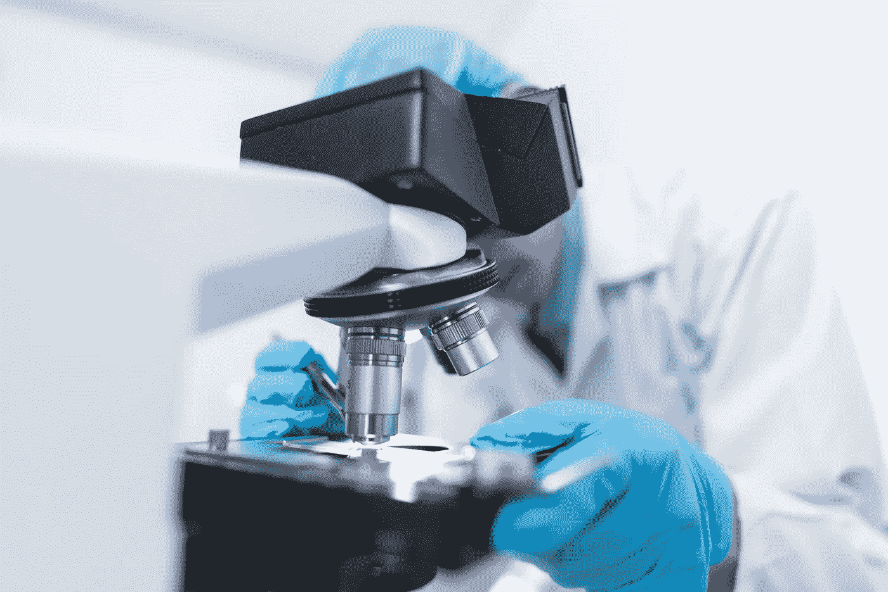
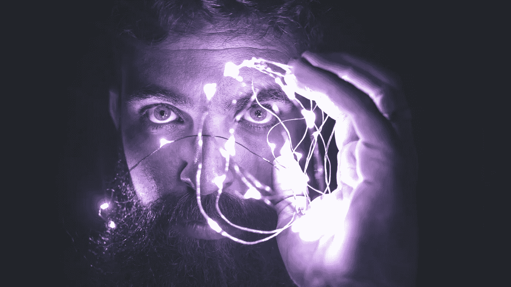

# 疯子，怪物，还是什么，这个人会是哪一个？AI 能帮忙吗？

> 原文：<https://medium.datadriveninvestor.com/madman-monster-or-what-which-could-this-person-be-can-ai-help-35d2495e1199?source=collection_archive---------18----------------------->

## 它可能写在我们的基因里，某种东西把它带了出来但是我们能用 AI“进入”杀手的思维吗？

Photo by [Muffin Prakittiphoom](https://unsplash.com/@muffinprkt?utm_source=unsplash&utm_medium=referral&utm_content=creditCopyText)

> “他们甚至看起来都不像人……除了商店里的人体模型，我对莎朗·塔特没有任何感觉……(她)听起来就像一台 IBM 的机器……她不停地乞求，恳求，乞求(为了她未出生的孩子的生命)，我厌倦了听她的，所以我捅了她。”——曼森家族的苏珊·阿特金斯

非法者就在我们身边，但我们在无忧无虑地过着日常生活时并没有意识到。一位乘地铁去购物的老妇人不知道一把裁缝用的剪刀会在那天下午结束她的生命，当时她正走上楼梯准备离开火车站。

一个年轻人和他的小儿子睡在一起，他不知道他们睡觉时会被棒球棒砸碎脑袋。[邦妮·加兰](https://en.wikipedia.org/wiki/Bonnie_Garland_murder_case)从来不知道羊角锤会结束她的生命。

 [## AI 和医学影像创业公司？6 大趋势|数据驱动的投资者

### “IBM Watson 健康成像”是医疗保健的未来吗？谷歌详细说明了人工智能对胸部 x 光的分类…

www.datadriveninvestor.com](https://www.datadriveninvestor.com/2020/08/30/ai-and-medical-imaging-startups-6-key-trends/) 

毫无疑问，度假归来的[塔蒂亚娜·塔拉索夫](https://en.wikipedia.org/wiki/Tarasoff_v._Regents_of_the_University_of_California)不知道等待她的是什么命运。詹尼佛·莱文没有理由预见到一个和朋友在一起的夜晚会导致她在中央公园的死亡。

> 三名年轻女子的谋杀案会令人震惊，这对父子的死亡在当地报纸上只会引起轻微的注意。这是一个心理健康问题，而不是一个可以让报纸垂涎数周的罪行。

由于卑鄙的行为，我们对旨在吸引我们注意力的犯罪标题着迷并感到厌恶。为什么我们会在报纸、杂志上读到关于杀戮的故事，看关于杀戮的电影？是什么促使我们去观看那些令人痛苦的尸体照片，而这些照片是我们本不该看到的？

记者雷切尔·门罗相信她有答案。*另一个不同的、更令人担忧的假设是我倾向于支持的:也许我们喜欢恐怖故事是因为我们身上有恐怖的东西*。

如果我们身上有令人毛骨悚然的东西，就像门罗断言的那样，人工智能有可能检测到它吗？这能用于法医调查吗？法医学已经变得极其普及，甚至进入了[虐待动物](https://www.ncbi.nlm.nih.gov/pmc/articles/PMC1950118/)的探索。但是人工智能在人类精神病理学法医领域处于什么位置呢？

Photo by [Chokniti Khongchum](https://www.pexels.com/@chokniti-khongchum-1197604?utm_content=attributionCopyText&utm_medium=referral&utm_source=pexels)

## 法医能告诉我们什么，AI 在哪里？

身体可以“辨别”人什么时候不会。我们已经看到了这一点，不是在[测谎仪](https://www.apa.org/research/action/polygraph)的可疑区域，而是在[瞳孔大小](https://www.scientificamerican.com/article/eye-opener-why-do-pupils-dialate/)之类的地方。这里的研究产生了有趣的结果。

> [有可能](https://www.sciencedirect.com/science/article/abs/pii/S107158190300017X)使用瞳孔大小变化作为计算机输入信号，例如在情感计算中。

警察部门正在使用数据分析程序，如 [PredPol](http://PredPol) 进行预测性犯罪规划，以管理他们的资源，但这并不能解决谁将是罪犯、疯子或精神病杀手。这是一个基于犯罪数据库的系统，犯罪发生在哪里，然后根据这些数据做出预测。

围绕人工智能和任何与大脑有关的问题似乎我们正在想象奥威尔的[老大哥](https://en.wikipedia.org/wiki/Big_Brother#:~:text=Big%20Brother%20may%20refer%20to,Watch%2C%20a%20UK%20pressure%20group)，而不是[音乐组合](https://en.wikipedia.org/wiki/Big_Brother_and_the_Holding_Company)。如果可以编写一种算法，使其通过使用深度学习来解释思想和信念，我们可能会期待什么？我们是否可以预期控制是一个结果，或者监禁或精神病住院，或者“重新编程”以在未来变得更顺从？

Photo by [David Cassolato](https://www.pexels.com/@davidcassolato?utm_content=attributionCopyText&utm_medium=referral&utm_source=pexels)

未来就在这里，它被称为基于大脑血流、新陈代谢或其他尚未发现的大脑活动的[神经预测](https://edge.org/response-detail/26623)。但是谁会被扫描，罪犯，还是整个人口？理查德·尼克松总统希望孩子们接受犯罪测试。

> 最近的一项研究发现，通过测量脑岛代谢活动的脑部扫描，可以预测不同抑郁症治疗方法的相对疗效。另一项研究发现，使用大脑扫描测量前扣带皮层的血液动力学活动，可以提高对假释罪犯是否会再犯的预测。

这些脑部扫描被视为假释和累犯方面的法医信息的可能来源。这些图像将形成人工智能数据库。

自从神经预测这个术语被发明以来，技术已经取得了进一步的进步，使得类似于[蓝牙技术](https://en.wikipedia.org/wiki/Bluetooth)的技术能够读取大脑。我以前在写过[这个话题。](https://medium.com/swlh/the-death-of-language-bbcd940ec0fa)

## 精神病患者被重新考虑

[精神病患者呢](http://Psychopaths commit a disproportionate amount of violent crime, and this places a substantial economic and emotional burden on society. Elucidation of the neural correlates of psychopathy may lead to improved management and treatment of the condition.)？技术能为防止令人发指的罪行提供必要的线索吗？杰夫瑞·达莫[、](https://en.wikipedia.org/wiki/Jeffrey_Dahmer)[约翰·维恩·加西](https://en.wikipedia.org/wiki/John_Wayne_Gacy)、[泰德·邦迪](https://en.wikipedia.org/wiki/Ted_Bundy)或者德克萨斯大学的塔枪手[查理斯·惠特曼](https://en.wikipedia.org/wiki/Charles_Whitman)会被阻止犯罪吗？惠特曼在验尸时被发现患有脑瘤。

达默要求在他死后检查他的大脑。[媒体报道](https://apnews.com/9ec6316a7c551459e510477acb3314f5)指出“*几名研究人员……想要 Dahmer 的毛囊和脑组织用于研究异常行为*……”

> 精神病患者犯下了不成比例的暴力罪行，这给社会带来了巨大的经济和情感负担。精神变态的神经相关性的阐明可能导致对该病症的管理和治疗的改善。

脑科学的未来，结合人工智能，可能会提供重要的线索。对有心理变态倾向的人进行早期干预或治疗将成为可能。但是必须坚持伦理上的考虑。这些人工智能措施会妨碍某人的公民权利吗？

> [神经影像学](https://www.ncbi.nlm.nih.gov/pmc/articles/PMC7090235/)与**人工智能**结合使用的进展。，特别是机器学习技术的使用，导致了大脑阅读技术的发展，在不久的将来，这种技术可能有许多应用，如测谎、神经营销或脑机接口。其中一些原则上也可以用于法医精神病学。

人工智能帮助那些需要帮助的人的承诺是我们力所能及的，但我们有责任保持适当的警惕，以确保它在可接受的范围内。做得少可能会导致我们制造的某种形式的计算机犯罪。

**访问专家视图—** [**订阅 DDI 英特尔**](https://datadriveninvestor.com/ddi-intel)