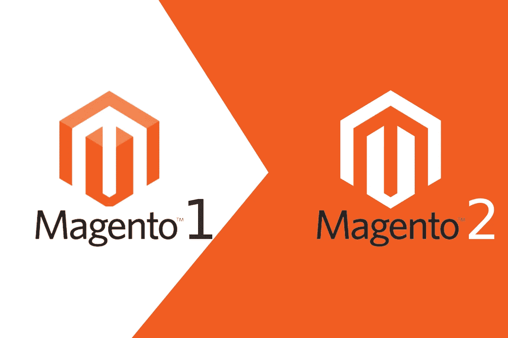

# Magento 1 到 Magento 2 迁移—分步指南

> 原文：<https://medium.datadriveninvestor.com/magento-1-to-magento-2-migration-step-by-step-guide-84c77c9f4a21?source=collection_archive---------9----------------------->

尽管 Magento 2 已经发布了一段时间，但是很多公司还没有迁移到最新版本。然而，这样做的时间已经不多了，因为 Magento 1 在 2020 年 6 月 30 日之后将不再受支持。如果你还没有转换到 Magento 2，你并不孤单。事实上，在 Magento 上运行的 185，000 多家在线商店中，只有 52，218 家在 Magento 2 上运行。使用最新版本的 Magento 可以打开一个充满机会的全新世界。让我们来看看为什么你应该从今天开始过渡到 Magento 2 的其他原因。

# 为什么您应该升级到 Magento 2

很多企业领导认为迁移到 Magento 2 不会影响，但事实并非如此。事实上，公司可以享受各种各样的好处，例如:

*   更好的性能和可伸缩性——Magento 2 在这方面更好，因为它配备了一个新的索引器，可以提高查询速度。一些电子商务商店报告页面加载时间减少了 43.5%。提高你的网页速度将导致更快的交付，从而导致更多的销售。
*   提高安全性—消费者总是不愿意透露任何个人信息，因为他们担心这些信息会被如何处理以及可能的泄露。Magento 2 提供了高级安全功能，如用于密码管理的 SHA-256 哈希算法、双因素身份验证、独特的管理 URL 以及许多其他功能。
*   简化结账流程——没有人愿意浪费时间填写个人信息或完成其他耗时的任务。Magento 2 将访客识别为已经注册的客人或客户，因此无需登录或注册。有对 PayPal 等支付方式的扩展支持，或者您可以将另一个支付选项集成到任何其他商家结账平台中。
*   详细报告—万磁王 2 通过其网络界面提供 20 种不同的报告。这将很容易掌握业务关键数据，如您的订单数量、注册账户、哪些产品卖得最好以及许多其他信息。
*   移动友好——由于越来越多的用户通过移动设备访问在线内容，所以您的网站在智能手机和平板电脑上的外观和性能都非常重要。Magento 2 不仅在这方面提供了一个升级，而且它还有一个响应式的设计，让用户更容易浏览你的网站。

# Magento 2 迁移过程中需要记住的事项

正确规划您的迁移过程将为您节省大量时间和金钱。就像其他的[网络解决方案](https://skywell.software/web-development/)一样，有些细微差别你必须考虑进去。首先，有些数据需要手动迁移，比如店面设计、媒体和访问控制列表(ACL)。还有，安装 Magento 2 的时候，程序里面应该没有信息。原因是，如果开发人员已经将一些数据迁移到 Magento 2，但以后想从头开始迁移更多的数据，他们会收到一条错误消息。

 [## 2019 年最值得学习的编码语言|数据驱动的投资者

### 在我读大学的那几年，我跳过了很多次夜游去学习 Java，希望有一天它能帮助我在…

www.datadriveninvestor.com](https://www.datadriveninvestor.com/2019/02/21/best-coding-languages-to-learn-in-2019/) 

# 如何迁移到 Magento 2

我们强烈建议您雇佣一个有经验的开发团队来为您执行这个迁移，但是从技术上来说，如果您有合适的技能，您自己也可以这么做。你可以按照这个[逐步指南](https://devdocs.magento.com/guides/v2.3/migration/migration-plan.html)将你的站点迁移到 Magento 2。

在迁移过程中，您可能会遇到诸如主页显示不正确之类的问题。如果你在 Magento 1 中有一个自定义的主页布局，你需要在新版本中创建一个类似的布局。您可能还会注意到，在完成过渡后，新网站上的一些产品被归入了错误的类别。这是一个常见的问题，但是解决这个问题的方法是重新索引所有的索引器。这可能很耗时，但专业服务提供商可能会推荐 Magento 2 数据迁移工具来简化这一过程。

# 今天就开始享受 Magento 2

正如我们在一开始所说的，迁移到 Magento 新版本的时间已经不多了，冒险使用一个不受支持的产品并不是一个好主意。最新版本的 Magento 可以为您提供许多好处，为您带来业务优势。向 Magento 开发公司咨询迁移的时间表和成本，因为它可能比你想象的要少。

*最初发布于*[*https://sky well . software*](https://skywell.software/blog/magento-1-to-magento-2-migration-step-by-step-guide/)*。*