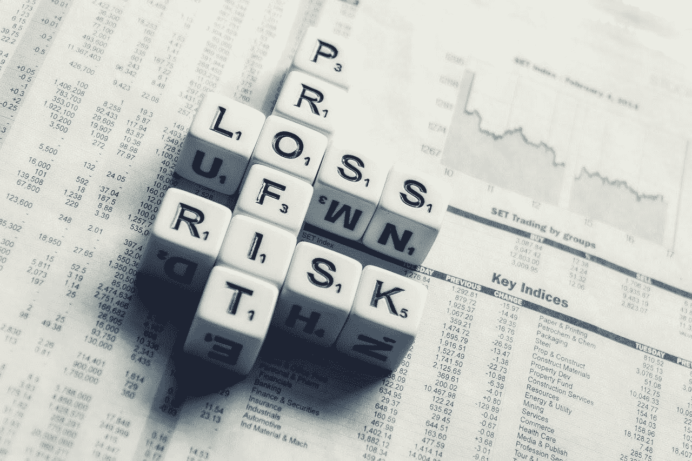
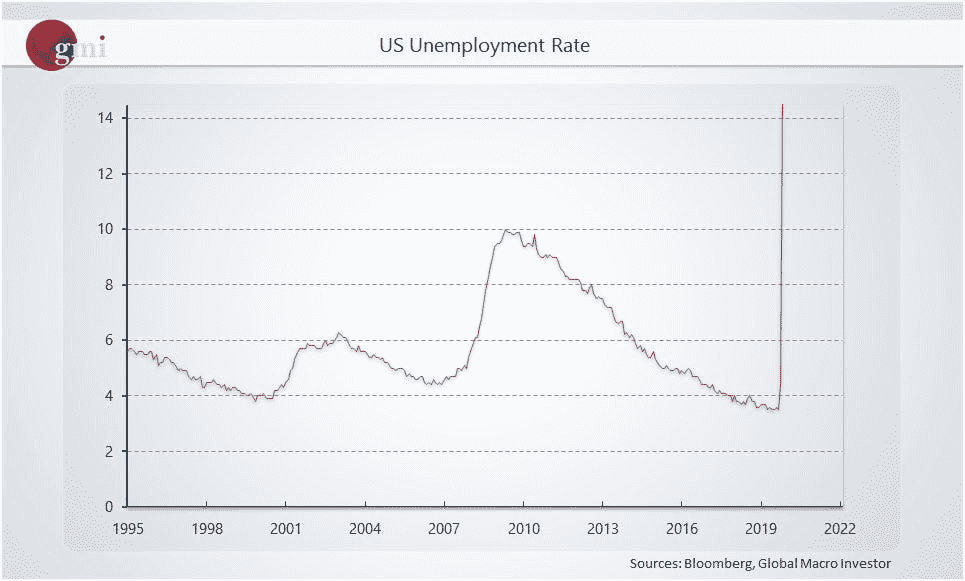
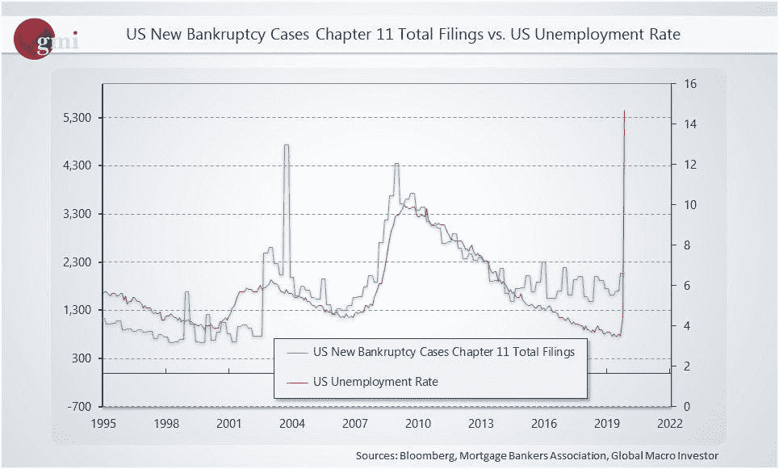
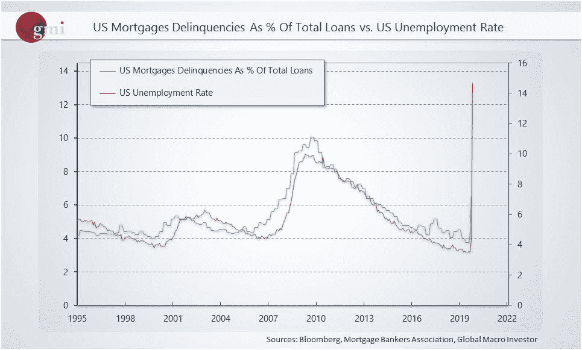
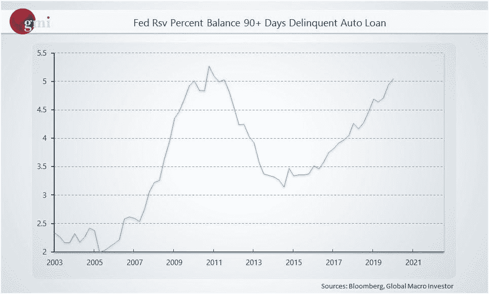
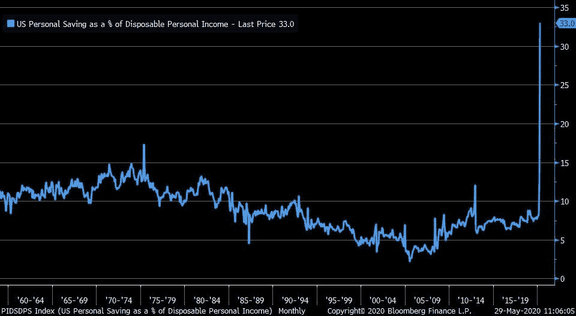

# 主街 vs 华尔街——如何在衰退中投资？

> 原文：<https://medium.datadriveninvestor.com/main-street-vs-wall-street-how-to-invest-in-a-recession-8c6a7719dc8e?source=collection_archive---------14----------------------->

## 2020 年 6 月值得关注的 3 只股票

Equities in June, Image by AbsolutVision

今天，我们的股票分析师 Faisal 和前花旗银行投资组合经理 Austin Ashraf 加入了 Alpha Trades。我们编辑了这篇文章来讨论与美国股市相关的重要事件，重点是“实体经济”与华尔街。为了不成为又一篇枯燥的金融文章，我们保留了对话的语气。

美国发生了太多的事情；冠状病毒、美中贸易战升级、特朗普与社交媒体公司的紧张关系，以及现在美国各地的骚乱和抗议。

# “35 年来，我了解到你在媒体上听到的几乎 80%都是噪音。”奥斯汀·阿什拉夫

当你关注美国股市时，可以说最响亮、最重要的声音来自美联储。此外，美国国债利率在未来几年可能会保持相对较低的水平。出于这些原因，奥斯汀目前在市场中持有约 55%的多头，有充足的现金来捕捉任何可能出现的波动。除此之外，他还列出了一份希望在价格合适时投资的股票清单。

我们的团队同意奥斯汀的观点，即市场，尤其是科技股，在目前的水平上处于超买状态，并预计 6 月份可能会有一些重大的买入机会。

 [## 如果资本主义失败了，那么还有什么选择呢？数据驱动的投资者

### 在当前政治领域的修辞之旅中，我们都可以面对面地接触到流行词汇，如…

www.datadriveninvestor.com](https://www.datadriveninvestor.com/2020/03/16/if-capitalism-is-a-failure-then-what-is-the-alternative/) 

正如我们在之前的股票分析综述中报道的[，进入工业、公用事业、金融和住房等价值行业的轮动正在上演，随着经济继续重新开放，这些行业有更多的运行空间。](https://medium.com/datadriveninvestor/us-china-economic-warfare-tech-and-healthcare-stocks-to-watch-this-week-4d4999d9d628?source=---------6------------------)

# 从成长股到价值股的轮动

成长型公司是指那些由于其未来潜力而有潜力在一段时间内跑赢整体市场的公司，而价值型股票是指那些交易价格低于其真实价值的公司。

我们的股票分析师 Faisal 在过去一周增加了他在美国市场的净空头头寸，因为他预计市场会有更大的下行波动。随着标准普尔 500 指数攀升至 3100 点水平，押注于进一步上涨而没有明显回撤的风险在此时是非理性繁荣。然而，他仍然非常看好美国的中长期前景。费萨尔报告称:“与多头头寸相比，我的空头头寸约为 75-25 倍。”。

# 实体经济

回到多样化但又相互关联的美国经济图景，让我们重申一下；[明尼阿波利斯骚乱](https://www.wsj.com/articles/george-floyd-protests-minneapolis-11590844180)、[冠状病毒](https://www.zerohedge.com/geopolitical/spains-socialist-pm-pushes-another-2-week-lockdown-extension-global-covid-19-cases)、主街对华尔街、[美中贸易战升级](https://www.zerohedge.com/markets/china-sets-yuan-fix-weakest-2008)以及[川普对推特的回应](https://www.washingtonpost.com/)。

# 数百万人失业，经济范围内的破产，拖欠的抵押贷款和拖欠的汽车贷款飙升。

尽管有这些统计数据，但 SPX 仅较冠状病毒爆发前的水平下跌了 10%，而道琼斯指数则接近此前的历史高点。因此，许多公司本身也达到了历史新高。主街和华尔街之间的脱节非常明显。美国企业正从危机应对中受益，而消费者却在努力保住工作或寻找新工作。

疫情期间，美国人的储蓄率上升了近 33%，这在美国是前所未有的。虽然很明显这种发展是人们不能出门花钱的结果，但几个月养成这种习惯可以大规模改变人们的消费习惯。

US Unemployment Rate, Source: Bloomberg

US Bankruptcy Rates, source: Bloomberg

US Mortgage Delinquencies, Source: Bloomberg

US Delinquent Auto Loans, Source: Bloomberg

US Personal Savings as a % of Disposable Personal Income; Source: Bloomberg Finance

一方面，市场是一个巨大的贴现机制，另一方面是不可预测和非理性的。也就是说，展望未来 6 至 12 个月，我不会忽视的一个事件是美中贸易战。目前我们真的必须考虑更长期的时间范围，因为今年是选举年，即使是贸易战也将是一场复杂的贸易。

# 如何投资后冠状病毒时代

冠状病毒之后的生活，许多事情将会改变，许多行业将会被打乱。我敢肯定，我们的一些读者在高层建筑中工作，随着如此多的员工和公司经理发现在家工作并不像许多人想象的那样低效，商业房地产陷入了困境。这就是软件业将在市场转变留下的空白中占据主导地位的地方。在一个由疫情经济引领未来五年的世界里，软件公司和有效利用软件的公司将比任何其他群体受益更多。

# 进入六月，我们的团队专注于技术

当科技股龙头表现出疲软迹象时，投资价值股的趋势应该会加强。

基于他的多年时间框架偏好，奥斯汀非常看好市场，但如果美中紧张局势开始沸腾，你可以说，随着冠状病毒疫苗的任何延迟，他将准备好充足的现金储备来购买更大的下跌。

**奥斯汀:**半导体行业目前正在寻求大约 370 亿美元的联邦资助。一家得益于良好基本面的公司是 Advanced Micro Devices。AMD 是一家成长型公司，由一位能干的首席执行官掌舵，这是对未来的投资。这是一家处于巨大创新风口浪尖的公司。我认为它将从其竞争对手 IBM 那里夺取大量市场份额。我买入 AMD 的股票，很大程度上是因为我买入了首席执行官和她团队的愿景。

# “在投资一家公司之前，首先要做的是看看核心团队”——奥斯汀·阿什拉夫

然后，我会寻找这家公司是否在创新方面投入了大量资金，最后，他们的销售在多大程度上是由新产品推动的。

我们将看到需求激增的另一个领域是医疗产品，因此医疗部门是我们团队将关注的另一个领域，重点是[雅培实验室](https://en.wikipedia.org/wiki/Abbott_Laboratories) (ABT)，这是一家医疗设备和医疗保健公司，在医疗保健系统方面拥有跨国业务。

# 还有哪些公司的团队愿景与你对市场的看法一致？

Nvidia 的 CEO 黄仁勋和 AMD 的 Lisa Sue 都很棒。微软的首席执行官塞特亚·纳德拉也很棒。

# 保持长远的眼光

> “只要你对市场有长远的眼光，真正让你赚钱的是持有优质资产，而不是交易它们。你可以围绕这个头寸进行交易，但要保证你核心长期投资的安全。”奥斯汀·阿什拉夫

资金必须流向某个地方，这就是为什么奥斯汀准备了大量现金来应对高概率的从多头到空头的重力交换，尽管他确实将这视为更大程度上的逢低买入机会，而不是做空潜在市场复苏的选项。

# 费萨尔本周的最佳选择

尽管我最近加大了看空股市的力度，但一些家喻户晓的高股息公司，如 HSY 好时(Hershey)、百事可乐(PepsiCo)、可口可乐(Coca-Cola)和卡夫亨氏(Kraft Heinz)将是一个防御篮子。如果我们的团队持有这些资产中的任何一个，Advantage 成员都会收到警报。

# 优势会员获得更多

[订阅 Discord 服务器](https://bit.ly/2KJ1oor)学习技术分析以及如何投资获利。要求第一个月的高级会员享受 50%的折扣！(优惠将于 6 月 15 日结束)查看以下视频了解更多信息。

Stock Market Discussion with Former Citigroup Portfolio Manager, source: Alpha Trades, LLC

# 放弃

Alpha Trades，LLC 提供的信息不用于制定任何财务决策，也不是购买、持有和/或销售特定产品、数字资产或 ICO 的请求或建议。

访问我们的完整服务条款:[https://bit.ly/3faVeeV](https://bit.ly/3faVeeV)