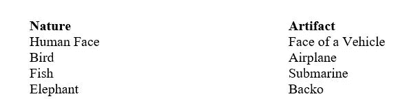
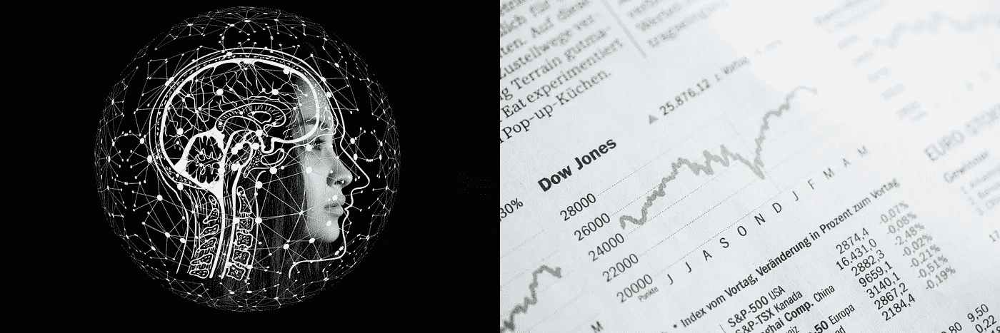
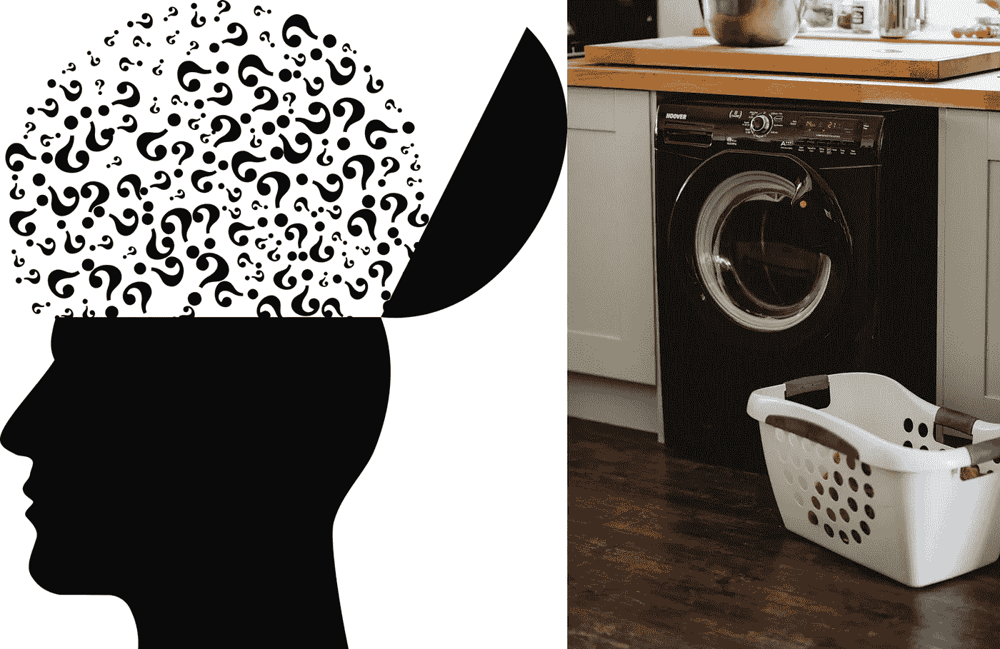
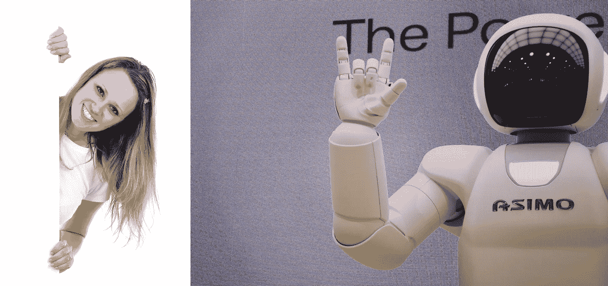

# 人工智能的主要领域

> 原文：<https://medium.datadriveninvestor.com/major-areas-of-artificial-intelligence-74f41917453?source=collection_archive---------1----------------------->

大家好，

今天我将简要地讲述人工智能的主要领域。不同的来源可能会给你提供不同的列表，因为在人工智能下有如此多的领域。但是我将坚持下面的七个方面。

 [## 人工智能和监督资本主义|数据驱动的投资者

### 大科技，总是现在:人工智能推动的大科技，已经使购物，搜索，在你的…

www.datadriveninvestor.com](https://www.datadriveninvestor.com/2020/03/04/on-artificial-intelligence-and-surveillance-capitalism/) 

人工智能的所有发展都受到大自然的启发。一般来说，任何人工制品或任何理论都是由自然现象激发的。让我们看一些例子。

这也可以应用于人工智能技术。但是，我们不应该忘记还有人造的东西，如香水，药物，这些都不是天然的。有些人造的东西比天然的好。例子有橡胶、机油。

让我们看看这里讨论的主要领域。

**1。专家系统**——这是一个像医生、律师、工程师、科学家、木匠、音乐家等人类专家解决问题的模型。

**2。人工神经网络(ANN)——**ANN 的灵感来自大脑是如何由大量神经元和连接组成的。神经元作为处理器工作，连接作为记忆工作。

**3。遗传算法—** 染色体和基因给了遗传算法技术发展的灵感。

**4。模糊逻辑** —人类智能有一个特点，就是对一组值进行近似运算，而不是对精确值进行运算。这种性质为模糊逻辑提供了灵感。

**5。机器人—** 这是人类或动物如何完成一些体力任务的模型。

**6。自然语言处理(NLP)——**这是一个关于自然语言理解和自然语言之间翻译的领域。

**7。多代理系统**——这些系统基于通过团队合作使用通信或消息传递来解决问题。

上面提到的数字告诉你，哪种自然现象激发了人工智能的哪个领域。我想和大家再一次讨论一下人工智能的主要领域之一的**【专家系统】**。如果你喜欢这篇博文，请与朋友分享。

注意安全…！！！