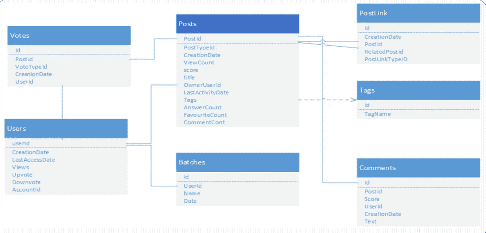
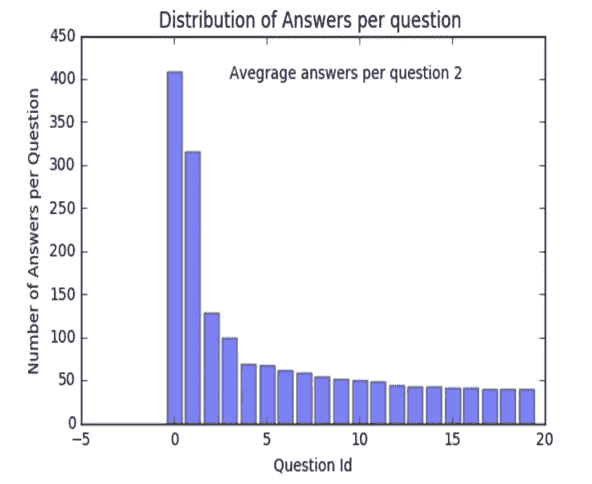
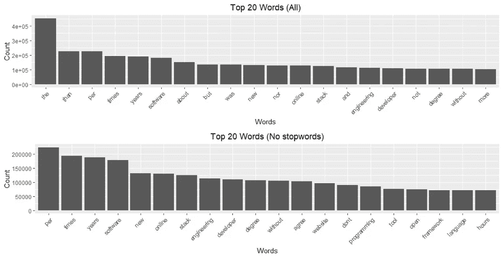
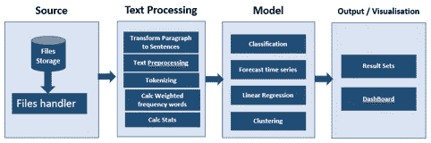
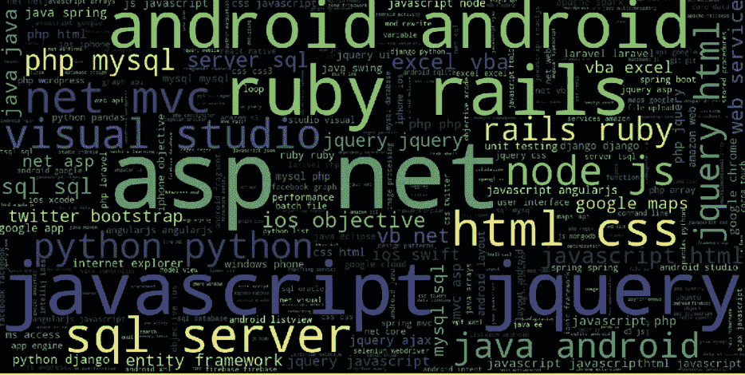

# 使用 Python、Spacy 和 Tableau 对数据分析和可视化产生影响

> 原文：<https://medium.datadriveninvestor.com/make-an-impact-using-data-analysis-and-visualization-using-python-spacy-and-tableau-528f837270d1?source=collection_archive---------4----------------------->

## 提取数据、分析和可视化以获得对堆栈溢出数据的洞察

tackOverflow 是一个受欢迎的 Q &程序员网站，通过它的问题和答案数据库为全球近 500 万程序员提供有用的信息——更不用说其他程序员提供的附加评论了。分析连续的数据流并提取有用的讨论意义，这是一个很好的里程碑。该选项将提供讨论的见解，并以预期的方式为不同的技术提供很大的帮助。记住同样的事情，我将尝试用下面的目标和方法来探索这个选项。

# 目标

1.  **获得最受欢迎的标签和数量**
2.  **带有 1 个以上标签的问题**
3.  **讨论和评论最多的顶级技术**
4.  **针对不同技术提出的问题数量**
5.  **有高低分的标签**
6.  **响应频率等**

# 问题陈述

tack Overflow 有数以百万计的问题被问及，并有关于这些问题的讨论。这些问题/答案/评论被标记和评分。不同文件中 xml 格式的数据集。理解并需要编写解析器来解释 xml 文件并提取结果以执行进一步的 EDA。数据集中每个文件都由数百万个数据组成。每个文件有 7-8 个属性，由许多缺失的特征、空字段和不一致的数据条目组成。这是由于堆栈溢出数据的复杂性。

> 这种数据提取、分析和从数据中获取意义的方法对项目经理、新生、有经验的专业人士、研究人员、顾问和组织都非常有用。

EDA(探索性数据分析)需要理解给定的数据和不同数据集之间的关系。然后，对数据进行分析，以提取用户、评论、投票、标签、问题、趋势以及最重要的技术方面的指标，反之亦然。

# 关于数据

数据可从 [*链接*](https://archive.org/details/stackexchange) 下载。
将数据集缩减至 3gb 大小，以便于探索和实施。数据集包含以下文件，在我们的数据库设计中，我们把它们当作表格:帖子链接、批处理、投票、评论、用户、标签和帖子。数据使用密钥相互链接，如下所示:

Data and their dependencies

# 一些数据集的探索示例

**帖子**:未回答的问题、标记为关闭的问题、无效问题、查看次数最多的问题、得分最高的问题和热门类别。

**用户和评论**:查看次数最多、回复数量最多、不活跃账户、死账户、最活跃/最有价值用户和用户评论数量最多的用户资料。

# 数据清理和转换

1.  数据集非常庞大。通过分块挑选数据来进行数据分析。
2.  删除所有 delta 答案为负或零的问题。在这里，Delta 答案是通过提问时间和回答时间之间的差异来计算的。
3.  通过删除标点符号和不需要的符号来净化文本。创建了两个语料库，一个有停用词，另一个没有停用词，用于分析。
4.  现有的 python 库空间被用来代替 NLTK 进行数据清理和文本处理。它非常快，并且比 NLTK 有更多现有的有用特性

# 探索更多信息的后续步骤

**数据归一化步骤**:数据的归一化将有助于去除离群值、缺失值。简而言之，在数据有偏差的情况下，归一化将有助于使数据更好，以便模型更好地执行。正如所料，在正常化前后发现了巨大的差异。并且，文本在规范化后变得更易于管理。

**分数分析步骤**:分数是给予问题或答案的支持票。这里的分数分析是指计算分数，根据分析，分数总是在 0 到 100 之间。

**问题正文分析步骤**:问题正文有很多见解和发现。根据分析，问题的长度会导致快速响应与否。而且，这也与 upvote 有关。

**文本摘要步骤**:用于摘要文本的简单技术。
将段落转换为句子
移除特殊字符或停用词
标记化并查找加权出现频率(TFID 或 PMI)
用原句子中的加权频率替换单词
以下是一些图表，用于分析更多数据。

# 建模和情感分析

●数据摄取、预处理、转换、聚类、训练、测试和预测时间序列。

●可视化和决策

可以使用 Spacy、afinn 和 TextBlob 进行情感分析。分数已经存在于数据中，但情感分析有助于给我们更多的数据洞察。简而言之，获得给定的情绪，并使用我们自己训练的模型对情绪进行总结。而且，据推测，这将有助于从回答中得出更多结论性的观点。

> Spacy 是 python 中的库，它拥有执行 NLP 任务所需的所有库，包括 NER 和从数据中获取意义。它具有针对小型、中型和大型的预先训练的语言模型，可以基于问题陈述和需求来使用。

# 可视化的最终输出和仪表板

Dashboard 是基于使用 python 对数据进行情感分析和规范化后生成的文件开发的。最终数据帧存储为 csv 文件，以便在 Tableau 中使用。尝试在仪表板中开发大约 12 个不同的视图，以获得问题的良好前景和更好的结论。更多关于 [*仪表盘*](https://public.tableau.com/profile/laxman.singh#!/vizhome/StackOverflowFinalVersion/Analysiswithfilter?publish=yes)

Interactive Dashboard to Visualize and Understand Data set

> Dashboard 可直观显示总记录、总答案、问答、问答比率、问题的答案数量、讨论的前 10 项技术、具有正面评论的技术、标签数量、用于动态过滤 dashboard 的标签分析以及问答分析。这为理解和解释数据提供了良好的可视化视图

不同技术和最常用词的词云提供数据分析，以进行建模和情感分析。这是一个非常好的视图，因为你可以看到错误的单词是否没有被挑选出来进行分析。如果是，将它们包括在停用字词删除步骤中。

d

# 结论

本分析的目的是探讨堆栈溢出时问答社区过程的推理。这种分析将有助于不同的技术专家了解趋势技术和降低或提升其受欢迎程度的技术。这也有助于确定未来的技术路线图和旅程。此外，它可能有助于规划组织的资源和能力。

> 这种分析可以用来确定缺乏技能的市场需求，以及哪个产品有很多缺陷和问题。因此，它将有助于公司架构师或战略人员决定他们可以为企业标准选择的产品，并在该领域构建功能。

这一领域的需求日益增长，可对其进行分析，并可用于基于信息或数据的决策制定。使用人工智能设备，如 SIRI、亚马逊的 Alexa、谷歌助手等，这可以被带到基于语音的响应的下一个级别。，与知识库接口。此外，聊天机器人可以利用知识库的自动回答或解决方案的能力。总的来说，这种分析可以帮助各类技术人员获得对他们有用的信息。**编码快乐！**