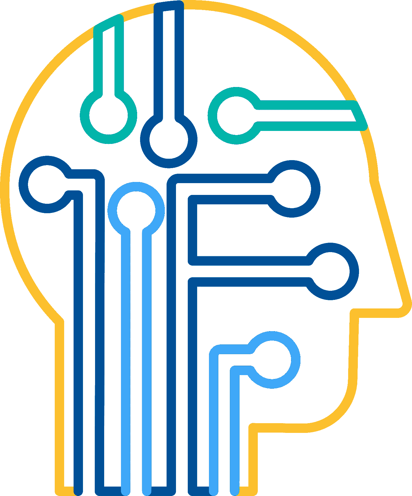
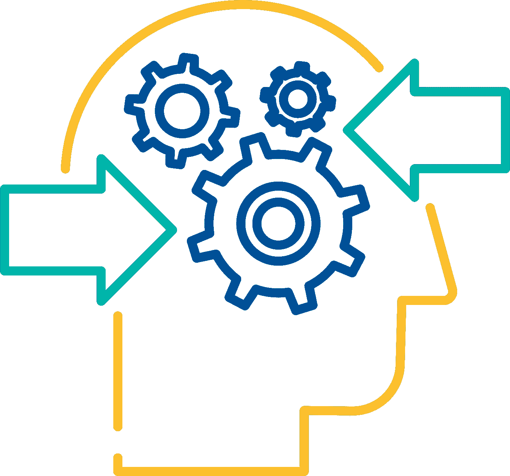

# 理解、计划、执行、审查

> 原文：<https://medium.datadriveninvestor.com/make-it-work-make-it-right-make-it-fast-6d9ca743f91d?source=collection_archive---------6----------------------->

## 我陷入困境时的发展过程

## 用 UPER 解决问题

我做应用已经很多年了。大部分是供朋友和个人使用的应用程序，有些是由开发团队开发的，我也在很多其他人的代码库上工作过。这些经历中有一样东西是不变的——问题。

这些年来，我在某种程度上发展了自己的解决问题的框架，它时好时坏。我最近通过 Lambda 学校被介绍给 UPER，它完全改变了我的游戏。

如果你像我一样，当面对一个问题时，你可能会以某种你能理解的方式重述这个问题，思考你将如何解决它，然后投入并解决它。如果这是你，那么你知道——这从来不会持续有效，你可能会觉得你可以做得更好——或者至少不同。

 [## 干净的代码在软件开发中至关重要——这就是为什么|数据驱动投资者

### 干净的代码是“容易理解和容易改变的”，它是关于对细节的关注。但是开发人员为什么要担心…

www.datadriveninvestor.com](https://www.datadriveninvestor.com/2020/05/27/clean-code-is-crucial-in-software-development-heres-why/) 

UPER 是一个已经存在很长时间的问题解决框架(非常类似于 Polya 的四步问题解决过程)。以下是其工作原理的简要概述:

## 明白；理解

花点时间，真正理解问题。你到底想完成什么？现在还不是积极思考解决问题的时候，但是如果你有想法，就让他们来吧。如果对你有帮助，就把它们写下来。

在这个阶段，我通常会用一种对我来说非常清楚的方式来重新表述这个问题。如果对目标有任何疑问，这是得到答案的时候了(希望是给你出问题的人！)

> 问题: *我有很多员工。我的人力资源团队需要以有组织的方式获得这些数据，我们的人员流动率很高。*
> 
> **重述**:
> 
> **问题:**

# 计划(避免陷阱)

在思考这个特殊问题时，您可能已经想到了您将使用什么集合类型进行存储(数组、字典、链表等等)。

如果你正在使用 OOP 风格的语言，你可能已经开始考虑类和结构了。我立即想到了实现一个链表，并开始考虑将进入其中的数据结构以及它们的层次结构。如果你还没有想到什么特别的东西，那也没关系！

现在是研究的时候了。把你重述的问题放入搜索引擎，看看你会得到什么。将它与你自己的知识进行比较，做一个理智检查，然后想出你认为最好的行动方案。

制定尽可能详细的计划。越详细，越有助于你避免陷阱——但也显然会花费更多的时间和思想，你可以花在别的地方。

做图画图，*涂鸦*。涂鸦可以帮助你想象那些你必须想象并继续想象的事情。这可以释放你可以在接下来的精神挑战中使用的资源，并给你一个方便的视觉参考。

# 执行(让它发挥作用)

有了你重申的问题和精心策划的计划，就不会出问题了，对吗？哈！不对！总有一些事情是你没有预料到的。一些你没有充分考虑到的事情——这没关系。

这一切都不是一成不变的！这些都是为了帮助我们实现解决问题的最终目标。这总是好的，甚至鼓励重新回顾以前的步骤。解决一个你并不真正理解的问题，或者执行一个你知道行不通的计划是没有意义的。需要的时候就后退一步。

也就是说，从未执行过的完美计划不会为任何人带来任何好处，所以去执行吧！正如脸书和他的团队常说的那样…

> “动作快，砸东西！”

既然你已经“更好地打破它”…

# 复习(纠正错误)

你刚刚成功了！恭喜你！但是你知道，我也知道——它可以变得更好。也许在匆忙执行时，您使用了“神奇的”数字或字符串，这对于以后的重构来说是一种痛苦，但现在很容易纠正。也许你使用占位符是因为你只是想在屏幕上得到一些东西来证明你没有浪费所有的时间！

不管是什么情况，即使你认为它很完美…即使你很满意，也要回顾一下。如果你没有发现任何错误，你可以让其他人也检查一下。你能做的最好的回顾就是把产品交给最终用户，让他们做点什么。看看他们是否直觉地知道该做什么，看看这个过程是否按照你想要的方式进行，如果他们有任何反应的话，评估他们的反应。对于一个好的最终产品来说，听取别人的意见只会有好处，但是你自己审查它是至关重要的。

我数不清在这个审查过程中我犯了多少愚蠢的错误，也数不清我在这里做了多少 UX 改进。反正第一次复习的时候，重点做好事情 ***对*** 。使用你的最佳开发实践，确保你遵循你公司的风格指南，尽你所能让那只小狗发光。

## 再复习一遍！(快点)

我知道，你已经解决了，你做了 ***对*** 。你不可能做得更好了，对吧？好吧，也许你意识到了不管什么原因，链表并不是完成这个的最快方法。也许随机访问会让你受益，不管是什么原因。现在是时候把这个美丽的创造变成流线型的喷气发动机了。

掸掉 CS 书上的灰尘，卷起袖子， ***真的挖到了*** 。效率是这个游戏的名字。如果你知道如何让它变得更快，在你的预算和时间表之内，并且你还有一盎司的精力，那就投入进去。现代计算机拥有多少资源似乎不值得，但最终，它们会达到极限…没有人愿意被贴上资源猪的标签！

# 跟我重复

**了解
计划
执行
回顾**

让它工作，让它正确，让它快速！

**访问专家视图—** [**订阅 DDI 英特尔**](https://datadriveninvestor.com/ddi-intel)