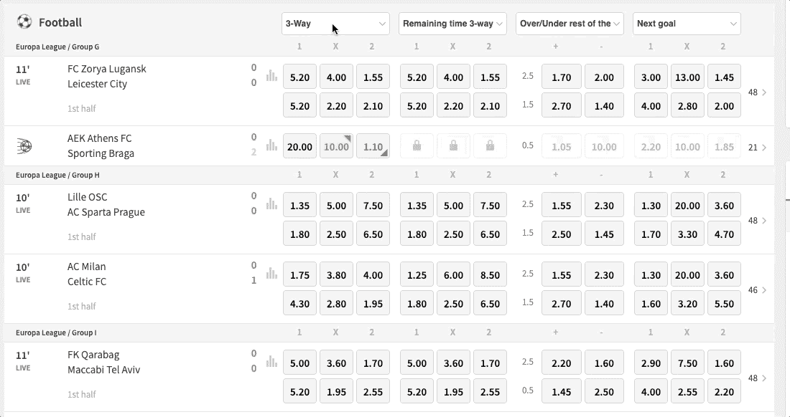
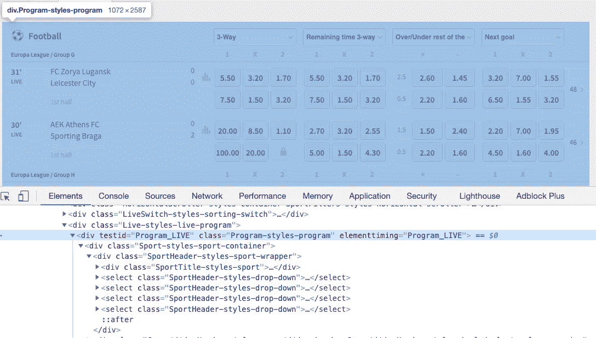
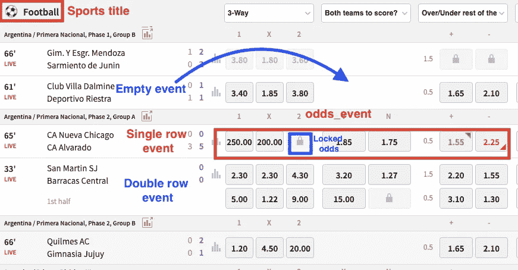
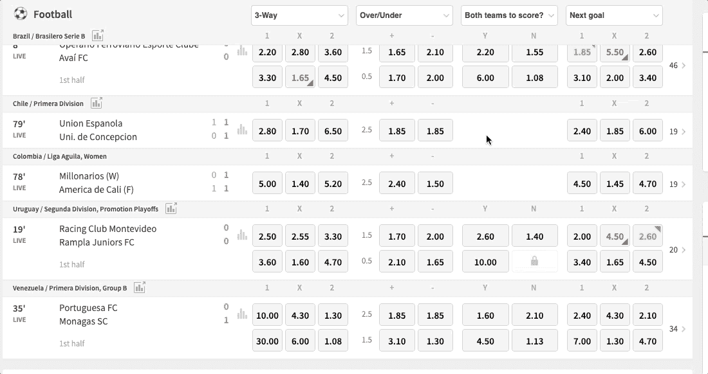
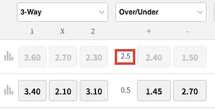

# 用 Python 赚钱——体育套利项目

> 原文：<https://medium.datadriveninvestor.com/make-money-with-python-the-sports-arbitrage-project-3b09d81a0098?source=collection_archive---------0----------------------->

## 充分代码，使额外的钱与体育套利。


Photo by [Heather Gill](https://unsplash.com/@heathergill?utm_source=medium&utm_medium=referral) on [Unsplash](https://unsplash.com?utm_source=medium&utm_medium=referral)

所以你终于完成了一门教你 Python 基础的课程；你已经学习了列表、字典、循环和条件如何工作，但是你仍然不能用你的 Python 技能赚钱。我学 Python 1 年后也遇到过这种情况；幸运的是，你可以用一些 Python、Selenium 和体育套利的知识来赚外快。

体育套利或 surebets 是利用博彩公司在计算同一体育赛事的赔率时出现的错误的做法。当这种情况发生时，无论结果如何，你都可以通过向不同的庄家下注来获利。

在本教程中，我将指导你通过**的完整代码**，你需要从 3 个投注网站收集**现场投注数据，**将为我们找到 sure bets**。**有两种 surebet:预赛和现场 sure bet。我们将专注于实时 surebets，因为这是最有利可图的，但由于数据是“动态的”，因此有点难以收集。

本教程将分为 4 个部分:

1.  **用 Selenium 抓取现场投注数据**:在 Selenium 中，我们会用到`WebdriverWait`、`Expected Conditions(EC)` 和`Select`。此外，我们将自定义 chromedriver 的默认选项，以便在后台抓取。我们需要的一些 Python 必需品是`try-except`块和列表。
2.  **清理和转换实时赔率数据**:来自不同博彩公司的赔率数据以不同的形式出现，因此我们需要对它们进行适当的格式化，以便能够比较它们并找到确定的赌注。熊猫图书馆在这方面派上了用场。
3.  **匹配队名**:博彩公司对相同队名的写法各不相同。有些人可能会写纽约市足球俱乐部，而其他人只会把它称为纽约足球俱乐部，所以我们需要先做一些字符串匹配。我们将使用 Fuzzywuzzy。
4.  **寻找确定赌注并计算赌注**:我们将创建 Python 函数来寻找确定赌注，为我们计算赌注，并告诉我们潜在的利润。

如果您以前从未使用过 Selenium 或库(如 Pandas 或 Fuzzywuzzy)上的高级工具，您也不必担心。当我们需要它们时，我会一步一步地解释它们是如何工作的。

但是，要学习本教程，一些关于 Selenium 的基础知识是必要的；否则解释就太长了。我制作了另一个教程，以赛前 surebets 为例解释了网络抓取的基础知识。教程可以在下面的链接中找到，我创建的一个**网页抓取备忘单**可以在这个[链接](https://medium.com/geekculture/web-scraping-cheat-sheet-2021-python-for-web-scraping-cad1540ce21c)中找到。

[](https://medium.com/swlh/web-scraping-basics-scraping-a-betting-site-in-10-minutes-8e0529509848) [## 网络抓取基础——10 分钟内抓取一个赌博网站

### 在这 10 分钟的教程中，我将向你展示如何用 Python 来抓取网站，即使你根本不编码！

medium.com](https://medium.com/swlh/web-scraping-basics-scraping-a-betting-site-in-10-minutes-8e0529509848) 

此外，在我们开始编码之前，请确保您完全熟悉 surebets 的[概念，这样我们将要编写的代码对您来说才有意义。](https://medium.com/swlh/how-to-make-money-from-web-scraping-without-selling-data-92c1f961b25)

***注*** *:我用 Python 的硒和熊猫搭建了一个盈利的投注工具。在下面的文章中，我展示了完整的代码，并解释了我是如何做到的。*

[](https://frank-andrade.medium.com/i-used-to-pay-180-yr-for-a-profitable-betting-tool-this-year-i-built-one-in-python-dda1a9b9581f) [## 我曾经每年花 180 美元购买一个有利可图的赌博工具。今年我用 Python 做了一个

### 完整的代码创建一个足球博彩工具与熊猫和硒。

frank-andrade.medium.com](https://frank-andrade.medium.com/i-used-to-pay-180-yr-for-a-profitable-betting-tool-this-year-i-built-one-in-python-dda1a9b9581f) 

**法律免责声明:**网站的大量抓取会导致高流量，并可能给网站带来负担。如果您正在访问网站，您应该始终考虑他们的服务条款，并检查“robots.txt”文件，以了解网站应该如何被抓取。此外，我不提倡赌博，不管是哪种赌博。

# 编码时间到了

在 3 个博彩网站中，我认为这是最难获得数据的一个，所以一旦你能够从这一个中获得实时赔率，你就能够很容易地理解其他 2 个网站的代码，并创建自己的博彩网站刮刀。

开始编码吧！完整的代码可在第 4 部分的结尾获得。

**如果你已经学习了本教程，突然代码停止工作**，下面你可以找到我对代码做的一些更新，因为对网站做了一些改动。

***2021 年 3 月 21 日更新:***

1.  *我将 Tipico、Betfair 和 Bwin 刮刀的 CSV 输出示例上传到我的*[*Github*](https://github.com/ifrankandrade/the-sports-arbitrage-project.git)*中，这样您就可以了解第 1 节(*用 Selenium 刮活投注数据)*的输出是什么样子了。然而，在找到 surebets 之前，这些数据仍然需要在第 2 和第 3 节中进行预处理。*
2.  *Tipico 博彩网站下拉列表中的名称略有变化。最初的名字是，“两个队都得分？”但现在是“两队得分”，下面的代码考虑新的名字。*

***2021 年 4 月 22 日更新:*** *(仅限 Tipico 网站)*

1.  *显然，从某些国家访问该网站是不可能的。如果是这种情况，使用一个****VPN****连接到欧洲的某个国家(TunnelBear 对我很有用，而且是免费的)*
2.  网站对直播部分做了一些重大改动。现在 prematch 和 live 部分在一个名为“Program_UPCOMING”的容器中，所以为了保持 scraper 工作，我必须删除和添加一些代码行，这些代码行是我在文章结尾的完整代码以及下面的代码片段中指定的。
3.  *看起来网站现在有了一些功能，不允许所有事件显示在直播部分(除非你一直向下滚动)。如果你看到不是所有的事件都被废弃了，使用下面的代码一直向下滚动并抓取所有的事件。(我只在完整的代码中包含了这一点，以防你需要)*

```
#scroll down to the bottom to load all matches
driver.execute_script("window.scrollTo(0, document.body.scrollHeight)")
time.sleep(3) #implicit wait to let the page load all the matches
```

*4。我把网站网址更新为 scrape，所以现在直接进入“足球”部分(有助于简化代码)*

如果代码停止工作，请在评论中告诉我！

```
**Table of Contents** 1\. [Scraping live betting data with Selenium](#f1fd)
 - [Importing libraries](#eed6)
 - [Changing Chromedriver default options](#3f81)
 - [Select values from dropdown menus](#6355)
 - [Looking for 'live events' and 'sports titles'](#ad81)
 - [Scheme for scraping live games](#f66f) 
 - [Find 'empty events'](#3078) 
 - [Remove empty_events from single_row_events](#f130)
 - [Getting live odds](#6b82)
2\. [Clean and transform live odds data with Pandas](#3eaa)
3\. [String matching with Fuzzywuzzy](#fe02)
4\. [Find surebets and calculate stakes](#9b4a) 
 - [Find surebets](#712d)
 - [Calculate the stakes](#c645)
 - [Final Step: Automate the Python Script](#d60c)
5\. [Full Code of 3 Bookmakers](#96f6)
6\. [Final Note](#125b)
```

# 1.用 Selenium 抓取实时赌博数据

## 导入库

我们需要导入`Options`来改变 chromedriver 的默认选项；`Select`用于下拉菜单中的选择，以及`By`、`WebDriverWait`、`EC`、`time`用于等待特定条件的发生。

## 更改 Chromedriver 默认选项

为了在计算机上做其他事情的同时继续抓取，我们需要使用无头模式。为此，我们编写以下代码:

分解代码:

*   `options = Options()`创建选项类的实例
*   `options.headless = True` 开启无头模式
*   `options.add_argument(‘window-size=1920x1080’)` 在背景上以自定义大小打开窗口
*   `webdriver.Chrome(path, options = options)` 应用我们在 chromedriver 中所做的更改
*   `driver.get` 打开浏览器
*   `web` 代表博彩网站的网址，而`path` 代表 chrome 驱动程序在你电脑中的路径

如果你不想在无头模式下工作，那么写`option.headless=False` 并使用`driver.maximize_window()`而不是`options.add_argument(‘window-size=1920x1080’)` ，如完整代码所示。

## 从下拉菜单中选择值

我们需要选择我们想要从中获取数据的博彩市场。我们用`Select` 和下拉列表的 Xpath 来实现。要获取 Xpath，请执行以下操作:



Image by author

但首先要记住，每次你打开一些博彩网站时，都会显示一个 cookies 横幅。我们需要通过点击“接受按钮”来删除它们

要单击“accept button ”,然后在下拉菜单中进行选择，我们编写以下代码:

分解代码:

*   `WebDriverWait(driver, 5).until(EC.element_to_be_clickable((By.XPATH, '//*[@id="_evidon-accept-button"]')))`让驱动等待，直到 cookie 横幅上的“确定按钮”可以点击。如果这引发了一个错误，那么使用“选项 2”来代替。要获取 Xpath，右键单击“ok 按钮”,然后像我们之前一样检查下拉菜单。
*   `WebDriverWait(driver,5).until(EC.presence_of_all_elements_located((By.CLASS_NAME, '...')))`让驾驶员等待几秒钟，直到找到下拉菜单
*   `Select('...')` 选择`dropdowns`菜单
*   `first_dropdown` 包含博彩市场的三个下拉列表之一
*   `first_dropdown.select_by_visible_text()` 在博彩市场名称的帮助下选择下拉菜单中的一个元素。

我特别选择了“两队得分”和“过/欠”,因为它们代表了我认为容易找到确定赌注的博彩市场。

## 寻找“现场事件”和“体育标题”

在获得数据之前，我们需要首先寻找现场事件。此外，为了简化分析，我们将只选择“足球”作为运动名称。为此，我们编写以下代码:

分解代码:

*   `box`代表包含体育赛事的盒子。该网站还包含即将举行的活动，这是我们不需要的分析。
*   `driver.find_**element**_by_xpath()`通过元素的“Xpath”帮助我们找到网站中的元素。

与我们之前处理过的大多数元素的 Xpaths 不同,‘live events’元素更难获得。为此，我们需要非常具体。然后我们使用`contains` 选项来匹配一个在`div` 标签内的`testid` 内包含`Program_LIVE`的元素。查看下图找到`Program_UPCOMING` ( `Program_LIVE` 在网站更改后不再显示)



Program_live — Image by author

*   `sport_title`代表各部分的运动名称。
*   `driver.find_**element**_by_class_name()` 通过元素的“class_name”帮助我们找到网站中的元素。要获得类名，只需按照我们之前用于下拉菜单的相同步骤，但在这种情况下，单击“足球”标题并复制类名`‘SportTitle-styles-sport’.`

在我们继续编写代码之前，我们需要理解将帮助我们收集实时数据的方案。

# 抓取游戏直播的方案

抓取直播游戏的方案类似于[抓取赛前游戏](https://medium.com/swlh/web-scraping-basics-scraping-a-betting-site-in-10-minutes-8e0529509848)的方案。然而，博彩网站 Tipico 中的直播游戏包括我们需要排除的“双排事件”和“空事件”。



*   体育标题:代表体育部分。网站上有很多运动，但我们将只关注足球，因为它是最受欢迎的运动。
*   双排赛事:上半场(0'-45 ')足球直播赛事有 2 排。第一行包含整场比赛的赔率，第二行只包含上半场的赔率。我们只和第一排合作。
*   单行事件:下半场(45'-90 ')的足球直播事件只有一行包含剩余比赛的赔率。
*   odds_event:表示一行中可用的赔率。每行有 1 个“赔率事件”，每个“赔率事件”有 3 个框，默认为市场“三向”、“过/欠”和“差点”。
*   空事件:现场赔率可能会由于多种原因暂停几秒钟。为了简化分析，我们不考虑包含空事件的行。

## 查找“空事件”

与赛前游戏不同，现场游戏的赔率变化很快，随时可能暂停几秒钟。当投注赔率暂时暂停时，赔率要么被锁定，要么为空。锁定赔率容易刮，空赔率难。这就是为什么我们需要用下面的代码来定位那些空赔率:

分解代码:

*   `for sport in sport_title` 循环浏览之前获得的运动列表(更新:不再需要)
*   `parent`表示`sport`元素的‘父节点’,而`grandparent` 是它的‘祖父节点’,表示实时事件中的整个‘足球’容器(更新:现在我们必须这样做 3 次才能到达代码中所示的目标节点)
*   `empty_groups`代表每场赔率暂停或为空的足球比赛
*   `granparent.find_elements_by_class_name()`给出了足球直播版块中所有类别名为‘EventOddGroup-styles-empty-group’的空赔率列表。您可以通过以下方式获得类名:



*   `empty_events`代表至少有 1 个空赔率市场的每一排或足球比赛(3 路、过/欠等。)
*   `[empty_group.find_element_by_xpath('./..') for empty_group in empty_groups]` 是一个列表理解，它遍历`empty_groups` 列表以获得每个元素的‘父节点’,即`empty_events`
*   `except`处理在`try`程序块中可能遇到的错误。当没有赔率为空的游戏时，我们需要这个来处理错误

## 从单行事件中删除空事件

我们找到单行事件，并使用以下代码删除其中的所有空事件:

分解代码:

*   `single_row_events` 代表双排项目的第一排或单行项目的唯一一排。正如我们之前所解释的，两者都代表了整个游戏的赔率，我们关注它们是因为在整个游戏的赔率计算中找到确定的赌注更常见。通过检查任何单行来查找单行事件的类名。你应该找到这个类名`'EventRow-styles-event-row'`
*   `[single_row_event for single_row_event in single_row_events if single_row_event not in empty_events]` 列出排除`single_row_events`中任何空游戏的理解
*   `try/except`处理没有赔率为空的游戏时可能出现的错误

## 获得实时赔率

之前选择的每个下拉列表将给出用以下代码提取的 3 个市场的赔率:

分解代码:

*   `for match in single_row_events`遍历`‘single_row_events’`列表中的所有匹配项
*   `odd_events` 代表每项赛事的可用赔率
*   帮助我们找到每场比赛中的所有“赔率事件”。要找到类名`‘EventOddGroup-styles-odd-groups’` ，只需右键单击并检查“赔率框”后面的代码，就像我们之前检查空赔率一样
*   `for team in match.find_elements_by_class_name(‘EventTeams-styles-titles’)`循环遍历‘匹配’节点中类名为`'EventTeams-styles-titles'`的元素。比赛有两个队(主队和客队)；这就是为什么我们需要遍历它们并用`team.text.` 获得它们的名字，然后用`append`方法将它们存储在`teams`列表中
*   `for odd_event in odds_events`循环查看投注网站上直播比赛的总数。
*   `for n, box in enumerate(odds_events)`循环一场比赛中的所有“赔率箱”。开始时，我们把下拉列表改成了“三向”、“超/欠”和“两队得分”，所以它们是我们能获得的赔率
*   `rows = box.find_elements_by_xpath('.//*')` 给出 box 元素内的所有子节点(odds)。
*   `n==0` 表示“仅从第一个框中取值”在这种情况下，第一个盒子是“3 路”盒子，存储在`x12`列表中
*   `rows[0]` 告诉 Python“只选择每个赔率框的第一行。”这样，我们忽略了双行事件中的第二行。



Goal-line Image by author

对于`n==1`(超额/不足)和`n==2` (BTTS)遵循相同的过程，但是在`n==1`中，我们还需要存储“**目标行**”这代表您赢得赌注所需的目标总数。

例如，超过 2.5 个目标意味着至少 3 个目标才能赢得赌注。让我们来分解一下`n==1.`的代码

*   `box.find_element_by_xpath('./..')`给出包含赔率的 box 元素的“父节点”。
*   `goals = parent.find_element_by_class_name('EventOddGroup-styles-fixed-param-text').text` 通过给出目标线的类名找到目标线。只需右击并检查目标线(如上图所示)即可获得其类名。然后我们用`.text`获取数据
*   `over_under.append(goals+'\n'+rows[0].text)`以标准格式附加目标行数据。超额/不足赔率格式将如下所示`2.5\n2.4\n1.5`
*   关闭 Chrome 浏览器

**至此，刮削部分完成！**现在我们必须使数据可读，并对熊猫进行一些预清理。然后我们用 Pickle 保存数据。

分解代码:

*   `dict_gambling` 存储所有包含赔率的列表的字典是否被删除
*   `pd.DataFrame.from_dict(dict_gambling)` 把字典变成一个数据框架`df_tipico,`，这样我们就可以轻松地阅读和使用它
*   `df_tipico.applymap(lambda x: x.strip() if isinstance(x, str) else x)`使用`strip` 方法清除所有前导和尾随空格。
*   `open('...', 'wb')` 在“写入字节”(wb)模式下打开一个名为`df_tipico` 的文件。我们将它保存在变量`output`中
*   `pickle.dump(df_tipico, output)` 保存在名为`df_tipico.` 的文件中创建的数据帧。我们对文件和数据帧使用了相同的名称，但它们可以有不同的名称
*   `output.close()`关闭文件

太好了！我们刮完了第一个庄家。庄家 2 和 3 比较好刮。博彩公司 1、2、3 的完整代码在本文末尾。

现在让我们用获得的数据自动找到一个可靠的赌注！

# 第 2、3 和 4 部分

从现在开始，我们将从另一个开始。py 文件来收集和处理从博彩公司 1、2 和 3 收集的投注数据。在这个文件中，我们将导入以下库。

子进程让我们并行运行脚本；也就是我们可以同时刮庄家 1，2，3。Pickle 让我们在每个书签中加载数据抓取；熊猫帮助我们清理和转换数据，FuzzyWuzzy 匹配团队名称所需的字符串。

尽管我们涉猎了不同的博彩市场，但为了简单起见，我们将只关注“两队得分”(BTTS)市场。如果你愿意，你可以跟随任何其他市场。过程类似。

# 2.**清理和转换熊猫的实时赔率数据**

正如我们之前提到的，暂停赔率要么被锁定，要么为空。当它们被**锁定时，像`‘’`这样的**空值将被清除，这不同于**空值**几率，空值不会给出任何值，并且会改变其他数据(这就是我们之前删除它的原因)

BTTS 有两种可能的结果，所以赔率看起来像这样`1.8\n1.7.`由于这个原因，我们需要将每个锁定的赔率`‘’` 格式化为没有值的常规赔率`‘0\n0’.`

另一方面，偶尔，一种结果的几率很大，而另一种结果的几率很小，可能根本不会出现。它们看起来像这样的`40\n` ，相当于`40\n1.01`在那种情况下，我们永远也找不到确定的赌注，所以我们需要把它们再次转换成`‘0\n0’` 我们用下面的代码来做这件事:

分解代码:

*   `pickle.load(open('df_tipico','rb'))`加载在第 1 部分创建的数据帧`df_tipico`
*   `df_tipico[['Teams', 'btts']]` 选择我们将在本次分析中重点关注的 2 列
*   `df_tipico.replace(r'', '0\n0', regex=True)` 将锁定的赔率变为`‘0\n0’`
*   `df_tipico.replace(r'^\d+\.\d+$', '0\n0', regex=True)` 把`40\n` 这样的巨大赔率变成`‘0\n0’.` 我们使用正则表达式来捕捉这些赔率的模式。

我们为 3 个数据帧中的数据给出了相同的格式。

# 3.用 Fuzzywuzzy 进行字符串匹配

博彩公司通常不同意球队的名字。为了匹配看起来相似的队名，我们使用 Fuzzywuzzy。这给出了一个介于 1 和 100 之间的分数，告诉我们两个名字有多相似。

我将用 60 作为考虑两个名字相同所需的最低分数。然而，有时这仍然可能匹配不同的团队。一旦确定无疑，用你的常识看看这两个队是不是真的一样。

在匹配字符串之后，我们合并数据帧，所以我们稍后寻找 surebets。

分解代码:

*   `df_tipico['Teams'].tolist()`将一个数组转换成一个名为`teams_1`的列表
*   `process.extractOne(x, teams_2, scorer=fuzz.token_set_ratio` 将队伍名称`x`与带有名称`teams_2` 的列表进行比较，并给出两个输出:与队伍名称`x` 最相似的`teams_2`中的名称及其得分
*   `df_tipico['Teams'].apply(lambda x:process.extractOne(x, teams_2, scorer=fuzz.token_set_ratio))` 将前面的公式应用于数组的每一行`df_tipico[‘Teams']`
*   `.apply(pd.Series)` 将 2 路输出转换成分配给各列的数据帧`df_tipico[[‘Teams_matched_bwin’, ‘Score_bwin’]]`
*   `pd.merge(df_tipico, df_bwin, left_on='Teams_matched_bwin', right_on='Teams')` 使用团队名称作为关键字合并 2 个数据帧
*   df _ sure bet[df _ sure bet[' Score _ bwin ']> 60]过滤掉低于 60 的分数
*   `df_surebet[['Teams_x', 'btts_x', 'Teams_y', 'btts_y']]` 选择我们稍后将使用的特定列

3 家博彩公司的字符串匹配是相同的。我们需要结成对子，以便以后找到可靠的赌注。对子是赌注 1-赌注 2、赌注 1-赌注 3 和赌注 2-赌注 3。

# 4.**寻找确定的赌注并计算赌注**

为了找到确定的赌注并计算赌注，我们将使用两个公式。公式如下所示。如果你想知道我是如何得出这些公式的，可以看看这篇文章。

## 寻找确定的赌注

分解公式`find_surebets`:

*   `frame[['btts_x_1', 'btts_x_2']] = frame['btts_x'].apply(lambda x: x.split('\n')).apply(pd.Series).astype(float)`将几率分成两部分。第一个存储在列'`btts_x_1'` 中，第二个存储在'`btts_x_2'.` 中，这两个列都是在我们应用公式时创建的
*   `(1 / frame['btts_x_1']) + (1 / frame['btts_y_2'])` 是求 surebets 的公式。您也可以在一对赔率`btts_x_2` 和`btts_y_1`中找到 surebets
*   `frame[(frame['sure_btts1'] < 1) | (frame['sure_btts2'] < 1)]` 只选择结果小于 1 的匹配，这是 surebet 的一个要求。`‘|’` 符号是一个“或”条件。
*   `frame.reset_index(drop=True, inplace=True)` 重置索引。我们需要它来识别代码找到的匹配项。

这样做之后，我们用`find_surebet('...')`将公式应用于每个庄家的数据框架。最后，帧被存储在字典中`dict_surebet.`

## 计算赌注

我们将把公式`beat_bookies`应用到字典的每个元素`dict_surebet .`中，这样做是为了找到下注所需的赌注和我们将获得的利润。

分解代码:

*   `total_stake` 是您在每场游戏中愿意下注的总金额。你必须确定适合你的数量。在这个例子中，我选择了 100
*   `for frame in dict_surebet` 遍历我们搜到的所有赌博公司的框架
*   `if len(dict_surebet[frame])>=1:` 过滤掉没有找到任何确定的帧
*   `for i, value in enumerate(dict_surebet[frame]['sure_btts1']):` 循环遍历数据帧内的列'`sure_btts1'`'的每一行。`enumerate` 给出两个输出:迭代次数`i`和行的`value`。我们需要`i` 来标识 surebet 被发现的几率和团队名称(`i` 相当于 dataframe 的索引)
*   `if value<1` 过滤掉`‘sure_btts1’`或`‘sure_btts2’`中的非确定赌注
*   `odds1 =float(dict_surebet[frame].at[i, 'btts_x'].split('\n')[0])` 借助 `.at`方法和索引`i`找到第一个赔率。由于赔率是成对的，我们必须将它们分开，然后通过`[0]` 或 `[1].` 选择我们想要的一个。之后，我们确保获得的结果是一个带有`float`的数字
*   `teams = dict_surebet[frame].at[i, 'Teams_x'].split('\n')` 通过 `.at`方法和索引`i`找到队伍名称。当我们打印球队名称时，我们不需要`‘\n’`，所以我们用`split`去掉它们
*   `dict_1 = beat_bookies(odds1, odds2, total_stake)`将公式`beat_bookies` 应用于我们找到的 surebet。该公式返回字典
*   `print(str(i)+' '+'-'.join(teams)+ ' ----> '+ ' '.join('{}:{}'.format(x, y) for x,y in dict_1.items()))`打印所有必要的数据，无论结果如何，都能获利。`.item()`解包所创建的字典中的元素。我们循环遍历元素，并以特定的格式打印它们

最后，您可以在我们从第 2 部分开始工作的文件的开头添加此代码，以同时收集 3 个赌注登记经纪人:

```
subprocess.run("python3 bookie1_tipico_live.py & python3 bookie2_bwin_live.py & python3 bookie3_betfair_live.py & wait", shell=True)
```

最后一段代码在 Mac 上运行。但是，Windows 似乎有一个问题。如果它在 Windows 上对你有效，请告诉我。

祝贺你！现在你可以在任何一家赌场找到可靠的赌注了！下面你有一个关于如何自动化这个脚本的教程，还有我们处理的 2 个文件的完整代码(code bookier 1+来自第 2、3、4 部分的代码)以及 bookmaker 2 和 bookmaker 3 的完整代码。

## 最后一步:自动化 Python 脚本

本教程的最后一步是自动化 Python 脚本，因此您可以每天、每周或在特定时间运行它。这里有一个关于如何通过 3 个简单的步骤在 Mac 和 Windows 上自动化 Python 脚本的教程。

[](https://towardsdatascience.com/how-to-easily-automate-your-python-scripts-on-mac-and-windows-459388c9cc94) [## 如何在 Mac 和 Windows 上轻松自动化您的 Python 脚本

### 使用 crontab 和任务调度器来自动化您的脚本并节省时间

towardsdatascience.com](https://towardsdatascience.com/how-to-easily-automate-your-python-scripts-on-mac-and-windows-459388c9cc94) 

如果你想在不被屏蔽的情况下浏览网站，请查看这篇文章:

[](https://medium.com/datadriveninvestor/3-simple-ways-for-web-scraping-without-getting-blocked-34f3b1f885d1) [## 3 个简单的方法来抓取网页而不被阻塞

### 防刮擦机构操作指南。

medium.com](https://medium.com/datadriveninvestor/3-simple-ways-for-web-scraping-without-getting-blocked-34f3b1f885d1) 

# 3 个博彩公司的完整代码

在运行代码之前，请务必阅读下面的注释。

## 庄家 1

注意事项:

*   在选项 1 或 2 之间切换，以防点击 cookies 横幅出现问题。

## 庄家 2

## 庄家 3

注意事项:

*   在选项 1 或 2 之间切换，以防点击 cookies 横幅出现问题。
*   在评论“选择任何市场”下面，完全按照你的浏览器显示的那样写下市场。市场的名称可能会因浏览器的语言而改变。只需键入浏览器中显示的市场名称，或者通过检查元素来复制它。
*   在第 66 行，你必须找到“暂停赔率”是如何用博彩网站的语言书写的。将单词“Suspedido”更改为浏览器语言中的等效单词。

你想知道更多关于如何击败庄家吗？如果有，看看我写的这篇文章:

[](https://medium.com/datadriveninvestor/can-we-beat-the-bookies-predicting-football-games-with-a-simple-model-43fe020fb384) [## 我们能打败庄家吗？用简单模型预测足球比赛

### 预测英超、西甲、意甲和德甲的足球比赛结果。

medium.com](https://medium.com/datadriveninvestor/can-we-beat-the-bookies-predicting-football-games-with-a-simple-model-43fe020fb384) [](https://medium.com/@fg.andrade95/4-things-i-wish-i-knew-when-i-started-sports-betting-88f1e4ee56e5) [## 开始体育博彩时我希望知道的 4 件事

### 以正确的方式开始您的赌博之旅。

medium.com](https://medium.com/@fg.andrade95/4-things-i-wish-i-knew-when-i-started-sports-betting-88f1e4ee56e5) 

## 寻找并计算庄家 1、2 和 3 之间的保证赌注

注意:

*   第 12 行`'subprocess'`在 Mac 上并行运行多个进程。验证它是否在 Windows 上工作。

# 最后一个音符

现在你可以在 3 家博彩公司找到确定的赌注。这是一个很长的教程，但完全值得！如果有些解释不清楚，请告诉我。我很乐意澄清任何概念。