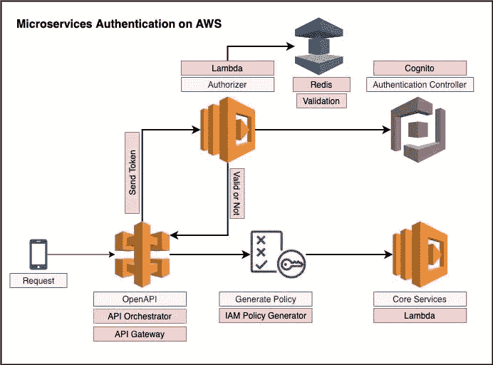

# 确保 API 网关 Lambda 授权器的安全

> 原文：<https://medium.datadriveninvestor.com/make-secure-your-api-gateway-lambda-authorizers-c1c1ea03d099?source=collection_archive---------1----------------------->

我不确定是不是几乎所有人都已经知道了。对我来说，通过添加新的层来防止任何人从 API 网关访问我们的核心 API，来制作安全的 API 网关是一种新的和有用的方法。

众所周知，API Gateway 中有三种类型的认证。其中，现在我计划展示如何用 lambda 授权器认证 API 网关，以及如何用 Cloudformation 模板设置下面的架构。



如上图所示，当一个请求被核心 api 使用时，它必须首先通过 Lambda 认证函数，然后 Lambda 将验证该请求是否有效。如果有效，该函数将生成策略文档并发送给我们核心 api。

[](https://www.datadriveninvestor.com/2019/02/25/6-alternatives-to-the-yahoo-finance-api/) [## 雅虎财经 API |数据驱动投资者的 6 种替代方案

### 长期以来，雅虎金融 API 一直是许多数据驱动型投资者的可靠工具。许多人依赖于他们的…

www.datadriveninvestor.com](https://www.datadriveninvestor.com/2019/02/25/6-alternatives-to-the-yahoo-finance-api/) 

现在我将写如何为其 API 网关 Lambda 认证的整个架构创建 Cloudformation 模板。

首先，IAM 角色现在需要先创建来消费核心 Lambda 函数。这个角色就是允许在我的账户中消费任何 lambda 服务。

```
CoreIAMAPILambdaRole:
    Type: AWS::IAM::Role
    Description: Lambda Function Role that will access to Core API.
    Properties:
      RoleName: CoreIAMAPILambdaRole
      AssumeRolePolicyDocument:
        Version: 2012-10-17
        Statement:
          - Action:
              - sts:AssumeRole
            Effect: Allow
            Principal:
              Service:
                - lambda.amazonaws.com
                - apigateway.amazonaws.com Policies:
        - PolicyDocument:
            Version: 2012-10-17
            Statement:
              - Effect: Allow
                Action:
                  - **lambda:InvokeFunction**
                Resource: "*"
          PolicyName: CoreIAMAPILambdaPolicy
```

然后我在这里创建简单的 lambda 函数作为核心服务。不，这只是简单的代码，没别的。

```
CoreAPILambda:
    Type: AWS::Lambda::Function
    Properties:
      Code:
        ZipFile: |
          'use strict'
          exports.handler = async (event) => {
            response = {
              statusCode: 200,
              body: {
                message: 'Yay, I am passed'
              }
            }
            return response;
          }          
      Description: This is Our Core Lambda API
      FunctionName: our-core-lambda-pai
      Handler: index.handler
      MemorySize: 128
      **Role: !GetAtt CoreIAMAPILambdaRole.Arn**
      Runtime: nodejs10.x
      Timeout: 5
```

希望您会注意到，以前创建的 IAM 角色附加到该功能。重要的是你永远不会忘记这件事。请继续收听，主要演员马上就要来了。

好了，下面是如何在我们的主参与者中验证请求。

```
CoreAuthenticationAPILambda:
    Type: AWS::Lambda::Function
    Properties:
      Code:
        ZipFile: |
          exports.handler = async event => {
            let response = {}, token = {};
            **let authorizationToken = event.authorizationToken;**
            **if (authorizationToken === 'ignoreme') {**
              token = {
                effect: 'allow'
              };
            } else {
              token = validation(authorizationToken);
            }
            switch (token.effect) {
              case "allow":
                response = generatePolicy("user", "Allow", event.methodArn);
                break;
              case "deny":
                response = generatePolicy("user", "Deny", event.methodArn);
                break;
              case "unauthorized":
                response = "Unauthorized";
                break;
              default:
                response = "Error: Invalid token";
            }
            return response;
          }; **const validation = token => {**
            /*
              Add your business logic and request validation HERE
            */
            let response = {
              effect: "allow"
            };
            return response;
          }; **const generatePolicy = (principalId, effect, resource) => {**
            let authResponse = {};
            authResponse.principalId = principalId;
            if (effect && resource) {
              let policyDocument = {};
              policyDocument.Version = "2012-10-17";
              policyDocument.Statement = [];
              let statementOne = {};
              statementOne.Action = "execute-api:Invoke";
              statementOne.Effect = effect;
              statementOne.Resource = resource;
              policyDocument.Statement[0] = statementOne;
              authResponse.policyDocument = policyDocument;
            }
            return authResponse;
          };      
      Description: This is Our Core Lambda API
      FunctionName: our-core-lambda-pai
      Handler: index.handler
      MemorySize: 128
      **Role: !GetAtt CoreIAMAPILambdaRole.Arn**
      Runtime: nodejs10.x
      Timeout: 5
```

在上面的代码片段中，你会注意到很多我们将要关注的亮点。

```
**let authorizationToken = event.authorizationToken;**
```

它向我们的 api 网关发送认证令牌。这个 toke 应该是您生成的 OAuth 或 AWS Cognito 令牌或其他什么。

```
**if (authorizationToken === ‘ignoreme’) {**
```

这也很重要。现在，所有 api 都不需要进行验证，有些 API 也应该加入白名单。在这种情况下，您将向 **authorizationToken** 传递一些验证应该忽略的指示。到目前为止，明白了吗？

```
**const validation = token => {**
```

好了，这就是有效**授权令牌**的地方。您可以在这里添加您的业务逻辑和验证逻辑。对我来说，我使用 AWS Cognito 令牌作为**授权令牌**传递，并将该 Cognito 令牌和访问时间添加到 AWS ElasticCache ( **Redis** )中。因此，Cognito 令牌是否过期是有效的。如果 yes 过期，则需要根据 Redis 中的访问时间再次刷新。

```
**const generatePolicy = (principalId, effect, resource) => {**
```

它将根据验证结果为请求生成**允许**还是**拒绝**的策略。你可以在 AWS 官方文档中查看详细信息。

[https://docs . AWS . Amazon . com/API gateway/latest/developer guide/API gateway-use-lambda-authorizer . html](https://docs.aws.amazon.com/apigateway/latest/developerguide/apigateway-use-lambda-authorizer.html)

最后，我们将把 IAM 角色和两个 lambda 函数集成到 API Gateway 中。

```
OurOpenAPI:
  **Type: AWS::ApiGateway::RestApi**
  Properties:
    Name: our-open-api
    EndpointConfiguration:
      Types:
      - EDGEOurOpenAPIResource:
  **Type: AWS::ApiGateway::Resource**
  Properties:
    ParentId:
      Fn::GetAtt:
      - OurOpenAPI
      - RootResourceId
    **PathPart: "/users"**
    RestApiId: !Ref OurOpenAPIAuthorizer:
 **Type: AWS::ApiGateway::Authorizer
  Properties:
    AuthorizerCredentials: !GetAtt CoreIAMAPILambdaRole.Arn**
    **AuthorizerResultTtlInSeconds: '0'**
    AuthorizerUri: !Join 
      - ''
      - - 'arn:aws:apigateway:'
        - !Ref 'AWS::Region'
        - ':lambda:path/2015-03-31/functions/'
        - !GetAtt 
          - **CoreAuthenticationAPILambda**
          - Arn
        - /invocations
    Type: TOKEN
 **IdentitySource: method.request.header.Authentication
    Name: apiAuthorizer
    RestApiId: !Ref OurOpenAPI**

**OurOpenAPIMethod:
  Type: "AWS::ApiGateway::Method"
  DependsOn: LambdaPermission
  Properties: 
    AuthorizationType: CUSTOM
    AuthorizerId: !Ref Authorizer
    RestApiId: !Ref OurOpenAPI
    ResourceId: !Ref OurOpenAPIResource**
    HttpMethod: GET
    Integration: 
      Type: AWS
      IntegrationHttpMethod: GET
      Uri: !Sub 'arn:${AWS::Partition}:apigateway:${AWS::Region}:lambda:path/2015-03-31/functions/${CoreAPILambda.Arn}/invocations'
      IntegrationResponses: 
        - StatusCode: 200
      RequestTemplates: 
        application/json: |
          {
            "body" : $input.json('$')
          }
      RequestParameters: 
        **method.request.header.Authorization: true**
      MethodResponses: 
        StatusCode: 200
```

好了，上面的代码片段是 API Gateway 的完整 Cloudformation 模板解决方案，用于集成我上面说过的两个 lambda 函数。正如您再次注意到的，还有许多您可能知道的高亮文本。

```
**Type: AWS::ApiGateway::RestApi**
```

就是在 api gateway 里面创建我们的 OpenAPI，没什么。

```
**Type: AWS::ApiGateway::Resource**
```

这是一个资源，也就是我们 api 的路径。作为例子，我将 like "/users "设置为路径。如果你想创建**学校**或者**宠物**或者**其他的**，这是你的选择。

```
**Type: AWS::ApiGateway::Authorizer
  Properties:
    AuthorizerCredentials: !GetAtt CoreIAMAPILambdaRole.Arn**
    **AuthorizerResultTtlInSeconds: '0'**
```

它将在 API 网关中添加我们的自定义 lambda authoriser 作为自定义身份验证方法，并附加到 CoreAPI 网关。

```
**OurOpenAPIMethod:
  Type: "AWS::ApiGateway::Method"
  DependsOn: LambdaPermission
  Properties: 
    AuthorizationType: CUSTOM
    AuthorizerId: !Ref Authorizer
    RestApiId: !Ref OurOpenAPI
    ResourceId: !Ref OurOpenAPIResource**
```

现在要消费[https://myapi.com/users](https://myapi.com/users)，它的请求必须要通过我们的 Lambda authoriser 函数，上面的代码片段是在哪里配置它的。

好了，以上就是如何用 Cloudformation 模板在 AWS Api Gateway 中配置自定义 lambda authoriser。希望对你多多少少会有帮助。谢了。