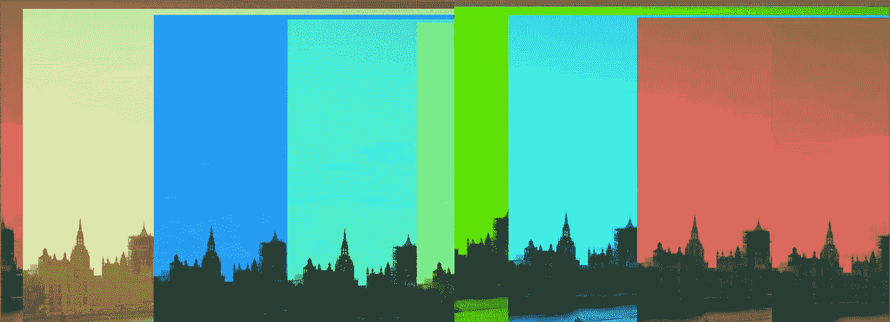
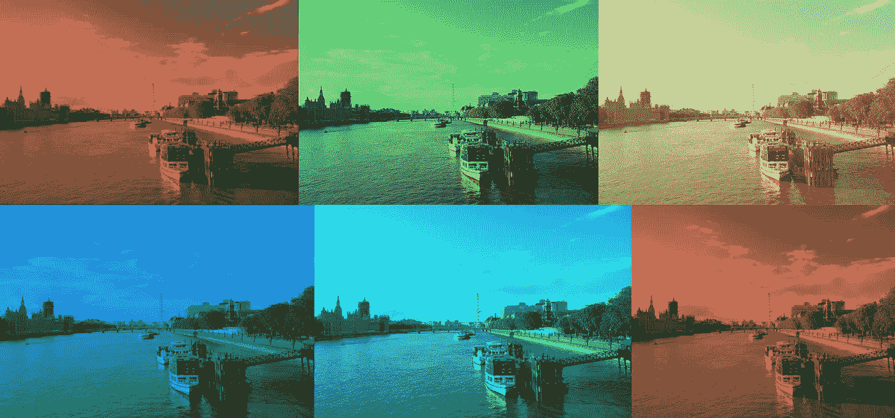

# 使用 Python 制作定制的照片滤镜，并在 Instagram 上获得关注

> 原文：<https://medium.datadriveninvestor.com/make-your-bespoke-photo-filters-with-python-and-get-traction-on-instagram-aa60e004dd00?source=collection_archive---------11----------------------->

## [内部 AI](https://towardsdatascience.com/programming/home)

## 不需要 Instagram 和其他服务提供的通用滤镜



Images based on the code discussed in this article. The original picture is taken by author

T 智能手机相机和 Instagram 等服务的最新发展给数码摄影带来了很大的吸引力。在胶卷相机的时代，我曾经非常挑剔，因为胶卷和冲洗照片是一件昂贵的事情。

今天在这篇文章中，我将讨论我们如何使用 Python 开发定制的照片过滤器。我们不需要使用 Instagram 和其他此类服务提供的通用过滤器。这些自定义过滤器将有助于使用相同的有限过滤器将您的照片从人群中分离出来。

上周晚上散步的时候，我用 iPhone 拍了下面这张照片。


Photo taken by author using own iPhone

我们的目标是生成随机过滤器，并用这些过滤器保存照片。

我们将使用 Python 库 ***Imageio*** 来读取原始照片并保存调整后的照片。

```
import imageio
from random import randrange#Importing the image
img = imageio.imread('01010057.JPG')
```

原始照片是使用 Imageio 库中的“imread”方法导入的。

在下面的代码中，生成了 20 个定制的滤镜，应用于原始照片并保存。

[](https://www.datadriveninvestor.com/2020/07/07/introduction-to-time-series-forecasting-of-stock-prices-with-python/) [## 用 Python |数据驱动投资者进行股票价格时间序列预测简介

### 在这个简单的教程中，我们将看看如何将时间序列模型应用于股票价格。更具体地说，一个…

www.datadriveninvestor.com](https://www.datadriveninvestor.com/2020/07/07/introduction-to-time-series-forecasting-of-stock-prices-with-python/) 

我们正在调整原始照片，用随机值改变它的值，并使用求和运算符进行编辑。

```
for i in range(20):
# Applying filter and saving the image 
    filtered_img = img +[randrange(25), randrange(15), randrange(25)]
    imageio.imwrite(str( i)+'.jpg', filtered_img)
```

我将鼓励你们所有人通过改变随机值范围，并使用乘法或除法运算进行编辑来探索和生成定制的过滤器。

> 示例:filtered_img = img *[randrange(5)，randrange(3)，randrange(7)]



Images based on the code discussed in this article. Original picture is taken by author

**访问专家视图—** [**订阅 DDI 英特尔**](https://datadriveninvestor.com/ddi-intel)