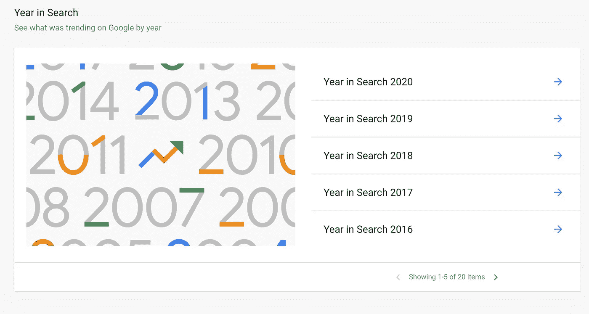

# 当其他人都休息的时候，尽你最大的努力

> 原文：<https://medium.datadriveninvestor.com/make-your-best-move-when-everyone-else-rests-18e177f1a590?source=collection_archive---------33----------------------->

## “淡季”是超越竞争对手的最佳时机

Photo by Jonathan Chng on Unsplash

众所周知，一年中不同的时间销售缓慢。这是许多专业人士放下油门去度假的时候。

这对聪明的[安](https://twitter.com/seosmarty)来说是轻而易举的事情，她抓住机会让她的竞争对手措手不及。

作为[互联网营销忍者](https://twitter.com/NinjasMarketing)的品牌营销经理，Smarty 已经做了 10 年的在线营销顾问，通过她的服务和课程提供高质量的数字营销咨询。她以深入的工具评论、创新的内容营销建议和可操作的数字营销想法而闻名。

Smarty 也知道如何创造自己的运气，准备在她的竞争对手睡觉时启动她的业务。当其他人都不景气的时候，她在市场营销方面做了一些最好的投资。

 [## 投资回报全在数字里

### 有创造力的头脑聚集在一起以获取利润

medium.com](https://medium.com/datadriveninvestor/return-on-investment-is-all-in-the-numbers-cb252bd3cf24) 

“当你的竞争对手不活跃时，你可以脱颖而出，赢得他们的客户，”Smarty 说。“这是一个引人注目的好时机。

“此外，当销售缓慢时，你可以利用团队的时间来创建营销资产，以便在旺季使用，”她说。“那就是*生产力*。”

作为一个搜索引擎优化专家，Smarty 津津乐道的机会，采取任何优势。

“除了为旺季做计划和准备，淡季也是应用 SEO 策略的好时机，”她说。“这肯定取决于利基市场，但在大多数情况下，有一些关键词和搜索趋势可以从中受益。

“例如，我想象一旦假期结束，人们会对节食、提高生产力和缓解压力更感兴趣，”Smarty 说。“你能使用这些搜索短语来匹配你的卖点吗？那就去做。”

# **利用趋势**

她建议关注谷歌趋势中的[“最近趋势”](https://trends.google.com/trends/trendingsearches/daily?geo=NG)，寻找适用于特定行业和企业的东西。

“此外，Google Trends 还提供了‘年度搜索’功能，可以让你找到感兴趣的搜索模式，”Smarty 说。

淡季也是计划的好时机。

“利用整个团队的时间来创建内容资产和更新旧内容，以便为旺季做好更好的准备，”Smarty 说。“也让更多的团队参与营销规划。让它们成为你营销策略的一部分，具有极大的启发性和激励性。”

 [## 强大的网络不仅仅是一个梦想

### 对话会带来更多的联系

medium.com](https://medium.com/datadriveninvestor/powerful-networks-are-more-than-a-dream-61c666b9a1fe) 

一年到头，人际关系网都是有用的和必不可少的。亲临现场是最理想的，但是利用任何你能利用的场所来制造和建立人情味。

“其他淡季参与策略可能在很大程度上取决于利基市场，但电子邮件营销在大多数情况下都会奏效，”Smarty 说。“假期过后，人们会看到更少的电子邮件，所以这是发送你的电子邮件的好机会。

“免费赠送一些东西，向你的客户介绍你的新产品，甚至简单地发送一封‘一年回顾’的电子邮件，”她说。“所有这些都将推动参与和转化机会。”

某些营销策略在年初特别有效。

“让你最忠实的顾客参与进来，产生更多的评论，”Smarty 说。“联系那些不止一次从你这里购买过产品的人，要求他们进行评估。

“延长你的季节:你知道东正教圣诞节是 1 月 7 日，而中国新年是在 2 月初吗？”她说。“让你的顾客知道，你拒绝停止庆祝来纪念所有碰巧稍后庆祝的顾客。”

# **全新诱惑**

一种“新的开始”的情绪已经成熟。

“新年是每个人都想开始新生活的时候，”Smarty 说。“通过将你的产品作为‘新尝试’来营销，给你的观众一些想法。”

“开始建立忠诚度，”她说。“随着新的一年的到来，你的客户可能会寻找新的努力和演出。他们可能想加入你的忠诚度或推荐计划。”

 [## 忠诚是一个简单的命题

### 质量将顾客与品牌捆绑在一起

medium.com](https://medium.com/datadriveninvestor/loyalty-is-a-simple-proposition-727dfe43fa9b) 

陈旧的存货亟待清理。

“想出一个巨大的销售，或者捆绑你的产品，以摆脱过多的库存，”Smarty 说。“如果你想出一个吸引人的名字，这也将是一个很好的公关机会。

“如果没有别的事，用这几个月做计划，”她说。"当这个季节再次达到顶峰时，准备好在竞争中领先一步."

不要轻易放弃一个看似陈词滥调的想法。

“虽然这可能是老生常谈，但它确实有效，”Smarty 说。“我自己也喜欢这种类型的内容。我看不出这会有什么不好的结果。

“不要每年都做同样的事情，但也不要因为陈词滥调就忽略它们，”她说。“现在尝试一切。明年要强调哪些措施奏效了。”

# **构建链接**

在淡季活跃会放大你使用的营销策略。你对他们的任何想法和努力都会比大家都涌入市场时收获更大的回报。

“利用淡季建立联系，”Smarty 说。“创建能够推动链接的匹配内容资产。比如“如何应对节后抑郁”和“节后最佳食物”。

“为了让它更有效，收集你自己的数据，”她说。“为您的客户创建一份调查，了解他们如何应对压力或重返工作岗位。这也会吸引你的观众。原始数据总会带来链接。”

 [## 分享无限的愿景

### 使用视频将有助于小企业脱颖而出

medium.com](https://medium.com/datadriveninvestor/share-a-vision-without-limits-b3fdeb7890df) 

如果你还没用过视频，淡季就是尝试的时候。视频获得更多关注。拉开帷幕，向消费者展示你的人在幕后做什么，建立情感依恋。

“节后季节是坐下来看看你的数据的最好时间，”Smarty 说。“如果你做过一段时间的广告，你现在应该有足够的数据来创造一些有意义的再营销机会。

她说:“根据你的老顾客之前购买的东西，为他们提供特别优惠。”“向那些以前接触过你的广告的人推销。这是你不寻求太多销售的时候，所以你可以玩目标选择和实验。”

可能最有效的方法是结合两种营销渠道的优点。

“建立一个客户群，通过脸书联系你的电子邮件用户，”Smarty 说。"这也会帮助你更好地了解你的听众."

无论哪个季节，增加的知识都可以在全年产生收益。

**关于作者**

吉姆·卡扎曼是[拉戈金融服务公司](http://largofinancialservices.com/)的经理，曾在空军和联邦政府的公共事务部门工作。你可以在[推特](https://twitter.com/JKatzaman)、[脸书](https://www.facebook.com/jim.katzaman)和 [LinkedIn](https://www.linkedin.com/in/jim-katzaman-33641b21/) 上和他联系。