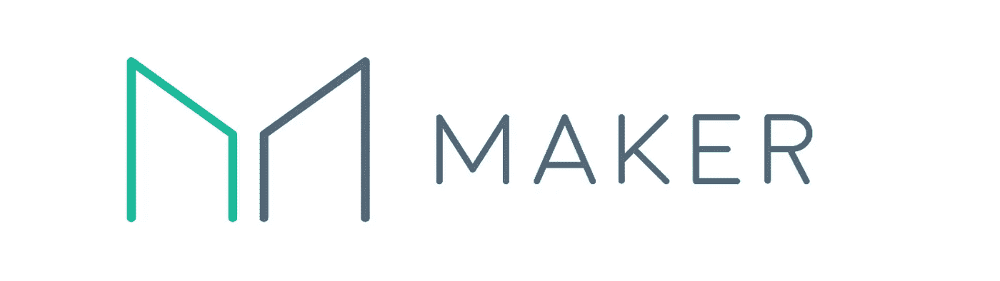
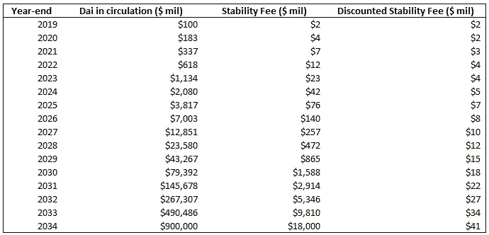
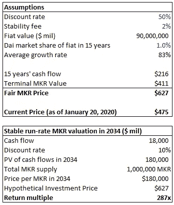

# 从根本上重视创客道

> 原文：<https://medium.datadriveninvestor.com/maker-dao-investment-and-valuation-3f34a236b723?source=collection_archive---------3----------------------->

## 风险资本(加密令牌)

所表达的观点仅代表我个人，并不代表我的雇主的观点或意见。

我最初在 2020 年 1 月写了以下文章，目的是让人们了解我对创客道及其估值的看法。我现在把它和对一年来发生的事情的观察一起贴出来。

# 稳定的硬币

稳定币是一种加密货币，其价值与目标价格挂钩，比如美元。最终目标是让稳定币成长为一种独立的货币，并从法定货币中夺取可观的市场份额，因为它能够在 defi 生态系统中使用。

# **估价**

我们可以估计储存在菲亚特的财富总量约为[【90 万亿】](https://docs.google.com/spreadsheets/d/1JhQfslunlCFfDeWmym1Qnz8IqkriGcANtisB2hpxYyw/edit#gid=1452923335) *(由 Multicoin Capital 提供)*。

我们可以粗略估计，15 年后戴稳定币将占这一法定货币的 1%(从今天流通中的 1 亿美元戴的复合增长率为 83%)。

考虑投资风险的 50%贴现率。

截至 2019 年底，约有[亿](https://daistats.com/)美元的戴在流通。

我们可以对 MKR 代币产生的费用进行贴现现金流分析*。稳定费从 0.25%到 20%不等。截至 2020 年 10 月，Eth-Dai 稳定费为 2.0%。我们假设 2%的稳定费为长期平均值。

** MKR 价值累积的实际机制是通过代币燃烧，而不是股息*

**这些假设将得出每 MKR 627 美元的价值。**同样，假设贴现率为 50%,以说明所涉及的风险。如果制造商成功获得菲亚特 1%的市场份额，并且在此过程中没有出现重大问题(如黑天鹅事件导致的 MKR 代币大规模膨胀)，那么假设投资价格为 627 美元时的投资回报率将是 287 倍，这是对一项非常成功的风险投资的预期。**当然，最终结果会因所用的假设而异。**

对于那些喜欢玩假设游戏的人，这里有更多信息:

 [## MKR 估价

docs.google.com](https://docs.google.com/spreadsheets/d/1xBqbBVoPPbe5pGcBwHdQF-1Dc62w8ArrfkyW1tnvsWc/edit?usp=sharing) 

感谢乔在 Messari 上用 DCF 模型对进行估值，这让我有了从这个角度看问题的想法。然而，我使用一些不同的假设。我还想清楚地指出高风险资产的“公允价值”在回报中的体现(即鉴于与风险相关的极高贴现率，627 美元是公允价值*。如果资产如预期的那样成功，回报将相应地很高)。对于那些对数字如何工作感到好奇的人来说，上面带有单元格链接和公式的谷歌表格会有所帮助。*

**回首往事**

2020 年 10 月的今天，Dai 的总发行量为 9 亿美元，远远高于我们今年年初预计的 1.8 亿美元。它有助于多抵押品 Dai 的释放，允许 Dai 从更多资产中产生，如英美烟草和 USDC。这取代了仅由以太坊支持的单一抵押品 Dai(现在称为 Sai)。

虽然继续波动，今天的价格为 545 美元，但人们可以预计的价格将反映基于基本面和戴在加密领域日益增长的作用的公允价值。也就是说，有许多因素影响着 MKR，包括以太坊的表现，因此投资者应该预计 MKR 是一个高风险的投资。

# 附录

## 秘密抵押的

加密抵押债券通过其他加密资产的支持来维持其挂钩。刀客是这方面最成功的案例。

道发行了一种叫戴的稳定货币，与 1 美元挂钩。当人们将以太坊这样的抵押品存入创客道的 CDP(债务抵押头寸)智能合约时，就会出现这种情况。抵押率为 300%时，存入 300 美元的 ETH 可产生 100 Dai。当担保品价值下跌并达到 150%的清算比率时，担保品被清算。

CDP 创建者(那些为戴存放抵押品的人)每年支付一笔稳定费，目前以太坊的稳定费为 2%，这笔费用支付给令牌的持有者。你可以把这个想象成发放贷款的利率。稳定费由 MKR 持有者投票决定，对维持联系汇率至关重要。简单地说，如果对 Dai 的高需求导致价格高于 1 美元，稳定费可以降低，以激励更多的 CDP 并增加 Dai 的供应，从而给价格带来下行压力。当 Dai 跌破 1 美元时，可以增加稳定费，以激励 CDP 持有者赎回抵押品，并烧掉他们的 Dai，从而对价格施加上行压力。

**稳定费不是作为现金红利发放的，而是用于燃烧 MKR 代币，这有助于提高每个剩余 MKR 代币的估值，很像股票回购。通过这种方式，更多地采用 Dai 将导致 MKR 代币产生更大的价值。**

## 黑天鹅事件

如果 ETH 的价格迅速下跌，CDP 变得抵押不足，更多的 MKR 代币被创造和出售以弥补差额。这稀释了 MKR 的价值。这种类型的[黑天鹅事件](https://www.coindesk.com/makerdao-debts-grow-as-defi-leader-moves-to-stabilize-protocol)发生在 2020 年初。

这是 Maker DAO 系统如何工作的简单机制。实际上，这是一个非常复杂的系统，有一个由市场参与者组成的网络，这些参与者被称为管理做市商系统的管理人。戴的日常用户不必理解这一点就可以使用稳定币——他们可以在交易所购买戴稳定币。

## 在你走之前—

你知道你可以放弃 50 吗👏通过按下👏按钮？如果你真的喜欢这篇文章，试试看。它让我知道我应该多写！

要想了解像这样的新帖子，请在 Medium 上关注我: [Daniel Sangyoon Kim](https://medium.com/u/bf7541767d25?source=post_page-----3f34a236b723--------------------------------) 和 [Twitter](https://twitter.com/dksangyoon?lang=en)