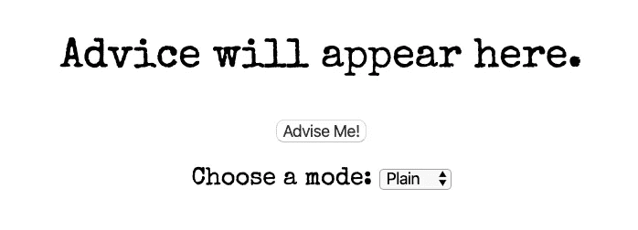

# 用 JS 制作一个建议按钮

> 原文：<https://medium.datadriveninvestor.com/making-an-advice-button-with-js-5a1ed3b500fa?source=collection_archive---------20----------------------->

# 我们将构建什么:

在这个项目中，我们将制作这个超级酷、超级有用的建议页面(点击图片查看 [Codepen](https://codepen.io/LKRR/pen/WNvMXyy) ):

[](https://codepen.io/LKRR/pen/WNvMXyy)

***免责声明* :** *这是一篇初学 JS 的文章，并不是为了给出重要的生活建议。这只是为了展示 JS 的一点能力。所以不要以此为基础做人生决定。*

现在，这是一种方式，让我们进入它…

# 第一步:设置。

这个项目需要一个带有 CSS 样式表的 HTML 文件和一个单独的 JS 文件。如果你不想手工编码，你可以使用 HTML Shell 或者从我的 Github repo 下载一个模板。

# 第二步:HMTL

我们这个应用程序本身的 HTML 非常简单。我们需要两样东西:

*   一个带有一些最终会显示建议的填充文本的`paragraph`。
*   一个启动`giveAdvice()`函数的按钮——我们稍后将构建这个函数。

这些应该被包在一个`<div>`中，以帮助以后的造型。我们的 HTML 看起来像这样:

```
<body>
  <div class="app">
   <p id="advice">Advice will appear here.</p>
   <button onclick="displayAdvice()">Advise Me!</button>
  </div>
  <script src="advice.js"></script>
 </body>
```

稍后我们将关注下拉菜单来选择我们的风格模式。

# 第三步:变量

这个项目中的数据存储在两个变量中。首先，我们需要一个包含我们建议的对象。你可以尽可能多的采纳建议，但是我推荐至少 10 条(毕竟，没有人喜欢重复的建议。)

**注意:**由于 JS 对象是零索引的，所以将第一条建议编号为 0 是有意义的，而不是 1。这也将有助于以后构建我们的函数。

```
const advice = {
 0: "Follow your heart",
 1: "Advice is what you ask for when you already know the answer but wish you didn't.",
 2: "You know the answer to that.",
 3: "Don't repeat past mistakes.",
 4: "The only true mistake is a lesson not learned.",
 5: "If you're hiding, don't light a fire.",
 6: "Keep an open mind.",
 7: "Seize the day.",
 8: "Don't pray for an easy life. Pray for the strength to endure a difficult one.",
 9: "A stitch in time saves nine."
};
```

接下来，我们需要一个名为`num`的变量，在这个变量中，我们使用`math.floor().`生成一个随机数，以确保所有的建议都被使用，将`math.floor()`的结果乘以建议的数量。`math.floor()`可以产生 0，因此第一条建议需要编号为 0 而不是 1。

`let num = Math.floor(Math.random() * 10);`

# 步骤 4:交换 HTML

接下来，我们希望我们的段落显示与我们生成的随机数相对应的建议。我们用一行简单的代码做到了这一点:

`document.getElementById(“advice”).innerHTML = advice[num];`

# 第五步:功能

这一切都很好，但迄今为止，我们的建议只在页面负载上有所改变。为了在点击按钮时获得新的建议，我们需要创建一个函数(`displayAdvice()`)，然后在按钮的`onclick`上运行它。

我们通过移动随机数变量(`num`)和 JS 来实现这一点，JS 将我们的 HTML 换成一个函数声明:

```
**function displayAdvice() {**
 let num = Math.floor(Math.random() * 10); document.getElementById("advice").innerHTML = advice[num];
**}**
```

按钮的 HMTL 应该是这样的:

```
<button onclick="displayAdvice()">Advise Me!</button>
```

# 造型——概述:

现在是有趣的部分，或者如果你讨厌 CSS，是糟糕的部分。建议有多种形式；一个普通的音符，写在星星上，或者出现在云里。为了显示这些不同的建议风格，我们将使用单独的 CSS 类，或“模式”。

在添加我们的模式之前，我们将添加一些在所有情况下都适用于应用程序的通用 CSS 规则。

```
.app {
 height: 200px;
 width: 900px;
 margin: 0 auto;
 text-align: center;
}p {
 font-size: 50px;
}button {
 font-size: 20px;
 border-radius: 10px;
 cursor: pointer;
}label {
 font-size: 30px;
}.mode-select {
 display: block;
 padding-top: 30px;
}select {
 font-size: 20px;
}
```

# 样式—模式

现在来玩玩模式。我已经尝试了三种模式(普通、云和星星)，但是你可以随意添加。

我们将通过让用户使用`onchange`从我们的应用程序的下拉列表中选择来切换模式。我们将它添加到 HTML 中:

```
<div class="mode-select">
  <label for="modes">Choose a mode: </label>
  <select id="modes" **onchange="showMode()"**>
     <option value="plain">Plain</option>
     <option value="clouds">Clouds</option>
     <option value="stars">Stars</option>
  </select>
 </div>
```

我们的模式的 CSS 如下(注意字体是从 Google fonts 作为 CSS 文件的顶部导入的):

```
.clouds {
 background-color: lightcyan;
 color: white;
 text-shadow: -1px 0 black, 0 1px black, 1px 0 black, 0 -1px black;
 font-family: "Fredoka One", Helvetica, sans-serif;
}.stars {
 background-color: black;
 color: lightgrey;
 font-family: "Monoton", Helvetica, sans-serif;
}
```

你可能已经注意到`plain`模式没有单独的类。这是因为`plain`是页面加载上显示的默认值。要显示它，我们只需将其添加到`body`标签上的样式中:

```
body {
 background-color: white;
 color: black;
 font-family: "Special Elite";
}
```

现在，在我们的 JS 中，我们构建了一个函数`showMode()`，当用户选择它时，它显示相关的模式。**注意:**每个模式还必须移除任何先前的模式，以确保模式正确显示。`else`子句删除所有先前使用的模式，并将样式设置回 pageload 上显示的`plain`模式。

```
function showMode() {
 let mode = document.getElementById("modes").value;if (mode == "clouds") {
  let element = document.body;
  element.classList.remove("plain");
  element.classList.remove("stars");
  element.classList.add("clouds");
 } else if (mode == "stars") {
  let element = document.body;
  element.classList.remove("plain");
  element.classList.remove("clouds");
  element.classList.add("stars");
 } else {
  let element = document.body;
  element.classList.remove("clouds");
  element.classList.remove("stars");
 }
}
```

现在我们已经完成了，我们的建议按钮也完成了！随便你问它什么！

# 挑战挑战:

如果你想测试你的编码技能，这里有一些更棘手的挑战。代码世界是你的牡蛎！

*   想办法确保同一条建议不会连续重复两次。
*   再添加几个模式样式
*   生成一个“随机”模式，随机显示现有模式之一。

编码快乐！:)