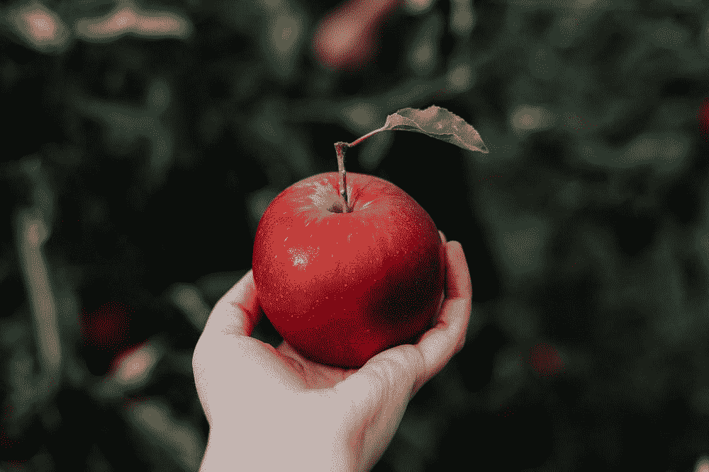
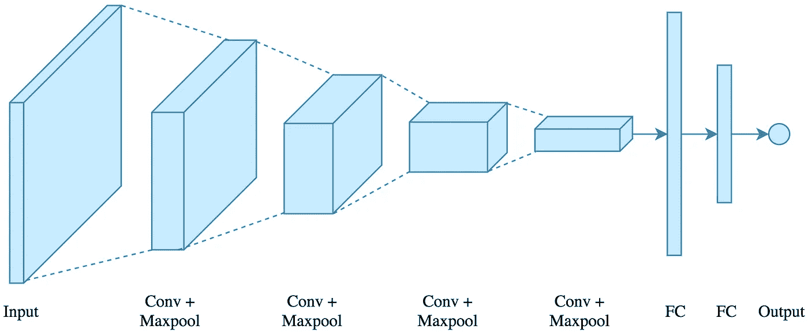
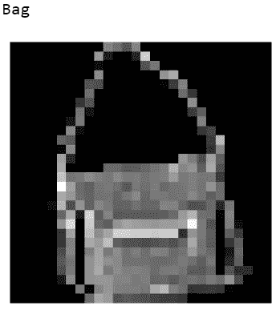
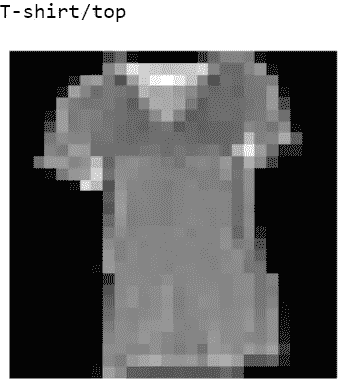
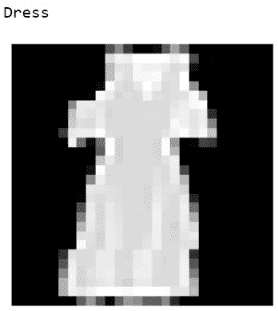
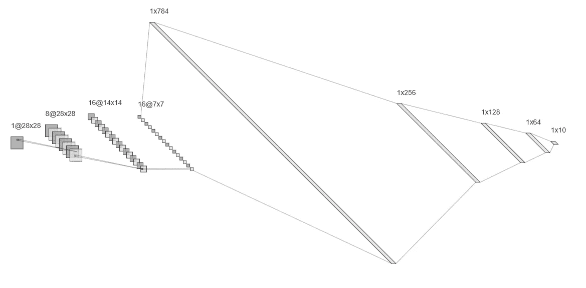
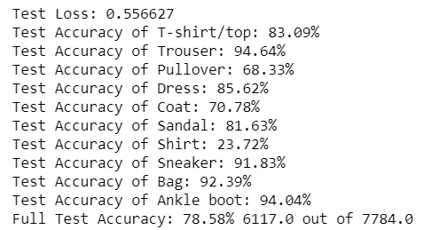
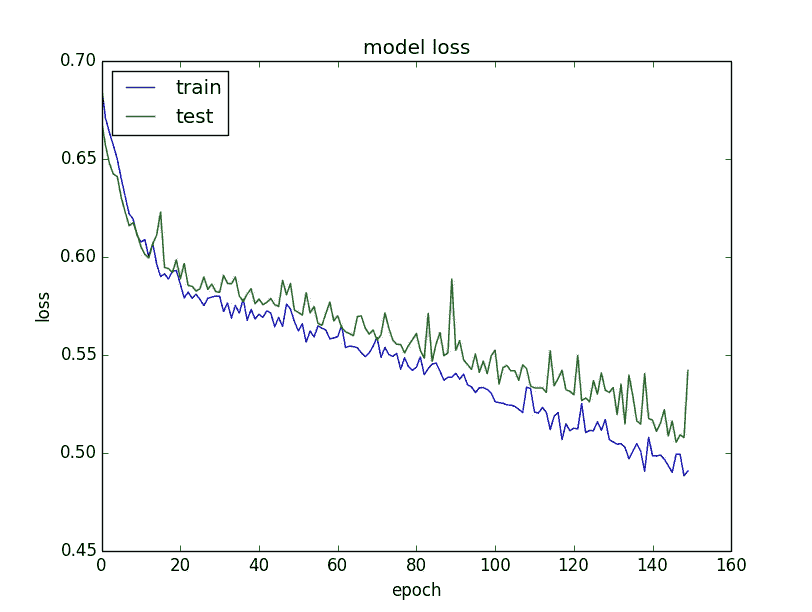

# 用 CNN 和 PyTorch 制作图像分类器

> 原文：<https://medium.datadriveninvestor.com/making-an-image-classifier-using-cnns-and-pytorch-17518905c85b?source=collection_archive---------0----------------------->

> 对于如何区分成千上万种不同的物体，我们通常不会多想。无论是苹果还是人，我们对大多数物体的分类都不会超过几秒钟。



While we can easily tell that these images are of an apple and a person, computers have a much harder time with classification tasks.

现在，如果我们能让计算机获得*类似的性能，那些甚至不能“看”的机器会怎么样？就图像分类而言，**卷积神经网络(CNN)** 是一种获得高精度结果的好方法。它们也很容易实现，我可以用 **PyTorch** 创建一个 CNN 来分类不同类型的服装。我使用了[时尚-MNIST 数据集](https://www.kaggle.com/zalando-research/fashionmnist)，它包含了 **70，000 张十种不同类型服装的图片**，以衬衫、连衣裙和外套为例。每张图像都是 *28×28 像素*。*

## 什么是 CNN，它是如何工作的？



关于结构，CNN 由输入、卷积层、全连接层和输出组成。**卷积**是将**输入函数和过滤函数相乘**以形成输出函数的过程，这是 CNN 的一个关键方面。对于 CNN 如何工作的更详细的概述，请随意通读这篇文章[](https://medium.com/@vedaant.varshney/cnns-the-key-to-computer-vision-29c6fe1c6fdc)****以获得更完整的描述。****

****[](https://www.datadriveninvestor.com/2019/01/23/which-is-more-promising-data-science-or-software-engineering/) [## 数据科学和软件工程哪个更有前途？数据驱动的投资者

### 大约一个月前，当我坐在咖啡馆里为一个客户开发网站时，我发现了这个女人…

www.datadriveninvestor.com](https://www.datadriveninvestor.com/2019/01/23/which-is-more-promising-data-science-or-software-engineering/) 

## 导入模块

从项目开始的一个好地方是导入所有需要的模块。提醒一下，我用 PyTorch 创建了这个网络。

```
import **torch**
import **numpy** as **np**
import **torchvision.transforms** as **transforms**
from **torchvision** import **datasets**
from **torch.utils.data.sampler** import **SubsetRandomSampler** import **matplotlib.pyplot** as **plt**
import **torch.nn** as **nn**
import **torch.nn.functional** as **F**
import **torch.optim** as **optim**
%matplotlib inline
```

torchvision 的数据集库允许我们直接下载和导入时尚 MNIST，使过程变得更简单。

## 载入数据

制作图像分类器的第一步总是加载数据并设置训练、验证和测试集。我决定使用 **20%的训练数据进行验证**，并应用一些标准数据扩充，这可以减少训练时的过度拟合。

```
num_workers = 0
batch_size = 36
valid_size = 0.2**# Data augmentation for train data + conversion to tensor**
train_transforms = transforms.Compose([
    transforms.RandomHorizontalFlip(),
    transforms.RandomRotation(12),
    transforms.ToTensor(),
    transforms.Normalize((0.5,), (0.5,))

])**# Data augmentation for test data + conversion to tensor**
test_transforms= transforms.Compose([
    transforms.ToTensor(),
    transforms.Normalize((0.5,),(0.5,))
])**# Picking Fashion-MNIST dataset**
train_data = datasets.FashionMNIST('Dataset', train=True, download=True, transform=train_transforms)
test_data = datasets.FashionMNIST('Dataset', train=False, download=True, transform=test_transforms)
```

同样重要的是，要随机分割验证和训练数据，并创建数据加载器，我们可以通过它进行迭代训练。

```
**# Finding indices for validation set**
num_train = len(train_data)
indices = list(range(num_train))
**#Randomize indices**
np.random.shuffle(indices)split = int(np.floor(num_train*valid_size))
train_index, test_index = indices[split:], indices[:split]**# Making samplers for training and validation batches**
train_sampler = SubsetRandomSampler(train_index)
valid_sampler = SubsetRandomSampler(test_index)**# Creating data loaders**
train_loader = torch.utils.data.DataLoader(train_data, batch_size=batch_size, sampler=train_sampler, num_workers=num_workers)
valid_loader = torch.utils.data.DataLoader(train_data, batch_size=batch_size, sampler=valid_sampler, num_workers=num_workers)
test_loader = torch.utils.data.DataLoader(test_data, batch_size=batch_size, num_workers=num_workers)
```

## 可视化数据

既然数据加载器已经设置好了，我们应该能够查看我们的图像，看看到目前为止是否一切正常。(代码在 GitHub repo 中)



即使图像只有 *28×28 像素*和灰度*、*，我们仍然能够区分它们。卷积神经网络可以**处理更大的 RGB 图像**；尽管训练时间同样会增加。

## 定义 CNN 的架构

对于我的网络，我采用了一个输入图像，并经历了以下步骤:

1.  我通过一个*深度为 8* 的**卷积层**和一个 **maxpooling 层**将数组的长度和宽度缩小了 2 倍。
2.  接下来，我把第一层的输出通过另一个 conv。深度为 16 的层，以及 maxpooling 层。
3.  我**把数组**“展平”成一维数组，放入四个全连通层，最后得到一个输出。



Visual representation of my CNN

```
class Net(nn.Module):
    def __init__(self):
        super(Net, self).__init__()
        **# convolutional layers**
        self.conv1 = nn.Conv2d(1, 8, 3, padding=1)
        self.conv2 = nn.Conv2d(8, 16, 3, padding =1)
        **# linear layers**
        self.fc1 = nn.Linear(784, 256)
        self.fc2 = nn.Linear(256, 128)
        self.fc3 = nn.Linear(128, 64)
        self.fc4 = nn.Linear(64, 10) 
       ** # dropout**
        self.dropout = nn.Dropout(p=0.2)
    **    # max pooling**
        self.pool = nn.MaxPool2d(2, 2)

    def forward(self, x):
       ** # convolutional layers with ReLU and pooling**
        x = self.pool(F.relu(self.conv1(x)))
        x = self.pool(F.relu(self.conv2(x)))
       ** # flattening the image**
        x = x.view(-1, 7*7*16)
      **  # linear layers**
        x = self.dropout(F.relu(self.fc1(x)))
        x = self.dropout(F.relu(self.fc2(x)))
        x = self.dropout(F.relu(self.fc3(x)))
        x = self.fc4(x)
        return x

model = Net()
print(model)
model.cuda()
```

## 定义损失函数和优化器

对于这个网络，我决定使用一个**交叉熵损失函数**和随机**梯度下降**作为优化器。利用这些，我们可以提高基于分类误差的模型的性能，达到更高的精度。

```
**# loss function (cross entropy loss)**
criterion = nn.CrossEntropyLoss()
**# optimizer**
optimizer = optim.SGD(model.parameters(), lr = 0.001)
```

## 训练模型

既然模型的架构已经设置好了，我们可以创建一个训练循环。虽然我只为 **25 个时期**训练了模型，但验证损失*继续减少*，我可能可以训练更长时间。

顺便提一下，模型是使用支持 CUDA 的 GPU 进行训练的，这导致*训练时间大约为****20–30 分钟*** 。训练循环代码可以在[这里](https://github.com/Deep-Thoughts42/ImageClassifierCNN/blob/master/Image%20Classifier.ipynb)找到。最终得到的验证损失约为 0。 *57，比最初的 2.3* 有所减少。

## 模型精度

完成训练循环后，最后一步是**使用测试数据集检查模型的准确性**，并查看其实际表现如何！



在测试模型时，我们可以注意到**更独特的服装** **项目比具有更一般特征的项目具有更高的准确率**。例如，裤子的准确率为 94.64%*，而衬衫的正确识别率仅为 23.72%**。衬衫很可能被误认为是类似的物品，如外套和套头衫，因为在如此小的图像尺寸下特征会是相似的。***

## *潜在的模型改进*

*我的解决方案并不完美，主要是我的实验，我的目标是看看什么可行，什么不可行。*

**

*In general, training a well-designed model should result in decreased loss and increased test accuracy with an increased number of epochs.*

***以下是一些提高性能的潜在方法:***

*   *训练模型的时间越长，测试的准确性就越高。*
*   *在数据扩充阶段，规范化可能会影响潜在的特征检测，因此修改这些值可能会导致性能变化。*
*   *我使用的架构可能将图像合并了两次，简化了图像，减少了特征的细节，使检测图像之间的模式变得更加困难。*
*   *为了提高效率，我可能不需要四个完全连接的层，两个或三个层可能会产生类似的值***** 

*****尽管时尚-MNIST 数据集包含只有一个颜色通道的小图像，但不要认为这是对 CNN 的轻视。**它们可以用来对高清和 RGB 图像进行分类，并达到 90 多的精度水平。*******

*****图像分类的未来似乎倾向于卷积神经网络，它们是一种很好的工具，可能会在不久的将来得到很大的发展！*****

## *****我在构建项目时获得/使用的酷资源*****

*   *****这个项目是在 [Udacity 深度学习课程](https://classroom.udacity.com/courses/ud188)的指导下完成的，这是一个学习如何编程和训练神经网络的优秀资源*****
*   *****[改进 CNN 模型的技巧](https://www.topbots.com/14-design-patterns-improve-convolutional-neural-network-cnn-architecture/)*****
*   *****[用于可视化神经网络的工具](http://alexlenail.me/NN-SVG/index.html)*****

*****谢谢你看我的文章！如果您有任何反馈、建议、评论或更正，我很乐意收到您的来信。我还提供了项目代码，以防您想更好地了解事情是如何工作的。*****

*******项目 GitHub:** [CNN 图片分类器](https://github.com/Deep-Thoughts42/ImageClassifierCNN/blob/master/Image%20Classifier.ipynb) **邮箱:**vedaant.varshney@gmail.com **LinkedIn:**[韦达安·瓦什尼](http://www.linkedin.com/in/vedaant-varshney)
**个人网站:**[vedaantv.com](https://vedaantv.com/)*****