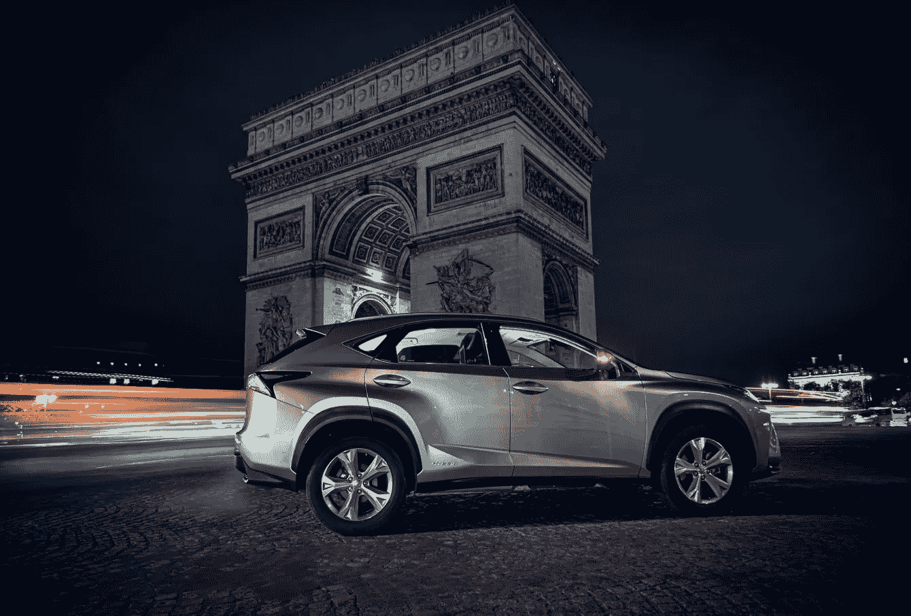
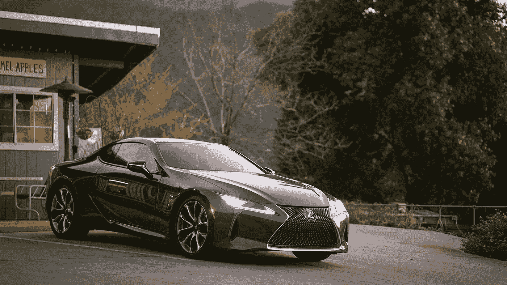
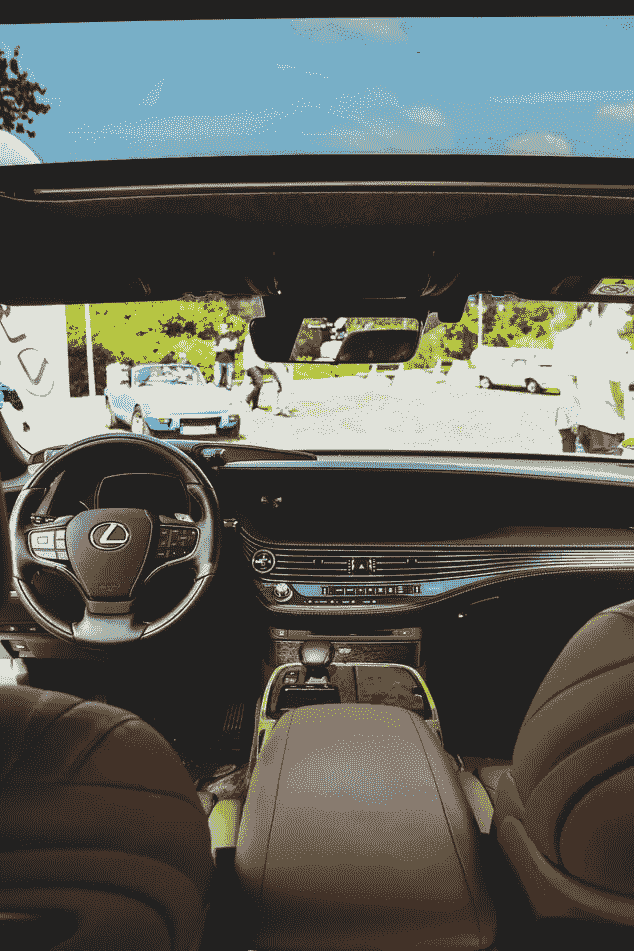

# 让客户服务成为颠覆者

> 原文：<https://medium.datadriveninvestor.com/making-customer-service-a-disruptor-21134b8e2e8f?source=collection_archive---------14----------------------->

客户服务是局外人，而不是前哨

**Fabe Collage/Unsplash**

在我们这个创新、变革和颠覆的时代，很难想象客户服务会处于最前沿，更不用说是企业工具和变革推动者了。但这正是雷克萨斯在打入豪华汽车市场时所包含的内容。

大男孩们嗤之以鼻，哈哈大笑。无法相信一辆配有铃铛和哨子的丰田汽车能够构成威胁。他们所看到的是愚蠢，等待丰田，即雷克萨斯在发射台内爆。

谁能想到雷克萨斯会在豪华汽车市场上取得现在的成就？奔驰、宝马和捷豹拥有这个市场和奢侈品消费者。然而，品牌认知度很低的雷克萨斯推动了客户服务。

他们制造优秀的车辆，但在汽车工业中却默默无闻。然而，为了生存和发展，他们需要拥有与奢华、品质和性能同义的品牌。精英中的精英。

雷克萨斯不仅一路攀升，确立了自己的地位。他们将客户服务提升到了另一个高度。通过这样做，他们认识到了需求并创造了新的标准，从而超越了竞争对手。

 [## 2020 年最佳短期投资选择精选资源|数据驱动型投资者

### 投资是增加你净财富的一个好方法。如果你通过遵循一个严格的…

www.datadriveninvestor.com](https://www.datadriveninvestor.com/2020/03/28/handpicked-resources-for-the-best-short-term-investment-options-of-2020/) 

随着雷克萨斯销量、形象和品牌认知度的增长，梅赛德斯、宝马和捷豹开始重组、解雇和雇佣高层管理人员和部门大辉格党人。

雷克萨斯颠覆了豪华汽车市场，创造了一个新的、改进的、更高的标准。从他们的丰田部门，他们为客户服务的价值而自豪。雷克萨斯认为这是一种内在的东西。作为文化而不是额外津贴。

前面提到的奢侈品制造商认为他们的顾客是理所当然的。毫无疑问，汽车卖了自己，但最终，他们知道这是不够的。

**Steady Hand Co./Unsplash**

雷克萨斯通过附加服务和售后跟进建立了自己的客户群。奢侈品顾客中只有一小部分是有钱有势的。其余的不是。Lexus 雷克萨斯明白，这位客户享受额外津贴、折扣和额外里程服务，这相当于省钱。

雷克萨斯称之为服务，而事实上，节省和折扣是核心。他们用不同的术语来表达这一点。免费的，而不是免费的。感谢您的惠顾而非折扣。雷克萨斯没有让顾客感到廉价，而是让他们感到被重视。

当其他汽车制造商通过调整、换油和配件服务积累利润时，雷克萨斯采取了另一种方式。毫无疑问，轮胎、电池和刹车工作是一个巨大的赚钱机器。

雷克萨斯看到的是一个吸收这些成本以获得新买家的机会。他们不会免费提供这些产品替代品和服务。通过降低利润率，他们吸引了更多的顾客。

如今，雷克萨斯在豪华汽车市场上的地位不亚于大多数汽车。通过重视顾客，他们开辟了销售汽车的新角度。他们通过尊重顾客来赢得尊重。

想象一下雷克萨斯进行的艰苦斗争。失败会使他们沉没。时至今日，这一遗产将会在世界各地的商学院和研究生项目中被教授。

然而，他们坚持自己的愿景和承诺，尽管丰田的名字。丰田是紧凑型和中型汽车领域的一个伟大品牌，而不是高性能和豪华汽车。

丰田与基本型、经济型和可靠性类似并相关联。标价和油耗是非奢侈品市场的强大卖点。

当然，雷克萨斯淡化了丰田的名字和从属关系。他们从丰田吸取的东西是基本要素，如工程和客户服务。

仅仅几年时间，雷克萨斯就蚕食了大量的市场份额。随着他们不断取得进展，他们赢得了尊重。

雷克萨斯不仅转化了奔驰、宝马和捷豹的豪华客户，还切入了林肯和凯迪拉克领域。与此同时，每年获得新客户的比率远远高于流失的客户。

**Viktor Theo/Unsplash**

奢侈品消费者既不是产品先锋，也不以四处跳跃而闻名。从高五位数到低六位数的购买量，奢侈品消费者不会排队自愿换品牌。远非如此。

奢侈品顾客被认为是客户。他们很忠诚，而且众所周知会投资一个品牌。他们享受的红利体现在这些名字所带来的声望和身份上。奢侈品消费者是最难转变、最具挑战性的消费者。

从汽车的角度来看，所有的东西都是平等和可比的。与上面提到的豪华品牌相比，雷克萨斯车型在质量、价值、价格和性能上并没有更好或更差。

通过卓越的客户服务，雷克萨斯打造了一条道路和身份。他们创造了一个新的类别和标准，供其他人效仿或放弃。雷克萨斯迫使竞争对手提高自己的客户服务标准，否则就会进一步落后。

通过这样做，他们不仅收集了新客户，还转化并留住了他们。如果没有这项客户服务计划，Lexus 雷克萨斯将永远不会取得成功和持续增长。