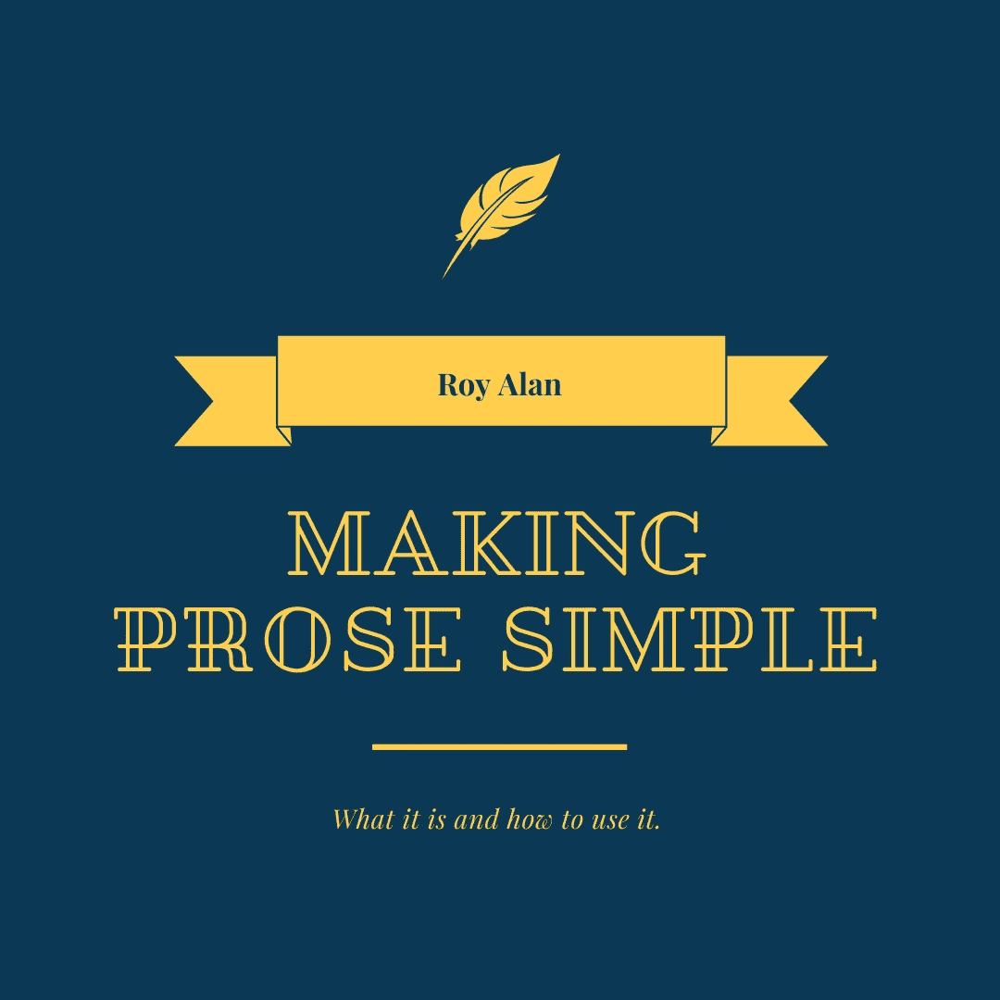

# 让散文变得简单——它是什么以及如何使用它

> 原文：<https://medium.datadriveninvestor.com/making-prose-simple-what-it-is-and-how-to-use-it-3058de376f9c?source=collection_archive---------2----------------------->

## 案例研究和分析，以改善你的写作风格。

Image Courtesy of Author via [Canva](http://canva.com/)

散文传统上不被视为写作的基础，因为它经常与浮夸的散文、非常雄辩和富有诗意的句子联系在一起。但是散文非常简单，它是我们用来讲故事的声音的产物。出于这个原因，我认为它是一种工具，你可以在职业生涯的任何阶段工作，因为你的散文是不断发展的。要了解如何做到这一点，我们必须了解什么是散文。

 [## 10 大人工智能应用革新金融服务|数据驱动的投资者

### 最近，银行和金融部门的日常运作发生了变革。领先的银行，如…

www.datadriveninvestor.com](https://www.datadriveninvestor.com/2019/07/08/10-artificial-intelligence-applications-revolutionizing-financial-services/) 

# **什么是散文？**

散文的定义是:

> …一种没有韵律结构的语言形式。它运用自然流畅的语言和普通的语法结构，而不是像传统诗歌那样的韵律结构。

从本质上说，散文是任何非诗歌的文学作品。它存在于小说、散文、杂志、学术期刊和任何其他书面作品中。它可以简单，也可以复杂；它可能很糟糕，也可能很棒。

在今天的文章中，我们将把散文分解成最简单的形式，分析经典文学中使用的散文的案例研究，以及如何把它搞砸。

# **打破散文:表面。**

从表面上看，散文简单得令人难以置信。散文有四类:

*   非虚构散文；
*   虚构的散文；
*   英雄散文；
*   散文诗。

## **非虚构散文**

非虚构散文是任何基于事实的文学作品。非小说类由非小说散文组成。例子包括散文、新闻文章(不是最近的)、传记、历史教科书等。

## **虚构散文**

与非虚构散文相反，虚构散文是任何由理论或想象的事实和事件组成的文学作品。虚构散文是用来构建幻想小说，中篇小说，中篇小说，或任何其他小说。

## **英雄散文**

英雄散文的一个常见定义是任何采用口头传统中的公式化表达方式写下来或背诵出来的文学作品。传奇、故事、史诗——如荷马的《奥德赛》——或戏剧，如莎士比亚的《仲夏夜之梦》。

## **散文诗**

表现出诗歌特征的文学作品，如增强的情感效果和意象，但不像传统诗歌那样用韵文写成。在这篇文章的后面，我们将讨论“紫色散文”，通常是散文诗的一个属性。

# 更多地分解散文:紫色散文与米色散文。

如果散文是除了韵文诗歌以外的任何书面表达，我们必须看不同类型的散文。放大我们的句子，散文可以在紫色到米色的范围内使用，紫色是过于冗长，米色是非常简单。

## **紫色散文**

紫色散文是一种华丽的、奇异的、通常毫无意义的散文形式。散文可以是有趣的、描述性的和诗意的，但是紫色散文有内在的缺陷。如果散文被称为“紫色”，那么形容词、副词和从句是压倒性的和多余的。

紫色散文的一个例子可以在斯蒂芬妮·梅尔的*暮光之城*传奇中找到。整个传奇经历经受住了来自各方评论家对其拙劣文笔的贬低。迈耶斯使用极其简单的句法和语法，即我们句子结构的组成部分，但偶尔也会加入同义词。以我写的一段话为例，许多批评家指责迈耶斯:

*”她走进黑暗的房间。她的头因跌倒而受损，受到重击。她在镜子里看到了他的倒影。他的脸很迷人。*

句子简短，如果使用得当，这不成问题，最后我用了“撩人”这个词在周围所有词语的上下文中，这个词似乎非常不合适，分散了读者对故事和场景的注意力。像这样的文学作品中的例子被称为“紫色斑块”

太多的紫色补丁组成了紫色的散文，读者很容易识别它们。

简单，或者复杂，本质上都是不好的。如果使用得当，它们可以以自己的方式变得强大。我会用一种更恰当的方式来使用“挑逗”这个词。

*“他的爱是痛苦的，所以我想我是个虐待狂。我一定是。他的牙齿是我嘴唇上的剃刀；他的手指像暴露的电线一样刺激着我的皮肤；他的呼吸，可怕而燃烧，烙印在我的脖子上。称之为痛苦是一种轻描淡写的说法，然而没有一个女人敢说他好色——他太撩人了。”*

我没有这样写我自己。我也可以是一个有腿的三角形。但是我在性的背景下使用挑逗，用不同的速度和描述性的比喻。那里没有任何获奖的作品，但远非紫色补丁。它是有背景的，有感觉的，有效的——即使不是很好。

## **米黄色散文**

光谱的另一端是简单的东西:米色散文。米色是一种令人厌烦的颜色，这种类型的散文也有类似的风险。米色散文短小精悍，非常简单。它传达了重点。它推进了故事的发展。这并不令人兴奋。看到我做了什么吗？

简单可以被有效地利用。正如玛格丽特·阿特伍德在她的创意写作大师课上指出的，黄邦贤·斯威夫特的《格列佛游记》有力地运用了简洁。叙述者从一开始就是实事求是的，中肯的，建立了一定程度的可信度。他非常注重事实，很难想象他会撒谎，尽管他继续讲述一个关于小人物和现实生活中的巨人的故事。

然而，如果使用不当，米色散文——我将在下一节中称之为 plain song——会让读者厌烦。它在很大程度上依赖于一个伟大的故事，一个足以引起读者兴趣的宏大故事，而不需要通常会吸引观众的副词、形容词和从句。

我倾向于避免米色散文，徘徊在两者之间，我们稍后会讨论。

# **把散文分解得更细:两个极端。**

我们将引入经典的案例研究，来看看散文的极端用法。这两个极端，被称为素歌(米色散文)和巴洛克(紫色散文)，很少以引起读者兴趣的方式执行。如果运用得当，这些极端将故事提升到新的高度；不当，很少有人会看完这本书。

## **平原之歌——欧内斯特·海明威**

欧内斯特·海明威是我最喜欢的散文范例。为了这个案例研究，我拿着一本他的短篇小说集，名为*尼克·亚当斯故事集*。这段摘录摘自该系列中一个名为*杀手*的故事。请注意海明威是如何开始这个看似简单的场景的。

> 亨利餐厅的门开了，两个男人走了进来。他们在柜台边坐下。
> 
> “你的呢？”乔治问他们。
> 
> “我不知道，”艾尔说。“我不知道我想吃什么。”
> 
> 外面天渐渐黑了。窗外的街灯亮了。柜台边的两个人看了看菜单。尼克·亚当斯从柜台的另一端看着他们。他们进来时，他一直在和乔治说话。

海明威不用任何形容词或副词。这些句子很简单，长度相似。注意标点符号很少。很少有作家能做到这一点。这个故事甚至没有那么有趣，但写作工具的稀疏使用，简单，相信存在主义海明威灌输给他的观众的感觉。这种互动是荒谬的，他们在对文本的某种醉酒阅读中有这种感觉。从这个意义上说，简单是令人陶醉的。

海明威的故事节奏保持不变。这是起伏不定的事实。他这样说是因为，毕竟，尼克·亚当斯是二十世纪初一个简单的密歇根州农村男孩。简单符合性格。亚当斯没有受过大学教育，是个学者。他在一个小木屋里长大，能读会写，因为他父亲是医生，但对这两样都不感兴趣。

## **巴洛克——查尔斯·狄更斯**

狄更斯具有深刻的巴洛克风格，我不需要费多大力气就能证明给你看。下面是对埃比尼泽·斯克罗吉的介绍，他是狄更斯的《圣诞颂歌》的主角和对手:

> 哦！但是他是个吝啬鬼，吝啬鬼！一个压榨、扭、抓、刮、抓、贪婪的老罪人！像燧石一样坚硬锋利，没有哪种钢能从燧石中发出这么大的火；秘密，独立，像牡蛎一样孤独。他内心的寒冷冻结了他的老面孔，咬破了他的尖鼻子，干瘪了他的脸颊，僵硬了他的步态；使他的眼睛发红，薄嘴唇发青，用刺耳的声音精明地说。他的头上、眉毛上和瘦长的下巴上结了一层霜。他总是带着自己的低温；他在三伏天给办公室结冰:却没有在圣诞节解冻一度。

哇——真正的封装。如果我在深度和沉浸程度上尝试我的手，我会被抓到在纸上玩游戏。但狄更斯完美地执行了它，并在接下来的几页中继续这样做。

尽管有大量的描述和压倒性数量的副词、形容词和从句，狄更斯从未接近令人反感的境界。这一段跟着一个节拍，每一个节拍都有一百万个害怕斯克罗吉的新理由。隐喻和明喻无处不在，但它们都和谐地工作以实现一个目标:向我们介绍埃比尼泽·斯克鲁奇——斯克鲁奇*的真实身份。*

## **你在哪里混？**

很难找到能掌握这两种极端的作者。大多数作品都充满了不同类型的散文，从紫色到米色，多样性是一个很好的平衡。

斯蒂芬·金在他的《航母》中一直被指责过于简单，缺乏任何好的描述。他避开长复合句和令人印象深刻的单词。一位评论家声称他可以在纸上写下他的购物清单，出版它，仍然可以卖出一百万份，然后指责他正是这样做的。但是金已经找到了平衡；他掌握了平衡。从他的短篇小说*多兰的凯迪拉克*中选取这段开头的话，在他的作品集*噩梦和梦境*的开头找到:

> 我等了七年，看了七年。我看见他来了又走——多兰。我看着他穿着燕尾服走进高档餐厅，总是挽着不同的女人，总是有一对保镖挡着他。我看着他的头发从铁灰色变成时髦的银色，而我自己的头发则渐渐变秃。我看着他离开拉斯维加斯，定期去西海岸朝圣；我看着他回来。有两三次，我从旁边的路上看着他的轿车 DeVille 在 71 号公路上飞驰而过，驶向洛杉矶，那辆车的颜色和他的头发颜色一样。有几次，我看着他开着那辆灰色凯迪拉克离开他在好莱坞山的住处，回到拉斯维加斯——虽然不经常。我是一名教师。学校教师和高价流氓没有同样的行动自由；这只是生活中的经济事实。

金并不回避形容词或副词，但他不会拿起他的辞典，用不必要的词汇轰炸段落。这些句子长短不一，不会太长，它们让人筋疲力尽，而且他的用词与他所描述的很相称。他试图把多兰这个“高价流氓”描绘成叙述者的对立面，他做得很好。"我看着他的头发从铁灰色变成时髦的银色，而我自己的头发则渐渐变秃。"不是“撩人的银”，也不是“迷人的银”，甚至不是“砾石银”金选择了“时髦”，因为多兰年轻且有女人缘，而叙述者却是年迈的寡妇。

他为描述多兰而选择的词语也描述了主角，叙述者，因为它传达的语气。但是音调是另一个完全不同的主题，我们改天再深入探讨。

# **外卖……**

如果没有别的，学会在不牺牲写作质量的情况下，在你的用词和句子结构上深思熟虑。如果你可以用平淡无奇的方式完成一个非凡的故事，或者用巴洛克风格的散文完成一个没有紫色补丁的故事，那么绝对要去做。想怎么写就怎么写。但是那些能力少之又少，我不确定我们在文学界是否需要它们。诗意的散文很美，但是即使写得很好也会很累，尤其是对于词汇量有限的读者(比如我)。达到这种平衡——这就是伟大作品可以被一致复制的地方。在那里，你的写作不再是偶尔的风格选择，而是你总是用来讲故事的声音。

散文和声音密切相关，因为散文是我们说话方式的产物。它是会话式的，不管是正式的还是俚语。随着你声音的发展，你会找到你的散文，你可以像研究其他技术一样研究它——它是你工具箱中的另一个工具。

**访问专家视图—** [**订阅 DDI 英特尔**](https://datadriveninvestor.com/ddi-intel)