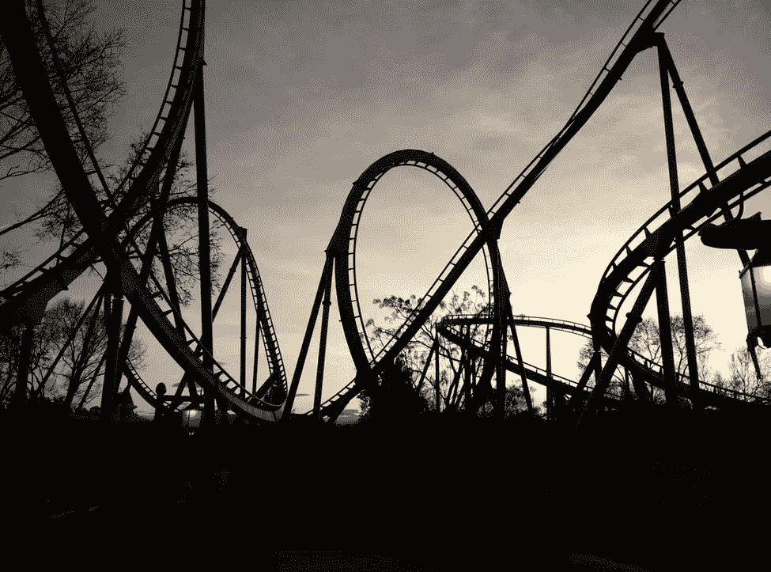

# 理解人生的过山车旅程

> 原文：<https://medium.datadriveninvestor.com/making-sense-of-lifes-rollercoaster-ride-5f1769588880?source=collection_archive---------13----------------------->

# 生活迫使我们不断变化

我完全同情那些感到这些天我们正在经历的突如其来的急剧变化和大起大落的人。

事实上，我们总是被生活抛来抛去，迫使我们不断调整。

但是现在，由于疫情、封锁和不断发展的社会经济危机，这些变化突然变得更大、更频繁，使我们大多数人失去平衡。

 [## 教科书行业如何最终被颠覆，并将继续改变|数据驱动…

### 就此而言，教科书产业在美国乃至全世界都有着悠久的历史。事实上，他们已经…

www.datadriveninvestor.com](https://www.datadriveninvestor.com/2018/09/25/how-the-textbook-industry-has-finally-been-disrupted-and-will-continue-to-change/) 

# 对目的、目标的需要

特别是在禁闭期间，我们大多数人都获得了机会，因为我们获得了暂停，重新思考我们的生活，寻找整体的意义和方向。

我想很多人开始觉得我们永远无法理解这种过山车，我们永远无法做出反应，做出适当的调整，除非我们确定一个总体目标和目的。

# 自然“惩罚、警告”

与此同时，许多人也把病毒——特别是鉴于大自然是如何调整、自我修复整个人类撤退的——作为一种警告，从大自然的完美系统中吸取教训。我们可以把这看作是大自然的“惩罚”、“警告”，尽管事实上这个系统是一个不变的“铁律”系统。

不是系统在惩罚我们，而是我们在惩罚我们自己，因为我们忽视、破坏了那些维持着至关重要的、脆弱的平衡和稳态的法则，没有这些法则，生命、最佳的发展是不可能的。

因此，为了理解我们经历的看似偶然的变化，为了理解我们的生活，我们需要研究自然和它无情的进化计划，以及它自己预定的角色，人类在其中的目的。

# 成为有意识的观察者，自然的伙伴

我们需要做这个研究，研究不是为了像以前一样利用这个系统来满足它自己过度的、人为的、破坏性的需求，而是为了补充、支持、配合这个系统。

然后，我们将最终看到、理解所有的因果过程，我们将能够绘制、监督进化计划，从它的原始状态直到它的最佳最终状态。

我们将能够通过逐渐变得与自然越来越相似来研究自然——通过我们之间积极的、相互的融合——到这样一种程度，我们将真正感到好像我们自己设计和操作了整个系统！

