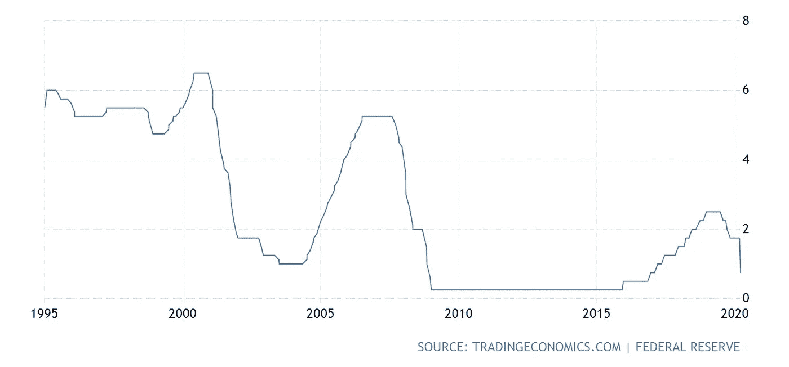
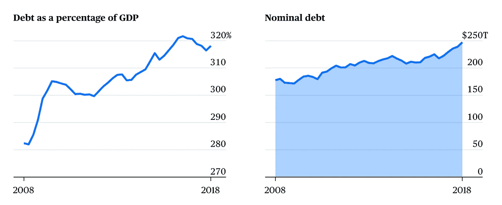
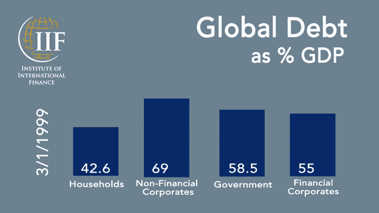

# 理解零利率

> 原文：<https://medium.datadriveninvestor.com/making-sense-of-zero-interest-rates-9d34c126b48d?source=collection_archive---------20----------------------->

关于利率下降我们需要知道什么？

最近全球利率的发展以及市场对这些发展的反应没有什么不引人注目的。零利率或负利率环境的问题已经持续了几十年，是政治和经济争议的主题，我们在 2008 年 GFC 会议后多次经历过这种情况。

Federal Reserve Interest Rate Policy since 1995

在利率过高的情况下，经济活动低迷，相反，在利率过低的情况下，由于资产价格高或通货膨胀，经济活动高涨。科技和全球化把我们带到了一个加息不再有意义的地方。

> 经济学家一致认为，零利率政策的主要目标是增加总需求(消费支出)，而不是总供给(生产)。然而，总供给是决定未来通胀的潜在因素。

虽然 2019 年全球债务承销达到创纪录水平，但当前市场的利率却出现了前所未有的低点-就现有债务额而言。万亿的计算很普遍，但这可能即将改变，截至 2019 年第三季度，全球债务已超过 253 万亿美元，现在罕见的术语“万亿”即将出现。今年年初，超过 10 万亿美元的全球债务以负收益率交易。毫不奇怪，货币政策的框架及其应用效果变得如此复杂，尤其是在实行负利率的欧洲和日本——这加大了刺激的难度。我不清楚我们能给当前的市场情景带来多深的影响，但是，我们知道这将需要很长时间才能回到我们在 20 世纪初看到的水平。

当瑞恩·高斯林走进那个房间推销信用违约互换时，我们了解到，抵押贷款危机的基础是向不合格的买家购买抵押贷款衍生品。世界各国政府和中央银行通过出台广泛的刺激计划来应对危机。在全球债务达到如此空前水平的情况下，加上收益率曲线在去年年底经历了两次反转，我们有了第二次机会，但 COVID。

 [## 利用股市相关性的最佳方式|数据驱动的投资者

### 当阿尔弗雷德·温斯洛·琼斯开创了世界上第一个“对冲”基金(后来“d”被去掉了)时，他让其他投资者大吃一惊…

www.datadriveninvestor.com](https://www.datadriveninvestor.com/2020/02/02/the-best-way-to-use-stock-market-correlations/) 

# 我们现在正处于世界将为 35 年的过度行为受到惩罚的时刻，这是美联储在 1913 年开始的 100 年法定货币实验的高潮

从个人角度来看，我们可以预期:

1.  信用卡持卡人将在几个账单周期内看到他们的年收益率下降。虽然这不一定能拯救生命，但开始一个债务雪球是明智的——在这里阅读更多关于雪球和雪崩方法的内容。
2.  随着利率下降，贷款再融资可以节省数百美元的利息费用。
3.  随着利率基本上为零，预计零约束储蓄收益。然而，这可能是一个锁定更高定期存款利率的机会。
4.  忘掉汽车贷款的任何收益，省下现金和麻烦。

零利率环境虽然滞后，但可以产生以下宏观经济影响:

1.  膨胀的资产价格
2.  劳动收缩
3.  资本税削减
4.  增加政府开支

Source: Bloomberg

世界各国政府都在努力刺激增长和提振需求，但代价是债务与 GDP 的比率居高不下。全球平均债务与 GDP 之比超过 320%，明显高于 2018 年的 226%，仅比上年高出约 1.5%。许多新兴市场经济体对此准备不足，简而言之，根据国际金融研究所(Institute of International Finance)的报告，这是一个最糟糕的时机，主权借款人占 72 万亿美元，非金融企业借款人占 69 万亿美元。不要误解我，我不认为现在是担心与政府债务相关的潜在问题的时候，我相信他们都在做正确的事情。虽然公共卫生是最重要的，但重要的是要知道这场危机将把政府推向未知的领域。

当纳粹政府在 1933 年宣布单方面违约其所有主权债务时，其债务的很大一部分被美国和英国勾销。历史和证据表明，这种以前瞻性思维和决心为导向的方法对于打击疫情的生存威胁是必要的。

> 在每七年结束时，你必须取消债务。豁免的方式是这样的:每个债权人都应该取消他借给他的邻居。——申命记 15:1–2

我同意赖因哈德和特雷贝施在他们题为“主权债务减免及其后果”的论文中得出的结论，即危机的出现是在债务面值大打折扣之后，债务重组、延期偿付和其他类似形式的债务减免等较温和的危机解决形式对解决债务危机没有多大作用。许多这样的救济已经拖了好几年了。这个理论支持了《圣经》中的《申命记》，该书估计写于公元前 7 世纪至 5 世纪之间，人们被指示每 7 年注销一次债务，这让我想知道我们的全球债务负担是否还会存在。