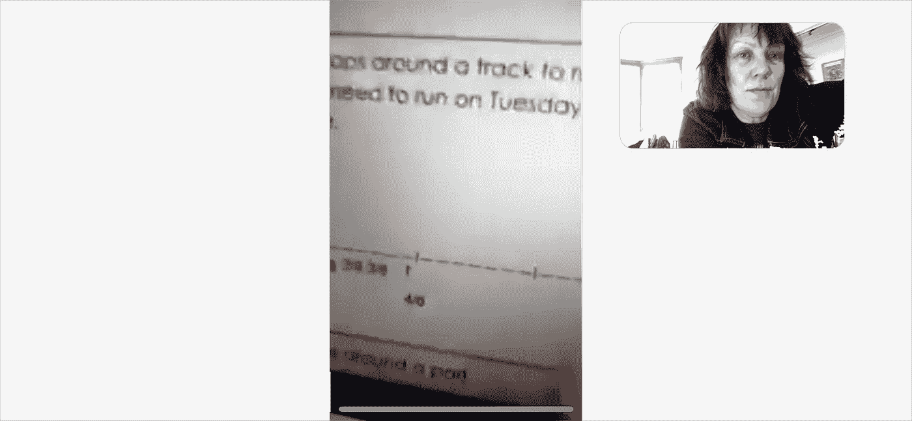

# 充分利用 zoom、FaceTime、google、skype 和 app 视频聊天

> 原文：<https://medium.datadriveninvestor.com/making-the-most-out-of-your-z-m-fa-etime-g-gle-sk-pe-pp-video-chats-3c96efd09915?source=collection_archive---------18----------------------->

## 我们都呆在家里……我们都极度需要另一边一些友好的人

*第一期* **科技生活精要**

## 隔离引起了我们对炉边视频聊天的最深切的渴望…即使是在我们最内向的人身上

我们以为我们能挺过去。但不知何故，在隔离的第三周，我们人类渴望再次看到和听到彼此。感官在尖叫，对交谈的需求压倒一切。我们迫切希望听到有人把这个新的世界秩序与我们联系起来。

在保护和拯救生命的同时，我们正在尽一切努力在国内繁荣发展。我们给孩子们他们需要的空间，与我们的同居者一起练习友善，每天给我们的妈妈和爸爸打电话。我们想知道外面的生活会是什么样子。春天从未像现在这样热烈。纽约市污染水平已经降低了至少一半。我们从未在如此清澈的蓝光下看到过城市的天空。所有这一切的一线希望是，我们的集体碳足迹终于在下降。

## 输入技术

Helping my young friend with his homework assignments long-distance. We use his mobile phone camera to check in on his on-screen homework, and also to discuss the questions asked.

幸运的是，技术已经提供了近乎完美的跨屏幕体验，模拟了一次近距离的个人遭遇，这甚至会给企业号上的让·卢克·皮卡德船长留下深刻印象。科技可能会拯救我们。

# 但是有一个问题

面对时机是瞬间的。随之而来的是，我们的个人空间也消失了。这比真正的身体接触还要糟糕。为此，我们可以做好准备。对于我们的视频聊天，大多数基本设置都不受我们控制。朋友、家人、同事找我们进行面对面的交谈，会看到我们最脆弱的时候，在家里，毫无准备，心理上赤裸，甚至身体上赤裸。当这种 facetime 聊天圈穿透我们的耳朵时，我们可能会感到恐慌。我的衣服在哪里？我的鞋子在哪里？在视频通话中，鞋子并不重要，但穿鞋子还是很不错的。天哪，我的皮肤又破了。

 [## 认知计算——一套被广泛认为是……

### 作为它的用户，我们已经习惯了科技。这些天几乎没有什么是司空见惯的…

www.datadriveninvestor.com](https://www.datadriveninvestor.com/2020/02/19/cognitive-computing-a-skill-set-widely-considered-to-be-the-most-vital-manifestation-of-artificial-intelligence/) 

很有可能，我们还没有照镜子，或者穿上漂亮的衣服或毛衣，或者做头发。当我们的朋友或父母紧急打电话给我们，要求进行私人谈话时，我们就在镜头前，**就像我们在**一样。

***卷进来的第一个问题……***

## 你感觉怎么样？

当我的加州朋友问我这个问题时，我仍然穿着休闲瑜伽风格的衣服，喝着第三杯咖啡。几分钟前，我看了州长科莫的每日简报，仍然在奇怪地计算着数字，寻找曲线的平坦处。我仍在计划我的一天。我为失去的生命而悲伤，听到我的建筑墙外的警笛声。我没有考虑过我的感受，然而，我很感激我能把*某事、*推心置腹地与*某人*联系起来。我们悲伤，哭泣。

我很好。我很高兴在视频上看到我的朋友。我们交谈，我们看着彼此，我们鼓励彼此继续创作有创造性的内容，并就如何填写失业救济金交换有价值的信息。

## 个人隐私消失了，我们的面具摘下来了

可能是因为糟糕的照明，或者是凌乱的房间背景，或者是桌子没有反映出玛丽·近藤(Marie Kondo)对我们工作空间的态度，我们看起来没有《Vogue》模特展示她早上的化妆程序那么迷人。

我记下我需要练习上镜前的最佳自我。我希望我看起来更好，但这只是不可行的在这个非常时刻。**没事的。如果我们接受聊天电话，我们就是朋友，我们会原谅对方。**

我还记下了一点，将来要去上公共演讲课。我想和外面所有的专业人士一样说得好。我希望我的语言流畅，发音清晰。我想要那份能让我在未来通过下一次面试并获得工作的工作。好，那堂演讲课记下了。

## 隐私和大量观众聊天

成百上千或成千上万的视频聊天观众的时代正在到来。我们可以随时随地收听网络研讨会和信息会议。主持人会很随意的告诉我们有几百人加入了，这对他们来说是好事，对我们来说就没那么好了。我们登录，注册，添加到公司供应商的数据库中。这可能没问题，但这仍然是通过我们的电子邮件和 IP 收集的数据。

在一大群人面前感到不舒服也没关系。也可以…

> 盖上摄像机，关掉外放的音频，只听进去

# 明摆着的难题

## 视频聊天和工作有关怎么办？

实际上，我们都必须面对它。这是新的聊天时代。越来越多的时候，我们会在去任何办公室之前看到视频聊天面试的要求。我们将不得不发布一些关于我们自己的个人统计数据，我们自己的照片，学位，值得注意的成就，以及我们家庭办公室的技术规格。

我未来的简历可能是这样的:

> 作家/设计师/UX Designer/创意思考者，有 WiFi，笔记本电脑，台式机，移动，手机摄像头，Adobe Creative Cloud 会员，Google Cloud，丰富的品牌经验，没有平板电脑，www.evaschicker.com，IG @evaschicker，@evaschicker.ux，热爱伟大的美国室内。

我们知道，危机时刻唯一不变的是变化本身。如果我们将概念上的工作范式转变为在线时薪工作片段，相机对相机，我们会没事的。我们将能够把我们的一天分成镜头上的模块和镜头外的工作冲刺。我们将通过使用 Trello、Slack、Calendly 和数百个其他应用程序来帮助我们度过一天，从而准备好处理多维度的工作流程。

## **成为视频聊天专家的几个简单步骤**

**在家里找一个舒适的角落。**将其转换成简单的工作空间。确保背景与你是谁有关。加一些花，或者一棵漂亮的植物。将此空间作为您的“官方”聊天空间。如果你接到一个专业人士的聊天电话，接电话，但是要求他们给你 10 秒钟时间，这样你就可以进入你的聊天空间，当然，除非你已经在那里了。

让你的聊天空间成为你的圣地。没有人可以碰它，没有人可以坐在那里，没有人被允许在那里摊开书本或做作业。你需要让你所有的室友都明白这一点。非常清楚。因为当你设计好神圣的视频聊天空间后，你家里的每个人都想使用它。但是他们不能。把这一点说清楚。你未来的自我将取决于此。

保持你的聊天空间整洁。保持简单。如果你依赖特定的设备，把它设置到你最好的相机优势。玩光。选择柔和的光源。用温暖的灯泡升级你的灯具。确保外部噪音水平是可以忍受的。检查您的麦克风设置。考虑使用全向领夹式话筒，如果这能让你感觉更舒服的话。每天检查你的设备。确保您的 WiFi 已启动并运行。确保你准备好了所有的技术工具。

**在视频通话中保持头脑清醒。记得微笑和呼吸。**

# 专注于一天，而不是一周

危机期间，我们在家，努力工作。尽管这对每个人来说都是新的，但我们可以从中学习。我们可以提高视频聊天的目标。

> 我们可以决定真正学习这种聊天技术，并准备好**引导**下一次工作聊天。

我们可以成为主持人，向所有人展示我们在这个新全息甲板里有多么自信。谁知道呢，成为一名视频聊天主持人可能是我们下一份工作的要求。

此外，我们还可以开设自己的聊天频道。我们自己的周五晚上炉边谈话节目，或者周六晚上虚拟舞会。我们的观众会越来越多，我们需要讨论的话题会越来越多。

## 绝望时期的古老智慧

## 保持创造力。拥抱聊天技术。发明新的日常事务。给你的朋友发视频消息。设计你的网络。记住，只有变化才是不变的。

接下来:

孩子们会不会接受视频聊天？

点击这里阅读更多我的个人新冠肺炎日志:

 [## 冠状病毒时代教会了我们什么(8)

### 我在新冠肺炎病毒隔离区的这几天写日记。这是观察的拼贴画…

medium.com](https://medium.com/@evaschicker2012/what-the-time-of-the-coronavirus-is-teaching-us-8-6d9fd31d6ae3)  [## 冠状病毒时代教会了我们什么(7)

### 我在新冠肺炎病毒隔离区的这几天写日记。这是观察的拼贴画…

medium.com](https://medium.com/@evaschicker2012/what-the-time-of-the-coronavirus-is-teaching-us-7-3a7d47af405d)