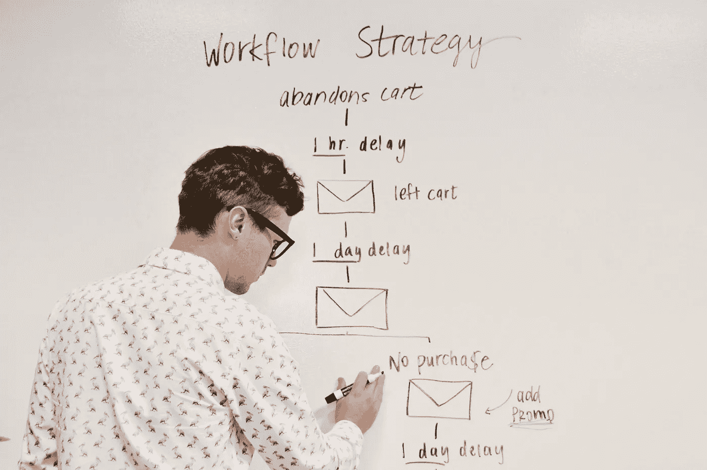

# 通过制造更好的东西让事情变得更好

> 原文：<https://medium.datadriveninvestor.com/making-things-better-by-making-better-things-4fdb13d07eed?source=collection_archive---------11----------------------->

Photo by [Campaign Creators](https://unsplash.com/@campaign_creators?utm_source=unsplash&utm_medium=referral&utm_content=creditCopyText) on [Unsplash](https://unsplash.com/s/photos/workflow?utm_source=unsplash&utm_medium=referral&utm_content=creditCopyText)

## 在困难时期，你会做出反应、回应或主动出击吗？

有办法让危机变得更糟，有办法化解危机，幸运的是，也有办法改善危机。让我们来谈谈原因和影响，以及如何利用危机来改善你的生活。

有一群害怕的人开始购买包括卫生纸在内的大量食物，这个群体对他们的恐惧做出了反应。这些人通常也是去海滩、度假或仍然外出的人，原因很简单，他们感到无聊。上周末在荷兰也发生了这样的事情，海滩和公园里到处都是散步、跑步和享受阳光的人…他们这样做确实危及了许多其他人，我觉得这是不负责任的，我很高兴我不是这个群体的一员。

第二组**通过采取行动来应对危机**，如果可能的话，他们开始在家工作，因此，他们的收入不会有太大变化。他们通过调整他们的生活和工作方式来充分利用这种情况，他们使自己的情况不那么依赖他人。他们充分利用这种情况，但在(金融)危机之后，他们并没有真正选择改善和适应这种情况。我很乐意帮助你做这个决定，这个决定让你减少对现有金融体系的依赖，并准备好应对你的金融风险。

 [## 零工经济如何改变未来的就业前景|数据驱动的投资者

### 随着自动化的发展和 Z 世代的出现，劳动力的构成和动态正在发生变化…

www.datadriveninvestor.com](https://www.datadriveninvestor.com/2018/12/19/how-is-the-gig-economy-changing-the-future-jobs-landscape/) 

我希望看到你继续前进，去**开始**，去改善你的家庭状况，去赚比以前更多的钱，去对你的成就感到满意，去体验更少的压力。这些都可以通过选择做一名自由职业者，通过减少对他人的依赖来实现。因此，花几分钟时间来学习如何开始成为一名自由职业者，如何使流程让你的生活更轻松，以及如何创造自己的机会。

# 作为一名自由职业者，我如何开始网上工作？

有许多不同的方法可以做到这一点，我不会浪费你的时间列一个长长的清单，我只是简单地告诉你什么对我有效。那么，我开始自由职业的 10 个步骤是什么呢？

1.  通过列出你最大的需求来了解你的目标
2.  结合你的经验和兴趣来定义你的定位
3.  用 Hubspot 工具找出谁是你的完美客户
4.  价格相应地使用[这种方法](https://medium.com/better-marketing/the-7-basic-pricing-strategies-c44563547e12)
5.  创建一个优秀的作品集来展示你的经验和兴趣
6.  在你的 LinkedIn 页面和/或网站上有一些你能做什么的例子
7.  根据您在此制作的[买家角色选择前几个客户](https://medium.com/swlh/how-to-create-the-perfect-buyer-persona-in-7-steps-using-the-hubspot-tool-4424f4db58fb)
8.  在你的内容中提及其他潜在客户，让他们想象和你一起工作
9.  创造一个好的推介，包括[可信度](https://medium.com/better-marketing/how-do-you-incorporate-credibility-in-your-sales-pitch-847e6bd844d1)、[紧迫性](https://medium.com/better-marketing/how-to-incorporate-urgency-in-your-sales-pitch-fdc876d81e01)和[强硬措辞](https://medium.com/swlh/how-i-stopped-using-weak-language-and-got-my-confidence-and-self-respect-back-as-a-result-452f84c05d83)
10.  让你的自由职业远离你的日常工作

# 你如何创建完美的在线工作流程？

为了让你有信心并且能够按时完成，需要一个好的系统，所谓的工作流程。此工作流程的主要目标是设定如何实现目标的规则。通过遵循以下 5 个步骤，您可以为任何业务流程创建自己的工作流程。成为一名在线自由职业者已经够紧张的了

1.  仔细看看你所有的东西，找出你可以利用的东西，这些东西涉及到你用来实现目标的当前过程。比如纸质表格或者是谁批准了这些表格。
2.  找出你想完成的事情，列出需要完成的任务。找出这些任务是如何联系在一起的，如果可能的话，给团队成员分配角色。
3.  制作一个图表来显示流程，使流程更容易可视化。你甚至可以将它数字化，以便与每个相关人员分享。
4.  测试工作流程图，并在需要的地方进行调整，第一次没有什么是完美的，所以要准备好调整不正确的东西。把事情做到完美是需要时间的，所以不要浪费时间第一次就想把事情做到完美。
5.  部署工作流并熟悉它，你的团队也是如此(如果你有团队的话)。解释和培训将使用工作流程图的每个人，并确保他们了解自己的职责。当引入新流程时，不要忘记更新这些工作流程。

# 是什么阻碍了你？

你再也没有理由不做网上自由职业者了，尤其是现在全球经济越来越倾向于人们在网上为自己工作。多亏了手机、Slack 和 Skype，与客户的沟通变得很容易。网上有足够多的信息，许多公司不再介意你是在他们自己的办公室还是在你自己的家里工作。

自律是自由职业者最重要的一部分，开始负责任的一个简单方法是不打瞌睡就起床，整理床铺。这样你就可以训练自己成为一名成功的自由职业者。

如果你喜欢这篇文章，你也会喜欢这些:

 [## 如何按月销售服务，而不是按小时收费

### 它是如何工作的，为什么它这么好，以及如何设置自己的每月保持器。

medium.com](https://medium.com/swlh/how-to-sell-your-service-in-a-monthly-package-instead-of-your-hourly-rate-8e157538f81f)  [## 如何按月销售服务，而不是按小时收费

### 它是如何工作的，为什么它这么好，以及如何设置自己的每月保持器。

medium.com](https://medium.com/swlh/how-to-sell-your-service-in-a-monthly-package-instead-of-your-hourly-rate-8e157538f81f)  [## 3 个自由职业者在危机中发展业务的建议

### 立即行动，获取收益

medium.com](https://medium.com/better-marketing/3-major-freelance-tips-on-handling-crises-such-as-the-corona-virus-and-grow-your-business-eaa81c6354af)