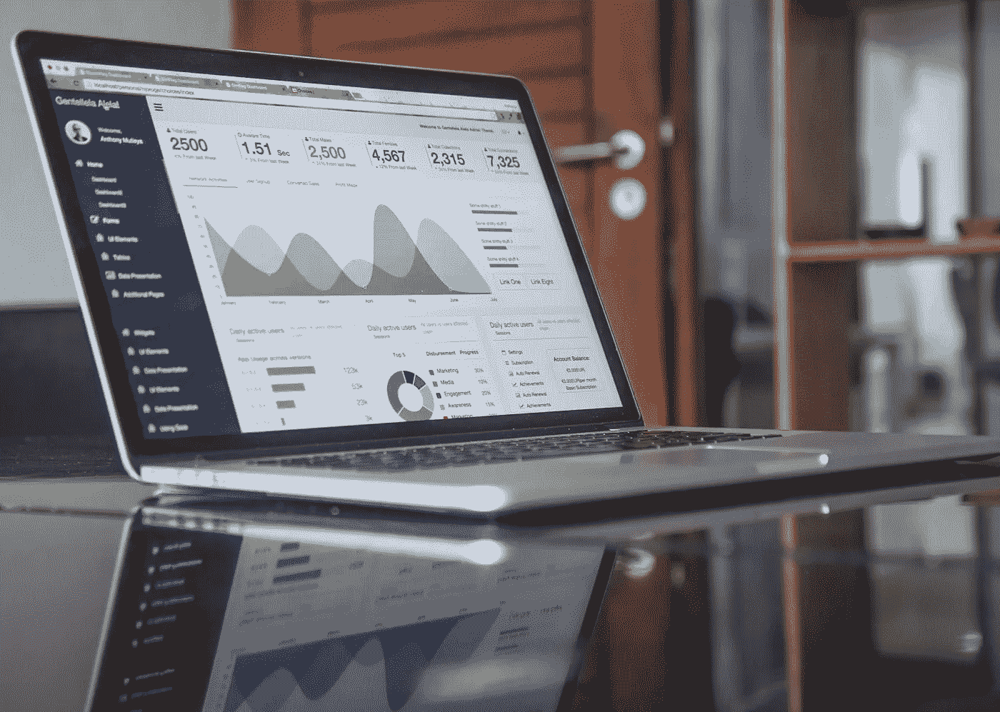

# 让营运资本发挥作用

> 原文：<https://medium.datadriveninvestor.com/making-working-capital-work-cb2cf35453c0?source=collection_archive---------8----------------------->

在任何组织中，无论行业、部门或规模如何，营运资本都是保持商业机器运转的润滑油。如果不对营运资本进行管理，企业就像发动机一样，很快就会冻结。

在这一系列关于营运资本的文章中，我们将探讨营运资本的不同要素，这些要素相互作用的方式，现金转换周期以及如何计算您的现金转换周期，这对您的企业意味着什么，较长和较短的营运资本周期的影响，以及在某些情况下营运资本周期会影响甚至阻碍增长的时间。

每种企业的营运资本都不同。大多数行业都有行业标准和平均值，但要真正了解你的营运资本，你需要通过你独特的业务来评估它。在线电子商务企业的营运资本周期将不同于制造企业。大型超市不同于小型便利店。制造商不同于服务提供商。当你审视自己的组织时，了解自己营运资本的性质、不同要素之间的相互作用方式、如何改善营运资本循环以及这对增长和规模意味着什么是很重要的。

Photo by [Carlos Muza](https://unsplash.com/@kmuza?utm_source=unsplash&utm_medium=referral&utm_content=creditCopyText) on [Unsplash](https://unsplash.com/s/photos/accounting?utm_source=unsplash&utm_medium=referral&utm_content=creditCopyText)

营运资本是在当前水平上支持你的企业所需的现金数量。这与收入大于支出或盈利能力无关，但归结为一个简单的问题，在任何给定的时间点，你的企业有多少资金被套牢？对于书店来说，这可能与商店中的书籍有关，店主需要为每本书付款才能出售它们，随着业务的增长，他将需要商店中更多的书。对于管道服务来说，这可能意味着他持有的存货和客户欠他的钱。如果客户用 30 天付款，他的应收账款会随着他的成长而增加。

因此，您可能想知道为什么这很重要，这对您的业务有什么影响。好吧，今天你企业的营运资本是你需要增加多少营运资本的一个指标。一个总库存为 100 万美元，收入为 1000 万美元的制造商可以假设，如果收入增长到 2000 万美元，它将需要 200 万美元的库存。一旦你有了这些信息，你就可以开始计划，问问题，并找出如何计划这种增长。相比之下，同一家制造商优化了库存，在当前收入水平下只需要 500，000 美元的库存，也许他们可以在不需要更多库存的情况下增长到 20，000，000 美元。你今天需要越多的营运资金来支持你的业务，随着你的业务增长，你需要的营运资金也就越多。对此进行优化可以让你释放这种潜在的增长。

Photo by [Kelly Sikkema](https://unsplash.com/@kellysikkema?utm_source=unsplash&utm_medium=referral&utm_content=creditCopyText) on [Unsplash](https://unsplash.com/s/photos/accounting?utm_source=unsplash&utm_medium=referral&utm_content=creditCopyText)

营运资本有三大要素，应收账款、存货和应付账款，每一项都与短期现金的来源或用途有关。

存货和应收账款耗尽了可用的现金。现金存在企业中，等待出售或收回。应付款是现金的一个来源。现金是从供应商那里借来的，但很快就需要归还。了解现金在你的企业中的位置，并能够确保它变成现金，是商业机器不可或缺的一部分。

 [## 2020 年最佳短期投资选择精选资源|数据驱动型投资者

### 投资是增加你净财富的一个好方法。如果你通过遵循一个严格的…

www.datadriveninvestor.com](https://www.datadriveninvestor.com/2020/03/28/handpicked-resources-for-the-best-short-term-investment-options-of-2020/) 

应收账款——在一个信用驱动的世界里，许多企业提供客户条款来刺激销售。如果客户可以在两家看似相似的企业中进行选择，其中一家提供信贷，另一家不提供，他们很可能会选择信贷条件更优惠的那家。如果没有其他人提供信贷，那么它可能是一种竞争优势，如果其他人都提供信贷，那么它就是一种必需品。赊销时，企业已经放弃了产品或服务，但只有以后才能得到付款。同时，企业需要补充库存或向供应商付款。现金需要从某个地方来，并且必须得到企业的支持，直到收回为止。

库存——对于大多数企业来说，收入是由产品销售驱动的，但为了销售产品，企业首先需要购买或制造产品。大多数企业无法在今天购买明天将被出售的产品(或在出售后购买产品)，因此产品将在货架上或仓库中放置一段时间。任何存货在出售前都必须支付货款，因此企业的运营现金将被库存占用。随着企业的成长，他们需要更多的库存，也需要更多的现金来支撑这些库存。

Photo by [Ruchindra Gunasekara](https://unsplash.com/@ruchindra?utm_source=unsplash&utm_medium=referral&utm_content=creditCopyText) on [Unsplash](https://unsplash.com/s/photos/warehouse?utm_source=unsplash&utm_medium=referral&utm_content=creditCopyText)

应付账款——在我们这个相互联系的世界里，所有企业都需要与他人就商品和服务进行互动，当你的企业向他人提供信贷时，你的供应商也向你提供信贷。给你信用条款的供应商允许你有效地从他们那里借钱。这让你手头有商品，甚至可能在你需要付款之前就卖掉它们。这使你可以通过让供应商等待付款来减少现金负担。

那么你的生意需要多少钱呢？你的净营运资本是你的应收账款+存货-应付账款。这是在你的营运资金中被占用的钱的数量，并且总是需要在业务中。

Photo by [Clark Street Mercantile](https://unsplash.com/@mercantile?utm_source=unsplash&utm_medium=referral&utm_content=creditCopyText) on [Unsplash](https://unsplash.com/s/photos/inventory?utm_source=unsplash&utm_medium=referral&utm_content=creditCopyText)

通过了解这三个项目是如何运作的，你可以相应地调整你的净营运资本要求。通过有目的地减少应收账款和存货或增加应付账款，你可以腾出现金用于其他领域。如果你了解当今企业所需的营运资本水平，你就会了解随着企业规模的扩大，营运资本的需求。