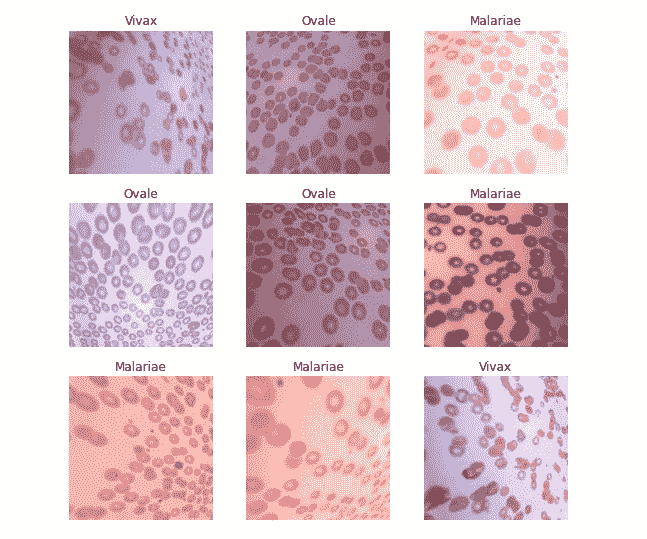
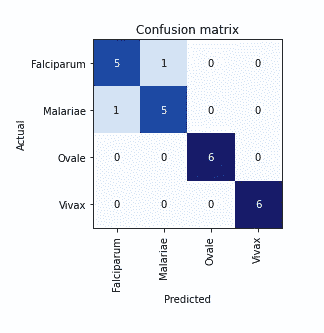
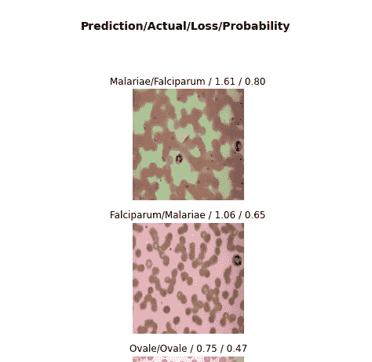

# 利用 Fast.ai 进行疟原虫种类分类

> 原文：<https://medium.datadriveninvestor.com/malaria-parasite-species-classification-using-fast-ai-4255b7ac1bff?source=collection_archive---------22----------------------->

## 将疟原虫图像分类为不同种类


Photo by [Kendal](https://unsplash.com/@hikendal?utm_source=medium&utm_medium=referral) on [Unsplash](https://unsplash.com?utm_source=medium&utm_medium=referral)

这是本系列的第 2 部分:“**学习数据来源和准备模型部署的过程**”。在系列的这一部分，我们将建立我们的深度学习模型。

由于我们的数据托管在 Kaggle 上，我们可以很容易地使用它的笔记本来编写我们的代码。数据在这里找到:[https://www.kaggle.com/emmamichael101/malaria-species](https://www.kaggle.com/emmamichael101/malaria-species)

从上面的链接创建一个新的笔记本，然后编码。

根据我们的任务创建深度学习模型的过程将分为 9 个阶段:

1.  导入必要的包
2.  声明数据集的路径
3.  定义数据块
4.  将数据块对象转换为数据加载器
5.  检查 dataloader 对象中的图像
6.  火车模型
7.  将预测可视化，并与实际标签进行比较
8.  检查最高损失
9.  导出训练模型

# 导入必要的包

Fastai 已经安装在 Kaggle 内核上，所以您可以继续导入 fastai:

```
#fastai convention to import everything inside the vision #application for image classificationfrom fastai.vision.all import *
```

# 声明数据集的路径

```
*#path to data to train and evaluate our deep learning model*
DATASET_PATH = Path('/kaggle/input/malaria-species/malaria_species_identification')
```

# 定义数据块

我们必须定义数据块来创建数据加载器。

在我们的数据块中，我们将指定:

*   **块** —这指定了独立变量(一组图像)和目标变量(每个图像的类别[在我们的例子中:疟原虫的种类])
*   **get_items** —检索底层项目(在我们的例子中是图像)。get_image_files 函数获取一个路径并返回该路径中所有图像的列表(默认情况下是递归的)。
*   **拆分器** —从祖父文件夹名称(`train_name`和`valid_name`)中拆分`items`。因此，我们的模型将使用 train 文件夹中的图像进行训练，并使用 test 文件夹中的图像进行测试。
*   **get_y —** 目标变量被称为 y。为了创建标签，我们使用了`**parent_label**`函数，该函数获取文件所在文件夹的名称作为其标签。
*   **item_tfms** —这会将我们的图像调整到相同的大小。我们通过选择一个随机缩放的图像并在批处理之前将其调整到 224 来应用转换。

我们使用 RandomResizedCrop 来训练神经网络，其中对象的位置和大小略有不同，以帮助它理解对象的基本概念，以及如何在图像中表示它。“min_scale”决定每次至少选择多少图像。

*   **batch_tfms** —一个或多个转换一旦形成就应用于批处理。这是应用数据增强。

```
species_datablock = DataBlock(
    blocks=(ImageBlock, CategoryBlock), 
    get_items=get_image_files, 
    splitter=GrandparentSplitter(train_name=('train'),           valid_name='test'),
    get_y=parent_label,
    item_tfms=RandomResizedCrop(224, min_scale=0.3),
    batch_tfms=aug_transforms(mult=2)
)
```

这个命令给了我们一个数据块对象。这就像是创建数据加载器的模板。

[](https://www.datadriveninvestor.com/2020/11/27/deep-learning-amid-increased-physician-administrative-workload/) [## 医生管理工作量增加时的深度学习|数据驱动的投资者

### 行政工作量是我们这个时代大多数医生所经历的众多负担之一。医生，尤其是…

www.datadriveninvestor.com](https://www.datadriveninvestor.com/2020/11/27/deep-learning-amid-increased-physician-administrative-workload/) 

# 将数据块对象转换为数据加载器

这告诉 fastai 我们数据的实际来源——在本例中，是可以找到图像的
路径:

```
#convert [DataBlock](https://docs.fast.ai/data.block.html#DataBlock) to a [DataLoaders](https://docs.fast.ai/data.core.html#DataLoaders) object
dls = species_datablock.dataloaders(DATASET_PATH)
```

数据加载器包括验证和培训数据加载器。DataLoader 是一个类，它一次向 GPU 批量提供几个项目。

# 检查 dataloader 对象中的图像

然后，我们可以使用`show_batch`方法检查 dataloader 对象中的图像:

```
dls.show_batch()
```



# 火车模型

为了训练我们的模型，我们需要建立一个学习器(cnn_learner)。我们将 resnet34 定义为我们的架构，将“错误率”定义为我们的指标。“learn.fine_tune”将适合我们的模型。

```
learn = cnn_learner(dls, resnet34, metrics=error_rate)learn.fine_tune(16)
```

# 将预测可视化并与实际标签进行比较

我们将预测值与实际值进行比较

```
interp = ClassificationInterpretation.from_learner(learn)
interp.plot_confusion_matrix()
```



# 检查最高损失

```
interp.plot_top_losses(4, nrows=4)
```



# 导出训练模型

我们需要保存我们训练好的模型，以便能够部署它。我们有模型架构和保存模型的训练参数。这个方法甚至保存了如何创建数据加载器的定义。这是
重要的，因为否则你将不得不重新定义如何转换你的数据，以便在生产中使用你的模型。

```
#fastai will save a file called export.pkl:
learn.export()
```

从 Kaggle 下载这个文件。

该模型仍有改进的空间。

查看我们最后的笔记本这里:[https://www . ka ggle . com/Emma Michael 101/疟疾-寄生虫-物种-分类/输出](https://www.kaggle.com/emmamichael101/malaria-parasite-species-classification/output)

我们的下一步将是部署我们训练有素的深度学习模型。我们将在本系列的第 3 部分中讨论这个问题。

**在推特上关注我:** [@emmakodes](https://twitter.com/emmakodes)

**领英:**[https://www.linkedin.com/in/emmanuelonwuegbusi/](https://www.linkedin.com/in/emmanuelonwuegbusi/)

# 结论

第 3 部分:[使用 Binder 部署一个 Fast.ai 训练模型](https://emmamichaelo.medium.com/deploy-a-fast-ai-trained-model-using-binder-ce717a2ca66c)

第 1 部分:[了解模型部署的数据来源和准备流程](https://emmamichaelo.medium.com/learn-the-process-of-data-sourcing-and-preparation-to-model-deployment-4936c3b1f7b8)

**参考文献**

[1]杰瑞米·霍华德和西尔万·古格，Fastai 和 Pytorch 的程序员深度学习(奥莱利媒体公司，2020 年)

**进入专家视角—** [**订阅 DDI 英特尔**](https://datadriveninvestor.com/ddi-intel)