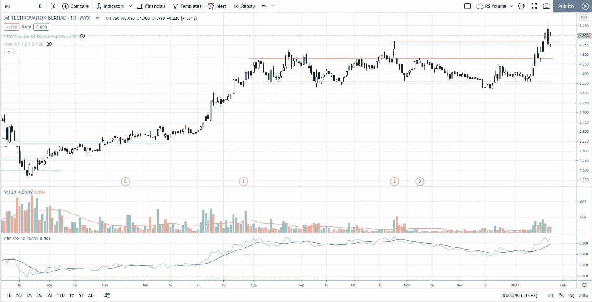

# 马来西亚技术部门——杜甫、JHM、米、彭塔、VS 积累或分配

> 原文：<https://medium.datadriveninvestor.com/malaysia-technology-sector-dufu-jhm-mi-penta-vs-accumulation-or-distribution-6fb7ed68a5ef?source=collection_archive---------19----------------------->

两周前，由于全球芯片短缺，包括 OSAT(外包半导体组装和测试)、ATE(自动测试设备)、EMS(电子制造服务)和其他支持集团在内的马来西亚技术部门开始充电。杜甫，JHM，米，PENTA 和 VS 已经被选中，因为他们有可能在支点的基础上价格行动交易和威科夫分析的数量传播。

找出杜甫，JHM，米，PENTA 和 VS 的交易计划，根据突破交易或简单的回调交易策略设置进场点和止损。观看下面的视频:

## 时间戳

*   [1:04](https://www.youtube.com/watch?v=w8az0cA-JqU&t=64s) 都富(BHD 都富科技有限公司)
*   [6:35](https://www.youtube.com/watch?v=w8az0cA-JqU&t=395s) JHM (JHM 合并 BHD)
*   [10:12](https://www.youtube.com/watch?v=w8az0cA-JqU&t=612s) 米
*   [12:46](https://www.youtube.com/watch?v=w8az0cA-JqU&t=766s)PENTA(BHD penta master 公司)
*   [15:53](https://www.youtube.com/watch?v=w8az0cA-JqU&t=953s)VS(VS BHD 工业部)

# 资源

**每周市场展望&最佳交易建议**直达您的收件箱:[https://www.tradeprecise.com/](https://www.tradeprecise.com/)

**专业免费**制图平台:创建账户→[www.TradingView.com](https://bit.ly/2U2Femd)

**非美国居民？** ( **马来西亚、新加坡**、澳洲、纽西兰、欧洲等……):[点击此处，当您存入新币 2000 元](https://ji.hn/sgtiger)时，即可获得**免费股票(价值 100 美元++ &老虎经纪的欢迎礼物**

美国居民？[点击此处，当您存入 1500 美元](https://ji.hn/ustradeup)时，就有机会在 TradeUP 上获得一份**免费的 AMZN 股票(价值 3000++美元** ) & **欢迎礼物**

**从媒体获取无限文章** —加入以下:[https://priceactiontrading.medium.com/membership](https://priceactiontrading.medium.com/membership)

# 进一步阅读

 [## 被低估的高成长股——EVO、EMBRAC、FTCH、MWK、OPEN、SKLZ、UPST

### 2021 年第 2 周市场回顾

medium.com](https://medium.com/datadriveninvestor/underhyped-high-growth-stocks-evo-embrac-ftch-mwk-open-sklz-upst-5105abd20143)  [## ARKG ETF 中摇摆交易的三大小盘股——AQB、CLLS 和冲浪

### 从 ARK Invest 的 ARKG ETF 中找出三大小盘股——AQB、CLLS 和冲浪，它们有很大的潜力…

medium.com](https://medium.com/datadriveninvestor/top-3-small-cap-stocks-in-arkg-etf-for-swing-trading-aqb-clls-surf-8963bc4d5ef2)  [## ARK Invest 的 Cathie Wood 预测基因组股表现优于特斯拉？

### 方舟投资公司的首席执行官凯西·伍德预测，最大的上涨惊喜可能来自基因组股票，尤其是…

medium.com](https://medium.com/datadriveninvestor/ark-invests-cathie-wood-predicts-genomic-stocks-outperform-tesla-b67f3c4bbc68) 

Photo by Author — Ming Jong Tey

披露:如果您点击本文中的链接进行购买或开立账户，并将所需金额存入推荐的经纪人账户，我们将免费为您赚取佣金。

免责声明:本演示中的信息仅用于教育目的，不应作为投资建议。