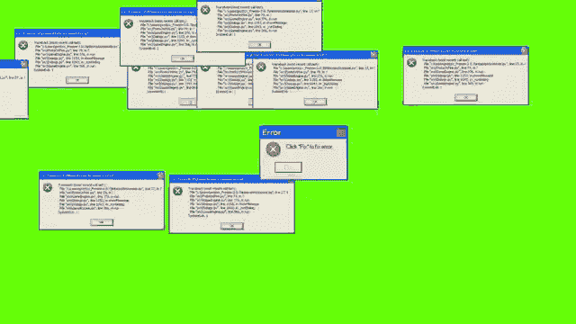

# 使用混淆算法技术的恶意软件检测

> 原文：<https://medium.datadriveninvestor.com/malware-detection-using-obfuscation-algorithm-techniques-4e3a09fc1bb5?source=collection_archive---------0----------------------->

## 这是公司的安全团队除了了解恶意软件混淆技术如何发展以及如何部署之外还需要的东西。这是恶意软件检测的最重要的方面之一，公司的安全团队必须处理。

恶意软件混淆是一个使文本和二进制数据难以理解的过程。攻击者使用混淆技术使反病毒软件难以检测无过滤器的恶意软件。恶意软件通过混淆技术将他们的身体进化成新的一代，从而能够躲避杀毒软件。

这是公司的安全团队除了了解恶意软件混淆技术如何发展以及如何部署之外还需要的东西。这是恶意软件检测的最重要的方面之一，公司的安全团队必须处理。因此，在已知的恶意软件示例中，这些技术可以被认为是动态构建的，而不是单次攻击的结果。这些技术用于在未来的动态恶意软件检测系统中检测新的和已知的恶意软件样本。

启发式分析寻找基于签名的解决方案无法发现的新威胁，例如新的恶意软件模式或新类型的恶意软件。

启发式扫描使用算法和模式来确定软件是否在做一些可疑的事情。由于代码掩盖的程度，反恶意软件程序可以决定被分析的软件是否是恶意的。例如，如果超过 50%的代码被伪装(就像如果它被严重伪装)，它可以声明它是恶意的，因为它的一些功能被代码使用隐藏了。然后，可以使用与原始代码相同的算法来重新编译和分析优化的软件代码，以确定它是否是恶意的，如果不是，则重新编译和分析它。

检测恶意软件的能力，正如它总是被称为，允许恶意代码在幕后持续工作。解密的恶意软件不会使快速检测和提取恶意软件变得容易，但它会使检测更容易，解密更快。

虽然伪装是为了防止应用程序倒退而设计的(这是技术上的设计)，但攻击者经常将其用作隐藏恶意代码的工具。一些恶意软件检测工具旨在检测和阻止这种技术的使用，它遵循与我们其他反恶意软件工具相同的原则。结果，攻击者被迫使用这些技术来尽可能长时间地延迟对其恶意文件的检测。

对于模糊处理，使用了几种方法，包括

死代码插入

寄存器重新分配

子程序重新排序

指令替换

代码换位

代码集成

命令更改

加密压缩和加密

恶意程序员通过使用加密、加密或加密来模仿或合并周围的代码，并确保代码无法被解密，从而避免了这一点。然而，当面对已经被修改以伪装软件代码或使分析更加困难的隐蔽恶意软件时，这些技术会失败。因此，反恶意软件程序无法检测到它们，因为它们花费了太多时间来分析这种模糊的软件，以至于检测过程变得非常低效。

 [## 肖尔算法:RSA 的克星|数据驱动的投资者

### RSA 加密是一种公钥加密系统。这意味着它有一个所有人都可以访问的公钥和一个私钥…

www.datadriveninvestor.com](https://www.datadriveninvestor.com/2020/05/25/shors-algorithm-the-bane-of-rsa/) 

掩盖的程度，从简单到高级，影响着反病毒检测恶意软件的频率。例如，隐藏对象中的漏洞利用可以隐藏起来，不被恶意软件检测系统检测到。通过预过滤新注册的恶意软件实例，可以显示是否检测到特定类型的恶意软件。

简而言之，反恶意软件检测系统已经变得几乎不可能仅通过使用传统方法来跟上日益增长的隐蔽恶意软件。

因此，希望提供一种通过模糊内容和避免使用传统方法(如暴力)来检测恶意软件的新方法。启发式方法是检测加密恶意软件的一种有前途的方法。然而，这种检测机制需要完整的沙盒环境来执行测试。

**引用来源**

*   【https://www.atlantis-press.com/journals/ijcis/25899232/view 号
*   【http://www.google.com/patents/US9690936 
*   [https://ibimapublishing.com/articles/JIACS/2018/836339/](https://ibimapublishing.com/articles/JIACS/2018/836339/)
*   [https://patents.google.com/patent/US20110010697](https://patents.google.com/patent/US20110010697)
*   [https://www . vadesecure . com/en/malware-analysis-understanding-code-obfuscation-techniques/](https://www.vadesecure.com/en/malware-analysis-understanding-code-obfuscation-techniques/)
*   [https://www . lmg security . com/common-anti virus-bypass-techniques/](https://www.lmgsecurity.com/common-antivirus-bypass-techniques/)
*   [https://www . cynet . com/blog/a-guide-to-malware-detection-techniques-av-ngav-and-beyond/](https://www.cynet.com/blog/a-guide-to-malware-detection-techniques-av-ngav-and-beyond/)
*   [https://www . scmagazineuk . com/evolution-malware-obfuscation-poses-security-concerns/article/1677639](https://www.scmagazineuk.com/evolution-malware-obfuscation-poses-security-concerns/article/1677639)
*   https://cyberleninka.org/article/n/1351839
*   [https://resources . infosecinstitute . com/category/certifications-training/malware-analysis-reverse-engineering/malware-obfuscation-encryption/](https://resources.infosecinstitute.com/category/certifications-training/malware-analysis-reverse-engineering/malware-obfuscation-encoding-encryption/)
*   [https://www . elastic . co/blog/catching-malware-with-elastic-outlier-detection](https://www.elastic.co/blog/catching-malware-with-elastic-outlier-detection)
*   [https://www . mime cast . com/blog/2019/06/obfuscated-file less-malware-in-cyber attackers-toolkits-a-closer-look/](https://www.mimecast.com/blog/2019/06/obfuscated-fileless-malware-in-cyberattackers-toolkits-a-closer-look/)
*   [https://www . ground ai . com/project/generation-evaluation-of-adversarial-examples-for-malware-obfuscation/2](https://www.groundai.com/project/generation-evaluation-of-adversarial-examples-for-malware-obfuscation/2)
*   [https://securityboulevard . com/2020/02/what-is-malware-obfuscation/](https://securityboulevard.com/2020/02/what-is-malware-obfuscation/)

**访问专家视图—** [**订阅 DDI 英特尔**](https://datadriveninvestor.com/ddi-intel)