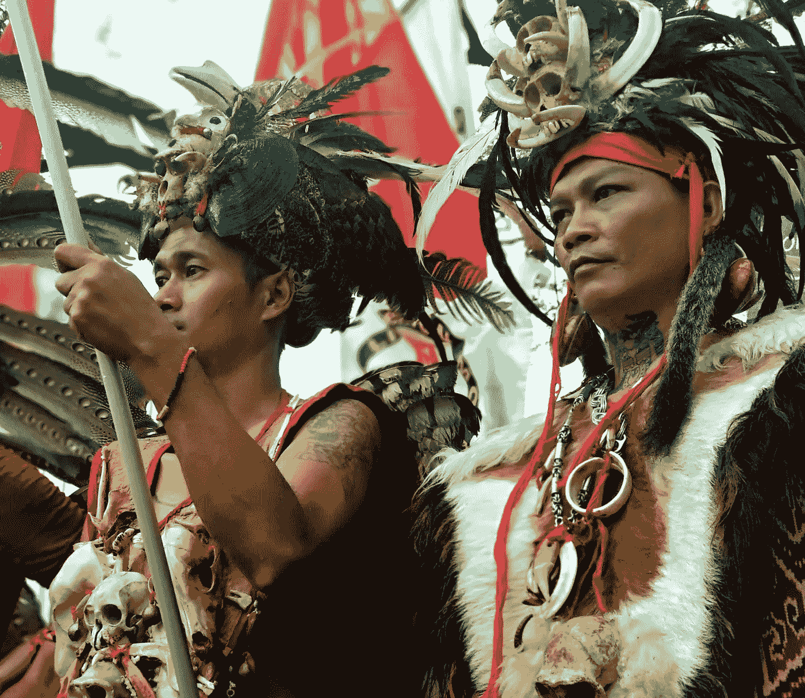
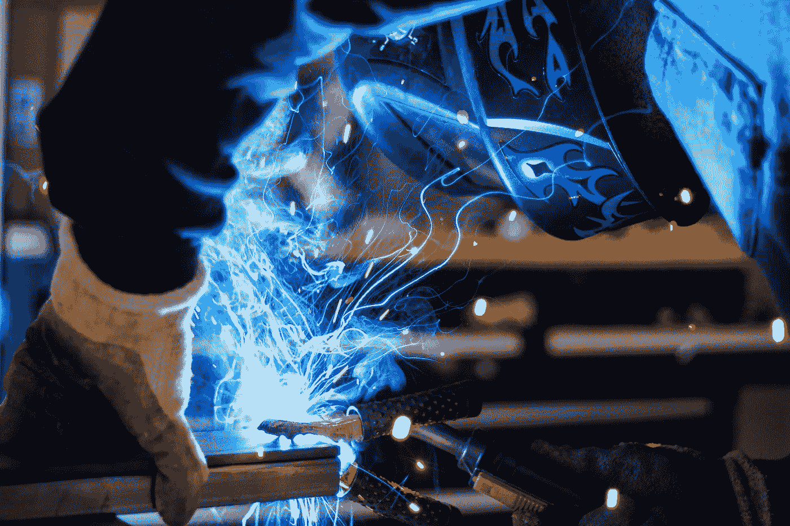
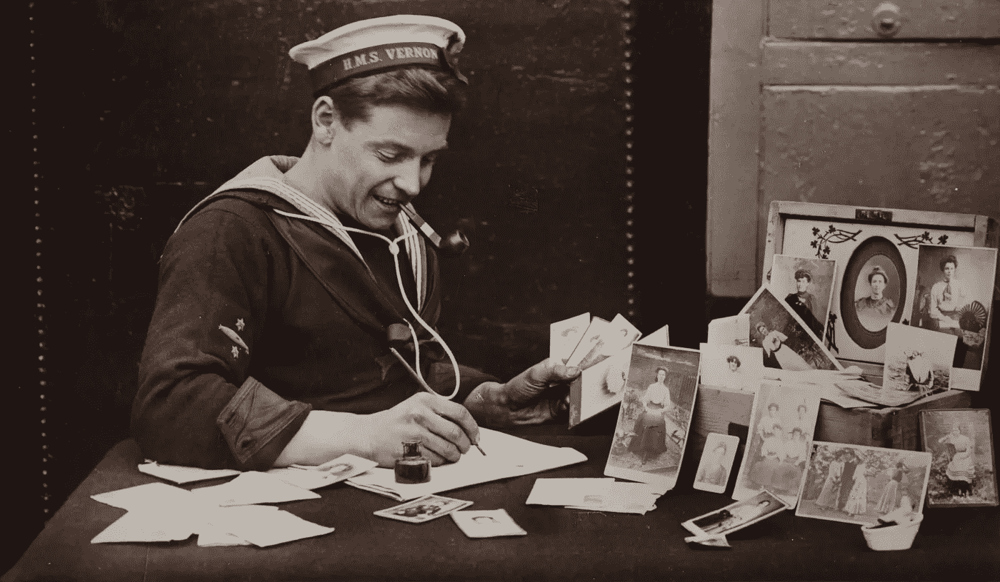
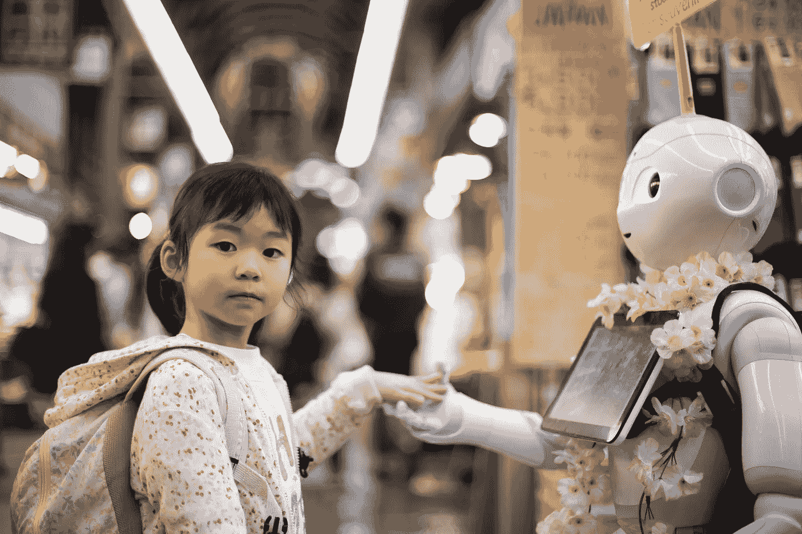
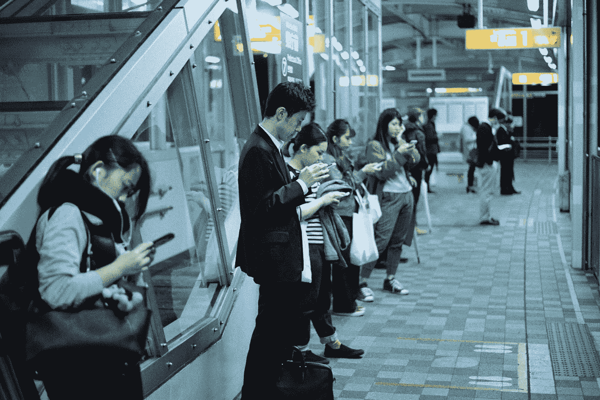
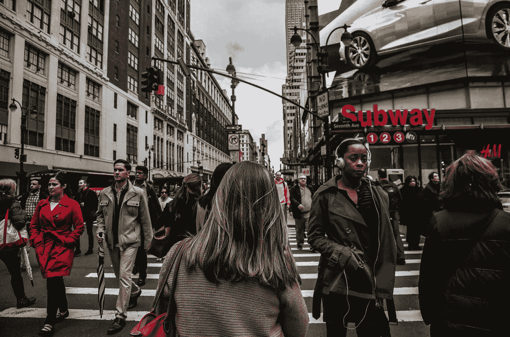
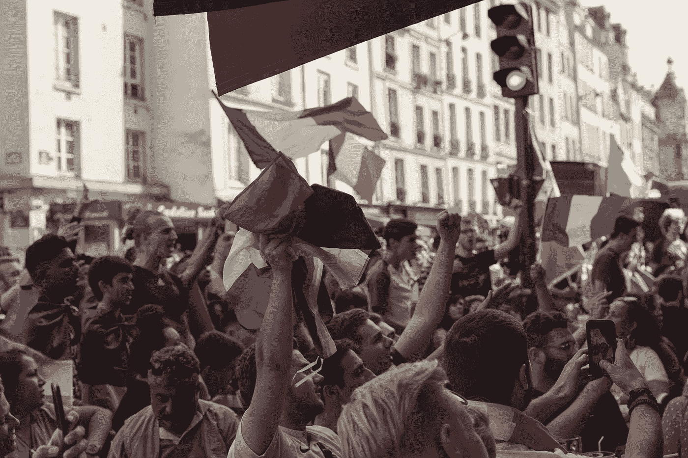
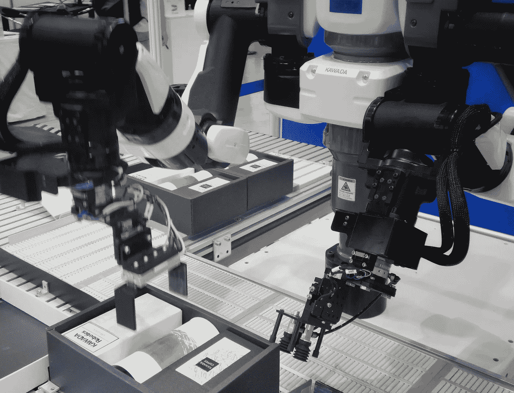
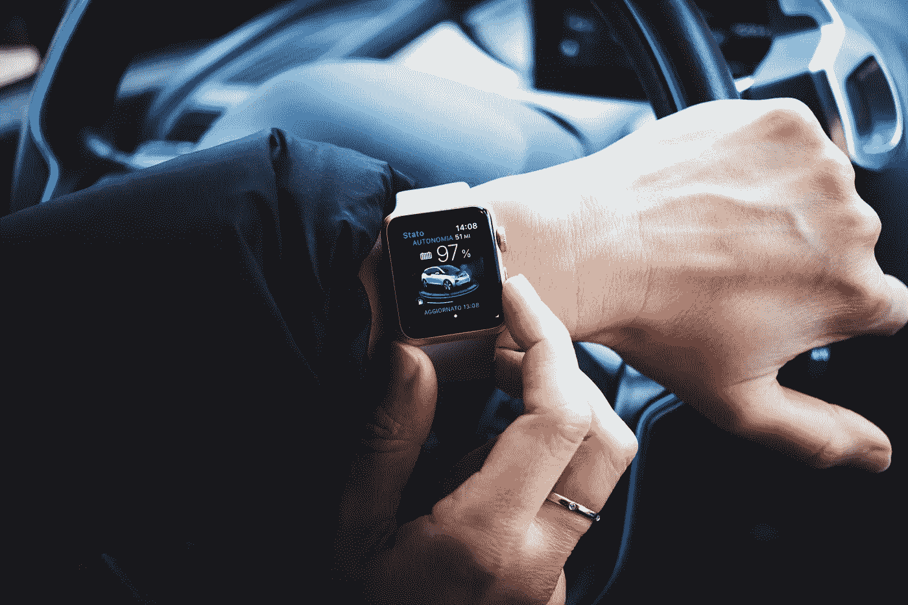

# 人与机器:为什么我们如此渴望转换角色

> 原文：<https://medium.datadriveninvestor.com/man-and-the-machine-why-were-so-driven-to-switch-roles-a31363cf4a62?source=collection_archive---------12----------------------->

> 召唤我们的问题是:我们从哪里来，向哪里去？

当今世界比以往任何时候都更加紧密地联系在一起。

今天，来自不同文化的人们可以从一开始就感受到一种社区感，因为在互联网提供的无止境的知识共享出现后，我们对彼此的生活和成长方式有了广泛的了解。

今天，我们本质上是一个大文化，亚文化源于对意识形态的忠诚。这可能与体育、电影或思想流派有密切关系，因为我们比我们的祖先更了解每一种文化和每一个人。我们的历史就是世界的历史，因为当地发生的每一个事件都是全球性的，其后果会实时展现出来。世界是一个地球村。

 [## 人工智能与创造力:梦想成真|数据驱动的投资者

### 人工智能总是让我着迷。不仅作为一套有用的工具，不断发展，而且作为一个…

www.datadriveninvestor.com](https://www.datadriveninvestor.com/2019/01/28/ai-creativity-deep-dream-comes-true/) 

> 正如尤瓦尔·诺亚·哈拉里所说，我们正在从多向一转变。

智人通过信仰不同的思想流派而合作的能力将我们带到了食物链的顶端。

智人没有速度、力量或体型的优势，但我们的好奇心给我们带来了战胜捕食者和猎物所需的所有优势。

我们已经活过了直立人和尼安德特人。我们的作品集还以将澳大利亚的巨型动物和其他物种一起带向灭绝而自豪。

生存是我们的原始本能，它证实了恐惧。

我们希望活得更久，更强大——从生物学的角度来说，尽我们所能做到最好。

我们的好奇心一直是我们寻求科学地找到我们所寻求的基因改造的答案的武器。科学和我们的好奇心给了我们今天离不开的力量。

> 我们能想象回到没有科技的时代吗？

没有互联网，人们寄信意味着等待几周甚至几个月才能得到回复。

较慢的生活节奏意味着我们感觉时间更长了。我们有更多的时间四处看看，思考，反思和社交。

我们也更加孤立于世界各地发生的一切新闻之外。来自最近文明的消息可能需要 24 小时或更长时间，因为运输有其自身的局限性。科学进步的消息，变化中的世界的奇迹只能通过无线电波和报纸到达我们这里。

对工作的期望也受到基础设施能力的限制。

几十年前我们一天有 24 小时，今天我们有 24 小时。

但是很多都变了。我们的基础设施有所进步。今天的可能性是无限的。

**科技使人类比以往任何时候都更加强大。**

我们可以实时向世界各地的人发送信息。在技术和机器的帮助下，基础设施的发展速度比我们想象的要快，这不仅节省了我们的时间，也带走了我们的时间。

由于我们今天拥有的可能性，人类对完成任务的期望更高。

我们的社会期望我们比一千年前的祖先工作得更快，在更短的时间内完成更多的工作，因为技术让我们拥有了更快的过程，这促使我们更快地处理和反应。

我们的待办事项列表不断变满。人们期望我们今天做得更多。有了机器，工作变得更容易，但要做的事情的规模要大得多，这在精神上要付出代价，因为技术在短时间内发生了很大变化，而我们没有。

我们希望以最高效的方式完成更多的工作。这不是竞争，这是生存。

人类正在寻求变得更像机器。

我们想要的只是保留让我们成为人类的东西。如果技术能帮助我们变得更像机器，它能通过变得更像人类来帮助我们吗？

技术能帮助我们解决目前只能由人类解决的复杂任务吗？

> 这就引出了一个更大的问题:机器能更像人类吗？

在我们寻找这个问题的答案的过程中，我们发现了一些我们所做的东西的商业应用，在这一过程中，我们需要利用技术来优化和完成事情。

**我们是群居动物。**

从表面上看，技术似乎创造了一个将人们聚集在一起的全球网络，但相反，它增加了社会隔离，削弱了我们与人交流的能力。

人类对被认可和减少孤独感的需求，让他们来到手机前，与数百万粘在手机上寻找同样东西的人争夺注意力。

我们害怕技术在文化上对人类的影响。随着我们在屏幕前花的时间越来越多，我们失去了理解识别行为周围的社会线索的后天能力。

技术对用户的精神和身体健康有很大的影响。过度联系会导致心理问题，如注意力分散、自恋、对即时满足的期望，甚至抑郁。

> 我们还会交往吗？

另一方面，科技让我们能够进行更多的社交。今天，我们拿起电话，给某人打电话，制定计划，然后在同一个晚上一起喝酒。

有很短的一代人仍然发现很难应对社会文化需求的转变。

但在他们之后的那些人，已经把它当成了新的常态，不知道有联系和没有联系之间的区别，因为对他们来说，它不存在。今天，我们醒着的每一秒钟都保持联系，即使我们不使用手机。

我们分享知识，收获更多。我们知道世界上正在发生的事情——将我们团结在一起的问题和我们与之战斗的问题，趋势，人民，文化等等。

在一个拥挤的没有呼吸空间的世界里，在我们的设备中，我们发现了一个全新的世界，这个世界给了我们探索和发现我们是谁以及我们想成为谁的自由。

新一代人固执己见，年轻时充满自信，因为他们知道自己想成为什么样的人，想代表什么。

对于每一个反对者来说，你会遇到一千多个和你观点相同的人。

今天，随着内容和平台的蓬勃发展，每一代人都更善于利用技术来实现自己的目标。我们这一代人承认气候变化，并在日常生活中做出决定，帮助建设一个更加绿色的世界，而上一代人生活在有意识但无知的环境中。

我们致力于通过采纳更好的信念来实现更美好的未来。

科技让我们团结起来。我们正从多人走向一人

我们对机器接管我们的工作或破坏我们的社会体系的恐惧是有道理的，但当它涉及人类行为时，复杂的问题解决方案只能由人类来解决。

如果说有什么不同的话，那就是我们正在走向与技术的融合。为了更快更好地发挥功能，我们使用技术——体外和体内。

还有一种可能性是，我们可能会看到一个技术嵌入我们身体的未来，来做我们目前需要屏幕来做的所有事情。

我们对技术改变我们生活方式和威胁我们生存的恐惧并不是新发现的。我们一直忍受着它。

恐惧是我们生存本能的产物。

我们在日常生活中不再处理生死问题，但是我们用恐惧来完成我们永无止境的日常任务。

这就是为什么我们希望更像机器，为了帮助我们做到这一点，我们希望机器更像人类。

总有一天，我们会成为人**和**机器。唯一不变的是对后果的恐惧。在那之前，我们期待着这个激动人心的时刻的下一件大事，最好的还在我们前面。我们活着——恐惧又兴奋。

