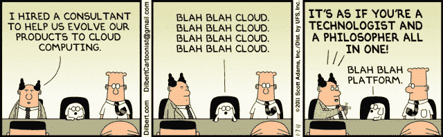
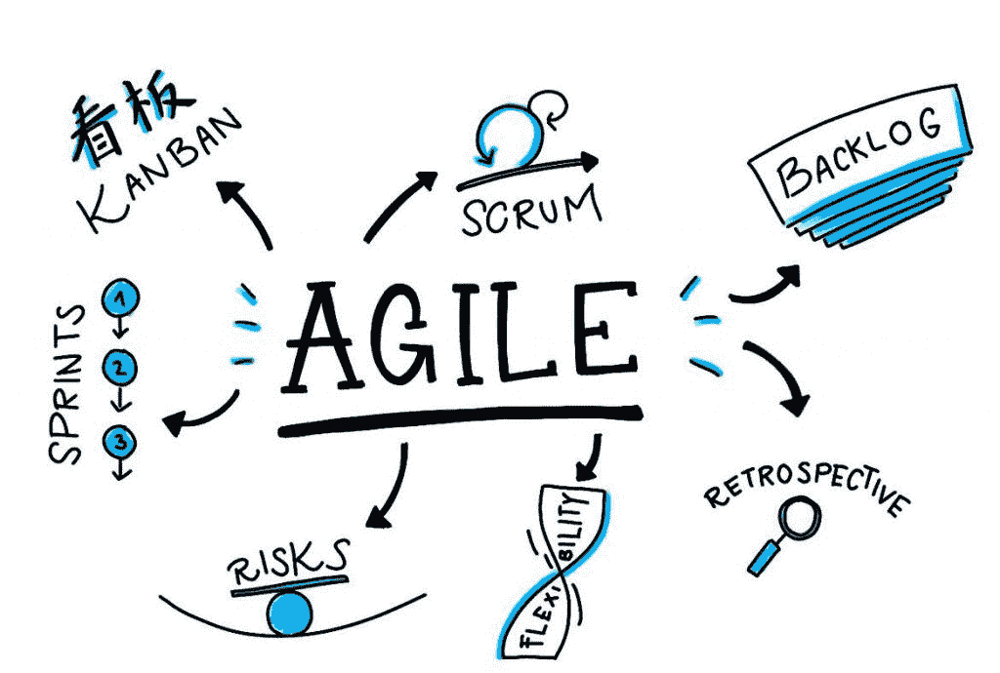
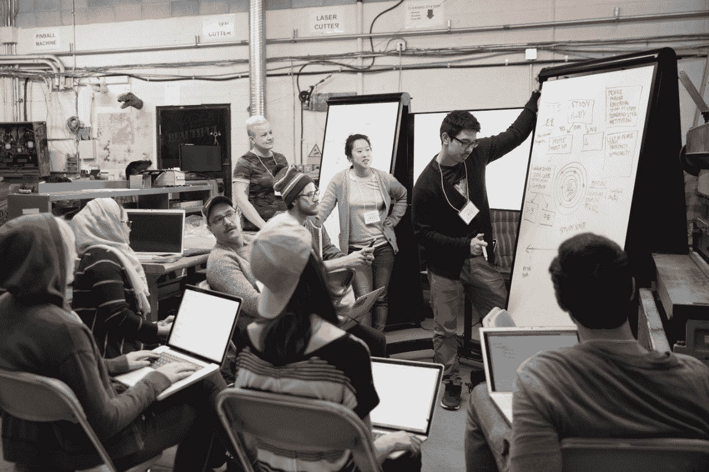
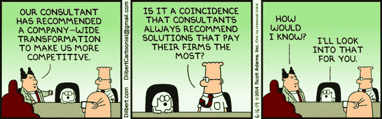

# 告诉我:什么是管理咨询？

> 原文：<https://medium.datadriveninvestor.com/management-consulting-for-dummies-826b7496835?source=collection_archive---------11----------------------->

*法语故事* [*ici*](https://medium.com/@fabien.dussaucy/le-conseil-en-management-pour-les-nuls-b91c8df5c448) *。*

**你是咨询师吗？但是你的专长是什么？你整天都在电脑前吗？**

你知道，在越来越多的工作中，计算机已经成为一种核心工具，你可能也无法逃避它。作为一名顾问**可以采取多种不同的形式，取决于你的领域、客户和你的专长**。

Most jobs today look the same…

好吧好吧，但是你在做什么？

你必须明白的是，作为顾问，客户打电话给我们**是为了帮助他解决遇到的问题**。对于每种类型的问题，你都有不同类型的顾问。有点像当你背痛时，你不会像视力问题或胃痛时一样去看同一位医生。

它还是没告诉我你在做什么…你是哪方面的专家？牙医还是肿瘤学家？

我的专长是帮助公司更好地组织自己，更好地协调他们的团队，更好地管理他们的活动。

对我来说没什么意义…你会成为什么样的医生？

好问题，我会说是风湿病学家和神经学家的混合体。我所支持的公司没有明确的病状。她在一次事故中失去了行动能力，之后我没有被任命。总的来说，随着时间的推移，他们会逐渐失去流动性和反应性。有一个时刻，他们意识到他们不能再移动了，或者需要太多的努力:他们不再有效率。

 [## 后 COVID 世界中具有前瞻性思维的虚拟财富管理顾问|数据驱动…

### 随着世界范围内病例数量的持续上升，新冠肺炎绝不是一个过去，但是我…

www.datadriveninvestor.com](https://www.datadriveninvestor.com/2020/07/28/virtual-wealth-management-with-forward-thinking-advisors-in-a-post-covid-world/) 

然后，我们介入将油注入齿轮，有时重组齿轮，并确保肌肉和大脑之间的信息流动良好。从大脑到肌肉，以确保手臂按照大脑要求的方向，以正确的速度前进，没有太多的延迟。并从身体传递到大脑，使其对体内发生的情况有很好的了解，并能更快地发现潜在的问题。

**但是风湿科医生更多是为老年人服务的，对吧？你真的是以前的商业博士吗？**

我从未从那个角度看过，但你可以说是的。公司的寿命比人长得多，最老的公司仍然非常聪明和有活力。我们常说“年龄是一种精神状态”，我认为对公司来说更是如此。

**所以你的工作是找出公司中有些生锈的地方，然后给它们一个新的生命？**

正是如此！此外，在我们的工具箱中，我们受到许多年轻公司的启发，如 [Spotify](https://www.youtube.com/watch?v=Yvfz4HGtoPc) 或 [Google](https://felipecastro.com/en/okr/what-is-okr/) 。他们已经开发出比老公司更有效的管理和驾驶方法。同时，他们从零开始，所以他们能够随着这些创新实践而成长。而这也是老牌公司的主要难点:**如何转型来采用这些创新的做法**。

好吧，我开始明白了，但是你的日常工作是什么？

总的来说，我们是受大脑的委托，或者说是受大脑中负责手部活动的部分的委托…

Dilbert. Consulting fallacy

**难道你不想停止与人体的类比吗？**

如你所愿，让我们进入我的日常生活。通常是信息系统部门指派我们提高其运营模式的效率，审查其部门与其业务的一致性，或彻底改革其管理模式以及相关的治理。目标是让他们更加敏捷，这是目前的流行词。

**嗯……除了敏捷这个词，我什么都不懂！**

它既是最重要的词，也是最不重要的词。这是最重要的，因为在这个词的背后，你会发现大量我们每天都在尝试应用的原则:

*   简单
*   合作
*   减少效率低下
*   适应变化
*   透明度
*   反馈的重要性
*   持续改进

但与此同时，这个术语本身并没有多少吸引力，有些人会称之为精益，而不知道其与 T21 的区别。其他人会告诉你，公司已经遵循这些原则几十年了，有时他们是对的。

Agile in a nutshell

因此，有了我刚才提到的工具箱、这些原则和我以前任务的经验，我可以帮助部门经理和团队经理使他们的组织更加高效、灵活、创新…

但是你从哪里学到这些的？在大学？

一点也不。嗯，我可能没有仔细地学习我应该学的所有课程……更严重的是，这仍然是非常创新的实践，而且 T2 大学和学校通常不是教授它们的最佳场所。因此，当我加入我的咨询公司时，我发现了这些新概念，无论是在内部与其他顾问一起，还是在现场与客户一起。

之后，我还会花大量时间阅读关于这些主题的[文章](https://leanandkanban.wordpress.com/2011/06/06/to-change-culture-change-the-system/)和[书籍](https://www.amazon.fr/Age-Agile-Smart-Companies-Transforming/dp/0814439098)，以便在我的客户面前更加贴切。你现在必须开始认识到，商业风湿病是一个非常广泛的主题！它可以从围绕[管理](https://www.hbrfrance.fr/chroniques-experts/2020/05/30082-trust-track-leadership-plus-quun-style-de-management-un-avantage-concurrentiel)和[领导](https://www.youtube.com/watch?v=lmyZMtPVodo)的问题，到[团队](https://less.works/less/structure/feature-teams.html)和[部门](https://businessagility.institute/learn/evans-theory-of-agile-constraints/)的划分，通过同步这些[团队](https://www.scrum.org/resources/what-is-scrum)和[部门](https://www.scaledagileframework.com/)的方法，定义[目标](https://medium.com/@mcleanonline/4-key-lessons-ive-learned-about-okrs-3f4b902ae9f8)，监控[财务](https://www.forbes.com/sites/stevedenning/2019/04/28/why-budgeting-cripples-agile-and-innovation/#71a96fae58f3)，[治理](https://www.youtube.com/watch?v=502ILHjX9EE)，更不用说[开发](https://blog.octo.com/retour-dexperience-mobile-le-monde-partie-2/)和[部署的所有更多技术方面了所以总是有东西要学，这是一个无底洞，这是我感兴趣的地方。](https://www.redhat.com/fr/topics/devops)

但是你怎么能帮助一个企业呢？负责的人肯定比你更有经验，他们为什么要听你的？

非常好的观点！当我开始的时候，我也在问自己同样的问题。我将再次用人体做类比。如果我以一个 30 岁的人为例，她已经 30 年了，她每天都按照自己的意愿和约束，按照自己认为合适的方式生活和指导自己的身体。因此，她是最了解自己的人，也是最知道自己想做什么的人。但是你不认为美食学家比这个人更清楚她的胃是如何工作的吗？他比这个人更能照顾好自己的胃？

Workshop meeting with customer

公司也是一样的道理。毫无疑问，一个信息系统主管比我更了解他的工作，也更了解他希望往哪个方向发展。但是在具体问题上，比如“如何采用这种创新的做法”，我会比他更熟练，很简单，因为我专门研究这些问题。

**如果我理解正确的话，你的工作是根据你的经验，找出如何让公司或公司的一部分在工作方式上更具创新性？**

我们可以这样总结，是的。所以我工作的主要部分是了解公司的具体情况和问题。然后根据管理团队的策略，描述他们如何更好地组织自己，如果必要，帮助团队转型。

所以回答你关于我做什么的问题，通常是:

1.  描述公司目前的运营方式
2.  与客户一起确定对他有意义的新的运营模式
3.  精确地描述它，这样他就能想象这具体意味着什么，他能从中获得什么
4.  定义一个允许这些新实践到位的计划
5.  并最终实现它们

这也是为什么如果我在从确定当前问题到解决这些问题的整个周期中进行干预，任务会很长。但与此同时，你可以与客户建立真正的关系。你要深入主题，而不仅仅是“制作幻灯片”。你会看到整个公司/部门的转变。

Dilbert. One biais of consulting firms

**超级有意思！当你谈到敏捷实践或新的组织模型时，你能给我举些例子吗？**

很高兴听到你说咨询很有趣！对于敏捷实践或组织模型的例子，我将在下一次告诉你更多关于它们的内容，这更具技术性。

没问题，我现在要做的就是祝你的客户转型好运？

是的，客户有时会经历困难时期，他们必须做出重大努力来转变他们的运营方式。与此同时，当你在风湿科医生或理疗师那里接受康复治疗时，如果你没有受到一点伤害，你就没有取得进展，对吗？

Consultant is the best job ever

每周，我都会在时事通讯上分享我阅读中最精彩的部分。在这里唱:**= = =**

## *访问专家视图— [订阅 DDI 英特尔](https://datadriveninvestor.com/ddi-intel)*