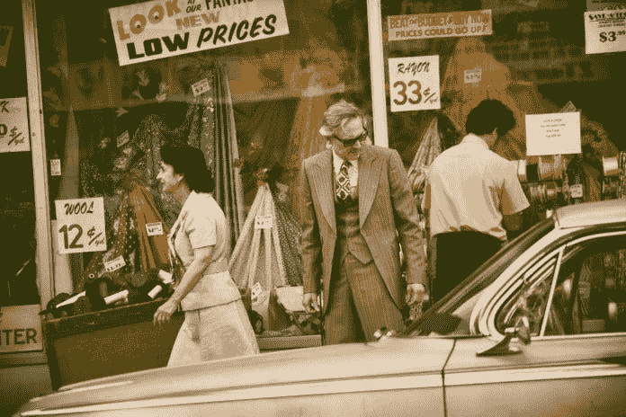
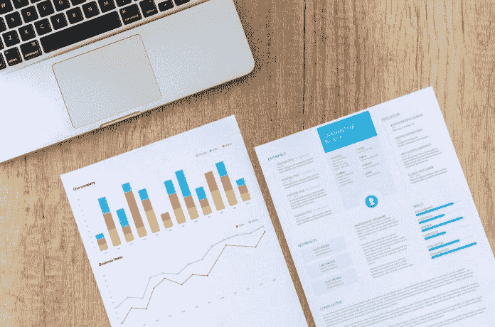

# 管理促销

> 原文：<https://medium.datadriveninvestor.com/managing-promotions-data-driven-investor-6f5d41e9be23?source=collection_archive---------33----------------------->

## 没有促销计划，需求计划就会失败

根据维基百科，推广的定义是:

> “在市场营销中，促销是指任何类型的营销传播，用于告知或说服目标受众某一产品、服务、品牌或问题的相对优势。促销的目的是提高知名度、引起兴趣、增加销售额或创造品牌忠诚度。它是市场组合的基本要素之一，市场组合包括四个 P，即产品、价格、地点和促销。

促销的目标有三个:

1.  向消费者和其他人展示信息。
2.  来增加需求。
3.  使产品与众不同。

 [## 影响者在聚光灯下表演|数据驱动的投资者

### 影响者营销是一个脱颖而出的游戏。结果是一个令人难忘的-和可信的-连接到一个产品或…

www.datadriveninvestor.com](https://www.datadriveninvestor.com/2020/01/15/influencers-perform-in-the-spotlight/) 

促销，顾名思义，是由市场营销管理的。这可能包括但不限于降价、交叉产品包、以较低价格组合多个单一产品、抽奖、其他产品折扣等。所有这些都增加了消费者的消费。至少这是一个商家的期望。

促销偏离整个市场取决于你的企业规模。换句话说，通过促销，我们从竞争对手那里购买市场份额(假设我们的比他们的促销更好),并希望尝试我们产品的新客户会继续使用我们的品牌。

这里的问题是，需求增量的现实预期是什么？

这个问题起着关键作用，因为促销的过度销售意味着购买更多的市场份额，但减少了利润(因为促销需要投资)，另一方面，没有人希望有一个低绩效的促销，因为否则我们无论如何都不会计划它。

# 促销前计划

在促销之前，我们需要计划。哪些参数将会发生变化，这些 SKU 在销售和利润方面对业务和类别的贡献是什么？

我们需要分析 SKU 的价格弹性和分布变化。我们需要了解他们的行为。根据标准需求计划计算，三方面的预期变化是什么:乐观、悲观和最重要的现实。

公司应该根据最现实的情况制定计划，但也要为乐观和悲观的情况做好准备，以便为现实世界做好准备。

# 在促销计划期间

根据促销的持续时间，我们需要定期进行报告以了解趋势。如果没有很好地执行，不如讨论如何使其更加突出，以及我们的哪些假设不起作用。相反，如果它表现出色，我们的利润会有很大风险吗？我们还应该注意我们的库存状况，如果我们卖不出去，它可能是过剩的库存，或者如果我们卖得很多，它可能是短缺的库存。

当然，对于所有的风险和机会，有一些缓解计划是很好的。

# 后期促销分析

促销的结束并不意味着促销研究的结束。

现在我们需要检查我们的假设是否正确，什么可以更好，我们可以做些什么来使它变得更好。

所有的假设，决定和结果都应该保存到一个数据库中，这可能是一个简单的电子表格。这里的主要思想是让所有可及的东西远离遗忘。

# 结论

推广策划是当今商业环境的一个无止境的旅程。我们都试图从竞争对手那里窃取市场份额和利润。然而，除非我们以一种清晰的方式去做，否则我们会重复我们的错误，反复失败，造成金钱损失。

巴里斯·努尔鲁拥有工业工程学位，拥有多家跨国公司的行政管理经验。目前管理一家全球最佳快速消费品公司的区域销售和运营。他还在苹果商店和谷歌 Play 商店的 Baseduo 中开发了优秀的应用程序。你可以通过 baris@baseduo.com 联系到他

*原载于 2020 年 3 月 30 日*[*【https://www.datadriveninvestor.com】*](https://www.datadriveninvestor.com/2020/03/30/managing-promotions/)*。*