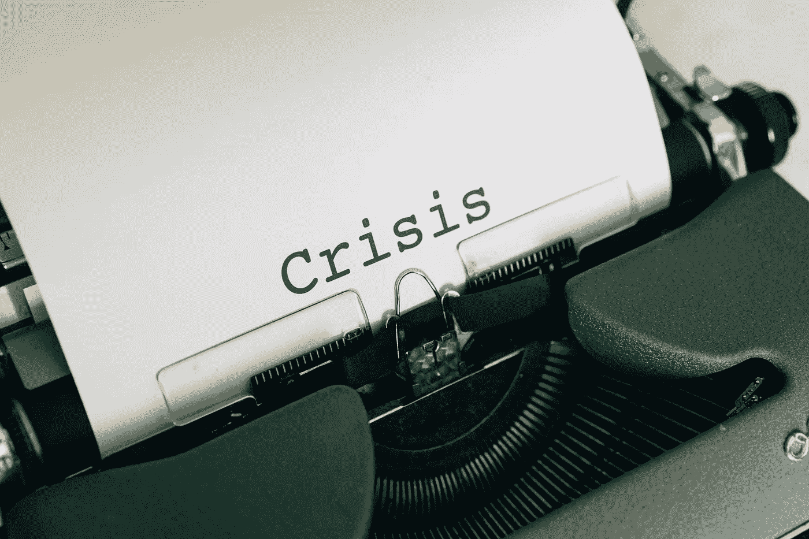

# 如何在危机中管理好你的钱以做得更好

> 原文：<https://medium.datadriveninvestor.com/managing-your-money-in-a-crisis-1e824676c673?source=collection_archive---------4----------------------->

## 疫情，经济衰退，甚至是萧条…

## 如果你的收入即将下降或停止(或者已经下降或停止)，该怎么办

Photo by [Markus Winkler](https://unsplash.com/@markuswinkler?utm_source=unsplash&utm_medium=referral&utm_content=creditCopyText) on [Unsplash](https://unsplash.com/s/photos/crisis?utm_source=unsplash&utm_medium=referral&utm_content=creditCopyText)

毫无疑问。

我们正处于一场严重的金融和经济危机中，比我们大多数人经历过的任何一次都要糟糕。

仅仅两周，1000 万工人提交了新的失业申请。

[国会预算办公室(CBO)预计](https://www.cbo.gov/publication/56314)失业率将在 2020 年第二季度超过 10%，经济收缩速度可能超过 28%的年化率！

如果你还在工作，你的雇主可能已经减少了你的工作时间，并且可能正在考虑休假甚至解雇员工。

如果你是个体户，客户可能会远离你，削减开支，搁置项目，或者干脆取消项目，因为他们试图阻止赤字的浪潮。

吓人。

但是并没有失去一切…

# 这对您的财务意味着什么

你的收入可能会下降，甚至完全停止。即使它没有发生，也没有办法知道它是否会在明天、下一周或下个月发生。

现在是开始在危机模式下管理你的财务的时候了。这意味着你必须尽可能地削减开支，尽可能地增加收入，并对你的债务进行战略规划。

 [## 更好的预算，打造更大的|数据驱动型投资者

### 即使是专家也承认它们并不完美。从 1 到 10 的范围内，安东尼·科普曼和德尔…

www.datadriveninvestor.com](https://www.datadriveninvestor.com/2018/11/08/budget-better-to-build-bigger/) 

虽然偿还大部分债务通常是一个非常好的主意，但我同意[本·勒福特](https://medium.com/u/9ccc688740f0?source=post_page-----1e824676c673--------------------------------)的观点，即[在衰退期间偿还债务基本上是个坏主意](https://medium.com/makingofamillionaire/a-recession-is-the-worst-time-to-pay-down-debt-610134f2b1cd)。

是的，当你的收入下降时，偿还债务是一个更大的问题。以前你可能能够收支平衡，还能用信用卡支付最低还款额，现在这可能是不可能的了。

更糟糕的是，如果你习惯于开新的信用卡来弥补持续的不足，较低的收入会让你更难继续借更多的钱。

你可能会面临一些严酷且不可避免的财务现实。

# 你现在可以做的 5 件事

以下是你需要做的 5 件事，或者至少考虑做的 5 件事，以最小化当前危机对你当前和长远未来的影响。

## 1.分类你的花费

首先，检查一下你过去几个月的开销，尽可能地削减开支。

从优秀的商业书籍[利润第一](https://www.amazon.com/Profit-First-Transform-Cash-Eating-Money-Making-ebook/dp/B01HCGYTH4)来解释，这意味着削减任何生存不需要的东西，并寻求用更便宜的替代品取代你确实需要的东西。

你现在所做的是尽可能地降低你的生活成本，使之接近(或者最好低于)你目前的收入。

## 2.设法增加你的收入

接下来，发挥创意，拿出一些额外的现金。当你不能像以前那样经常外出时，你能做些什么来赚点外快呢？

也许你的雇主(或客户)需要做一些你从来没有时间去做的事情，但是一旦疫情结束，这将会让他们走在更前面。如果你的工作时间因为业务放缓而减少，这是一个很好的探索方向。

试着写和卖一些你擅长的数字产品，比如电子书，可以帮助人们解决问题，最好是每个人都被困在家里的问题。如果有足够的需求，考虑创建订阅服务。如果像这样建立一个新的业务现在太难处理，你至少可以在支付作家的网站上发布文章。

如果你有一大堆不需要的东西，试着在易贝或 Craigslist 上出售。这显然不是最好的时机，但正如他们所说，一个人的垃圾是另一个人的财富。也许你的杂物正是其他人在寻找的东西，他们想在关在家里的时候找些有趣的事情做。

作为一个额外的好处，做所有这些会让你忙起来，而不是闷闷不乐或纠结于你无法控制的事情

## 3.继续支付最低还款额

除非这意味着失去你的家，你的公用事业，健康，或食物，保持这些最低限度的付款。

如果做不到这一点，你的信用评分会像石头一样下降。这将是一个坏消息，因为良好的信用评分有助于你在需要时获得更便宜的新贷款(见下文)，并可能意味着更低的保险成本或在你不得不搬家时获得新的出租房的能力。

请注意，在当前的疫情期间，你的房东可能不允许因你未支付租金而驱逐你，你的抵押贷款发行人可能会推迟付款。然而，仅仅因为你能做这些并不意味着你一定要做。以你的房东为例，一旦疫情结束，你可能会欠下很多欠租，可能还有利息。在抵押贷款的情况下，即使银行没有取消你房子的赎回权，利息也会继续增加，这将使你越来越深地陷入债务。

## 4.合并债务

如果你有多张信用卡和其他消费债务，考虑将所有这些合并成一个新的债务(但只有在你完成了上面的步骤 1，以确保你不会因为有更多的可用信贷而陷入更深的债务中)。

你有几个选择。

*   开立一张新的 18 个月利率为 0%的信用卡(例如，见[CreditCards.com](https://www.creditcards.com/best-credit-cards/)，或[NerdWallet.com](https://www.nerdwallet.com/the-best-credit-cards)，并把你所有的余额转移到那里。
*   根据你的信用评分，你可以通过像 LendingClub.com[这样的 P2P 贷款网站获得低于 8.2%的 5 年期无担保贷款。我甚至见过低于 11%利息的贷款给信用分数低于 695 的借款人。(本着充分披露的精神，我有一点钱投资于通过 LendingClub 发放的贷款)](https://www.lendingclub.com/)
*   如果你拥有自己的家，并有足够的股本，联系你的抵押贷款顾问，了解可能的套现再融资，以巩固你的债务。如果你有一段时间没有再融资，你可能会发现新贷款的利率比你目前的抵押贷款利率低，可能会减少你的抵押贷款付款，同时还清所有其他债务。

接下来是这样的。说你欠:

*   在收取 23.43%利息的 Visa 卡上支付 10，000 美元(根据 Wallethub.com 的说法，如果你的信用[良好，这是典型的情况)](https://wallethub.com/edu/cc/average-credit-card-interest-rate/50841/)
*   收取 25.44%利息的储蓄卡上的 5000 美元
*   你的抵押贷款是 202，350 美元(接近全国平均水平，根据 Experian )，利率是 5%(如果你在过去几年没有再融资的话，这是可能的)

假设您的卡需要最低还款额[25 美元或 2%,加上应计利息，您的最低还款额为:](https://www.nerdwallet.com/blog/credit-cards/minimum-payment-credit-card/)

*   你的 Visa 卡上有 395.25 美元
*   你的购物卡上有 206 美元
*   1207.85 美元的按揭付款(不包括房主保险和财产税；假设一笔初始金额为 225，000 美元的 30 年期固定贷款，大约在 6 年前开始)

因此，你在这里的总债务偿还额为每月 1809.10 美元。

如果你将两张信用卡的余额转移到一张新的 0%利息的卡上，并为卡上新的 15，000 美元余额支付 2%的最低利率，你的卡付款将下降到 300 美元，每月为你节省 301.25 美元。然而，请记住，在 18 个月内，你的利息会跳得更高，因此，虽然你在此之前会节省大量的钱，但一旦诱惑利率结束，你将不得不解决另一个问题。

> 从高息信用卡整合到一张新的零利率信用卡可以为你节省数千美元。

相反，如果你以 9%的利率从 LendingClub 获得一笔 5 年期 15000 美元的贷款，那么支付额将是 311.38 美元，每月节省 289.87 美元。这没有之前的想法节省那么多，但它将提供一个固定的付款计划，将在 5 年内付清全部 15，000 美元。

> 巩固到一个无担保的固定利率贷款也可以节省你数千美元，并确保你的条款不会改变，直到债务还清。

最后，让我们看看如何将你的三笔债务合并成一笔新的抵押贷款，比如 4%的利息。让我们假设你也将价值 3000 美元的成交成本投入到新贷款中。您的新余额将是 220，350 美元(忽略您当前贷款余额和还款额之间的差额)。你的新付款(本金和利息)将是 1051.98 美元。这比您当前的付款每月少 757.12 美元！

> 整合到一个再融资抵押贷款可以节省你数百美元一个月，在一个更长的时间之前，你的抵押贷款还清的代价。

请注意，您将重新开始计算您的抵押贷款，因此您将比不做任何更改时多支付大约 16，000 美元。虽然这不是什么好消息，但您确实获得了以下好处:

1.你目前的现金短缺要少得多

2.考虑到通货膨胀和你可能可以扣除的抵押贷款利息，你的实际成本最终将远低于 16，000 美元，甚至可能低于零。

 [## 为什么提前偿还房屋抵押贷款几乎总是一个糟糕的主意

### 这就是为什么越慢偿还抵押贷款越经济，也越安全的原因

medium.com](https://medium.com/financial-strategy/why-prepaying-your-mortgage-is-almost-always-a-terrible-idea-88fa87977d77) 

## 5.如果您无法整合，但有多余的现金

你可以选择偿还一些高息债务。然后你可以看到卡上更多的可用信用额度作为你的“应急基金”然而，你的发卡机构可能会突然决定将你的信用额度降低到你当前的余额。尤其是如果这恰好发生在你失去收入的时候，你将没有流动性和几个好的选择。

你可以将多余的现金存入联邦存款保险公司保险的银行储蓄账户——根据 Bankrate.com 的说法，你可以在某些账户上获得高达 1.7%的 APY。这结合了安全性、流动性和至少足够抵消通货膨胀的利息。

如果你在一个安全且流动性强的地方囤积了大量现金，[考虑一下，在股市较近期高点下跌 25%以上的时候投资股市是否是一个不错的长期投资](https://medium.com/financial-strategy/even-now-if-youre-scared-to-invest-in-stocks-you-re-afraid-of-the-wrong-thing-42a8ac7c22e5)。

 [## 即使是现在，如果你害怕投资股票，你害怕的是错误的事情

### 你退休的真正风险(假设是很多年后)是投资不足，以及不投资…

medium.com](https://medium.com/financial-strategy/even-now-if-youre-scared-to-invest-in-stocks-you-re-afraid-of-the-wrong-thing-42a8ac7c22e5) 

# 现在要避免做的 3 件事

首先也是最重要的，不要惊慌失措，草率决定。在投资方面，这可能意味着卖掉你所有的长期投资，锁定目前只是账面上的损失。

第二，不要(继续)用自己没有的钱去买自己不需要的东西——也就是所谓的以牺牲未来的自己为代价的入不敷出。

最后，不要用现金大举偿还债务，否则你以后可能会非常怀念。如果你已经为抵押贷款本金支付了额外的款项，这一点尤其正确。无论如何，这都不是一个好主意，但除非你的情况与我们大多数人大不相同，否则在危机中，这尤其鲁莽。你可能会发现自己欠的钱少了，但无论如何，你都还不起这笔贷款。虽然你的贷款人现在可能无法取消抵押品赎回权，但在你的情况好转之前，没有人能保证这一点。

> 首先也是最重要的，不要惊慌失措，草率决定。第二，不要(继续)用自己没有的钱去买自己不需要的东西。最后，不要用现金大举偿还债务，否则你以后可能会非常怀念。

# 底线

尤其是在危机中，似乎一切都失去了控制，但是如果你保持冷静，你可以做一些事情来管理你的财务状况。遵循上面的五个要做的事情，避免三个不要做的事情，你未来的自己会有充足的理由感谢你。

# 放弃

本文仅供参考，不应被视为财务建议。在做出任何重大财务决定之前，你应该咨询财务专家。

# 关于作者

[Opher Ganel](mailto:opher@opherganel.com) 已经成功建立了几个小企业，包括一个支持 NASA 和政府承包商的咨询公司。他最近的冒险是为独立专业人士提供的[金融策略服务](https://www.opherganel.com/)。你可以在那里与他联系，或者关注他的媒体出版物[金融策略](https://medium.com/financial-strategy)。

*最初发表于*[*https://www.opherganel.com*](https://www.opherganel.com/Managing-Your-Money-in-Crisis)*。*