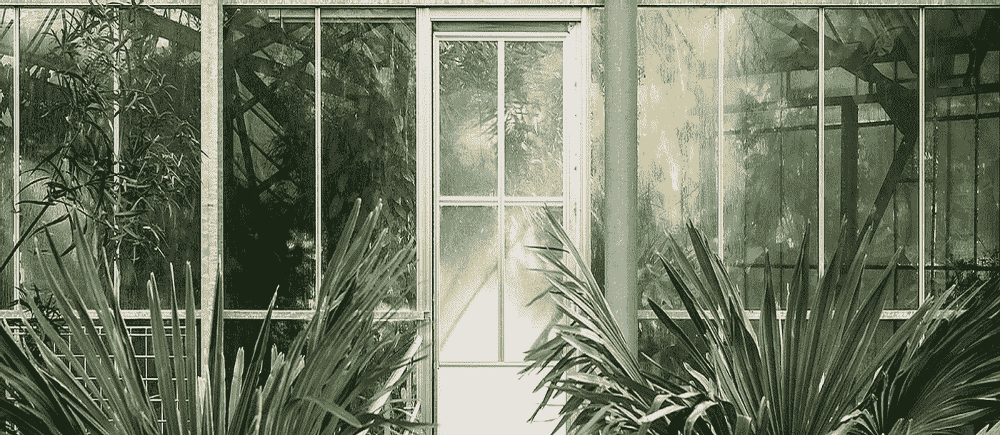
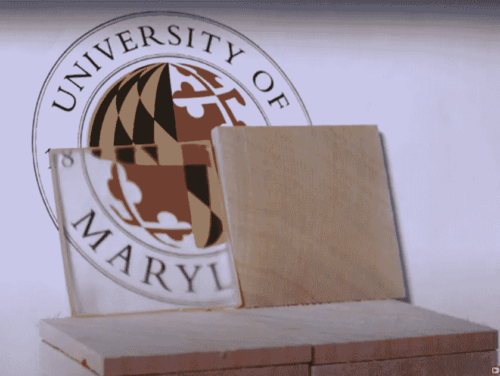
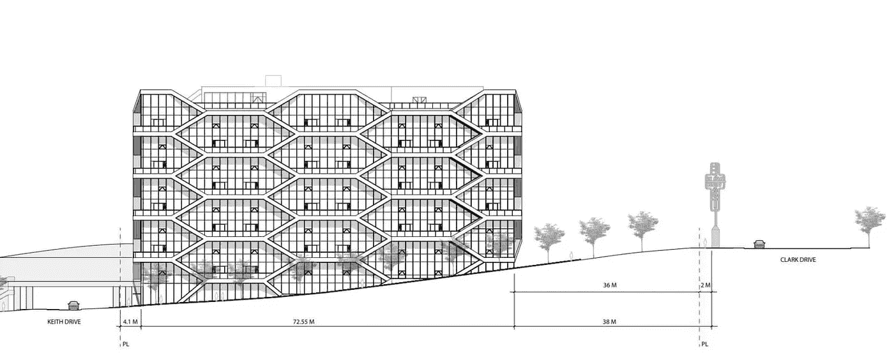
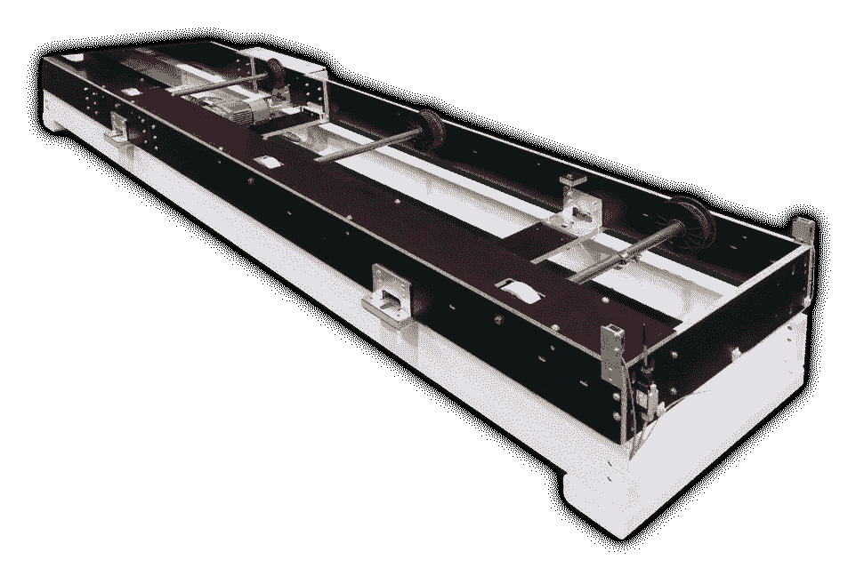

# 人类的下一个黑仔应用:木头

> 原文：<https://medium.datadriveninvestor.com/mankinds-next-killer-app-wood-7d6741844207?source=collection_archive---------2----------------------->

## 我们最古老的建筑材料进入 21 世纪

Transparent Wood — Inventwood [Website](https://www.inventwood.com/transparent-wood)

我们需要重新思考木材。它的现在和未来都不是你能想象的。看看上面图片中的玻璃窗玻璃，看看你是否能发现它有什么奇怪的地方？仔细看。那些看起来普通的窗户实际上是木制的。如果你感到震惊，我也一样。

我们大多数人认为木材是一种古老或“愚蠢”的建筑材料。在大型现代建筑、交通工具和电子设备中，它被“更智能”的材料所取代。钢、铝和塑料是我们现代的标志。木等于过去。

现在，如果我告诉你现代建筑技术可以使木结构建筑达到 20 层楼高，会怎么样？还有一位科学家改良了一种木材，其强度足以抵抗子弹的冲击。另一位工程师发明了一种强度足以制造轮胎的纸。此外，一家大型汽车制造商正在用它来制造输送系统。

木头还等于过去吗？我们对物质的先入为主的观念就是——观念。它可再生，重量轻，坚固，可塑成任何形状。更重要的是，它比许多我们赖以生存的所谓智能材料更便宜。

如果这个介绍让你思考，你还没有看到任何东西。

Wood 并不过时，它可能是人类的下一个杀手级应用。

# 使木材成为未来神奇材料的科学

在《科学美国人》的[文章](https://www.scientificamerican.com/article/stronger-than-steel-able-to-stop-a-speeding-bullet-mdash-it-rsquo-s-super-wood/)中，Sid Perkins 深入探究了现代木材技术的世界。在他的文章中，他采访了马里兰大学的科学家梁冰·胡，他开发了一种两步工艺来增加木材的密度。

木材首先在化学溶液中煮沸，以分解天然聚合物。之后，木材通过加热被压缩。这会破坏材料的细胞壁，迫使氢原子和木材的纤维素材料之间形成牢固的化学键。这一过程使原始样本的密度增加了两倍。然而，这还不是全部。

*   它的抗压能力提高了 50 倍
*   抗撕裂能力提高 10 倍
*   开发耐刮擦性和抗冲击性
*   变得坚硬 20 倍并获得防潮性
*   尽管有这些改进，它仍然可以被模制

胡还创造了一个试验，用几个样本组合起来挡住一颗模拟子弹。虽然他承认它不如凯夫拉尔纤维有效，但它只是成本的一小部分。虽然这些突破中的许多目前只是实验室中有趣的实验，但已经成立了一家公司来销售这项技术。

[InventWood](https://www.inventwood.com/) 提供三种材质:金属木材、透明木材、绝缘木材。金属木材是上面提到的坚韧材料。透明木材是本文开头的窗户材料。强化木材的部分过程还可以去除色素，使其变得透明。隔热木材是一种柔软、抗冲击的材料，也可以隔热。

Screen Capture Of [Video](https://www.youtube.com/watch?v=ufVDGv3G9B0) From University Of Maryland Showing Transparent Wood — University Of Maryland

胡认为这些木材是建筑材料、盔甲，也可能是玻璃或塑料的替代品，用来制作太阳能电池板。然而，这并不是 wood 未来管道中唯一有趣的产品。

据[福布斯](https://www.forbes.com/sites/japanesevisionarywomen/2020/11/18/innovations-incorporating-traditional-japanese-crafts-into-modern-life/?sh=6c0eac4a5c1d)报道，日本青年科学家奖得主石田幸子一直对折纸很感兴趣。在研究制造更好轮胎的方法时，她和一位老工程学教授进行了一次谈话。他提醒她弯曲和折叠是如何改变材料的各种特性的。《福布斯》还提醒我们，一种[折纸技术](https://ijpam.eu/contents/2012-79-2/8/8.pdf)也被用于打开和关闭太空中的太阳能电池板。

幸子很快发现，通过反复折叠纸张，它可以变得更强。此外，她将这种纸制成蜂窝形状，并用它来制作功能轮胎，这种轮胎在一辆汽车上工作。她还使用了另一种类似折纸的技术，用纸创造了一种能够分散地震震动的减震器。

这些可能是未来的一瞥，但木材也在今天卷土重来。

 [## 各种类型的分布式分类帐技术|数据驱动的投资者

### 随着比特币和加密货币在全球的采用、使用和魅力增长，它们已经成为常见的流行语。这个新的…

www.datadriveninvestor.com](https://www.datadriveninvestor.com/2020/12/04/various-types-of-distributed-ledger-technology/) 

# 当今木材的使用

劳雷·凯洛塞在法国国家科学研究中心发表的文章解释了波尔多正在进行的一个有趣的建筑项目。大约 15 层楼高的建筑完全用木头建造。此外，建造它们的建筑师声称它们可以安全地建得更高。

Sketch Of A Building Made With Mass Timber — Thinkwood [Website](https://www.thinkwood.com/projects/2150-keith-drive)

被称为“大块木材”的新型木材产品将多块木板钉在一起或用粘合剂结合在一起，制成更加坚固的结构。这使得木制建筑达到了新的高度。但是木材本身有一些极好的自然属性。

Cailloce 指出，当谈到密度与断裂阻力之比时，木材属于凯夫拉尔纤维和纤维复合材料。它的多孔性是由活的有机体创造的，这使它成为一种重量轻、坚固的材料。在接受研究主管兼工程师伯纳德·蒂博特的采访时，他解释道，“人们对木材有着大量先入为主的观念。”

首先也是最重要的，Thibaut 解释说，木材比其他许多材料更好地处理火。它能比金属更长久地保持结构的完整性，金属会变弱。他还指出，尽管法国的木制房屋比例很低，但大约 95%都在北美。因此，这种材料必须比其批评者声称的更安全。他说它也被用于工业。

*   赛车制造商 Ghisallo 在自行车轮圈上使用木材
*   木质纤维聚合物用于汽车仪表板
*   一些机器人装有竹臂
*   木质素是木材中第二常见的分子，在制造业中被用作石油的替代品
*   纤维素也可用于光学薄膜制造

除了这些例子，另一家使用木材的制造商正在进军汽车制造商大众汽车公司。Mike Farish 在他为*汽车物流*写的[文章](https://www.automotivelogistics.media/materials-handling/wood-you-believe-it-materials-handling-with-a-difference/38705.article?adredir=1)中提到，如果你经过沃尔夫斯堡的大众工厂，你会震惊地看到一条木制传送带。它被用来运送车身通过工厂。

LiGenium Auto Body Conveyor System — LiGenium [Website](https://www.automotivelogistics.media/materials-handling/wood-you-believe-it-materials-handling-with-a-difference/38705.article?adredir=1)

一家名为 LiGenium 的公司正在使用木质单板复合材料(WVC)，或一种现代形式的胶合板，来制造这些传送带和手推车，以运送汽车零部件。Farish 提到手推车的重量是钢制手推车的一半，但可以承载同样的重量；这样可以节省自动导航车的电池。

因此，在建筑、汽车制造和化学领域，木材并不被认为是古老的。事实上，它的受欢迎程度似乎在增加。

# 过去展示了我们的未来

[Longnow 基金会](https://blog.longnow.org/02014/12/31/humans-and-trees-in-long-term-partnership/)讲述了英国牛津新学院的一个惊人故事。虽然它的名字可能是新的，但它建于 17 世纪晚期，至今仍然存在。大约 100 年前，橡木横梁因虫害而受损。为了寻找替代的横梁，学院的管理人员开始在这个地区寻找合适的橡树。

原来，学校雇佣了一名护林员，负责照看分配给他们的林地。管理员问他是否知道在哪里可以找到合适质量的橡木来代替横梁。林务员微笑着说，他一直在想什么时候他会被问到这个问题。

林务员解释说，很久以前学校建成时，建造者种植了橡树，让它们生长了数百年。这些只是闲置着，等待被用于学校的建筑项目——在这种情况下是横梁。

现在，我想让你带着这个想法从现在开始前进 80 年。一座城市用木头建造了一座新的摩天大楼，透明的纤维素太阳能电池板覆盖在建筑上。建筑公司打好地基后，他们在 20 英里左右的地方种了几棵树。这些树被闲置着，作为最终的替换件或太阳能电池板，用于这栋建筑或可能是下一栋建筑。

我们有一个有趣的未来。希望这个未来可以由一种可再生材料建造，这种材料坚固、透明，可以让我们在最寒冷的冬天保持温暖。它还可以带我们遨游天空，还可以容纳我们的电子设备。做到这一点的杀手级应用程序现在可能就在你面前——wood。这不仅仅是一种建筑材料，而是一种长期的合作关系。

## 访问专家视图— [订阅 DDI 英特尔](https://datadriveninvestor.com/ddi-intel)