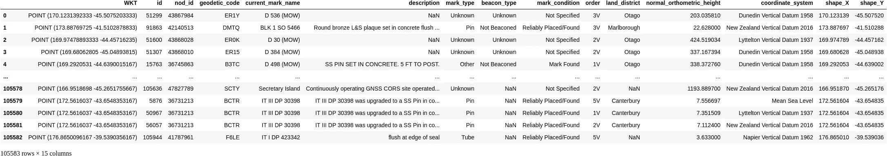
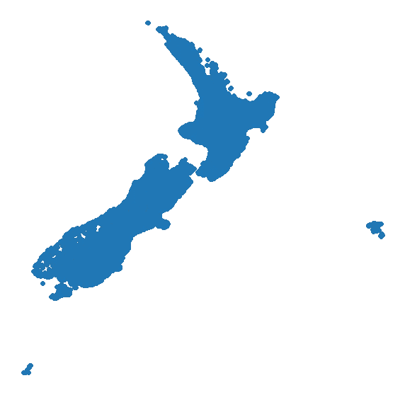
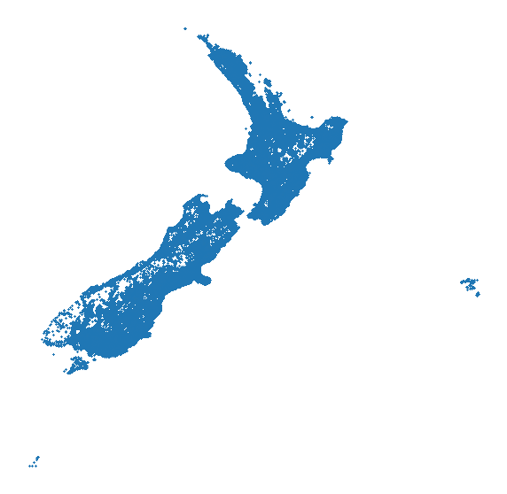
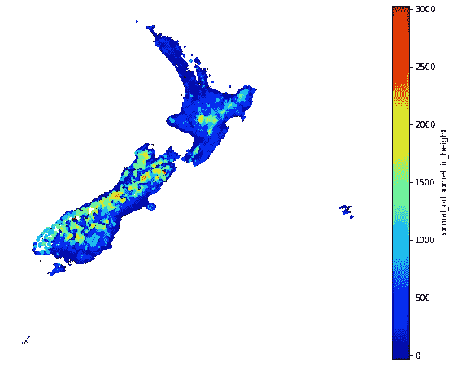
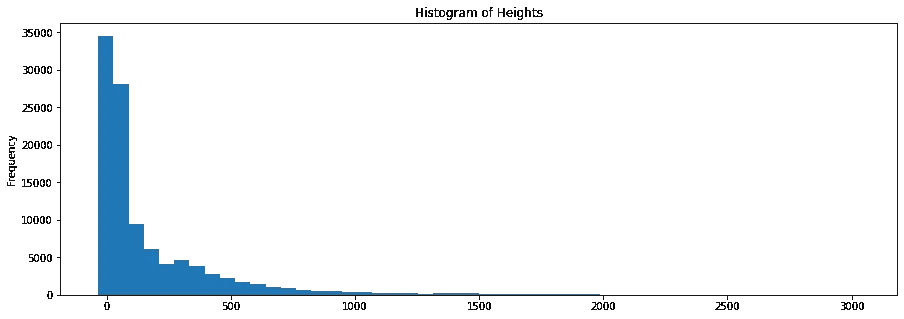
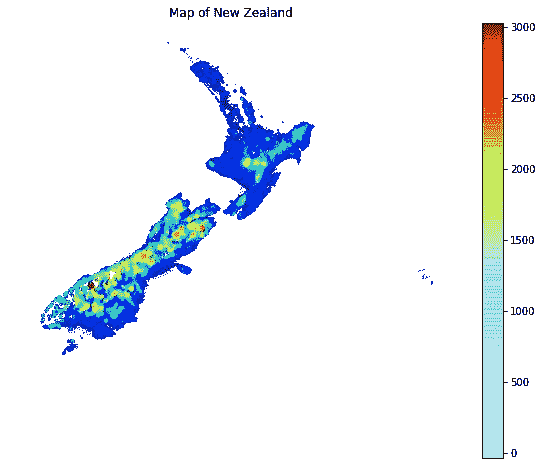
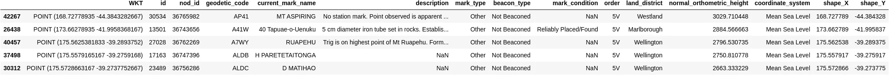
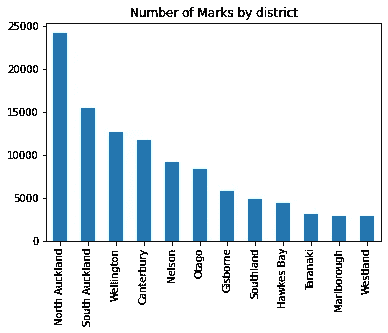
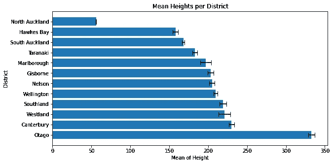
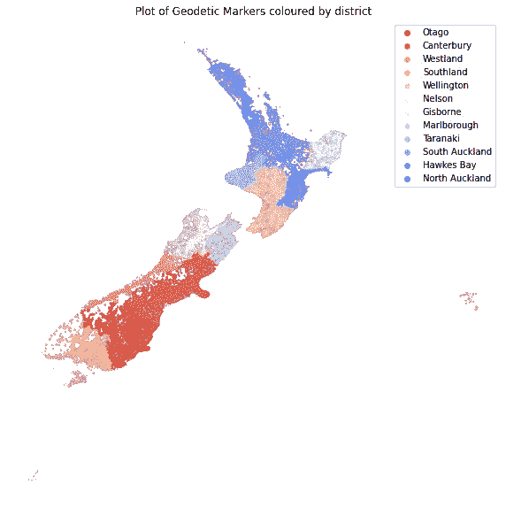

# 如何登上 Maunganui 山，从而创建一幅新西兰地图

> 原文：<https://medium.datadriveninvestor.com/map-of-nz-using-geo-markers-de87c4e537f8?source=collection_archive---------42----------------------->

这个项目的灵感始于本月初。我在 Maunganui 山度过了一个小型的家庭假期。在众多的活动中，我们开始攀登毛奥山。

在峰顶，欢迎你的不仅是海滨城镇的迷人景色，还有一个高大的不合适的建筑，被称为*大地标记*，更具体地说是一个三角站。

下面是位于 Mauao 顶部的确切 trig 站的牌匾:


这启发了我这个项目。有了这些标记的完整数据库，它们的位置和高度，我们能绘制它们的地图并根据高度给它们上色吗？

这就是我们计划在接下来的项目中要做的。

[这里是代码](https://github.com/ShivanS93/MapOfNZ)到 Github 的链接。

## 学习要点

在我们开始之前，我们先来看看一些学习点，这是这篇文章提供的。

*   如何使用`pandas`加载`.csv`数据
*   使用`matplotlib`及其功能
*   `pandas` groupby 方法和聚合
*   使用`seaborn`作为结合`matplotlib`绘图的方法

## 如何访问数据

[Koordinates 网站](https://koordinates.com/)拥有新西兰大部分的地理空间数据。我们将需要创建一个帐户来访问这个项目的数据。谢天谢地，这不用花一分钱。

我们可以搜索 [NZ 大地垂直标志](https://koordinates.com/from/data.linz.govt.nz/layer/50784/)。这些数据是由新西兰土地信息网站成员策划的。选择*垂直标记*以特定格式显示高度。

说到高度，简单的测量并不那么简单。

不涉及太多细节，垂直基准类似于所谓的*正常正高*。这就是我们最熟悉的海拔高度。正常正高实际上是海平面的平均高度(因为海平面会随着潮汐而变化)。

这与*椭球高*相反，后者将地球近似为椭球形，并以此作为参考点。

[林茨网站对此有更详细的介绍](https://www.linz.govt.nz/data/geodetic-system/datums-projections-and-heights/vertical-datums)。

## 导入库并加载数据

```
import pandas as pd
import numpy as np

#import random as r

import matplotlib.pyplot as plt
from matplotlib.colors import ListedColormap
import matplotlib.colors as colors
import matplotlib.cm as cmx
from matplotlib.lines import Line2D

import seaborn as sns

%matplotlib inline
```

这里我们可以使用`!`来唤起一个神奇的功能。在下面的例子中，我们使用 linux 命令`ls`来列出目录`./files`中的文件。

我们将使用`.csv`文件并将其加载到熊猫数据帧中。

```
# find the name of the .csv file containing the data
!ls ./filesnz-geodetic-vertical-marks.csv	 nz-geodetic-vertical-marks.txt
nz-geodetic-vertical-marks.csvt  nz-geodetic-vertical-marks.vrt
nz-geodetic-vertical-marks.prj	 nz-geodetic-vertical-marks.xml# load into dataframe
geomarks = pd.read_csv('files/nz-geodetic-vertical-marks.csv')
geomarks
```



这里，我们将数据加载到熊猫数据框架中。让我们进一步探究这些数据。

```
# explore the data more
geomarks.info()<class 'pandas.core.frame.DataFrame'>
RangeIndex: 105583 entries, 0 to 105582
Data columns (total 15 columns):
 #   Column                     Non-Null Count   Dtype  
---  ------                     --------------   -----  
 0   WKT                        105583 non-null  object 
 1   id                         105583 non-null  int64  
 2   nod_id                     105583 non-null  int64  
 3   geodetic_code              105583 non-null  object 
 4   current_mark_name          105583 non-null  object 
 5   description                73350 non-null   object 
 6   mark_type                  105583 non-null  object 
 7   beacon_type                93424 non-null   object 
 8   mark_condition             87315 non-null   object 
 9   order                      105583 non-null  object 
 10  land_district              105295 non-null  object 
 11  normal_orthometric_height  105583 non-null  float64
 12  coordinate_system          105583 non-null  object 
 13  shape_X                    105583 non-null  float64
 14  shape_Y                    105583 non-null  float64
dtypes: float64(3), int64(2), object(10)
memory usage: 12.1+ MB
```

## 探索数据

我们可以看到总共有 105，582 个条目。

重要的特征(输入变量)是`shape_X`、`shape_Y`，类似于经度和纬度，以及`normal_orthometric_height`，是高度。这些都考虑到了，没有遗漏值。

使用`shape_X`和`shape_Y`，我们实际上可以画出这个来表示地理空间。这可能以前已经做过无数次了，但是当我在 Aurélien Géron 的书 *Hands On Machine Learning，第二版*中发现这一点时，它让我大吃一惊！

```
mapNZ = geomarks.plot(kind='scatter', x='shape_X', y='shape_Y',  figsize=(10,10))
ax = plt.axis('off')
```



眼熟吗？

是新西兰！

标记太多了，准确的说是 105582 个。所以，让我们减小标记的大小。我们可以改变参数:

*   `alpha` -这是标记的不透明度
*   `s` -标记的大小

这将使我们更容易看到单个的标记。

```
mapNZ = geomarks.plot(kind='scatter', x='shape_X', y='shape_Y', 
                       figsize=(10,10), alpha=0.8, s=0.2)
ax = plt.axis('off')
```



现在，我们可以根据垂直高度应用颜色。

这些重要的参数是:

*   `c` -这是点数的颜色
*   `cmap` -这提供了配色方案；我们将使用`jet`

利用这些参数将为我们的图表创建另一个维度。

我们还根据高度改变了标记的大小，以强调这一属性。我们除以 100，以便进行明显的缩放。

```
mapNZ = geomarks.plot(kind='scatter', x='shape_X', y='shape_Y', 
                            figsize=(10,8), s=geomarks['normal_orthometric_height']/100,
                            c='normal_orthometric_height', cmap=plt.get_cmap('jet'), colorbar=True)

ax = plt.axis('off')/home/shivan/miniconda3/envs/shivan_env/lib/python3.7/site-packages/matplotlib/collections.py:922: RuntimeWarning: invalid value encountered in sqrt
  scale = np.sqrt(self._sizes) * dpi / 72.0 * self._factor
```



您可能会注意到，尽管垂直高度改变了标记的大小，但较低的点淹没了较高的点。

当我们更详细地探索垂直高度时，我们可以看到大多数都在较低的一端。a 图显示的数据是*尾重*。

```
heights = geomarks['normal_orthometric_height']
heights.describe()count    105583.000000
mean        176.935780
std         280.401109
min         -34.179500
25%          17.300748
50%          56.743200
75%         223.130634
max        3029.710448
Name: normal_orthometric_height, dtype: float64height_graphs = heights.plot(kind='hist', bins=50, figsize=(15,5), title='Histogram of Heights')
```



我们可以通过 cmap 改变α。我们采用 cmap 并改变α，与较高高度的暖色相比，较冷的颜色与较低的垂直高度相关联，也具有较低的α。

```
x = geomarks['shape_X']
y = geomarks['shape_Y']
c = geomarks['normal_orthometric_height']
s = geomarks['normal_orthometric_height']/100

cmap = plt.cm.jet
my_cmap = cmap(np.arange(cmap.N))
my_cmap[:, -1] = np.linspace(0, 1, cmap.N)

my_cmap = ListedColormap(my_cmap)

plt.figure(figsize=(10,8))
plt.scatter(x, y, c=c, s=s, cmap=my_cmap)
plt.title("Map of New Zealand")
ax = plt.axis('off')
cbar = plt.colorbar()/home/shivan/miniconda3/envs/shivan_env/lib/python3.7/site-packages/matplotlib/collections.py:922: RuntimeWarning: invalid value encountered in sqrt
  scale = np.sqrt(self._sizes) * dpi / 72.0 * self._factor
```



这是我们打算制作的地图。

但是我们不要就此打住！让我们看看其他方面的数据。

[](https://www.datadriveninvestor.com/2020/12/07/name-matching-techniques-with-python/) [## 使用 Python |数据驱动投资者的名称匹配技术

### 我们确实面临很多情况，我们必须匹配一个有很多变体的单词。这可能是因为错别字…

www.datadriveninvestor.com](https://www.datadriveninvestor.com/2020/12/07/name-matching-techniques-with-python/) 

你可以看到暗红色的点是所有标记中最高的。这是[Mt aspirating](https://en.wikipedia.org/wiki/Mount_Aspiring_/_Tititea)，不是新西兰最高的山峰，是奥拉基或库克山。

```
# Top highest geodetic markers in New Zealand
geomarks.sort_values(by='normal_orthometric_height', ascending=False).head()
```



## 进一步的数据探索

让我们看看每个地区的标记。然后，我们可以将这些数据绘制成柱状图。

```
geomarks['land_district'] = geomarks['land_district'].astype('str')
by_district = geomarks['land_district'].value_counts()
by_districtNorth Auckland    24125
South Auckland    15496
Wellington        12595
Canterbury        11741
Nelson             9129
Otago              8326
Gisborne           5765
Southland          4847
Hawkes Bay         4427
Taranaki           3092
Marlborough        2884
Westland           2868
nan                 288
Name: land_district, dtype: int64
```

我们可以看到实际上有一些隐藏的`nan`。[南代表‘不是一个数’](https://en.wikipedia.org/wiki/NaN)。它表示空数据。

我们可以通过将列类型转换为字符串来揭示这些`nan`。我们需要丢弃这些以便进行后续处理。

```
geomarks = geomarks[geomarks['land_district']!='nan']
by_district = geomarks['land_district'].value_counts()
by_districtNorth Auckland    24125
South Auckland    15496
Wellington        12595
Canterbury        11741
Nelson             9129
Otago              8326
Gisborne           5765
Southland          4847
Hawkes Bay         4427
Taranaki           3092
Marlborough        2884
Westland           2868
Name: land_district, dtype: int64
```

在这里，`nan`已经被移走了

```
by_district.plot(kind='bar', title='Number of Marks by district')
plt.show()
```



接下来我们来看看各区的平均高度。我们使用`groupby`和`agg`或聚合来实现这一点。我们还将删除额外的列以提高可读性

```
district_group = geomarks.groupby('land_district') # groups data by district
district_means = district_group.agg(['mean', 'sem']) # 'sem' means standard error, sem = std / n ** (1/2)
district_means = district_means.drop(['id', 'nod_id', 'shape_X', 'shape_Y'], axis=1) # dropping extra columns for readability
district_means = district_means.sort_values(by=('normal_orthometric_height', 'mean'), ascending=False)
district_means
```


```
x = district_means[('normal_orthometric_height', 'mean')]
err = district_means[('normal_orthometric_height', 'sem')]

# notice how we call the tuple for a hierarchical column

plt.figure(figsize=(10,5))

plt.barh(y=x.index, width=x.values, xerr=err, capsize=5)

plt.title('Mean Heights per District')
plt.xlabel('Mean of Height')
plt.ylabel('District')
plt.show()
```



我们可以看到奥塔哥平均得分最高。

让我们回到新西兰地图。我们要做的不同的是，我们要绘制点，但使用分类颜色。颜色将基于地区。颜色将根据该地区的平均高度进行排名。

我们将使用`seaborn`调色板来创建颜色标签，它将是间隔均匀的 RGB 值。

我们还必须使用`Lin2D`创建一个自定义图例

```
x = geomarks['shape_X']
y = geomarks['shape_Y']
s = geomarks['normal_orthometric_height'] / 500

plt.figure(figsize=(10,10))

colour_labels = list(district_means.index) # turns districts into a list
rgb_values = sns.color_palette('coolwarm_r', len(colour_labels)) # use seaborn to create colours, 
                                                                 # the number is based on the number of districts
colour_map = dict(zip(colour_labels, rgb_values)) # create a dict of district as keys and colours as values

legend_elements = [Line2D([0], [0], marker='o', color='w', markersize=8,
                          markerfacecolor=colour_map[label]) for label in colour_map] # creating a legend

NZ_d_map = plt.scatter(x, y, alpha=0.5, s=s, c=geomarks['land_district'].map(colour_map))
leg_ = plt.legend(legend_elements, colour_labels)
ax = plt.axis('off')
title_ = plt.title('Plot of Geodetic Markers coloured by district')/home/shivan/miniconda3/envs/shivan_env/lib/python3.7/site-packages/matplotlib/collections.py:922: RuntimeWarning: invalid value encountered in sqrt
  scale = np.sqrt(self._sizes) * dpi / 72.0 * self._factor
```



现在我们有了一张新西兰的地图，它是基于陆地区域的颜色编码的，按照标记的平均高度来排列。

## 结论

散步和假期对创造想法很有帮助。在这里，一次简单的登山激发了一个想法，那就是根据新西兰周围的大地测量标志的高度来制作一幅地图。

我们使用了各种技术——多亏了 Python 库、`pandas`、`numpy`、`matplotlib`和`seaborn`—来处理来自 [Koordinates](https://koordinates.com/) 和[Land Information New Zealand(LINZ)](https://www.linz.govt.nz/)的数据。

我们使用这些数据创建了一幅新西兰地图，根据大地测量标志的正常正高进行了颜色编码。除此之外，我们创建了另一个基于陆地区域的地图，这是根据每个区域的平均高度排列的。

我希望这能对你有所帮助，我很想知道这些数据还能做些什么。请与你认为会对此感兴趣的人分享。

## 参考

1.  芒恩古奈山—可看可做的事情—北岛|新西兰。(未注明)。[Www.Newzealand.com。https://www.newzealand.com/int/mount-maunganui/](http://Www.Newzealand.com.)T2
2.  芒恩古奈山。(2020 年 11 月 20 日)。维基百科。[https://en . Wikipedia . org/wiki/Mount _ Maunganui _(mountain)](https://en.wikipedia.org/wiki/Mount_Maunganui_(mountain))
3.  地球的数据平台。(未注明)。Koordinates.com。[https://koordinates.com/](https://koordinates.com/)
4.  新西兰大地垂直标记。(未注明)。Koordinates.com。检索于 2020 年 12 月 11 日，来自[https://koordinates.com/from/data.linz.govt.nz/layer/50784/](https://koordinates.com/from/data.linz.govt.nz/layer/50784/)
5.  新西兰土地信息局。(未注明)。新西兰土地信息局。[https://www.linz.govt.nz/](https://www.linz.govt.nz/)
6.  垂直基准。(未注明)。新西兰土地信息局。2020 年 12 月 11 日检索，来自[https://www . Linz . govt . NZ/data/geodetic-system/datums-projections-and-heights/vertical-datums](https://www.linz.govt.nz/data/geodetic-system/datums-projections-and-heights/vertical-datums)
7.  (2019).第二章:端到端机器学习项目【第二章:端到端机器学习项目回顾】。《机器学习实践》(第 35-84 页)。奥雷利。
8.  Python R. Plot With Pandas:面向初学者的 Python 数据可视化——真正的 Python。realpython.com。2020 年 12 月 11 日接入。[https://realpython.com/pandas-plot-python/](https://realpython.com/pandas-plot-python/)
9.  如何规范熊猫数据框列？CodeSpeedy。2020 年 2 月 19 日发布。2020 年 12 月 11 日接入。[https://www . code speedy . com/normalize-a-pandas-data frame-column/](https://www.codespeedy.com/normalize-a-pandas-dataframe-column/)
10.  阿卜迪沙库尔。(2020 年 4 月 29 日)。如何用 Python 制作按 Alpha 值的地图？检索自 Medium 网站:[https://towardsdatascience . com/how-to-make-value-by-alpha-maps-in-python-484722160490](https://towardsdatascience.com/how-to-make-value-by-alpha-maps-in-python-484722160490)
11.  Python 数据分析库— pandas: Python 数据分析库。Pydata.org。2018 年发布。[https://pandas.pydata.org/](https://pandas.pydata.org/)
12.  Python 熊猫-group by-Tutorialspoint。【www.tutorialspoint.com】T2。2020 年 12 月 14 日接入。[https://www . tutorialspoint . com/python _ pandas/python _ pandas _ group by . htm](https://www.tutorialspoint.com/python_pandas/python_pandas_groupby.htm)
13.  Python 中 Matplotlib 按类别散点图颜色。卡诺基。2020 年 8 月 30 日发布。2020 年 12 月 15 日接入。[https://Kano ki . org/2020/08/30/matplotlib-scatter-plot-color-by-category-in-python/](https://kanoki.org/2020/08/30/matplotlib-scatter-plot-color-by-category-in-python/)
14.  编写自定义图例— Matplotlib 3.2.1 文档。matplotlib.org。2020 年 12 月 24 日访问。[https://matplotlib . org/3 . 2 . 1/gallery/text _ labels _ and _ annotations/custom _ legends . html](https://matplotlib.org/3.2.1/gallery/text_labels_and_annotations/custom_legends.html)
15.  mount aspirating/titi tea。维基百科。2020 年 8 月 12 日出版。2020 年 12 月 24 日访问。[https://en.wikipedia.org/wiki/Mount_Aspiring_/_Tititea](https://en.wikipedia.org/wiki/Mount_Aspiring_/_Tititea)

## 访问专家视图— [订阅 DDI 英特尔](https://datadriveninvestor.com/ddi-intel)