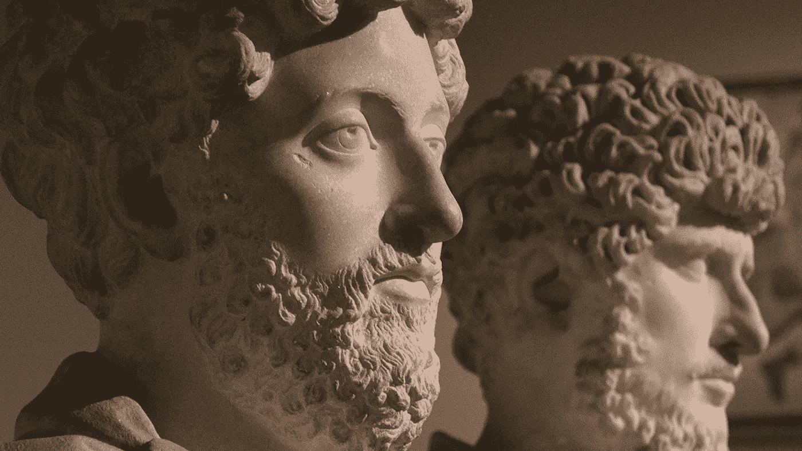
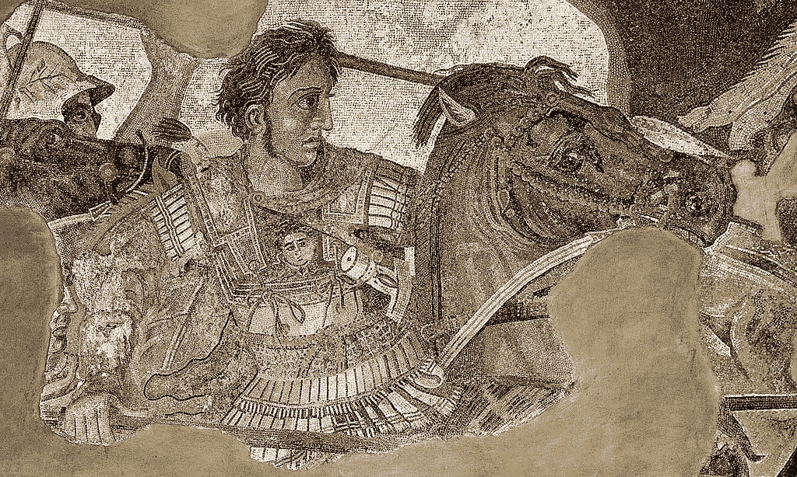

# 马库斯·奥勒留赢了

> 原文：<https://medium.datadriveninvestor.com/marcus-aurelius-is-winning-f8f81bd4899a?source=collection_archive---------7----------------------->

## 为什么斯多葛主义在自强行业的市场份额越来越大？

Marcus Aurelius and Lucius Verus. Photo by Carole Raddato. Public domain, wikipedia.org

托伊西主义正在经历 21 世纪的复兴。在亚马逊搜索栏中输入“斯多葛主义”，你会发现超过 5000 本书的可能性，其中大部分都是在过去五年中出版的。我们可以学习“如何像罗马皇帝一样思考”或阅读“斯多葛派初学者指南”，这将在理论上提供“情绪弹性和积极性的工具”。

围绕这个主题的网站已经遍地开花:谷歌搜索返回超过 1500 万次点击。斯多葛主义是自助和创业网站的主要内容:马库斯·奥勒留的警句可以帮助你成为一个更好的人，同时提供六个技巧来更好地服务你的客户。

这种快速增长在 Medium 上得到了反映:斯多葛主义标签已经与超过 5600 个帖子相关联，完全盖过了另一个伟大的希腊哲学，伊壁鸠鲁主义(57 个帖子)。就像蔓生的常春藤一样，斯多葛派正在通过媒体的主题传播新芽。

为什么这种古希腊哲学突然又如此流行了？是什么推动了它的复兴？

更重要的是，在一个信奉“你只活一次”理念的世界里，为什么斯多葛主义让它的哲学兄弟伊壁鸠鲁主义黯然失色？

## 古老的应对策略

斯多葛主义是在政治和思想混乱的烈火中锻造出来的。公元前四世纪，两个马其顿战争领主——腓力二世和亚历山大——征服了希腊和波斯。公元前 323 年亚历山大死后，他的将军们瓜分了他的征服地，建立了新的希腊王国，一直统治到罗马人的到来。生活在这些新王国的希腊人接触了其他古代文化:波斯人、美索不达米亚人、以色列人和埃及人。他们经历了文化冲击:世界突然变得比以前想象的更大更可怕。希腊人的自信和他们对其他种族的优越感受到了希腊自由的丧失和马其顿统治者的征服的挑战。

Mosaic featuring Alexander the Great from Pompeii. Public domain, wikipedia.com

四世纪末，两位雅典哲学家伊壁鸠鲁和芝诺制定了应对策略，以应对长期建立的精神支柱的丧失。伊壁鸠鲁主义和斯多葛主义的创立是为了帮助人们在希腊化的世界中驾驭生活的不确定性。

伊壁鸠鲁的体系强调了随机性:没有一种引导性的优越力量赋予我们的世界以意义。宇宙是偶然存在的；我们是偶然存在的；所有触及我们生活的事情(无论好坏)都是偶然发生的。我们所有的行为、希望、梦想和欲望都是偶然产生的。

 [## 如何管理优秀的团队和你自己|数据驱动的投资者

### Janice Presser 博士是团队科学及其基础理论的先驱实践者。老生常谈就是说她…

www.datadriveninvestor.com](https://www.datadriveninvestor.com/2020/05/26/how-to-manage-great-teams-and-yourself/) 

当伊壁鸠鲁的思想的含义被追溯到他们的逻辑结论时，很明显，在一个由机会支配的世界里，我们做的任何事情都没有任何持久的意义。努力工作的人可能会成功，但同样可能的是，他们会因为徒劳的辛劳而筋疲力尽。即使机遇向你微笑，你也会很快死去，你所完成的一切也会很快被时间遗忘。没有什么是永恒的，一切都是短暂的。今天的巨头盖茨、马斯克和巴菲特会在一千年后被人们记住吗？为什么有人会为不能持久的回报而奋斗呢？

我们最好的选择是承认我们存在的短暂性和随机性。在宇宙的尺度上，我们的存在仅仅是一眨眼的功夫。为什么我们要把短暂的良知浪费在无法忍受的事情上？唯一合理的策略是在绝望的情况下尽力而为。伊壁鸠鲁建议他的追随者从这个混乱和困惑的世界中退出，以便在机会允许我们活着的时候享受快乐。

就像现代的亿万富翁在遥远的岛屿上购买螺栓孔以防社会崩溃一样，享乐主义主张洗手不干人类的烂摊子，寻求拥抱任何可以获得的快乐。

用现代习语来概括他的思想:你只能活一次。尽你所能享受美好，因为明天一个随机的宇宙的转变可能会给你带来灾难，并抵消今天短暂的快乐。张开你的双臂:机会给了又拿走。你永远不知道骰子什么时候会对你有利，什么时候会毁掉你。

尽情享受你所拥有的。

伊壁鸠鲁主义对致力于自我完善的人没有什么帮助。如果没有未来回报的现实可能性，你为什么要把精力投入到一项兼职工作中，建立一个在线形象，学习 Python 编程，每天写 1000 个单词呢？在一个随机的世界里，所有的事情都是偶然发生的，努力工作并不一定会有回报。你可以花费精力写书、制造产品、创办公司，但是如果没有机遇的祝福，你将默默无闻。

与此同时，你的隔壁邻居写了半打不识字的博客文章，引起了文学代理人的注意，并把她的作品推上了《纽约时报》畅销书排行榜的首位。

在伊壁鸠鲁的观点中，这并不是说系统被操纵了；伊壁鸠鲁认为没有系统。

因此，尽管伊壁鸠鲁可能为世界如何运转提供了一个非常现实的模型，YOLO 哲学似乎现在在我们的文化中非常流行，但社会退缩和故意不作为冒犯了努力奋斗的一代人的感情。

## 进入斯多葛派

斯多葛派的创始人芝诺将人类置于一个决定论的宇宙中。没有什么是偶然发生的；所有收益来自设计。支撑宇宙的是神圣的良知，即*逻各斯*。*逻各斯*从创造到终结塑造了物质世界，在天堂或地球上发生的事情没有一件是偶然发生的。人类陷入了因果链，无法改变*标识*已经想要发生的任何事情。

伊壁鸠鲁的随机性在哲学上具有挑战性:如果一切都是偶然发生的，那么最终生活没有意义。在芝诺的宇宙中，发生的一切都是由更高的力量预先决定的，这也是有问题的:如果*标识*已经将我们的命运固定在石头上，我们做什么都无法改变这种预先决定的结果，我们为什么还要奋斗呢？

没有一个哲学体系是完美的。虽然像西塞罗这样的思想家在斯多葛派的形而上学中发现了很多可以批判的东西，但像大多数罗马人一样，他被哲学中实用、务实的一面所吸引。

与伊壁鸠鲁派不同，伊壁鸠鲁派认为最高的善是脱离世界，追求快乐，芝诺和斯多葛派主张投身其中。自我完善是圣人的首要任务。我们必须使自己符合支撑物质世界的理性精神(T8 逻各斯 T9)。

> 如果指引我们的内在罗盘与自然保持一致，那么它将永远适应生活带给我们的可能性和机遇。
> 
> *—马可·奥勒留，*沉思， *4.1*

斯多葛派的生活是不断自我完善的生活。取得进步的最好方法是把自己放在战场上，去体验，但不屈服于所有人都面临的困难。伊壁鸠鲁派试图通过逃避来避免麻烦，斯多葛派则将麻烦视为变得更强大的一种方式。

> 伊壁鸠鲁学派和斯多葛学派的主要区别是:我们的圣人感受到了麻烦的袭击，但却战胜了它们；伊壁鸠鲁式的智者甚至感觉不到麻烦。
> 
> *—塞涅卡，*书信 *9*

## 困难时期的哲学

为什么斯多葛派在当代话语中获得市场份额？显而易见的原因是，在困难时期，它是一个有用的帮手。在大多数观察者看来，我们的世界每天都在变得更加疯狂和不稳定。逼近的灾难，无论是来自疫情、环境还是政治崩溃，都会在地平线上扬起尘雾，向我们疾驰而来。尽管历史告诉我们，大多数人认为他们生活在一个独特的危机时代，但从长远来看，对于那些正在经历前所未有的时代的人来说，这并没有带来多少安慰。

斯多葛派的人气飙升是基于它在混乱时期的创造，以及它为不确定时期提供应对策略的能力。斯多葛派圣人的目标是一种不断自我完善的生活，培养一种宁静的心灵，并发现自己不会被晚间有线新闻中播出的噩梦般的故事所动摇和干扰。

在雅典和罗马吸引早期追随者的建立内在力量和坚定性格的实用指南仍然在一个混乱动荡的时代产生共鸣。

马库斯·奥勒留从未如此重要。

注意:所有来自希腊文和拉丁文的翻译都是我自己的。

## 获得专家视图— [订阅 DDI 英特尔](https://datadriveninvestor.com/ddi-intel)