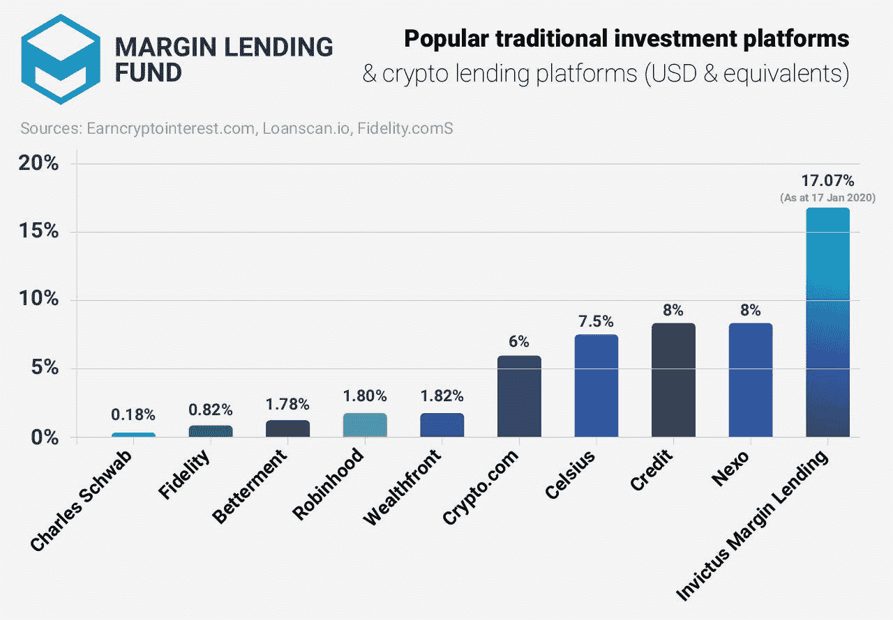
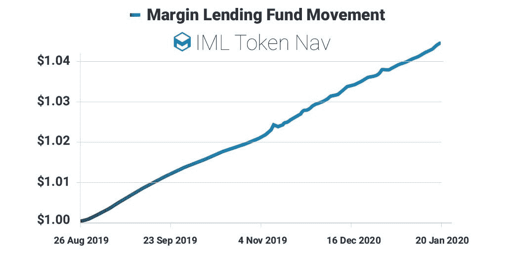

# 保证金贷款:赚取加密货币贷款市场的最佳利率

> 原文：<https://medium.datadriveninvestor.com/margin-lending-earn-the-best-interest-rates-in-the-cryptocurrency-lending-market-6b8ef7b93d29?source=collection_archive---------1----------------------->

过去一年，随着新产品在市场上激增，加密货币贷款一直是一个值得关注的领域。波动性一直是贷款利率的积极因素，随着最近波动性的飙升，加密交易所的一些加密资产(例如 [NEO](https://bfxrates.com/) )的贷款利率已经高达 149% p/a，美元的利率甚至高达 [38](https://bfxrates.com/) % p/a。这些发展为探索保证金贷款产品创造了有利时机。

# **传统市场融资融券**

几十年来，保证金贷款一直是传统股票经纪人提供的一项受欢迎的服务。这是一个过程，经纪人借出证券或现金给他们的客户进行交易。传统经纪人(如查尔斯·施瓦布)提供的贷款利率通常根据经纪人和贷款价值在 5.5%到 11%之间变化。

 [## 总部位于瑞士的 ETP 进入加密交易市场|数据驱动的投资者

### 虽然金融市场几乎没有沉闷的时刻，特别是在引入…

www.datadriveninvestor.com](https://www.datadriveninvestor.com/2019/03/10/swiss-based-etp-enters-the-crypto-trading-market/) 

对经纪人来说，贷款是一项非常有利可图的业务。根据他们的 2018 年 [10-K SEC](https://content.schwab.com/web/retail/public/about-schwab/YE_2018_Form_10-K.pdf) 文件，鉴于查尔斯·施瓦布仅为其高收益储蓄产品支付微不足道的 [0.18%](https://www.schwab.com/public/schwab/investing/accounts_products/investment/cash_solutions) ，难怪他们 57%的收入来自*净*利息收入(即扣除支付给账户持有人的利息后的贷款利息收入)。尽管他们是一家券商而非银行，但只有 40%的收入来自资产管理和交易费用。

# **加密货币市场的借贷**

区块链技术已经成为金融机会民主化[的代名词；在保证金贷款领域也是如此，因为任何人都可以借出他们的加密资产，并赚取经纪人和机构多年来一直享受的利率。像](https://invictuscapital.com/blog?article=democratization-of-financial-opportunity&utm_source=Hackernoon&utm_medium=referral&utm_campaign=iml_earnthebestrates) [Celsius Network](https://celsius.network/) 、 [Nexo](https://nexo.io/) 和 [Invictus Capital](https://invictuscapital.com/?utm_source=Hackernoon&utm_medium=referral&utm_campaign=iml_earnthebestrates) 这样的平台使得利息收入能够直接传递给散户投资者，在某些情况下，利率是传统市场利率的 10 倍。

Sources: Earncryptointerest.com; Loanscan.io, [Fidelity.com](https://accountopening.fidelity.com/ftgw/aong/aongapp/interestRates?type=ira)

加密货币借贷平台的发展在很大程度上可以归因于 2017 年后加密货币市场的成熟。加密货币信用机构 Credmark 的最新[报告](https://reports.credmark.com/TheCryptoCreditReport-q3-2019.pdf)强调，截至 2019 年第三季度，贷款市场已扩大到超过 64 亿美元的贷款。就在几年前，这个数字还只有几亿。此外，贷款市场正在经历新发放贷款环比增长 497。

在加密货币领域，借贷市场主要与少数重要参与者合作，即矿工、交易商、高净值个人和机构。贷款需求(尤其是通过[保证金贷款](https://invictuscapital.com/imlFund?utm_source=Hackernoon&utm_medium=referral&utm_campaign=iml_earnthebestrates)提供的贷款)的最重要驱动力来自交易员。

大多数大型加密货币交易所在其平台上促进某种形式的保证金交易。然而，一些交易所，如 Bitfinex 和 Poloniex，使用匹配引擎将流动性提供者和交易者聚集在一起，实现点对点借贷。随着交易员寻求快速、负担得起的流动性选择，以及贷款机构寻求有吸引力的回报，交易所贷款量正在增长。

# **市场波动继续推动保证金贷款活动**

加密货币的波动性是保证金贷款量增长的关键驱动因素，因为更高的波动性会刺激更多的交易活动。

贷款利率飙升往往与比特币价格波动相关，因为交易员希望增加他们的市场敞口。例如，2019 年 10 月 25 日比特币价格飙升 30%，导致美元贷款利率相应飙升，当月年化利率高达 20%。

虽然美元贷款利率跟踪加密市场的波动，但美元保证金贷款不会使交易资本受到基础加密市场价格波动的影响。除了没有资本提取风险之外，保证金贷款回报还提供了[多样化的好处](https://medium.crypto20.com/new-interest-based-fund-launch-announcement-c13fba080167)。

# **推出 Invictus 保证金贷款基金**

Invictus Capital 在加密资产领域有着卓越的历史，推出了指数基金 [CRYPTO20、](https://invictuscapital.com/crypto20?utm_source=CCN&utm_medium=referral&utm_campaign=iml)crypto 10 对冲基金和 [Hyperion](https://invictuscapital.com/hyperionFund?utm_source=Hackernoon&utm_medium=referral&utm_campaign=iml_earnthebestrates) (一只区块链风险投资基金)。Invictus 进一步开发了一种创新的保证金贷款基金，让投资者获得被动的、高收益的基于美元的回报。 [Invictus 保证金贷款基金(IML)](https://invictuscapital.com/imlFund?utm_source=Hackernoon&utm_medium=referral&utm_campaign=iml_earnthebestrates) 为投资者提供了一个独特的机会来利用这个新生的市场，迄今为止，这个市场提供了远高于传统货币市场收益率的持续回报。

目前美国最好的短期储蓄率为 2% APY，IML 基金提供了一个赚取超过 10%收益率的独特机会。

除了回报，该基金还具有引人注目的结构性优势，包括通过自动智能合约认购和赎回实现的 24/7 流动性。当投资者希望实现回报时，他们可以将代币兑换成 TUSD(基金的业务货币)。

随着借贷市场的持续增长和买方需求的增加，预计美元借贷会有所回报，因此 [IML 基金](https://invictuscapital.com/imlFund?utm_source=CCN&utm_medium=referral&utm_campaign=iml)的回报将继续保持可观水平。