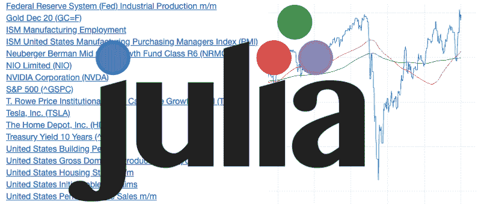
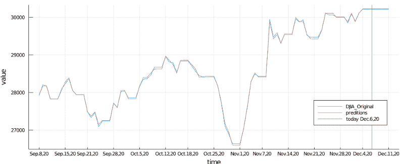
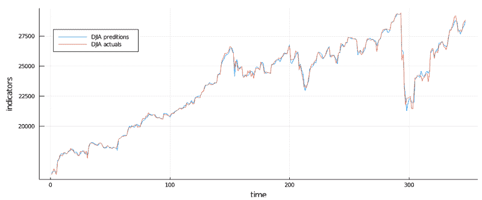

# 市场指标——朱莉娅语言的 ML 项目。

> 原文：<https://medium.datadriveninvestor.com/market-indicators-a-machine-learning-project-with-julia-language-be1a452213f8?source=collection_archive---------4----------------------->

我们能创建人工智能模型来预测宏观经济趋势吗？

不太久以前，天气预报是成功的或失败的。笑话是，电视天气预报员在本该是个好天气的时候打了一把伞。今天，我们可以非常精确地模拟未来几天的天气模式。

类似地，给定足够的相关数据，包括市场指标、人类行为模式、时事和最近的“黑天鹅”事件，我们应该能够对宏观经济进行建模。

在上图中，我展示了我所使用的一小部分市场指标数据，这些数据是免费的、最新的，可以以表格格式下载，大部分是逗号分隔的值(CSV 或电子表格)。

*“你应该采取你错了的方法。你的目标是* ***少出错。****—埃隆·马斯克*

*在预测未来时，持续好于平均水平，哪怕只有几个百分点，都会有很大的好处。*

**

*多年来，我一直在与我的朋友讨论基于成千上万宏观经济数据流的人工智能建模的概念，以及它可能给这样一个系统的设计师带来的机会。现在，我觉得数据、软件和硬件都在这个目标的范围之内。*

*经常听到商业或政治专家谈论所谓的“单一主题偏见”,这种偏见是基于人类思维能力非常有限，只能理解某个特定主题的几个方面。*

*在这里，我试图让人工智能将数以千计的复杂数据流(将每一个都视为不同的电子表格指标)组合成一个一致且可验证的“oracle”。*

*开始时，我采用了容易获得的市场指标和数据，这些指标和数据会影响即时的宏观经济变化，如制造业、失业、新的住房许可、库存等。*

*我大量使用平均值，因为我意识到某些事件会随着时间的推移而发生变化，有时是几天、几周或几个月。*

*当然，我意识到史料是不够的。*

*我也对人类行为感兴趣。专家和有影响力的人的意见，即使是错误的，也肯定会影响人类的行为。*

*我们知道一个事实，市场，或者更确切地说，一大群人的行为不合逻辑。*

*然而，普通人听总统演讲，看一些专家辩论，读一两篇文章，和工作中的朋友聊天，看一些题为“[插入任何一年]即将发生的崩溃”的视频，听说有人被解雇，最后几天后开始抛售股票，犯了一个巨大的投资错误，这是有规律可循的。*

*这样的建模很难，但是可以实现。我们已经经常从谷歌搜索、YouTube 上关于苹果或特斯拉最新创新的视频、Twitter 爆料和博客帖子中扣除人类情感。这是一项众所周知的成熟技术。*

*这个项目并不意味着一蹴而就，我确实意识到每个对冲基金都在类似的研究上投入了数百万美元。相反，我希望这是一个渐进的学习过程，一份热爱的工作，也是我退休后获得经常性收入的一种方式。我还有大约 20 年的时间来解决这个复杂的问题。*

*我的计划是每隔几天添加新的数据源，继续构建模型，直到我擅长预测一些东西。我故意用了“某事”这个词。我不确定我是否能够预测标准普尔 500 公司的具体价格，但我肯定我会在一些利基市场找到模式，拥有巫师级别的洞察力可能会打开大门，这是一条少有人走的路。*

*这篇文章，以及附带的开源代码，并不是要教你关于市场的知识，也不是要教你如何编码，而是要分享我的进步，并得到积极的反馈和合作。*

*项目目标*

*   *收集和分析尽可能多的市场指标*
*   *学习数据中的模式和相互作用*
*   *预测**未来几天**的市场趋势*
*   *预测特定的股票价格*
*   *生成可重用的代码并记录流程*

**

# *什么是市场指标？*

*市场指标是反映特定领域历史表现的数据点集合(比如电子表格),例如:*

*   *“标准普尔 500”指数显示了 500 种主要股票的整体表现*
*   *“ISM 制造业”指数显示了制造业的表现*
*   *“GDP”(国内生产总值)指数显示了这个国家的表现*
*   *等等。等。等。*

*这种指标即使没有数千个，也有数百个。每个国家、州、县和社区都有反映某种趋势的数据集。*

# *为什么不用电子表格？*

*电子表格及其制图能力是个人市场分析的基础。*

*然而，当数据开始乘以输入是压倒性的时，当只比较几个指标时，电子表格是好的。请记住，一个普通人可以记住大约 7 个数字，现在试着想象过去几十年的每日数据来自几百个指标，乘以几百个地区，再加上来自几百个来源的情绪。我们可以轻松地谈论数百万，如果不是数万亿的投入。*

*今天的计算机每秒可以处理许多万亿次运算。*

*万亿是 10 亿。我认为这一点很清楚。*

# *机器学习方法*

*当我们试图在成千上万的数据流中寻找微妙的模式时，机器学习或人工智能(AI)的压倒性优势显而易见。*

*人类的大脑(使用电子表格)无法掌握所呈现的丰富信息。另一方面，机器学习可以很容易地检测到海量数据集中的模式，并得出结论。*

# *为什么我要利用朱莉娅？*

*如果我选择了 Python，我可能会让我的生活更轻松。*

*然而，我在考虑一项长期、多年的长期投资，并希望选择绝对最好的语言。*

*以下是朱莉娅语言的一些特点:*

*   *Julia 是现代的、快速的、优雅的、多任务的，并且数学非常好，当然，我们说的是 Julia 编程语言*
*   *不像 C/C++，阅读和编写 Julia 是一种享受*
*   *它是麻省理工学院专门为科学计算和机器学习设计的*
*   *与 C 类似，它非常快*
*   *类似于 Python，非常容易学*
*   *它是为并行而设计的*
*   *它是为分布式计算设计的，因为有一天我可能会决定并行运行数百个预测模型，而不是像我现在这样按顺序运行。*

# *愿源头与你同在，卢克*

*我每天都在修改项目的代码。*

*逻辑方法和代码，肯定会与我在这里能够提供的任何例子有所不同，因此有了欧比万·克诺比的双关语“记住，卢克，使用源代码。”换句话说，研究实际代码。*

# *查看实际预测*

*在我的 [GitHub](https://github.com/UkiDLucas/MarketIndicators.jl) 中，我提供了一个页面，在那里我实际上发布了我的预测结果，我希望你会对它们感兴趣。*

*项目的其余部分记录在:*

*[UkiDLucas/market indicators . JL](https://github.com/UkiDLucas/MarketIndicators.jl)*

# *请订阅并分享*

*如果你喜欢我的写作，请喜欢，订阅，并分享这篇文章。*

*根据统计数据，我要么被激励去写更多的东西，要么与我天生的内向者取得联系。*

*通过 [LinkedIn](https://www.linkedin.com/in/ukidlucas/) 联系我。*

# *引用*

*如果您指的是这篇文章，请复制并粘贴以下内容:*

*尤基. d .卢卡斯。2020.市场指标——朱莉娅语言的 ML 项目。[https://docs . Google . com/document/d/18 hen _ r0rp-jqmbxsvrqsqndv 0 vqh 85 en _-fhebnup 54/edit？usp =分享](https://docs.google.com/document/d/18HEN_r0rp-JqMBXsVRQSqnDV0vqh85en_-FHEbNUP54/edit?usp=sharing)*

# *参考*

*   *在 Medium 上喜欢:
    [https://Medium . datadriveninvestor . com/market-indicators-a-machine-learning-project-with-Julia-language-be1a 452213 F8](/market-indicators-a-machine-learning-project-with-julia-language-be1a452213f8)*
*   *Google Docs 上的这篇文章(可能是最新的):
    [https://Docs . Google . com/document/d/18 hen _ r0rp-jqmbxsvrqsqndv 0 vqh 85 en _-fhebnup 54/edit？usp =共享](https://docs.google.com/document/d/18HEN_r0rp-JqMBXsVRQSqnDV0vqh85en_-FHEbNUP54/edit?usp=sharing)*