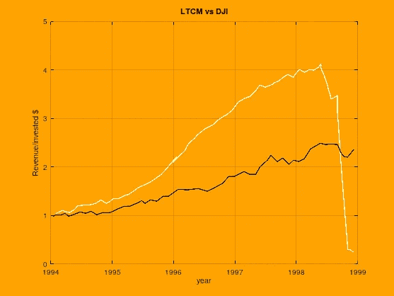
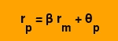
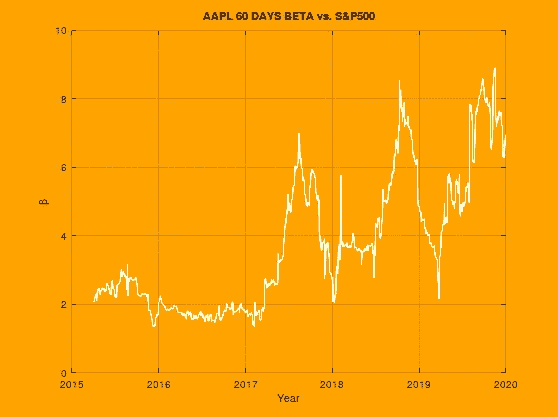
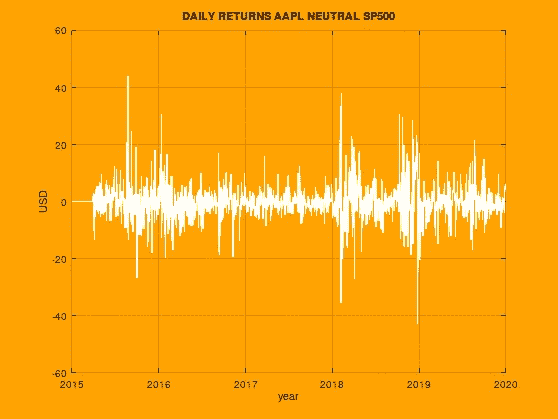
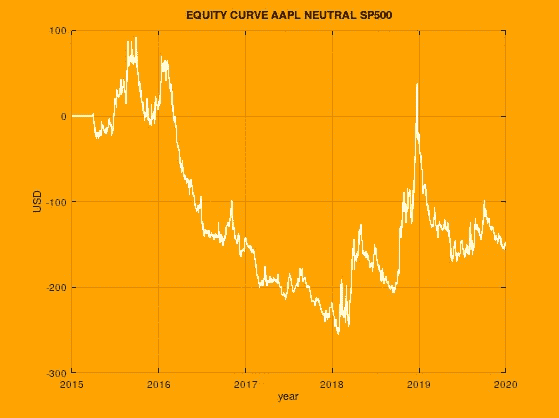

# 市场中立:简单来说是如何运作的

> 原文：<https://medium.datadriveninvestor.com/market-neutrality-how-it-works-in-simple-terms-239050927dd6?source=collection_archive---------1----------------------->

## 资本资产定价模型和贝塔系数

Source: Pikrepo

自营交易公司和对冲基金通常使用市场中性的投资组合，他们不进行定向交易。这是如此普遍，以至于长期价值基金经理的标志性观点远没有我们想象的那么普遍。

我所说的定向交易指的是小投资者、散户、专业日内交易者和长期价值投资者通常采用的方式:选择一个资产组合(或仅仅一个资产/工具),建立一个多头或空头头寸，预期它会增加(或减少)其市场价值。对短线交易者来说，操作将持续几分钟，对长线交易者来说，操作将持续几个月或几年，但这两个群体都将他们的策略建立在试图确定资产/工具价格未来方向的分析基础上。

虽然由专业人士执行的定向交易是有利可图的(比市场中性投资组合更有利可图，尤其是在使用杠杆工具的情况下)，但它总是带来更高的风险。如果选择了错误的方向，或者在市场触发风险阈值迫使退出头寸的高波动时期，方向性交易策略的损失可能是毁灭性的。

投资者(我指的是拥有大量资金的专业投资者)通常更看重安全性而非盈利性，因此任何降低风险的投资策略通常比在更高风险下获得更高回报更有意思。该行业致力于降低风险的模型策略，而不是寻找具有高盈利能力的模型。

> 该行业致力于降低风险的模型策略，而不是寻找具有高盈利能力的模型。

另外一点是，许多定向策略对大资本不起作用，因为它们通常是基于这样一个事实，即所应用的资本足够小，可以被市场注意到。盘中更是如此。

# 市场中立

市场中性(也称为美元中性)是指投资者同时持有相同基础资产/工具/商品的多头和空头头寸，但资产/工具略有不同。这种差异可能是同一基础资产的不同期权，未来合同的不同结算期，或者是同一基础的两个 ETF，甚至是同一行业内的公司(福特/通用)——行业往往会一起移动。

## 配对交易

一个众所周知且易于理解的市场中性投资组合是由 WTI 和布伦特原油的多头和空头头寸构成的。两者都有相同的潜在资产:石油。因此，无论每种工具的价格如何，两种价格都是高度相关的，不可能相差太多，如果一种价格上涨，另一种价格也会上涨。发现的差异与短期事件(库存、需求预期、新管道)和任何其他可能影响供需基本面的方面(宏观经济、地缘政治等)有关。).随着时间的推移，这些差异往往会得到纠正，高度相关的资产/工具的价格差异往往会显示出很强的均值回归特性，因为最终，*它是相同的基础资产:一桶石油*。

最基本的策略(更准确地说是配对交易策略)意味着当价格出现分歧时，买入 WTI，卖出布伦特(或相反)。强均值回归特性将使两个价格再次收敛，因此运营商实际上是在交易差价。这意味着，从理论上讲，盈利能力与石油的实际价格是脱钩的，因为我们在同一时间对同一种商品(石油)做多和做空的金额相同。

 [## 让你成为更好的营销者的 5 个思维技巧|数据驱动的投资者

### 凭借 20 多年围绕品牌营销的企业和小型企业咨询经验，我逐渐认识到…

www.datadriveninvestor.com](https://www.datadriveninvestor.com/2020/09/02/5-mindset-tips-to-make-you-a-better-marketer/) 

## 市场中性是无风险的吗？

关于市场中性策略不一定是无风险投资的一个广为人知的例子是 LTCM 案例。LTCM 运用对冲策略，将米隆·斯克尔斯和罗伯特·默顿(两人都获得了 1997 年的诺贝尔奖)纳入董事会。你想不出更好的旅伴了。他们的模型远远跑赢市场，后来遭遇了有组织的清算。这个案例表明，理论模型——无论背后的人有多优秀——都可能失败，也表明没有零风险这回事。

Figure 1\. When maths fail: Long Term Capital Management Hedge Fund. Profitability per invested dollar. Chart data extracted from: [https://en.wikipedia.org/wiki/Long-Term_Capital_Management](https://en.wikipedia.org/wiki/Long-Term_Capital_Management)

尽管如此，对冲策略比其他任何投资策略的风险都要小得多。尤其是在计划获得中等回报的时候。提款可以更小，风险可以得到更好的控制。作为一种权衡，它们的实施更加复杂(通常使用衍生品)，一些策略需要大量资金来创建真正多元化的中性股票投资组合。这就是为什么这种方法没有被个人投资者广泛了解(或使用),因为被动投资等策略可能实现良好的盈利能力，并且更容易理解和实施。

一个更近的事件表明，涉及相关期货合约的市场中性策略并非无风险，这就是 2020 年 4 月 CME WTI 期货合约案例。在几十年来最糟糕的疫情中期，价格暴跌至负值(一些人那天才知道期货可以有负报价)。所以这听起来很疯狂:市场会为你获得 1000 桶石油而付钱(得到钱和桶)。你将成为 1000 桶石油(当时没人想要，可能也不知道如何出售)的苦恼所有者，这些石油将被运送到芝加哥商品交易所代理指定的芝加哥仓库。

任何人以错误的方向操作一对合约，利用强大的杠杆，没有适当的风险控制措施，都将处于高度困境(可能破产)。所以风险是存在的，是的，是存在的。

## 旁注:新冠肺炎 WTI 4 月期货合约

> 尽管芝加哥商业交易所的特里达菲(Terry Duffy)表示，“期货市场运行完美”(不管这意味着什么)，但事实是，在异常市场条件下，做市商的角色是有争议的，因为我们经常发现，他们通过提供荒谬水平的流动性来履行自己的合同义务。对于普通交易者来说，WTI·新冠肺炎案例的教训可以总结为几条新的规则，我个人把它们纳入了我的交易计划，即使我不操作原油:
> 
> 1.永远不要操作临近结算日的实物交割期货合约，或者作为一个更强、可能更安全的推论:远离实物交割期货合约。
> 
> 2.远离没有足够流动性的合约——例如，月度对季度。
> 
> 这些是每个小交易者通常会遵守的规则，但在事件发生之前，我从来没有把它们写下来。

虽然这些例子可能很吓人，但它们也是非常特殊的异常值。顾名思义，市场中性策略的风险比其他任何策略都要小，因为你应用了覆盖范围的概念，你在操作边际利润。止损阈值很难达到，因为一个位置覆盖另一个位置，但你仍然需要应用一些常识和风险管理来避免这些“自由落体/陷阱”的情况。

# 资本资产定价模型和贝塔系数

资本资产定价模型可以被认为是市场中性的主要支柱。该理论最初是由 William T. Sharpe 提出的，基本上将资产价格建模为两个部分:一个是由一般市场(系统)引起的，另一个(剩余)是由单个资产引起的。

Figure 2\. The CAPM model: market and residual components

CAPM 模型指出的是，资产随市场而动(任何看涨日都会推动所有资产的价格，同样，无论如何，全面上涨日都会拉低价格)。变化的是单个资产会跟随市场多少。这个数字被模拟成一个β参数。贝塔参数代表资产相对于市场回报(rm)的变化程度。

θ值代表剩余分量，模型(尽管这是有争议的)表示它呈现出很强的均值回复特性。

这个想法是，你建立的投资组合中，贝塔系数相互抵消。因此，你在某些资产上做多，在另一些资产上做空。反向 ETF 被选作短期参考，常规股票被用作长期头寸，但是建立市场中性投资组合的替代方案是多样的，并且可以涉及更复杂的投资组合(包括部分中性的投资组合)。

交易活动发生在剩余成分上，由于其均值回归特性，这些剩余成分预计更加可预测，而整个市场趋势(或偏差)通过在多头头寸中拥有与空头头寸相同数量的美元而被抵消。

该模型也是因子分解的基础，其中θ通过几个因子的预测来估计。

## 计算贝塔系数

操作市场中性策略的第一步是建立市场中性投资组合。我建立的第一个投资组合是基于 S&P500 股票和反向 S&P500 ETF，这是我的第一个目标，获得一个简单的 P&L 股票曲线。

为了计算资产贝塔，基础资产和被分析资产之间的协方差除以市场方差。协方差代表两种资产之间的相关性，而方差代表资产(市场)偏离其均值的程度。

在我的例子中，每日股票数据从 [Polygon.io](http://polygon.io) 下载，并与每项资产的每日 OHLC 数据合并到 CSV 文件中。计算每个资产的日回报率，并与参考资产(逆 S & P500)进行比较，获得每个资产的贝塔系数。通过这样做，我们可以建立一个市场中性的投资组合，在这个投资组合中，我们将在大部分时间里实现盈亏平衡。

Figure 3\. AAPL 60 days Beta vs S&P500 calculated using Polygon.io data

图 3 显示了苹果(纳斯达克:AAPL)测试版计算的每日交易回报与 S&P500 的估计值的对比。计算贝塔系数是建立市场网络投资组合的第一步，因为它为我们提供了资产价格运动与市场相比有多接近的量化值。

## 每日回报和权益曲线

Figure 4\. AAPL vs SP500, daily returns per 1000$ invested.

Figure 5\. AAPL vs SP500 equity curve per each 1000$ invested.

图 4 和图 5 显示了由 SP500 指数及其资本化程度最高的资产(AAPL)组成的中性投资组合的每日回报和权益曲线。即使只有一种资产，也可以看出均值回归是多么的强，权益曲线趋向于零。Beta 选择和建立了一个非常差的中性投资组合(只有一种资产和指数)的事实，可能是 2016-2017 年其平均值为 0 时显示出强烈偏差的原因。

虽然这个例子并不完整，也不能用作交易策略，但它展示了市场中性投资组合的运作方式。潜在的想法是，组合回报比定向交易中的资产显示出更强的均值回复。

贝塔系数的计算方法可以有所不同，因为需要定义一段时间，但绝不能将贝塔系数视为一个静态数字(正如一些教科书所暗示的)。

**进入专家视角—** [**订阅 DDI 英特尔**](https://datadriveninvestor.com/ddi-intel)