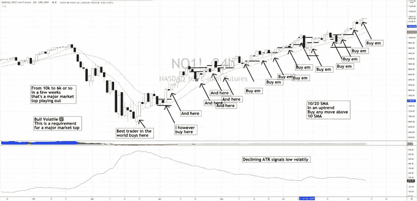
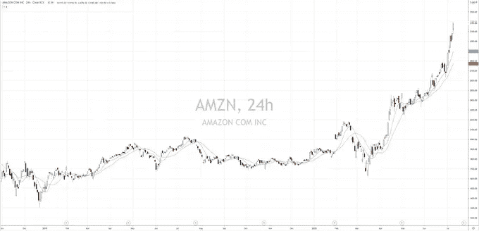
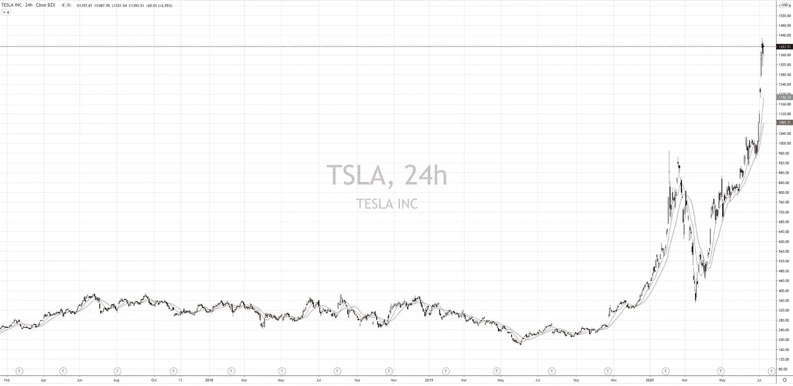
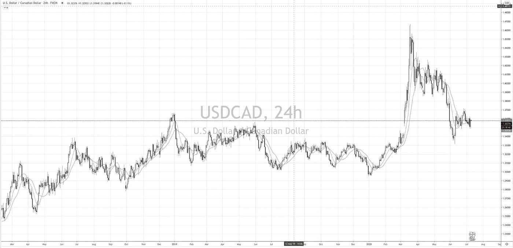
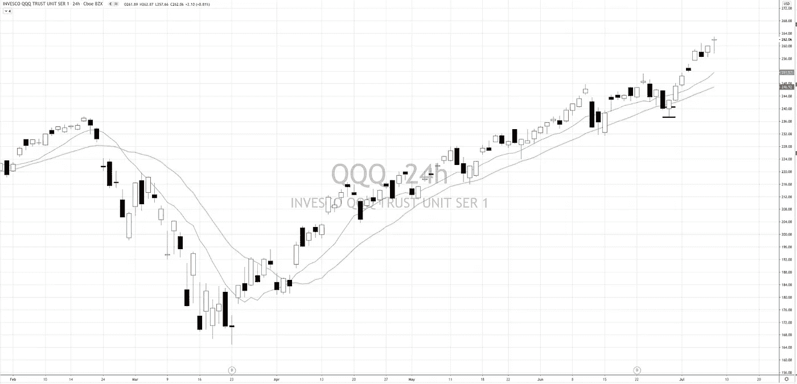

# 市场机制是成功交易的关键

> 原文：<https://medium.datadriveninvestor.com/market-regimes-are-a-key-to-successful-trading-f524ad50981e?source=collection_archive---------0----------------------->

我刚刚发了一条推特想和大家分享，因为我没有意识到我要把它变成一个线程，直到我做到了，我想确保你们都看到它到 0。

这是推文的链接，**很乐意点赞，转发**并与你认识的任何需要听到这个消息的交易者分享！

跟我来。

https://twitter.com/ChrisDMacro/status/1281377299900715008

如果没有，不要担心，这是推特，因为我爱你们所有人！

在昨天交易实验室的现场会议中，我们讨论了许多话题，但其中最精彩的一个话题是，魔力不在于指标，而在于指标告诉我们的市场特征

一根线…

基本上有两种类型的市场趋势和均值回复市场趋势是上升/下降或回复到中间值(横向)

市场在 80%的时间里无法突破和形成趋势，或者只有 20%的时间里突破和形成趋势，但当它们发生时，它们可能会比大多数人预期或相信的时间长得多，走得远得多 [$NQ](http://email.c.kajabimail.net/c/eJwdjs1qAyEUhZ9GNwW5etXRhYtmkkA3hdIHGBw10WbyU5WWvn1t4Ww-DpzvRKdUjCstToAAmDgAcETDODOzwnl3kPsD2tnsLJEQ2MV_-LVcfdnYLXWaXUS5Ap5OJmDkVkoRkwAJyU5Brj5purnc-6MRfCbiONK_S--psnC_DmrJ15AJHj8J7olQQr6-EaFbDYODb7n78xK2Ei40_VmXmLbylerPUqLjRiipJwBLqwu5lhbvoxtHz_8Ph4J29156enoZ46i55vIXIcBI1w) 例如这里

在这里，它花了很多时间试图在 2019 年突破，但 2020 年是一个完全不同的故事

$ TSLA[是另一个很好的例子，它横着走了很长一段时间，突破和恢复，但当它最终走了，它走得比任何人预期的都远](http://email.c.kajabimail.net/c/eJwdjs1uAyEMhJ8GLpWQ-V32wKHZJFKl3tL7CgwNNJsmAdSqb19aaS6esT1fdFrHGGhxAgTAxAGAS2kZZ3bRctkd1P4g58XuZqIA2cV_-FCuvmzsM3Wa3STC5BGVl-M6JtCzQdAxRR38_G4D3Vzu_d6IfCbiONS_S--pMrxdx9SSr5iJPD6I3BOhhXo7vY5N0yoOB33L3Z9X3ApeaPrrXWPayleqP2uJjluhlZkAZlod5lpavI1soJ7_GUcJ7e5Uenp6Ge-l4YarX-d7Scw)

知道了这些信息，你可以选择只交易趋势突破的策略，也可以选择找到失败的突破并回到均值的策略。这是两种类型的系统，所有的系统都是围绕这两种类型的系统建立的

将策略与制度相匹配(趋势或均值回归)给你一个大多数交易者忽略的优势，他们强迫一个策略应用于所有市场，这就是为什么指标让你陷入困境，认为你需要专注于找到指标的最佳组合

 [## 如何在 Robinhood |数据驱动的投资者上不破产交易期权

### 新冠肺炎·疫情关闭了大多数工作场所。许多人现在从…

www.datadriveninvestor.com](https://www.datadriveninvestor.com/2020/07/01/how-to-not-go-broke-trading-options-on-robinhood/) 

应该反过来，识别状态(趋势/均值回复)并为该状态匹配一个合适的指标，这就是潘多拉盒子打开的地方，知道你的指标告诉你什么

一些指标可用于两种交易类型(趋势/均值回复)，但它们需要不同地使用。查看 [$USDCAD](http://email.c.kajabimail.net/c/eJwdTstuwyAQ_Bq4VEIsC9g-cEjsROo56tnCLA00TtMCatW_L600h3lIM0POGKKNZ6ekknIAKSUgjgLEOBucjye9nHCax-PEtAzi5t_8lu8-7-I9Np6cJOshWJgUjGSAUPciDPRKSHHYPN9dau2jMjwwde5o37m1WER43Luq0ZeQGJ4_GS5MGaVfLst86NTWEroXfE3NX9ew53Dj8W95pbjnr1h-1kwORmW0HaSceHEhlVzp0bN-9vr_ss_w5i65xafn3ooWLOhfIgZJ3g) 应用 10/20 SMA，注意 10/20 x-over 和 over-over =均值回复，注意 10/20 点直线上升，运行=趋势

或者另一种方式来看，如果 10/20 不断交叉，你就处于均值回归状态，如果 10/20 指向其趋势相同的方向，需要买入下跌和买入下跌，就要淡化下跌和买入下跌

10/20 日均线告诉你制度，给你两种市场类型的一些很大的特征。注意当 10/20 经常交叉时蜡烛的大小——当 10/20 指向同一个方向并移动一段距离时，蜡烛很小，蜡烛很大

如果你知道形态，你不需要 10/20SMA 来告诉你形态，你可以看图表，看到价格横向运行的小蜡烛体=均值回归，价格走高的大蜡烛体=趋势

所以当我看到交易者的图表上布满指标时，通常意味着他们不理解系统，通常也不会理解他们的一堆指标基本上是在告诉他们同样的事情，只是名称不同，线条曲折

很多时候，有一堆指标意味着交易者将会得到所有 5 个指标的交易信号！！！"哦，哇，我的 5 个指标都显示抛售即将来临，赶紧出货，我从没见过如此悲观的情况！"

然而，这实际上只是一个卖出信号，通常在极度看涨的情况下，这些交易者通常是英雄顶呼叫交易者。如果你想搞清楚这种事情，加入我们在 https://pollinatetrading.com[的交易实验室，我们会深入研究这种事情。动手吧！](https://pollinatetrading.com)

在你读完所有的东西后，现在问问你自己“这看起来像是一个均值回复设置吗？”或者问问你自己，“这是一个趋势性的突破吗？趋势性的突破比所有人预期的持续时间更长，走得更远”

**访问专家视图—** [**订阅 DDI 英特尔**](https://datadriveninvestor.com/ddi-intel)