# 市场机制:密码、天然气、纳斯达克和债券

> 原文：<https://medium.datadriveninvestor.com/market-regimes-crypto-natural-gas-nasdaq-and-bonds-3fa89fb8f3da?source=collection_archive---------9----------------------->

这是繁忙的一周(和周末)，加密货币市场占据了我们的大量注意力。事实上，本周我们在[实验室](https://www.pollinatetrading.com/lab)最繁忙的频道是加密频道，**到目前为止。**

我不会让这封电子邮件全是关于加密的，但我想展示我们在过去一周的一些交易。

**这是我免费发给订户的一封电子邮件。** [**注册**](https://www.pollinatetrading.com/subscribe) **每周收到这样的邮件**

(我对下面的市场机制有更深入的了解，请继续关注我！)

OMGUSD

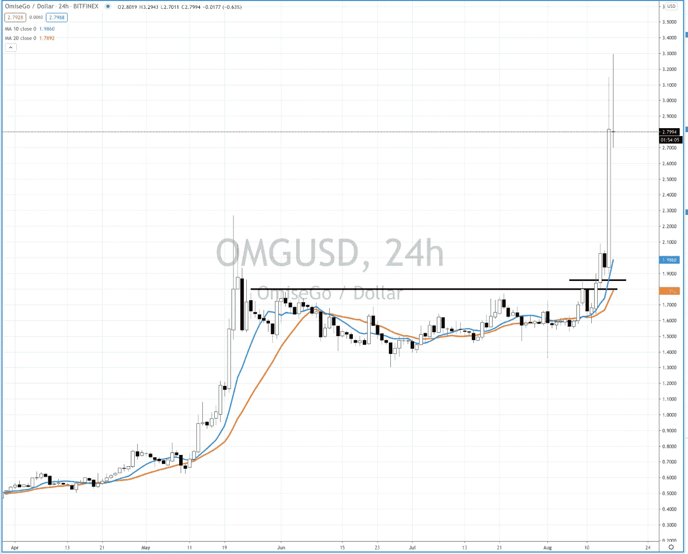

EOSUSD

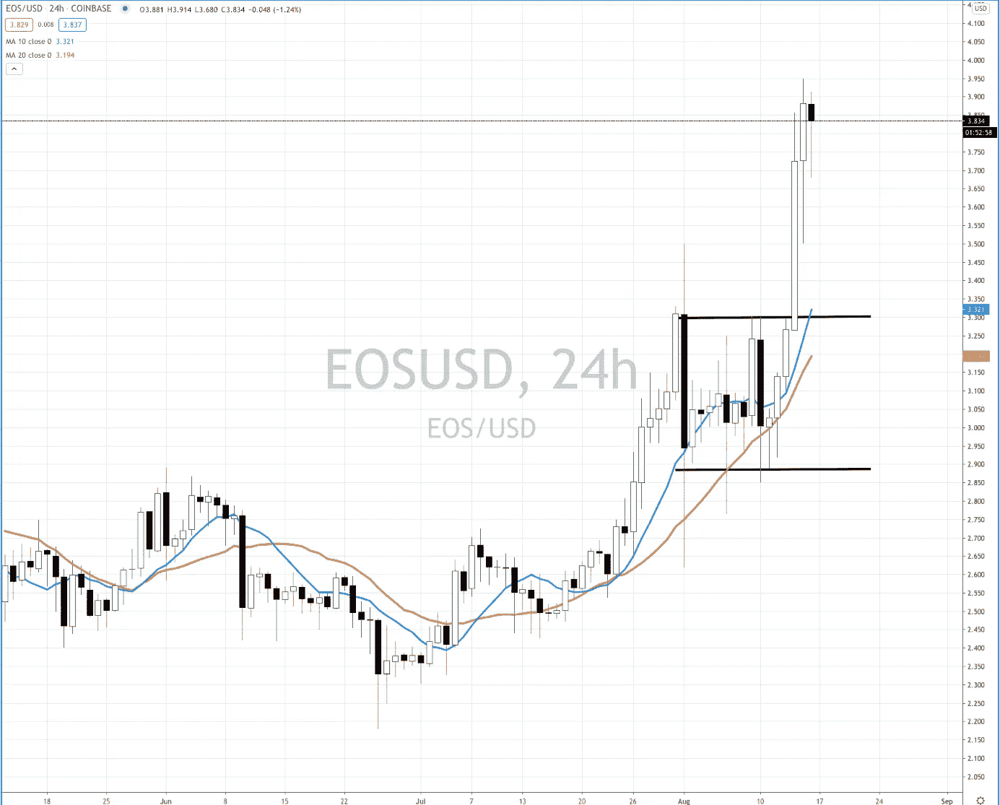

ALGOUSD

公平地说，上周在加密领域赚大钱相当容易。但是实验室里有很多人不知道如何进入市场，不了解安全性，不知道交易什么资产，如果没有一个交易伙伴网络的帮助，他们通常会迷失方向。

你会注意到在这些图表上你看不到任何 SQN 指标或 ATR 指标，你可能会说“但是克里斯，你是管理制度的人，没有管理制度你怎么交易？”

依靠指标来做你的脏活是非常令人欣慰的，总的来说它们做得很好。但如果说 2020 年的交易教会了我们什么的话，那就是制度指标滞后，我们需要走在游戏的前面，否则我们会错过大动作。

以我从 4 月份就开始谈论的纳斯达克期货交易为例，如果我等待指标告诉我我们处于牛市平静状态，那么我将错过 80%的波动。

 [## 为什么参与正确的加密交换至关重要|数据驱动型投资者

### 到目前为止，与黄金和美元相比，加密货币，尤其是比特币，已经显示出巨大的增长

www.datadriveninvestor.com](https://www.datadriveninvestor.com/2020/07/16/why-engaging-with-right-crypto-exchange-matters/) 

通过使用市场机制过滤器，比如我回溯测试中的 SQN 或 ATR，我可以帮助识别最佳机制的独特特征。一旦我确定了这些特征，我就不需要指标来告诉我状态，我可以简单地对确定的状态使用最佳策略。

市场机制有多种形式和规模。

宏观经济状况，例如，通货膨胀、通货紧缩、滞胀、增长、衰退、萧条等…

牛市，熊市，横盘。

高波动，低波动

有很多方法可以对市场机制进行分类，一旦你理解了在你所确定的机制中哪些资产表现最好，更重要的是它们的表现如何，那么你就可以相应地进行调整。

记住所有这些，让我们看看更传统的市场

**纳斯达克期货**

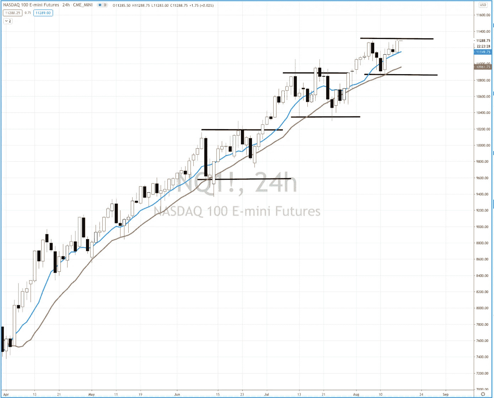

我强调了每次$NQ 进入横盘通道时，以及它是如何解决的。每一次我们巩固它已经发生了与大熊市蜡烛吸进只是为了阻止他们出来，再次，当我们把新的历史高点，再次。

那么，为什么它不能一遍又一遍地做同样的事情，为什么我们不能盲目地买入这种下跌并继续下去呢？

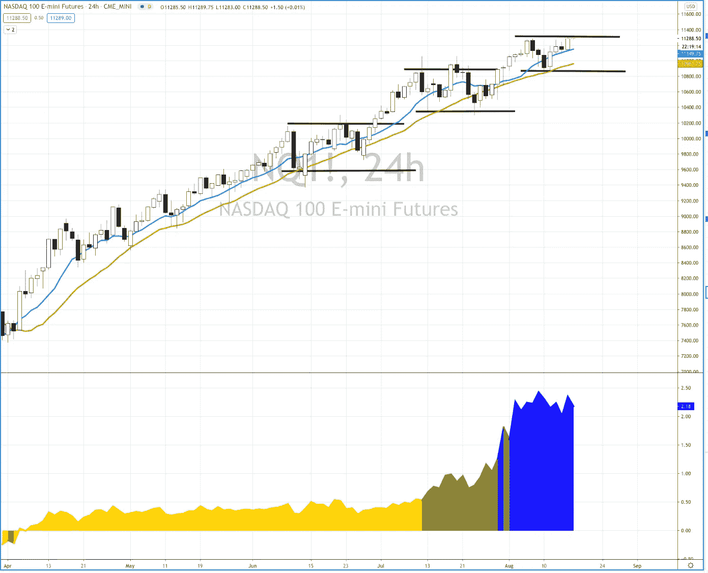

这就是政权介入告知我们如何玩这个游戏的地方。

正如我们在过去几个月所看到的，尽管 SQN 没有出台牛市安静机制，但我们显然处于其中。我们知道这一点，因为我们知道公牛安静的明显特征，其中之一是

*世界上最好的销售系统一次又一次地失败*

这种情况一次又一次地发生。目前唯一的区别是，我们在数量上处于牛市波动状态。这并不意味着派对结束了，它只是意味着我们现在可能有了一套市场交易的新特征。

在牛市波动中变得不那么咄咄逼人，会给这一次一些时间来结束。

现在我把它拉回到比特币

**比特币**

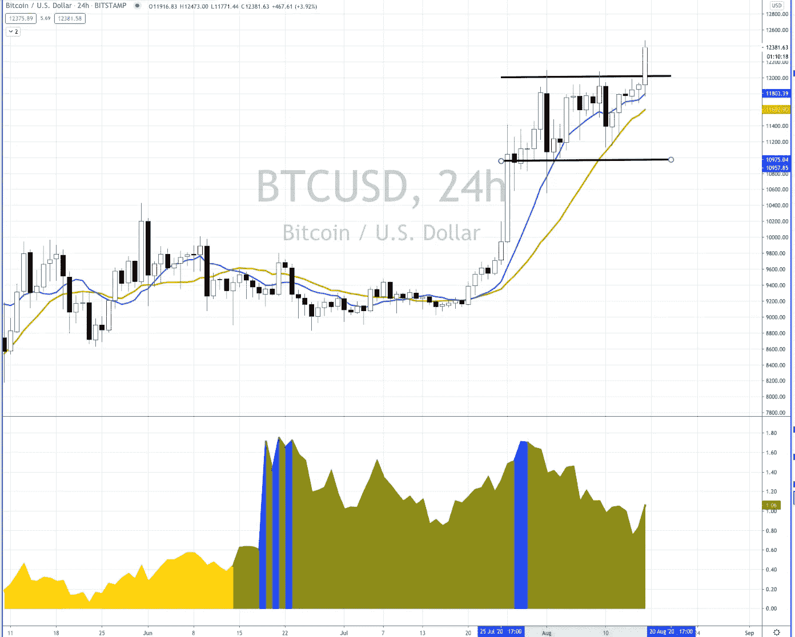

与美元 NQ 一直在疯狂奔跑并努力进入牛市波动不同，比特币一直在 12k 美元以下盘整，今天刚刚突破 12k 美元，处于牛市平静状态。

这意味着持续走高的条件已经成熟。本周末，我发布了一段视频，讲述了我对 BTC 的看法，但如果你已经关注我一段时间，你应该不会对这种看涨设置有如此大的潜力感到惊讶。

**30 年期债券$ZB**

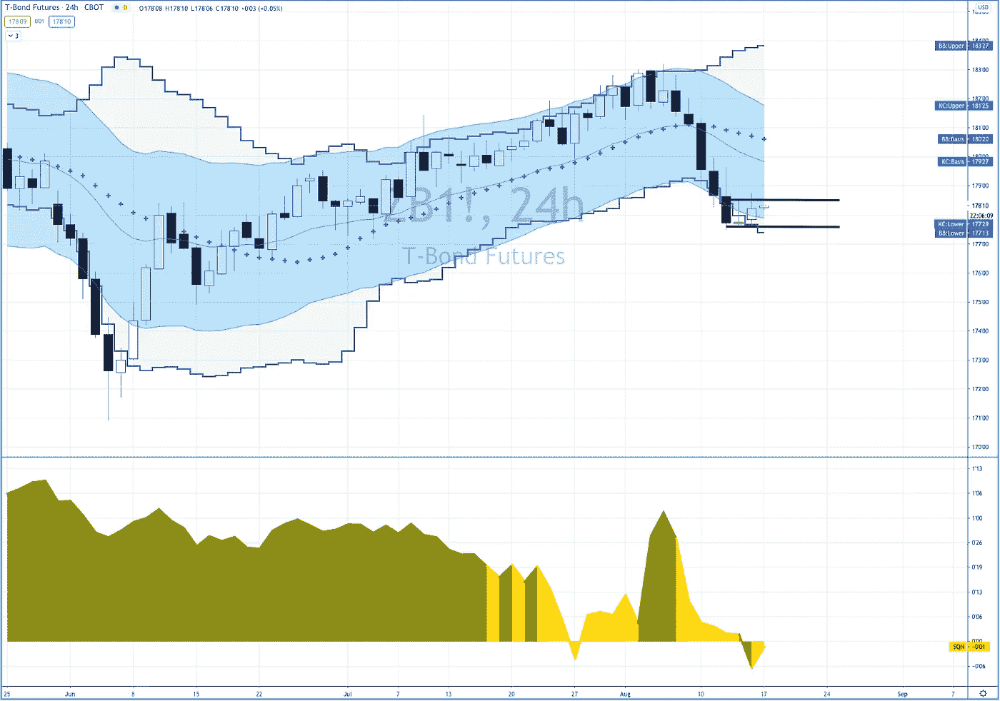

长期债券有一个特别好的设置，它有很多优势。让我们从一个处于中性状态的 FVBO 多头开始，这是我们所有策略中胜率最高的设置。更有意思的是，自 3 月份以来，该指数一直在牛市平静状态中盘整

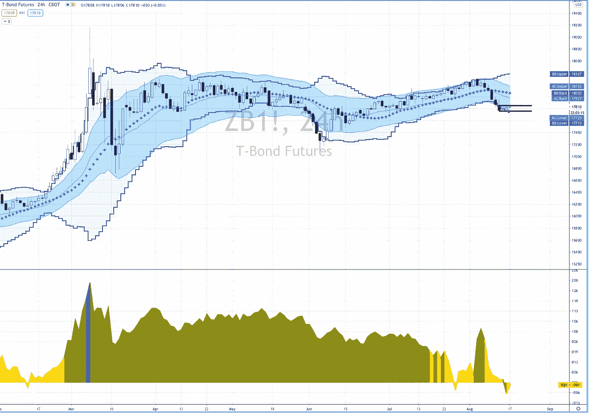

这是一个很好的机会，可以在底部做多，回到牛市的平静状态，做多。这是一个系统方法的很好的例子，上面撒了一些自由裁量的成分。

**天然气$NG**

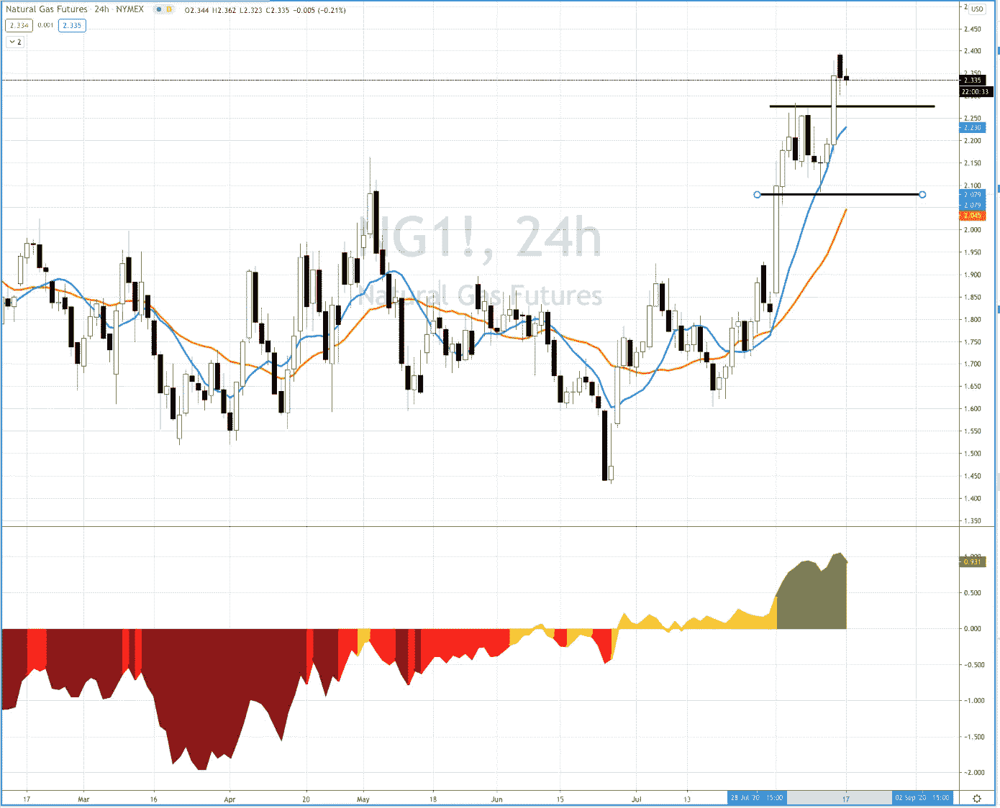

Natty Gas 已迅速进入牛市平静市场机制，并吸引了所有人的注意力。这里有持续牛市的可能，我说可能是因为…

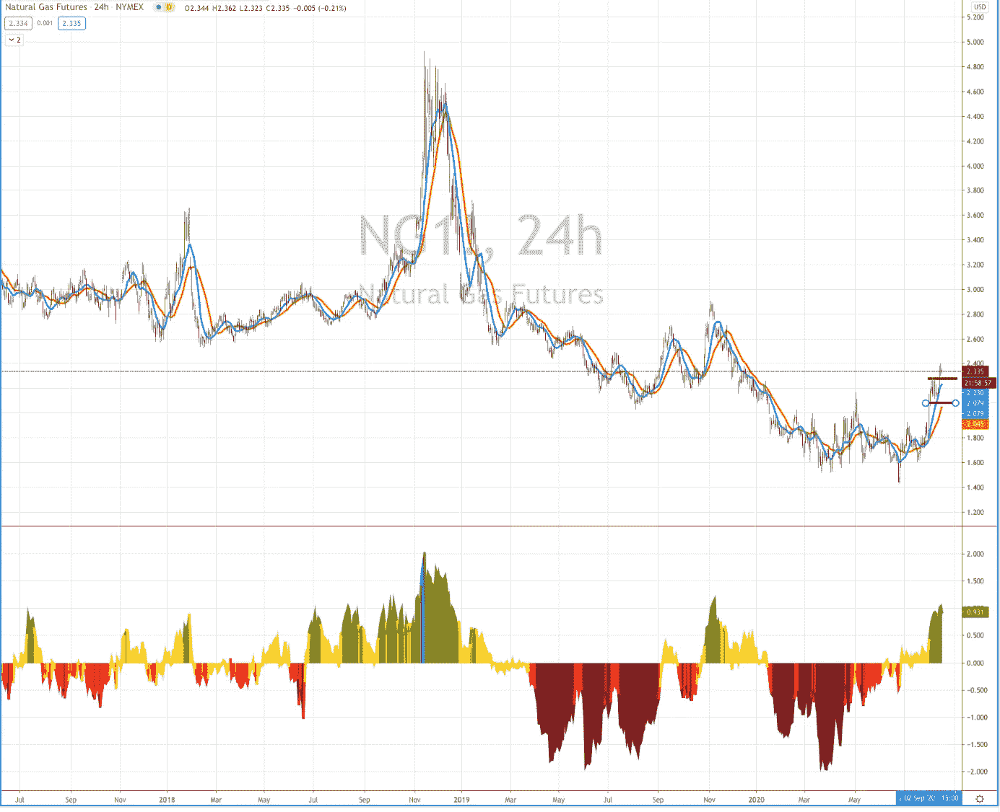

有很多例子表明，一个权力运动出现了，翻转到公牛安静，只有得到一个恶性殴打践踏下来。

最后一次发生在这个普通的社区

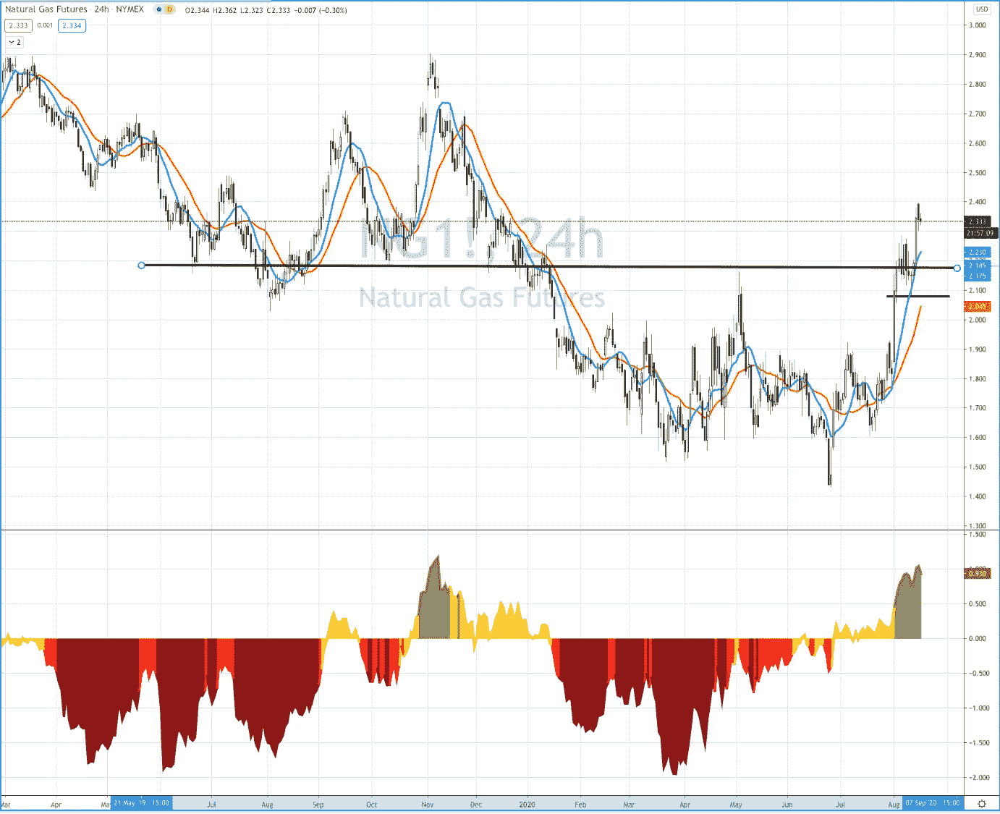

因此，虽然它很诱人，我会等待一个更好的设置

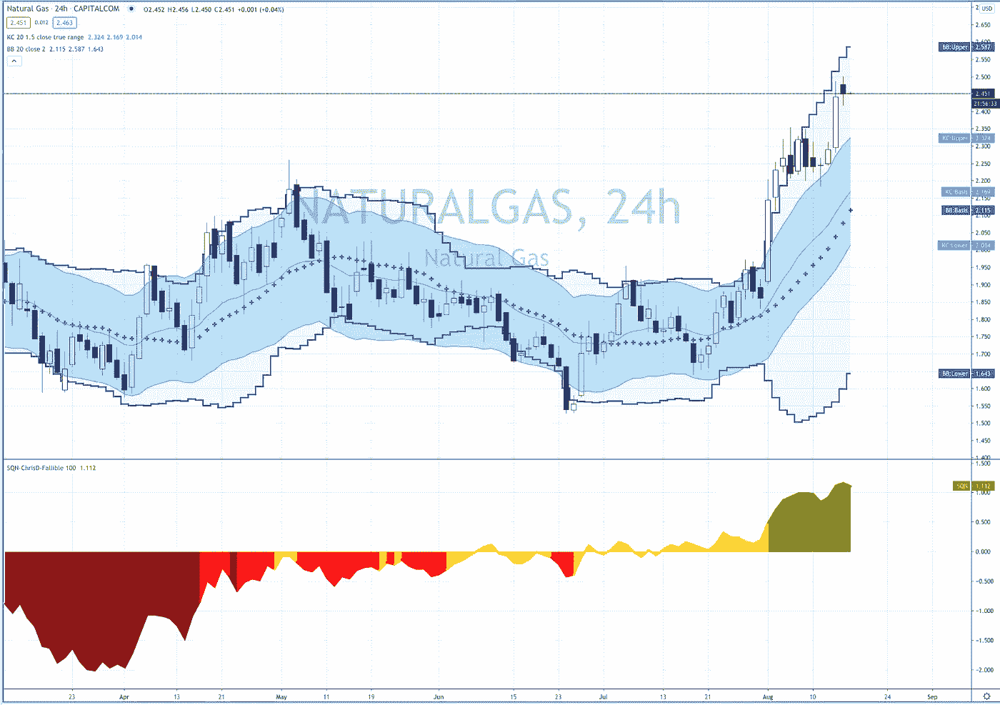

— — — — — — — — —

过去的几个月对我们来说是轻松赚钱，但在 crypto 之外，没有什么看起来像几周前那么简单。这意味着是时候收紧风险了，只采取像$ZB 多头配置这样的稳健配置，并保持这种纪律。

我们肯定会在月底提高 [**交易实验室**](https://www.pollinatetrading.com/lab) **的价格。**

在价格大幅上涨之前立即注册，你可以永远锁定当前价格。此外，我已经添加了 6 个月和 12 个月的折扣订阅，如果你还在观望，现在是时候加入我们的[交易实验室](https://www.pollinatetrading.com/lab)

**访问专家视图—** [**订阅 DDI 英特尔**](https://datadriveninvestor.com/ddi-intel)