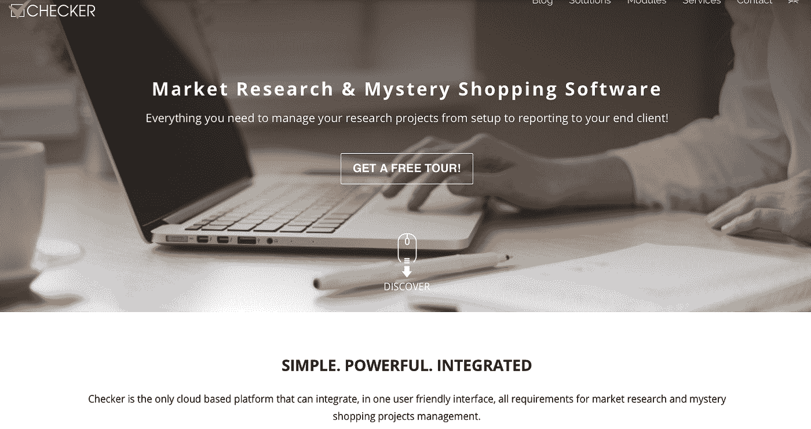
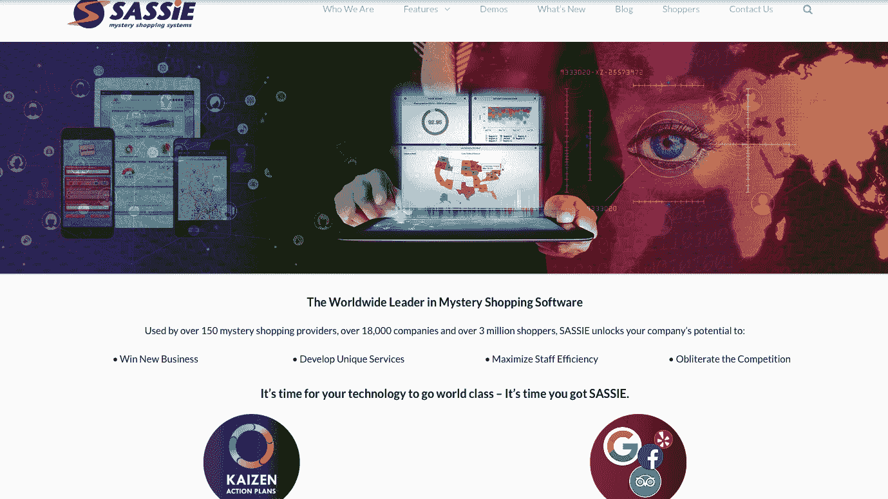
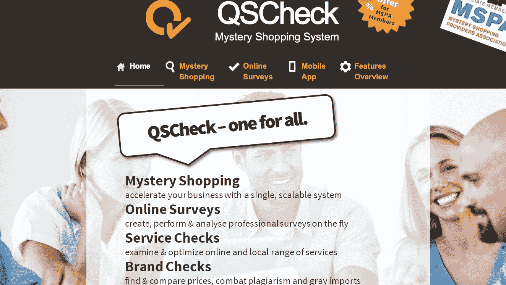
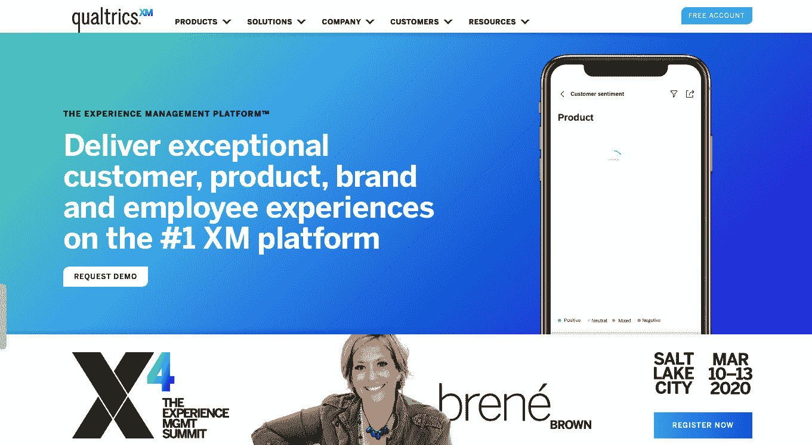
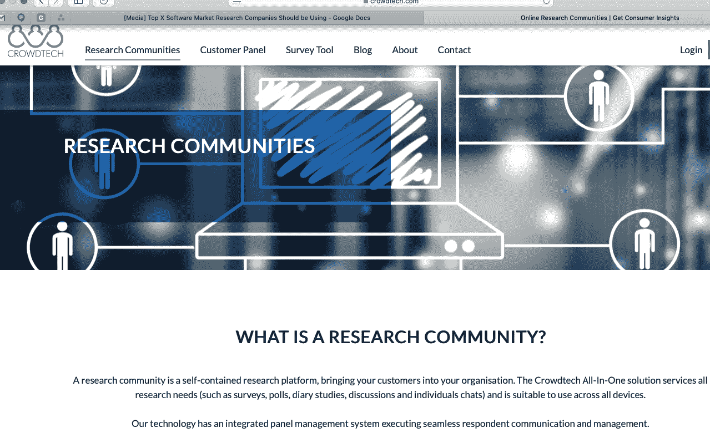
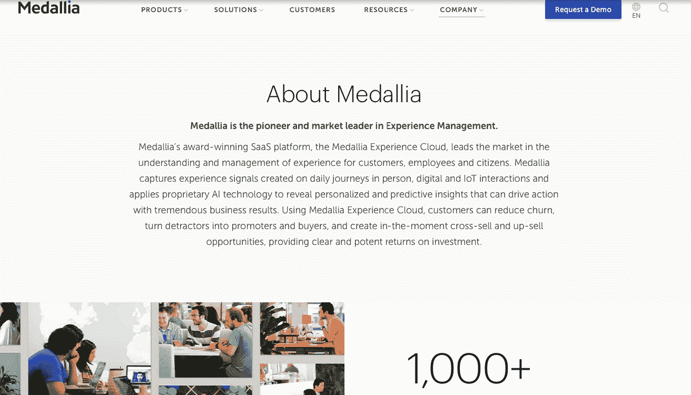
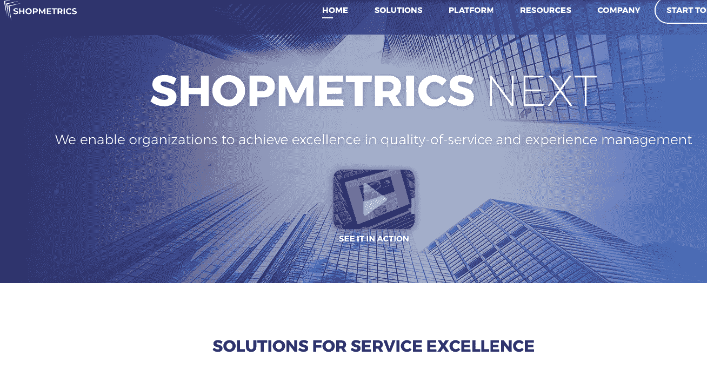

# 市场研究软件——最佳合作公司

> 原文：<https://medium.datadriveninvestor.com/market-research-software-top-companies-to-work-with-378ac9c9327b?source=collection_archive---------12----------------------->

**市场研究软件**是从市场中收集客户特定见解的必备工具。大部分市场调研平台都号称简单易用。然而，避开任何软件导航的便利性都是相对的。例如，一个应用程序开发者简单的打分对于一个市场研究员来说可能是一个难题。我们收集了不同市场研究平台的简要评论，以帮助您比较最好的市场研究软件公司，并选择一个与之合作。

 [## 一个企业在肚子上移动:如何照顾直觉|数据驱动的投资者

### 事实证明，直觉不仅仅是一种感觉。科学很清楚:你的直觉比你知道的更多…

www.datadriveninvestor.com](https://www.datadriveninvestor.com/2018/11/09/a-business-moves-on-its-stomach-how-to-make-allowances-for-gut-feelings/) 

# 最佳市场研究软件公司

这里强调的是你可以利用的 7 个最好的市场研究平台。大多数提供多种功能，包括多语言，神秘的应用程序购物和其他人工智能集成工具。

# 棋子

[Checker 软件](https://www.checker-soft.com/)是一家成立于 2005 年的 SaaS 市场调查软件公司。规定包括神秘购物以及 CX /挥发性有机化合物测量。它们还支持多种调查研究类型，包括在线调查、短信调查和自动电话调查。零售审计是另一个优秀的软件功能，为客户提供了一个映射、监控和构建产品及其库存的机会。目前，Checker Software 是企业解决方案和集成捆绑包(数据收集和合并报告)领域的强大领导者。

# 萨西

[Sassie](https://site.sassieshop.com/) 是另一个伟大的市场研究平台。它从 1998 年就上市了。该公司在开发网络和移动友好工具方面实力雄厚。他们还拥有独特的计划、数据收集和神秘购物工具。该软件通常利用数据控制和管理。客户全权负责，甚至可以创建自己的自定义报告。

**QSCheck**

[Qscheck](http://www.qscheck.com/) 是一款企业软件市场研究工具，提供高安全标准的数据调查。它成立于 2000 年，目前的特点是易于使用的浏览器，不需要进一步安装。访问控制同样可以防止信息和私人文件被盗。总的来说，他们的服务对用户来说是最可靠的。

# 质量标准

Qualtrics 在市场研究领域是一家实力雄厚、极具竞争力的公司。用户之旅通常包括名为 XM 的管理程序的实现。这个详细的分析工具负责生成客户洞察。这有助于 B2B 公司使用与他们的市场研究平台集成的软件系统来监控他们的客户体验。

# 众包技术

[Crowdtech](https://www.crowdtech.com/research-communities/) 是 MWM2 集团的一个组成部分。软件业务始于 2012 年，当时是一个单独的实体，在随后的几年里，合并成了我们所知的顶级市场研究软件工具提供商。他们的服务包括端到端的技术调查，在 Excel、Triple-S PowerPoint 等可下载的 CRM 系统上进行数据过滤。他们持有 ISO 27001 的认证——这是品牌的一大优势。

# 梅达利亚

就像 CheckerSoft 一样，Medallia 也是一个 SaaS 统一平台。基于云的软件有助于了解市场和管理用户体验。 [Medallia](https://www.medallia.com/about-us/) 的市场研究软件通过每天生成的信号捕捉这种客户互动。他们采用数字和人工智能技术将大数据缩小到更小规模的历史客户洞察。

# 商店矩阵

最后但并非最不重要的市场研究软件公司是 [Shopmetrics。起始年份是 2004 年。该平台提供技术解决方案，如神秘购物、数据/收集应用程序以及 Surveo 调查收集和报告工具。它们的结合使得在数据存储和分析之间穿梭成为可能。](https://www.shopmetrics.com/)

# 你如何选择最好的市场调查软件？

除了了解用户体验，其他[原因](https://medium.com/@BizzBeeSolution/5-reasons-why-market-research-is-crucial-for-your-business-a27b77fa8264)保持最新的顶级市场研究软件列表包括推出新产品，改进现有服务，或寻求垄断竞争对手的市场。如果你准备试水，但不确定使用什么市场研究软件，应用下面的提示到你的研究中。

# 决定你研究的目标

首先，权衡你对市场研究软件的需求。您想深入了解新产品的目标受众是谁，还是想了解客户对现有产品新增/删除功能的反应？其他可能影响你目标的因素包括:

*   价格模型
*   项目的长度
*   数据兼容性

# 确定你需要的利基分析的类型

决定什么最符合你的目标——预测性的、描述性的、说明性的还是诊断性的分析？如果你的企业最近缺乏资金，你想判断其原因，那么实施诊断性市场研究是可行的。如果所有功能都在一个市场研究平台上，那就更好了。

# 审查软件的关键功能

如前所述，市场研究软件功能多样，对选择有很大影响。显然，在实际使用中，越多并不总是越好。要寻找的总体特征是:

*   云托管:根据 BCG[的预测，70%的企业工作负载](https://on.bcg.com/36LlMil)预计将被托管在云环境中。
*   针对移动设备的优化:寻找针对桌面和移动设备进行优化的软件非常重要。根据一份[报告](https://bit.ly/35JzoJt)，调查参与者在他们的智能手机上比在桌面上对网络调查做出更多的回应。

# 寻找这些公司的口碑和评论

基本上，来自营销研究软件 B2B 用户的反馈应该巩固你的选择。Statista 年的一项调查证明，至少 [91%的美国在线](https://www.statista.com/statistics/315751/online-review-customer-opinion/)购物者认为一个好的评论增加了他们对相关公司的购买倾向。

# 结论

收集数据来研究一家公司的目标市场的任务可能相当艰巨。但是，正确使用这些数据可以增加销售额和利润。拥有合适的市场调研软件不仅能让这个过程变得简单，还能尽可能地有效。