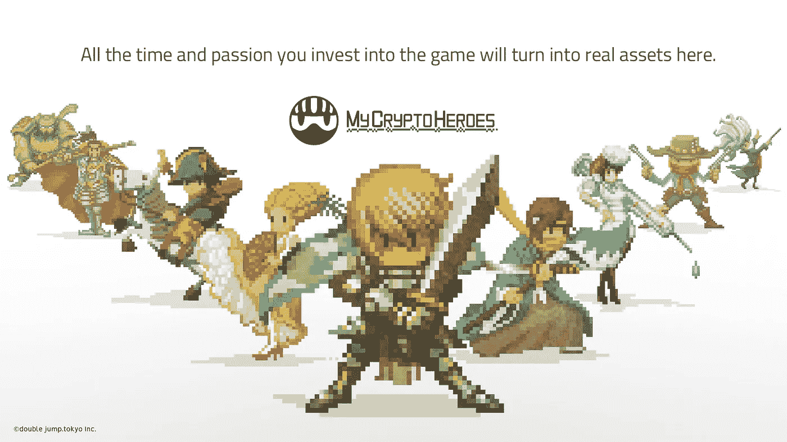
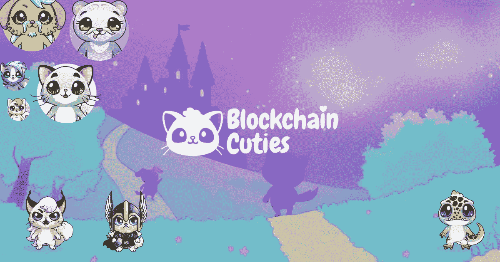
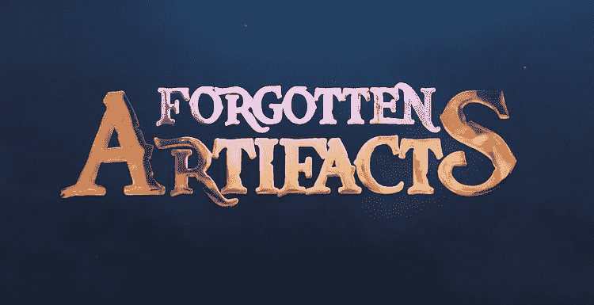
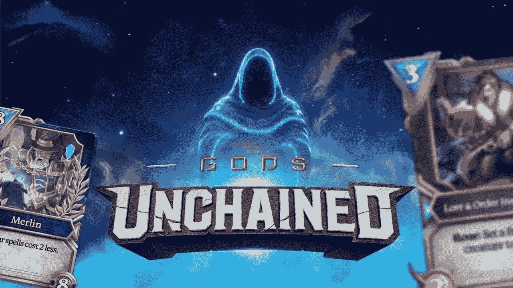
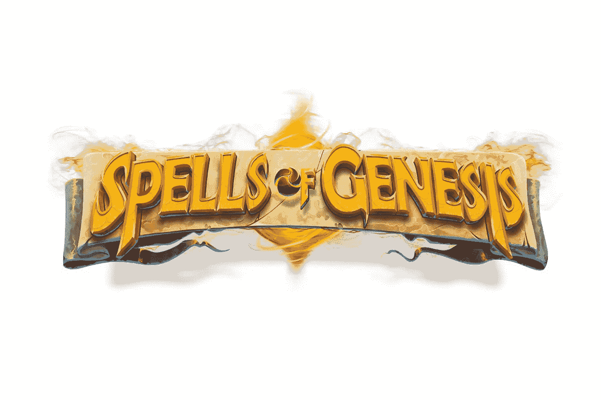

# 2020 年加密游戏的市场趋势

> 原文：<https://medium.datadriveninvestor.com/market-trends-of-crypto-games-2020-f0c135bf0546?source=collection_archive---------8----------------------->

随着越来越多的游戏被发明出来，越来越多的游戏中可收藏的物品基于区块链技术被制造出来，加密游戏正在发展壮大。游戏不仅使区块链和加密货币的大规模采用成为可能，还提供了一种了解区块链技术如何工作的简单方法。

 [## 总部位于瑞士的 ETP 进入加密交易市场|数据驱动的投资者

### 虽然金融市场几乎没有沉闷的时刻，特别是在引入…

www.datadriveninvestor.com](https://www.datadriveninvestor.com/2019/03/10/swiss-based-etp-enters-the-crypto-trading-market/) 

让我们看看 2020 年密码游戏的最新市场趋势是什么。

**1。我的密码英雄**

总部位于日本的区块链游戏仅仅存在了一年多，但其交易额却位居世界第一。该游戏由 Double jump.tokyo inc .于 2018 年 11 月 30 日开发，建立在以太坊上，作为一个去中心化的应用程序。

这款游戏既可以在手机上玩，也可以在 PC 上玩，它的特点是可以收集和训练历史英雄的记录，以便在史诗般的战斗中战斗。

## 2.区块链小可爱

区块链 Cuties 通过在多个区块链上提供数字收藏品，进一步发展了数字收藏品的概念。该游戏由可爱的幻想生物组成，如猫、小狗、熊猫和蜥蜴，可以交易、出售或变成传统的数字货币。此外，这些数字收藏品可以通过多种技能进行训练，这些技能将在战斗中得到检验。

区块链 Cuties 可以通过网络浏览器在 PC 和移动设备上播放。

## 3.被遗忘的艺术品

遗忘的文物是一个密码游戏，允许玩家进行无休止的冒险，以找到被遗忘的文物。在这个区块链游戏中的收藏品是可替换和不可替换代币的混合，每个代币都有限量供应，因此使它们独特而有价值。

目前，在其前阿尔法开发阶段，这种加密游戏只能用金恩钱包玩，因为这是唯一的方法来存储 ERC-1155 代币和收藏品。到目前为止，游戏社区对这款游戏有着浓厚的兴趣，被遗忘物品团队称为“勤奋”的用户群。

## 4.被解放的神

《被解放的神》是一款纸牌游戏，玩家可以获得纸牌包并积累独特的稀有纸牌。有了以太坊区块链制作的卡片，游戏玩家就获得了卡片的真正所有权，可以用它们交换其他卡片，或者在市场上出售。

很容易与暴雪的炉石相比——唯一的区别是顾是建立在的基础上——被解放的上帝在过去一年里获得了关注，因为暴雪在他表示支持香港抗议后驱逐了它的一名顶级玩家。

最重要的是，加密游戏已经获得了超过 1500 万美元的资金，使其成为 2020 年最有希望的区块链游戏之一。

## 5.创世咒语

这款手机加密游戏是街机风格游戏和纸牌交易游戏的混合体。《创世纪》的玩家可以在收集和交易球体的同时开始史诗般的冒险，以建造可以在战斗中测试的强大甲板。玩家可以用这副牌对敌人施魔法，策略和技巧是胜利的关键因素。

由于游戏中的收藏品和卡片是建立在区块链技术上的，玩家可以保留他们在游戏中赢得的物品和卡片。更有趣的是，这是首批允许在比特币区块链上直接存储收藏品的角色扮演比特币(BTC)游戏之一。此外，奖金可以在游戏之外交换，这对游戏玩家来说是令人兴奋的。

## 6.夹板岛

任何一个《权力的游戏》粉丝都会发现爱上《夹板大陆》很容易。这款加密游戏的背景是一个由六个王国组成的幻想世界，它们争夺对夹板岛的控制权。就像《权力的游戏》一样，有一个预言预言了一个共同敌人的到来，这个敌人将迫使分裂者联合起来战斗。

玩家可以使用游戏中的收藏品在战斗中击败敌人。由于使用了区块链技术，每张卡都是独一无二的，每场战斗的结果都可以轻松验证。这个游戏是用一种防止篡改战斗结果的算法构建的。即使是游戏创作者也不能操纵或改变它们。

***如果您想了解更多，请访问 BIDITEX 页面并提出您的问题，关注我们的*** [***推特***](https://twitter.com/biditex_com) ***，*** [***脸书***](https://www.facebook.com/biditex/) ***，*** [***中型***](https://medium.com/@biditex) ***，*** 用[***bidi tex***](http://www.biditex.com/)***投标你的空格。***