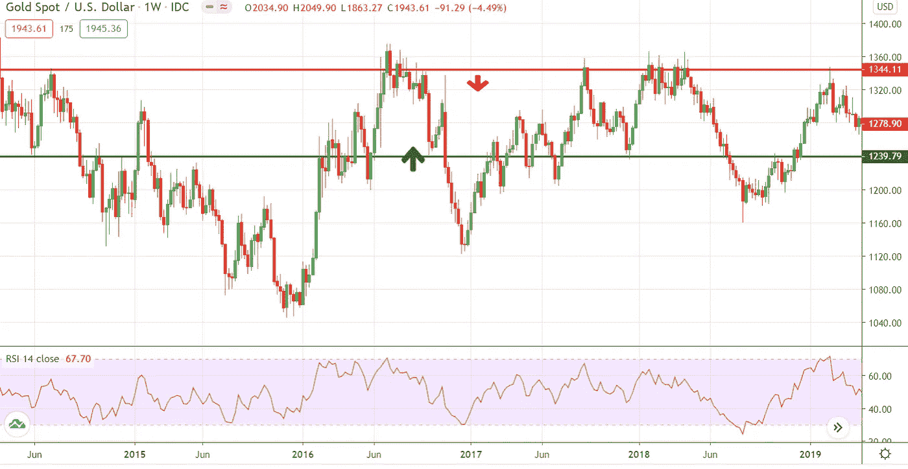

# 如果拜登获胜，市场将更难预测

> 原文：<https://medium.datadriveninvestor.com/markets-to-be-less-predictable-if-biden-wins-cd3454f0c45d?source=collection_archive---------25----------------------->

在一年中最大的政治事件——11 月 3 日的美国总统大选之前，金融市场动荡不安。美国总统大选每四年举行一次，总是在 11 月的第一个星期二举行。

## 股票市场对美国大选的反应

选举结果一公布，股票市场通常会大幅波动。如果民主党领袖乔·拜登当选，这里的主要问题是金融市场将如何反应。市场参与者认为，这对股市将是负面的，主要是因为拜登已经表示，他将取消特朗普的企业减税政策，这将打击企业利润率。道琼斯工业平均指数在民主党执政期间产生了 83%的平均回报率，而共和党执政期间的平均回报率为 45%。

在美联储向市场注入流动性后，S&P500 指数从 2020 年 3 月的低点回升，飙升超过 40%。根据 2019 年多维基金的报告，在 1928 年至 2016 年的过去 23 个选举年中，市场有 19 年是积极的。除 2008 年外，S&P 在总统选举前的每六个月都是正数。自 1929 年以来，在民主党总统执政时期，S&P500 的平均总回报率为 57.4%，而在共和党执政时期仅为 16.6%。

## **黄金会继续上涨吗？**

8 月，金价创下 2075 美元的历史新高。这种避险金属今年上涨了 35%以上。投资者今年全年一直在买入黄金，首先是冠状病毒病例上升，美中紧张局势升级，然后是利率下降，现在美国大选加剧了投资者的不确定性。

如果你看一下技术图表，上一次选举期间显示，在选举前的 7 月至 10 月，黄金价格出现飙升趋势，然后在选举后出现大幅下跌。平均而言，黄金价格持续降低，直到第二年 1 月。

随着 2020 年大选的临近，由于高度的不确定性，我预计未来几周美国总统大选对金融市场来说将是动荡的。保护投资者免受选举带来的不利影响的最佳方式是确保他们拥有真正多元化的投资组合。

> “与投资者分享的一个重要建议是，金融市场将在选举期间高度波动，因此将其视为一个潜在的机会，不要恐慌，并专注于最终推动市场长期发展的因素”。